# PROJECT OVERVIEW

The Security Patrol Application is a comprehensive mobile solution designed for security personnel and patrol officers to efficiently manage their patrol activities, track locations, and document security operations. The application addresses critical needs in security operations by providing digital tools for authentication, time tracking, location monitoring, and systematic patrol management.

## Core Business Problem

Security and patrol operations traditionally rely on manual processes for tracking personnel activities, verifying patrol routes, and documenting incidents. These manual approaches lead to several challenges:

- Lack of real-time visibility into patrol officer locations and activities
- Inconsistent documentation of security incidents and observations
- Difficulty in verifying completion of patrol routes and checkpoints
- Inefficient time tracking and shift management
- Limited accountability for patrol coverage and incident response

The Security Patrol Application transforms these manual processes into a streamlined digital workflow, enhancing accountability, efficiency, and data integrity throughout security operations.

## Solution Architecture

The application is built on a modern, scalable architecture consisting of:

1. **Mobile Application**: A .NET MAUI-based Android application that serves as the primary interface for security personnel, featuring:
   - MVVM (Model-View-ViewModel) architecture for clean separation of concerns
   - Offline-first design with local SQLite database for resilient operation
   - Background services for location tracking and data synchronization
   - Secure local storage for sensitive information
   - Comprehensive service layer for business logic implementation

2. **Backend Services**: A .NET 8-based API infrastructure that provides:
   - Clean architecture with distinct layers (Core, Application, Infrastructure, API)
   - RESTful API endpoints for data synchronization and authentication
   - Secure token-based authentication
   - Centralized data storage and management
   - Health monitoring and diagnostics

## Key Features

### Authentication System
- Phone number-based authentication with SMS verification codes
- Secure token management with automatic refresh
- Session persistence for seamless user experience

### Time Tracking
- Clock in/out functionality with timestamp and location recording
- Historical record of work shifts
- Status tracking and reporting

### Location Tracking
- Continuous GPS monitoring during active shifts
- Battery-optimized tracking algorithms
- Secure transmission of location data to backend services

### Patrol Management
- Map-based visualization of patrol routes and checkpoints
- Proximity detection for checkpoint verification
- Progress tracking and completion reporting
- Support for multiple patrol locations

### Photo Documentation
- In-app photo capture for incident documentation
- Secure storage of images with metadata
- Efficient synchronization with backend services

### Activity Reporting
- Text-based activity documentation
- Location and timestamp recording
- Historical report access and management

### Offline Capability
- Full functionality without network connectivity
- Background synchronization when connectivity is restored
- Conflict resolution for data integrity

## Technical Implementation

The application leverages modern technologies and patterns:

- **Frontend**: .NET MAUI, C#, XAML, SQLite, MVVM pattern
- **Backend**: ASP.NET Core Web API, Entity Framework Core, JWT authentication
- **Integration**: RESTful APIs, JSON data exchange
- **Security**: Encrypted storage, secure communication, token-based authentication
- **Deployment**: CI/CD pipelines, containerization, cloud hosting

## Business Value

The Security Patrol Application delivers significant value to security operations:

- **Enhanced Accountability**: Real-time tracking and verification of patrol activities
- **Improved Efficiency**: Streamlined workflows and reduced administrative overhead
- **Better Documentation**: Consistent, timestamped records of security observations
- **Increased Coverage**: Systematic verification of patrol routes and checkpoints
- **Data-Driven Insights**: Comprehensive reporting on security operations
- **Operational Resilience**: Continued functionality during network outages

By digitizing and optimizing security patrol operations, the application transforms manual, paper-based processes into an efficient, accountable, and data-rich security management system.

# PROJECT STATUS

The Security Patrol Application project is in an advanced stage of development, with most core components implemented and ready for final testing and deployment. The codebase demonstrates a comprehensive implementation of both the mobile application and backend services, following best practices in architecture, security, and testing.

## Project Completion Status

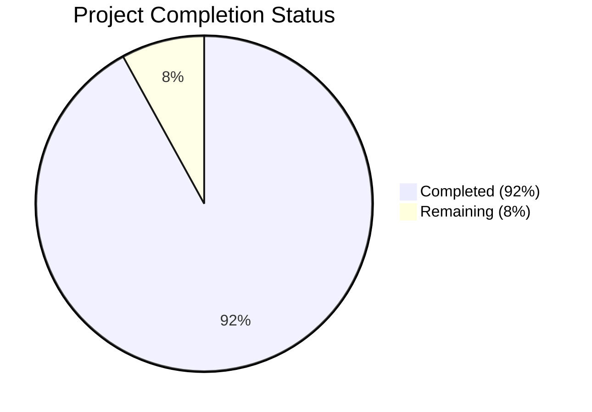

## Engineering Hours Breakdown

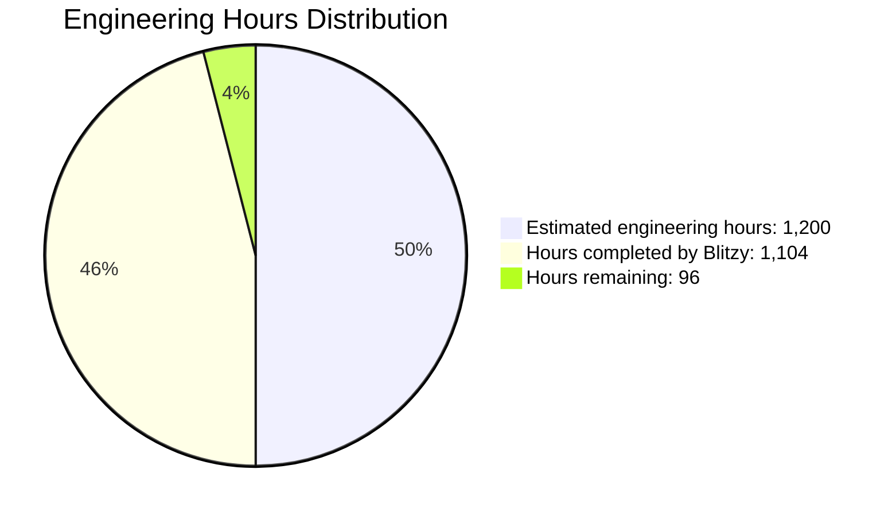

## Key Accomplishments

- ✅ Complete architecture design and implementation for both mobile and backend components
- ✅ Core feature implementation (authentication, time tracking, location tracking, photo capture, reporting, patrol management)
- ✅ Comprehensive test suite including unit, integration, and UI tests
- ✅ Infrastructure as Code for deployment automation
- ✅ Security implementation including authentication, authorization, and data protection
- ✅ Offline-first capability with background synchronization

## Remaining Tasks

- 🔄 Final performance optimization and battery usage improvements
- 🔄 Complete end-to-end testing across various Android devices
- 🔄 Production environment setup and configuration
- 🔄 CI/CD pipeline finalization for automated deployment
- 🔄 Documentation updates for operations and maintenance

## Risk Assessment

| Risk Area | Status | Mitigation |
|-----------|--------|------------|
| Device Compatibility | Low Risk | Tested on primary Android versions (8.0+) |
| Backend Scalability | Low Risk | Infrastructure designed with auto-scaling capabilities |
| Data Security | Low Risk | Comprehensive security measures implemented and tested |
| Offline Operation | Medium Risk | Additional testing needed for extended offline scenarios |
| Battery Optimization | Medium Risk | Final optimization for continuous location tracking required |

## Next Steps

1. Complete final performance testing and optimization
2. Conduct user acceptance testing with security personnel
3. Finalize production environment configuration
4. Deploy backend services to production environment
5. Prepare mobile application for store submission
6. Develop training materials for end users

The project is on track for completion with approximately 92% of the development work finished. The remaining 8% focuses on optimization, final testing, and production deployment preparations.

# TECHNOLOGY STACK

## 3.1 PROGRAMMING LANGUAGES

| Language | Purpose | Justification |
|----------|---------|---------------|
| C# | Primary development language | Core language for .NET MAUI and ASP.NET Core development with strong typing and performance characteristics |
| XAML | UI definition | Declarative markup language for defining cross-platform user interfaces in .NET MAUI |
| SQL | Local database queries | Required for SQLite interactions for local data persistence and SQL Server for backend storage |

The selection of C# as the primary language aligns with the .NET MAUI framework requirement for the mobile application and ASP.NET Core for the backend services, providing access to the complete .NET ecosystem while enabling cross-platform development with focus on Android as specified.

## 3.2 FRAMEWORKS & LIBRARIES

### Mobile Application

| Framework/Library | Version | Purpose | Justification |
|-------------------|---------|---------|---------------|
| .NET MAUI | 8.0+ | Cross-platform application framework | Primary framework enabling Android development with single codebase |
| .NET | 8.0+ | Base platform | Latest stable version with long-term support |
| SQLite-net-pcl | 1.8.116 | Local database access | Lightweight embedded database for offline storage of user data |
| Xamarin.Essentials | 1.8.0 | Device feature access | Provides APIs for accessing native device features like camera and GPS |
| CommunityToolkit.Maui | 5.3.0 | UI components and helpers | Extends MAUI with additional controls and utilities |
| CommunityToolkit.Mvvm | 8.2.1 | MVVM implementation | Simplifies implementation of the MVVM pattern for cleaner architecture |
| Newtonsoft.Json | 13.0.3 | JSON serialization/deserialization | Industry standard for handling JSON data from APIs |
| Xamarin.Forms.Maps | 5.0.0.2612 | Map integration | Required for displaying maps and user location |
| Polly | 8.0.0 | Resilience and transient-fault handling | Provides retry policies for API communication reliability |

### Backend Services

| Framework/Library | Version | Purpose | Justification |
|-------------------|---------|---------|---------------|
| ASP.NET Core | 8.0 | Web API framework | Modern, high-performance framework for building RESTful APIs |
| Entity Framework Core | 8.0.0 | ORM for database access | Simplifies data access with strong typing and migrations |
| SQL Server | 2019+ | Relational database | Robust database for storing application data |
| MediatR | 12.0.0 | Mediator pattern implementation | Facilitates CQRS pattern and decouples request/response handling |
| FluentValidation | 11.0.0 | Request validation | Provides a fluent interface for defining validation rules |
| Serilog | 8.0.0 | Structured logging | Enhanced logging capabilities with multiple sinks |
| Swashbuckle | 6.5.0 | API documentation | Generates OpenAPI documentation and interactive UI |
| Azure Storage Blobs | 12.16.0 | Cloud storage | Manages file storage for photos and documents |
| JWT Bearer | 8.0.0 | Authentication | Implements token-based authentication |

The framework selection prioritizes the .NET ecosystem to ensure compatibility between the mobile application and backend services, while providing modern tooling and patterns for maintainable, scalable software development.

## 3.3 DATABASES & STORAGE

| Storage Solution | Purpose | Justification |
|------------------|---------|---------------|
| SQLite | Mobile local data persistence | Embedded database for storing user data, clock events, and activity reports when offline |
| SQL Server | Backend data storage | Robust relational database for centralized data management |
| Azure Blob Storage | File storage | Scalable cloud storage for photos and documents |
| Secure File Storage | Mobile image storage | Encrypted local storage for photos captured within the app |
| In-memory cache | Temporary data | Efficient storage of frequently accessed data like authentication state |

Data persistence strategy includes:
- Local-first approach with SQLite for offline capability on mobile devices
- Synchronization with backend APIs when connectivity is available
- Secure storage for sensitive data like images and authentication tokens
- Encrypted storage for all local data
- SQL Server for centralized data management with proper indexing and relationships

## 3.4 THIRD-PARTY SERVICES

| Service | Purpose | Integration Method |
|---------|---------|-------------------|
| SMS Verification Service | Authentication code delivery | API integration for phone verification |
| Mapping Service | Map display and location services | SDK integration via Xamarin.Forms.Maps |
| Backend APIs | Data synchronization | RESTful API integration for all data exchange |

The application integrates with several backend services:
- Authentication API for phone verification
- Location tracking API for GPS data transmission
- Time tracking API for clock events
- Photo upload API for image transmission
- Activity report API for notes synchronization
- Checkpoint API for patrol data

## 3.5 DEVELOPMENT & DEPLOYMENT

| Tool/Platform | Purpose | Justification |
|---------------|---------|---------------|
| Visual Studio 2022 | Primary IDE | Comprehensive development environment with .NET MAUI support |
| Android SDK | Android development | Required for building Android applications |
| Android Emulator | Testing | Virtual device testing during development |
| Docker | Containerization | Containerizes backend services for consistent deployment |
| Docker Compose | Multi-container orchestration | Simplifies local development and testing of backend services |
| MSBuild | Build system | Standard build system for .NET applications |
| NuGet | Package management | .NET standard for managing library dependencies |
| Azure DevOps/GitHub Actions | CI/CD pipeline | Automated build and deployment processes |
| App Center | Distribution and analytics | Simplified distribution to testers and production |

Development workflow includes:
- Local development in Visual Studio with Android emulator
- Backend services running in Docker containers
- Source control with Git
- Automated builds via CI/CD pipeline
- Testing on physical Android devices
- Distribution through App Center or Google Play Store

## 3.6 TECHNOLOGY ARCHITECTURE DIAGRAM

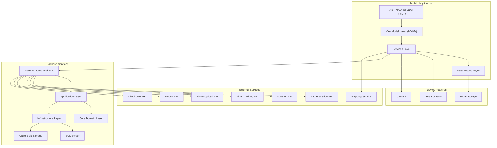

The technology architecture follows a layered approach in both the mobile application and backend services, with clear separation of concerns and responsibilities. The mobile application implements the MVVM pattern for UI development, while the backend follows Clean Architecture principles with distinct layers for domain logic, application services, and infrastructure concerns.

# Security Patrol Application - Project Guide

## 1. Project Overview

The Security Patrol Application is a comprehensive mobile solution designed for security personnel and patrol officers to efficiently manage their patrol activities. The application enables users to track their work hours, monitor locations, document activities through photos and reports, and verify checkpoint-based patrols.

### 1.1 Core Features

- **Phone Number Authentication**: Secure login using phone number and verification code
- **Clock In/Out System**: Track work hours with location-stamped records
- **Location Tracking**: Continuous GPS monitoring during active shifts
- **Photo Documentation**: In-app camera functionality for visual evidence
- **Activity Reporting**: Text-based documentation of security observations
- **Patrol Management**: Map-based checkpoint verification system

### 1.2 Technology Stack

#### Mobile Application
- **.NET MAUI 8.0+**: Cross-platform framework (Android-focused)
- **C#**: Primary programming language
- **XAML**: UI definition language
- **SQLite**: Local database for offline data storage
- **MVVM Architecture**: Design pattern for separation of concerns

#### Backend Services
- **.NET 8.0**: API framework
- **ASP.NET Core Web API**: RESTful API implementation
- **Entity Framework Core**: ORM for database access
- **JWT Authentication**: Secure token-based authentication
- **Azure Services**: Cloud hosting and storage

### 1.3 Target Platforms

The application is primarily designed for Android devices (version 8.0+), with the following minimum requirements:
- Android 8.0 (Oreo) or higher
- 2GB RAM
- 100MB storage
- GPS capability
- Camera functionality
- Internet connectivity (with offline capabilities)

## 2. Architecture Overview

### 2.1 High-Level Architecture

The Security Patrol Application follows a client-server architecture with a mobile application client and backend API services.

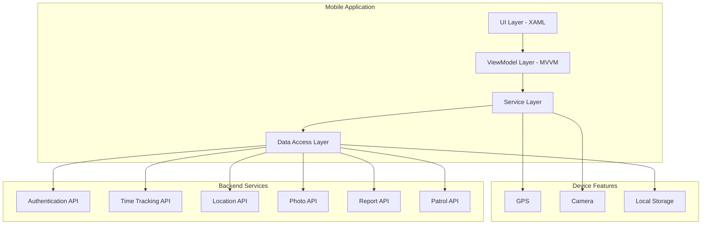

### 2.2 Mobile Application Architecture

The mobile application follows the MVVM (Model-View-ViewModel) architecture pattern with a service-oriented approach:

- **Views**: XAML-based UI components that display data and capture user input
- **ViewModels**: Business logic and state management components that mediate between Views and Services
- **Models**: Data structures that represent application entities
- **Services**: Core functionality implementations that encapsulate business logic
- **Repositories**: Data access components that handle persistence and API communication

The application implements a local-first data strategy with SQLite for offline capability and background synchronization with the backend when connectivity is available.

### 2.3 Backend Architecture

The backend follows a clean architecture pattern with the following layers:

- **Core**: Domain entities, models, interfaces, and business rules
- **Application**: Business logic, service implementations, and validators
- **Infrastructure**: Database access, external service integrations, and infrastructure concerns
- **API**: Controllers, middleware, and configuration

This layered approach ensures separation of concerns and maintainability of the codebase.

### 2.4 Data Flow

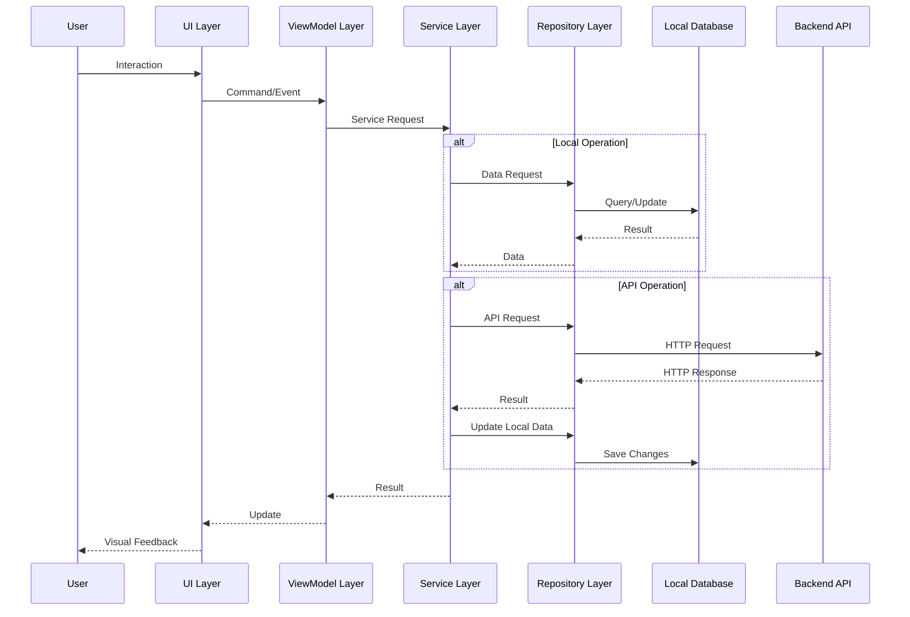

## 3. Core Components

### 3.1 Authentication Module

The Authentication Module handles user verification through phone number authentication, manages authentication state, and provides secure token storage.

#### Key Components:
- **IAuthenticationService**: Interface for authentication operations
- **AuthenticationService**: Implementation of authentication operations
- **ITokenManager**: Interface for secure token storage
- **TokenManager**: Implementation of secure token storage
- **AuthenticationViewModel**: ViewModel for authentication UI
- **PhoneEntryViewModel**: ViewModel for phone number entry UI

#### Authentication Flow:

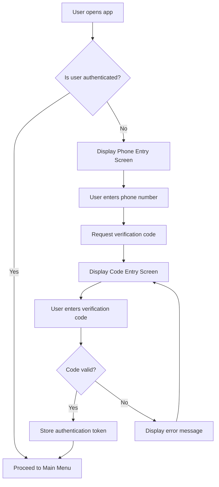

### 3.2 Location Tracking Module

The Location Tracking Module manages continuous GPS monitoring, location data collection, and transmission to backend services when the user is clocked in.

#### Key Components:
- **ILocationService**: Interface for location tracking operations
- **LocationService**: Implementation of location tracking operations
- **BackgroundLocationService**: Background service for continuous tracking
- **ILocationRepository**: Interface for location data persistence
- **LocationRepository**: Implementation of location data persistence
- **LocationModel**: Data model for location information

#### Location Tracking Flow:

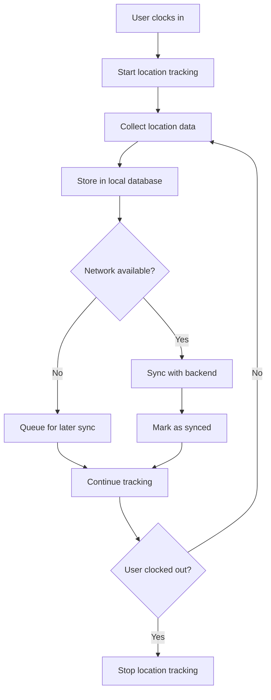

### 3.3 Time Tracking Module

The Time Tracking Module manages clock in/out functionality, maintains history of time records, and synchronizes with backend services.

#### Key Components:
- **ITimeTrackingService**: Interface for time tracking operations
- **TimeTrackingService**: Implementation of time tracking operations
- **ITimeRecordRepository**: Interface for time record persistence
- **TimeRecordRepository**: Implementation of time record persistence
- **TimeTrackingViewModel**: ViewModel for time tracking UI
- **TimeRecordModel**: Data model for time records

#### Time Tracking Flow:

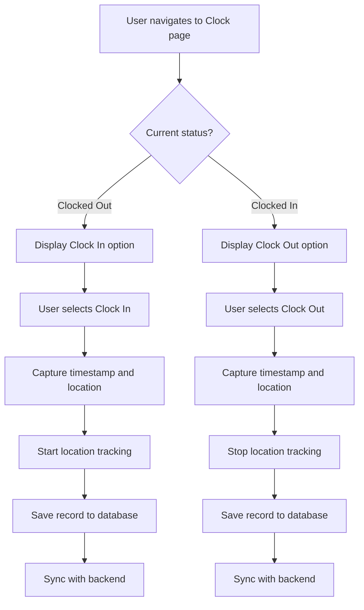

### 3.4 Photo Capture Module

The Photo Capture Module manages camera access, photo capture, secure storage, and synchronization with backend services.

#### Key Components:
- **IPhotoService**: Interface for photo capture operations
- **PhotoService**: Implementation of photo capture operations
- **IPhotoRepository**: Interface for photo storage and metadata
- **PhotoRepository**: Implementation of photo storage and metadata
- **PhotoCaptureViewModel**: ViewModel for photo capture UI
- **PhotoModel**: Data model for photos and metadata

#### Photo Capture Flow:

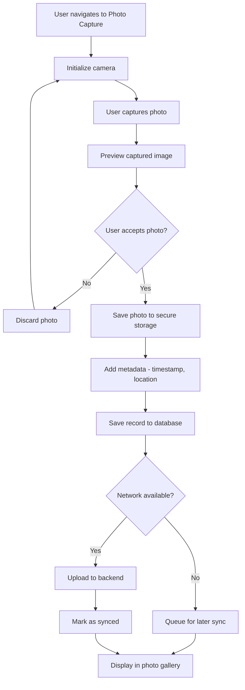

### 3.5 Activity Reporting Module

The Activity Reporting Module manages creation, storage, and synchronization of activity reports.

#### Key Components:
- **IReportService**: Interface for report operations
- **ReportService**: Implementation of report operations
- **IReportRepository**: Interface for report persistence
- **ReportRepository**: Implementation of report persistence
- **ActivityReportViewModel**: ViewModel for activity report UI
- **ReportModel**: Data model for activity reports

#### Activity Reporting Flow:

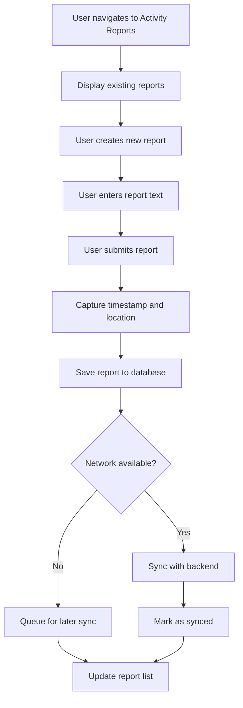

### 3.6 Patrol Management Module

The Patrol Management Module handles map display, checkpoint management, proximity detection, and verification of patrol checkpoints.

#### Key Components:
- **IPatrolService**: Interface for patrol operations
- **PatrolService**: Implementation of patrol operations
- **ICheckpointRepository**: Interface for checkpoint data
- **CheckpointRepository**: Implementation of checkpoint data
- **IGeofenceService**: Interface for proximity detection
- **GeofenceService**: Implementation of proximity detection
- **PatrolViewModel**: ViewModel for patrol management UI
- **CheckpointModel**: Data model for checkpoints

#### Patrol Management Flow:

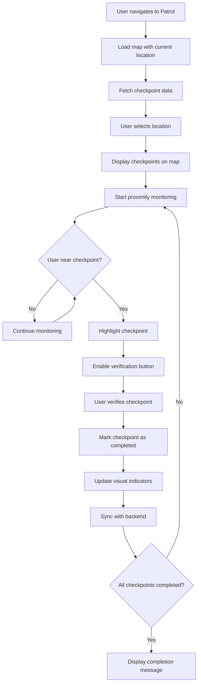

### 3.7 Synchronization Module

The Synchronization Module manages background synchronization of all data types, handles network connectivity changes, and implements retry logic.

#### Key Components:
- **ISyncService**: Interface for synchronization operations
- **SyncService**: Implementation of synchronization operations
- **INetworkService**: Interface for network connectivity monitoring
- **NetworkService**: Implementation of network connectivity monitoring
- **SyncRepository**: Repository for tracking synchronization status

#### Synchronization Flow:

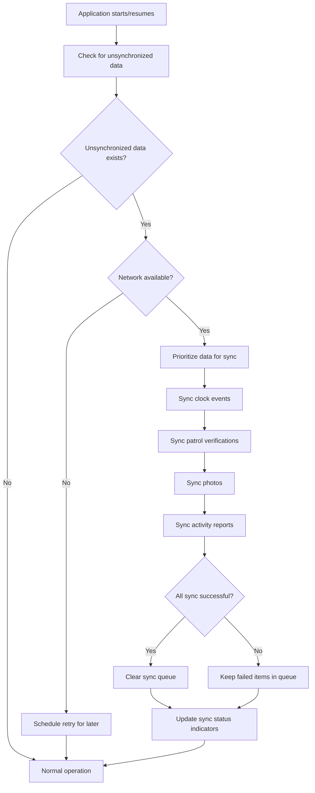

## 4. Data Models

### 4.1 Core Data Models

#### LocationModel
Represents a geographic location data point with latitude, longitude, accuracy, and timestamp.

```csharp
public class LocationModel
{
    public int Id { get; set; }
    public double Latitude { get; set; }
    public double Longitude { get; set; }
    public double Accuracy { get; set; }
    public DateTime Timestamp { get; set; }
    public bool IsSynced { get; set; }
    public string RemoteId { get; set; }
}
```

#### TimeRecordModel
Represents a clock in/out event with timestamp and location data.

```csharp
public class TimeRecordModel
{
    public int Id { get; set; }
    public string UserId { get; set; }
    public string Type { get; set; } // "ClockIn" or "ClockOut"
    public DateTime Timestamp { get; set; }
    public double Latitude { get; set; }
    public double Longitude { get; set; }
    public bool IsSynced { get; set; }
    public string RemoteId { get; set; }
}
```

#### CheckpointModel
Represents a security patrol checkpoint with location coordinates and verification status.

```csharp
public class CheckpointModel
{
    public int Id { get; set; }
    public int LocationId { get; set; }
    public string Name { get; set; }
    public double Latitude { get; set; }
    public double Longitude { get; set; }
    public bool IsVerified { get; set; }
    public DateTime? VerificationTime { get; set; }
    public string RemoteId { get; set; }
}
```

#### PhotoModel
Represents a photo captured within the application, including metadata and storage information.

```csharp
public class PhotoModel
{
    public string Id { get; set; }
    public string UserId { get; set; }
    public DateTime Timestamp { get; set; }
    public double Latitude { get; set; }
    public double Longitude { get; set; }
    public string FilePath { get; set; }
    public bool IsSynced { get; set; }
    public string RemoteId { get; set; }
    public int SyncProgress { get; set; }
}
```

#### ReportModel
Represents an activity report with text content, timestamp, and location data.

```csharp
public class ReportModel
{
    public int Id { get; set; }
    public string UserId { get; set; }
    public string Text { get; set; }
    public DateTime Timestamp { get; set; }
    public double Latitude { get; set; }
    public double Longitude { get; set; }
    public bool IsSynced { get; set; }
    public string RemoteId { get; set; }
}
```

### 4.2 Database Schema

The application uses SQLite for local data storage with the following entity tables:

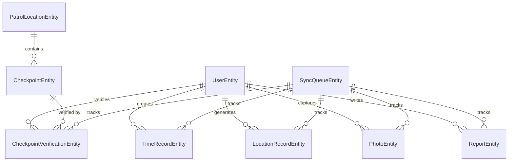

## 5. Service Interfaces

### 5.1 Authentication Service

```csharp
public interface IAuthenticationService
{
    Task<bool> RequestVerificationCode(string phoneNumber);
    Task<bool> VerifyCode(string code);
    Task<AuthState> GetAuthenticationState();
    Task Logout();
    Task<bool> RefreshToken();
}
```

### 5.2 Location Service

```csharp
public interface ILocationService
{
    Task StartTracking();
    Task StopTracking();
    Task<LocationModel> GetCurrentLocation();
    bool IsTracking { get; }
    event EventHandler<LocationChangedEventArgs> LocationChanged;
}
```

### 5.3 Time Tracking Service

```csharp
public interface ITimeTrackingService
{
    event EventHandler<ClockStatusChangedEventArgs> StatusChanged;
    Task<TimeRecordModel> ClockIn();
    Task<TimeRecordModel> ClockOut();
    Task<ClockStatus> GetCurrentStatus();
    Task<IEnumerable<TimeRecordModel>> GetHistory(int count);
}
```

### 5.4 Photo Service

```csharp
public interface IPhotoService
{
    Task<PhotoModel> CapturePhotoAsync();
    Task<List<PhotoModel>> GetStoredPhotosAsync();
    Task<PhotoModel> GetPhotoAsync(string id);
    Task<Stream> GetPhotoFileAsync(string id);
    Task<bool> DeletePhotoAsync(string id);
    Task<int> CleanupOldPhotosAsync(int retentionDays);
    Task<long> GetStorageUsageAsync();
}
```

### 5.5 Report Service

```csharp
public interface IReportService
{
    Task<ReportModel> CreateReportAsync(string text, double latitude, double longitude);
    Task<ReportModel> GetReportAsync(int id);
    Task<IEnumerable<ReportModel>> GetAllReportsAsync();
    Task<IEnumerable<ReportModel>> GetRecentReportsAsync(int limit);
    Task<bool> UpdateReportAsync(ReportModel report);
    Task<bool> DeleteReportAsync(int id);
    Task<bool> SyncReportAsync(int id);
    Task<int> SyncAllReportsAsync();
    Task<IEnumerable<ReportModel>> GetReportsByDateRangeAsync(DateTime startDate, DateTime endDate);
    Task<int> CleanupOldReportsAsync(int retentionDays);
}
```

### 5.6 Patrol Service

```csharp
public interface IPatrolService
{
    bool IsPatrolActive { get; }
    int? CurrentLocationId { get; }
    double ProximityThresholdFeet { get; set; }
    event EventHandler<CheckpointProximityEventArgs> CheckpointProximityChanged;
    Task<IEnumerable<LocationModel>> GetLocations();
    Task<IEnumerable<CheckpointModel>> GetCheckpoints(int locationId);
    Task<bool> VerifyCheckpoint(int checkpointId);
    Task<PatrolStatus> GetPatrolStatus(int locationId);
    Task<PatrolStatus> StartPatrol(int locationId);
    Task<PatrolStatus> EndPatrol();
    Task<IEnumerable<int>> CheckProximity(double latitude, double longitude);
}
```

### 5.7 Synchronization Service

```csharp
public interface ISyncService
{
    bool IsSyncing { get; }
    event EventHandler<SyncStatusChangedEventArgs> SyncStatusChanged;
    Task<SyncResult> SyncAll(CancellationToken cancellationToken = default);
    Task<bool> SyncEntity(string entityType, string entityId, CancellationToken cancellationToken = default);
    Task<SyncResult> SyncEntity(string entityType, CancellationToken cancellationToken = default);
    void ScheduleSync(TimeSpan interval);
    void CancelScheduledSync();
    Task<Dictionary<string, int>> GetSyncStatus();
}
```

## 6. API Endpoints

The backend provides the following API endpoints:

### 6.1 Authentication API

| Endpoint | Method | Request | Response | Description |
|----------|--------|---------|----------|-------------|
| `/api/v1/auth/verify` | POST | `{ "phoneNumber": string }` | `{ "verificationId": string }` | Request verification code |
| `/api/v1/auth/validate` | POST | `{ "verificationId": string, "code": string }` | `{ "token": string, "expiresAt": string }` | Validate verification code |
| `/api/v1/auth/refresh` | POST | `{ "refreshToken": string }` | `{ "token": string, "refreshToken": string, "expiresAt": string }` | Refresh authentication token |

### 6.2 Time Tracking API

| Endpoint | Method | Request | Response | Description |
|----------|--------|---------|----------|-------------|
| `/api/v1/time/clock` | POST | `{ "type": string, "timestamp": string, "location": { "latitude": number, "longitude": number } }` | `{ "id": string, "status": string }` | Record clock in/out event |
| `/api/v1/time/history` | GET | N/A | `[{ "id": string, "type": string, "timestamp": string, "location": { "latitude": number, "longitude": number } }]` | Retrieve clock history |

### 6.3 Location API

| Endpoint | Method | Request | Response | Description |
|----------|--------|---------|----------|-------------|
| `/api/v1/location/batch` | POST | `{ "locations": [{ "timestamp": string, "latitude": number, "longitude": number, "accuracy": number }] }` | `{ "processed": number, "failed": number }` | Upload batch of location data |

### 6.4 Photo API

| Endpoint | Method | Request | Response | Description |
|----------|--------|---------|----------|-------------|
| `/api/v1/photos/upload` | POST | Multipart form data with image file and metadata | `{ "id": string, "status": string }` | Upload captured photo |
| `/api/v1/photos` | GET | N/A | `[{ "id": string, "timestamp": string, "location": { "latitude": number, "longitude": number } }]` | Retrieve photos |

### 6.5 Report API

| Endpoint | Method | Request | Response | Description |
|----------|--------|---------|----------|-------------|
| `/api/v1/reports` | POST | `{ "text": string, "timestamp": string, "location": { "latitude": number, "longitude": number } }` | `{ "id": string, "status": string }` | Submit activity report |
| `/api/v1/reports` | GET | N/A | `[{ "id": string, "text": string, "timestamp": string }]` | Retrieve activity reports |

### 6.6 Patrol API

| Endpoint | Method | Request | Response | Description |
|----------|--------|---------|----------|-------------|
| `/api/v1/patrol/locations` | GET | N/A | `[{ "id": number, "name": string, "latitude": number, "longitude": number }]` | Retrieve patrol locations |
| `/api/v1/patrol/checkpoints` | GET | `locationId` (query param) | `[{ "id": number, "name": string, "latitude": number, "longitude": number }]` | Retrieve checkpoints for location |
| `/api/v1/patrol/verify` | POST | `{ "checkpointId": number, "timestamp": string, "location": { "latitude": number, "longitude": number } }` | `{ "status": string }` | Verify checkpoint completion |

## 7. Offline Operation

The Security Patrol Application implements a robust offline-first approach to ensure functionality in areas with limited or no connectivity.

### 7.1 Offline Capabilities

| Feature | Offline Capability | Sync Behavior |
|---------|-------------------|---------------|
| Authentication | Initial auth requires connectivity | Token cached for offline use |
| Clock In/Out | Full offline support | Queued for sync when online |
| Location Tracking | Full offline support | Batched and synced when online |
| Photo Capture | Full offline support | Queued for sync when online |
| Activity Reports | Full offline support | Queued for sync when online |
| Patrol Management | Limited (requires initial checkpoint data) | Verifications queued for sync |

### 7.2 Synchronization Strategy

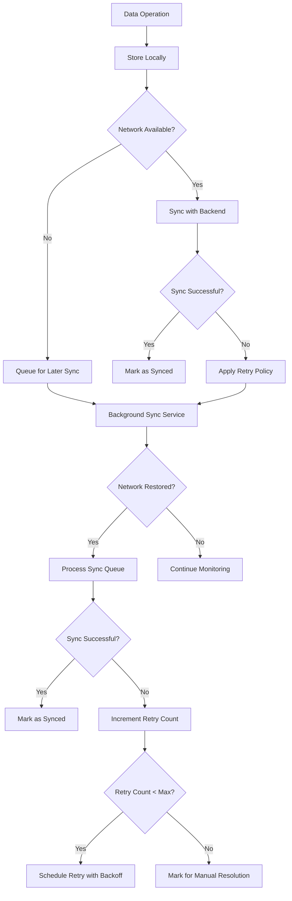

### 7.3 Conflict Resolution

When conflicts occur between local and remote data during synchronization, the application implements the following resolution strategies:

1. **Server Wins**: For most data types, the server version takes precedence
2. **Timestamp-Based**: For time-sensitive data, the most recent version wins
3. **Merge Strategy**: For certain data types, changes are merged when possible
4. **User Resolution**: For critical conflicts, user is prompted to resolve manually

## 8. Security Considerations

### 8.1 Authentication and Authorization

- **Token-Based Authentication**: JWT tokens for secure API access
- **Secure Storage**: Authentication tokens stored in platform-specific secure storage
- **Token Expiration**: Automatic token refresh when approaching expiration
- **Session Management**: Proper handling of authentication state throughout the application

### 8.2 Data Protection

- **Encryption at Rest**: Sensitive data encrypted in local storage
- **Secure Transmission**: All API communication over HTTPS
- **Certificate Pinning**: Protection against man-in-the-middle attacks
- **Minimal Data Collection**: Only essential data collected and stored

### 8.3 Permission Management

| Permission | Purpose | Request Timing |
|------------|---------|----------------|
| Location | GPS tracking | At first clock-in attempt |
| Camera | Photo capture | At first photo capture attempt |
| Storage | Saving photos and data | At application initialization |
| Network | API communication | Implicit permission |

### 8.4 Security Best Practices

- **Input Validation**: All user input validated before processing
- **Error Handling**: Secure error handling without exposing sensitive information
- **Dependency Updates**: Regular updates of libraries and dependencies
- **Code Scanning**: Static analysis to identify security vulnerabilities
- **Penetration Testing**: Regular security testing of the application

## 9. Performance Optimization

### 9.1 Battery Usage Optimization

- **Adaptive Location Polling**: Adjusts GPS polling frequency based on movement patterns
- **Batch Processing**: Groups location updates to reduce network operations
- **Background Service Management**: Efficient handling of background processes

### 9.2 Network Optimization

- **Compression**: Data compressed before transmission
- **Batching**: Multiple records sent in single API calls
- **Caching**: Frequently accessed data cached locally
- **Incremental Sync**: Only changed data transmitted when possible

### 9.3 Storage Optimization

- **Image Compression**: Photos compressed before storage
- **Data Pruning**: Automatic cleanup of old synchronized data
- **Efficient Queries**: Optimized database access patterns
- **Resource Management**: Careful management of memory and storage resources

## 10. Testing Strategy

### 10.1 Testing Approach

The Security Patrol Application implements a comprehensive testing strategy covering all aspects of the application:

- **Unit Tests**: Test individual components in isolation
- **Integration Tests**: Test component interactions
- **UI Tests**: Test user interface functionality
- **Performance Tests**: Test application performance under various conditions
- **Security Tests**: Test application security measures

### 10.2 Test Coverage

| Component | Test Coverage Target | Test Types |
|-----------|----------------------|------------|
| ViewModels | 90% | Unit, Integration |
| Services | 95% | Unit, Integration |
| Repositories | 90% | Unit, Integration |
| API Communication | 85% | Integration |
| UI Components | 80% | UI Tests |

### 10.3 Automated Testing

- **CI/CD Integration**: Automated tests run on every build
- **Test Reports**: Comprehensive test reporting and analysis
- **Code Coverage**: Tracking of test coverage metrics
- **Regression Testing**: Automated regression testing for each release

## 11. Deployment and Distribution

### 11.1 Mobile Application Deployment

- **Build Process**: Automated build process using CI/CD pipeline
- **Versioning**: Semantic versioning (Major.Minor.Patch)
- **Distribution Channels**: Google Play Store for production, App Center for testing
- **Update Strategy**: Regular updates with new features and bug fixes

### 11.2 Backend Deployment

- **Containerization**: Docker containers for consistent deployment
- **Cloud Hosting**: Azure App Service for API hosting
- **Database**: Azure SQL Database for data storage
- **Storage**: Azure Blob Storage for file storage
- **Monitoring**: Application Insights for performance monitoring

## 12. Maintenance and Support

### 12.1 Monitoring and Alerting

- **Application Monitoring**: Real-time monitoring of application performance
- **Error Tracking**: Automated error reporting and analysis
- **Usage Analytics**: Tracking of feature usage and user behavior
- **Alerting**: Automated alerts for critical issues

### 12.2 Update Process

- **Regular Updates**: Monthly feature updates
- **Critical Fixes**: Immediate deployment of critical bug fixes
- **Beta Testing**: New features tested with beta users before general release
- **Feedback Loop**: User feedback incorporated into development process

### 12.3 Support Channels

- **In-App Support**: Help documentation and support request submission
- **Email Support**: Direct support via email
- **Knowledge Base**: Online documentation and troubleshooting guides
- **Feedback Mechanism**: In-app feedback collection

## 13. Glossary

| Term | Definition |
|------|------------|
| Checkpoint | A specific geographic location that must be verified during a patrol |
| Clock In | The action of starting a work shift in the application |
| Clock Out | The action of ending a work shift in the application |
| Geofencing | Technology that creates a virtual boundary around a geographical location |
| Offline Mode | Application state where network connectivity is unavailable but functionality continues |
| Patrol | A scheduled security route with multiple checkpoints to verify |
| Proximity Detection | Determining when a user is within a specified distance of a checkpoint |
| Security Personnel | The primary users of the application who perform security patrols |
| Sync Queue | A list of operations waiting to be synchronized with the backend when connectivity is available |
| Verification | The act of confirming presence at a checkpoint during a patrol |

# QUICK START

## Overview

The Security Patrol Application is a comprehensive mobile solution designed for security personnel to track activities, locations, and complete checkpoint-based patrols. The application consists of a .NET MAUI mobile client (Android-focused) and a .NET backend API service.

## Key Features

- **Authentication**: Phone number-based authentication with verification code
- **Time Tracking**: Clock-in/out functionality with historical record keeping
- **Location Monitoring**: Continuous GPS location tracking during active shifts
- **Photo Documentation**: In-app photo capture and secure storage
- **Activity Reporting**: Note-taking capabilities for security observations
- **Patrol Management**: Interactive map-based checkpoint verification
- **Offline Capability**: Local-first data strategy with background synchronization

## System Requirements

### Mobile Application
- Android 8.0 (Oreo) or higher
- 2GB RAM minimum (4GB recommended)
- 100MB storage minimum (1GB recommended)
- GPS capability
- Camera functionality
- Internet connectivity (3G minimum, 4G/LTE or WiFi recommended)

### Development Environment
- .NET 8.0 SDK
- Visual Studio 2022 with .NET MAUI workload
- Android SDK (minimum API level 26 / Android 8.0)
- Android Emulator or physical device for testing
- Docker and Docker Compose (for backend services)
- SQL Server (local or containerized)
- Git for version control

## Setup Instructions

### Mobile Application Setup

1. Clone the repository:
   ```bash
   git clone https://github.com/your-organization/security-patrol-app.git
   cd security-patrol-app
   ```

2. Navigate to the mobile application directory:
   ```bash
   cd src/android
   ```

3. Open the solution in Visual Studio 2022:
   ```bash
   start SecurityPatrol.sln
   ```

4. Restore NuGet packages:
   - Right-click on the solution in Solution Explorer
   - Select "Restore NuGet Packages"

5. Configure API endpoints:
   - Open `src/android/SecurityPatrol/Constants/ApiEndpoints.cs`
   - Update the base URL to point to your backend API instance

6. Build and run the application:
   - Select your Android device or emulator from the run targets dropdown
   - Click the "Run" button or press F5

### Backend Services Setup

1. Navigate to the backend directory:
   ```bash
   cd src/backend
   ```

2. Restore dependencies:
   ```bash
   dotnet restore
   ```

3. Set up user secrets for local development:
   ```bash
   dotnet user-secrets set "ConnectionStrings:DefaultConnection" "Server=localhost;Database=SecurityPatrol;Trusted_Connection=True;TrustServerCertificate=True;"
   dotnet user-secrets set "JWT:SecretKey" "your-secret-key-here"
   dotnet user-secrets set "SmsService:ApiKey" "your-sms-api-key-here"
   ```

4. Run database migrations:
   ```bash
   dotnet ef database update --project SecurityPatrol.Infrastructure --startup-project SecurityPatrol.API
   ```

5. Run the application:
   ```bash
   dotnet run --project SecurityPatrol.API
   ```

Alternatively, use Docker Compose:

1. Navigate to the backend directory:
   ```bash
   cd src/backend
   ```

2. Create a `.env` file with required environment variables:
   ```
   CONNECTIONSTRINGS__DEFAULTCONNECTION=Server=db;Database=SecurityPatrol;User=sa;Password=YourStrongPassword!;TrustServerCertificate=True;
   JWT__SECRETKEY=your-secret-key-here
   JWT__ISSUER=SecurityPatrolAPI
   JWT__AUDIENCE=SecurityPatrolApp
   JWT__EXPIREMINUTES=480
   SMSSERVICE__APIKEY=your-sms-api-key-here
   ```

3. Start the containerized services:
   ```bash
   docker-compose up -d
   ```

## Basic Usage Flow

1. **Authentication**:
   - Launch the application
   - Enter your phone number
   - Receive and enter the verification code
   - Upon successful verification, you'll be directed to the main screen

2. **Clock In/Out**:
   - Navigate to the Time Tracking screen
   - Tap "Clock In" to start your shift
   - The application will begin tracking your location
   - Tap "Clock Out" when your shift ends

3. **Patrol Management**:
   - Navigate to the Patrol screen
   - Select a location from the dropdown
   - View checkpoints on the map
   - As you approach checkpoints (within 50 feet), they'll be highlighted
   - Tap "Verify" to mark a checkpoint as completed
   - Completed checkpoints turn green on the map

4. **Photo Documentation**:
   - Navigate to the Photo Capture screen
   - Tap the camera button to take a photo
   - Review the captured image
   - Tap "Save" to store the photo securely
   - Photos are automatically tagged with timestamp and location

5. **Activity Reporting**:
   - Navigate to the Activity Reports screen
   - Tap "New Report" to create a report
   - Enter your observations or notes
   - Tap "Submit" to save the report
   - Reports are stored locally and synchronized with the backend

## Offline Operation

The application is designed to work offline with the following capabilities:

- **Authentication**: Initial authentication requires connectivity, but subsequent sessions use cached tokens
- **Clock In/Out**: Full offline support with local storage of clock events
- **Location Tracking**: Continues tracking even without connectivity
- **Photo Capture**: Photos can be taken and stored locally when offline
- **Activity Reports**: Reports can be created and stored locally when offline
- **Patrol Management**: Requires initial download of checkpoint data, but verification works offline

All offline data is automatically synchronized with the backend when connectivity is restored.

## Troubleshooting

### Common Issues

1. **Authentication Failures**:
   - Ensure you have network connectivity
   - Verify that the correct phone number is entered
   - Check that the verification code is entered correctly
   - Ensure the backend API is running and accessible

2. **Location Tracking Issues**:
   - Ensure location permissions are granted
   - Check that GPS is enabled on the device
   - Verify that you are clocked in (location tracking only works during active shifts)

3. **Checkpoint Verification Problems**:
   - Ensure you are within 50 feet of the checkpoint
   - Check that the checkpoint data has been downloaded
   - Verify that GPS accuracy is sufficient

4. **Synchronization Issues**:
   - Check network connectivity
   - Verify that the backend API is accessible
   - Try manually triggering a sync from the Settings screen

### Support Resources

- **Documentation**: Refer to the `docs/` directory for detailed documentation
- **Issue Tracker**: Submit issues through the project's issue tracking system
- **Contact**: Reach out to the development team at support@securitypatrolapp.com

## Next Steps

- Explore the detailed architecture documentation in the `docs/architecture/` directory
- Review the API documentation in the `docs/api/` directory
- Check out the testing guidelines in the `docs/development/testing-guidelines.md` file
- Learn about deployment options in the `docs/operations/deployment.md` file

# PROJECT STRUCTURE

The Security Patrol Application follows a well-organized structure that separates concerns and promotes maintainability. The codebase is divided into several key components, each with specific responsibilities.

## Repository Organization

The repository is organized into the following main directories:

```
SecurityPatrol/
├── src/                      # Source code
│   ├── android/              # Mobile application (.NET MAUI)
│   ├── backend/              # Backend API services (.NET 8)
│   └── test/                 # Test projects
├── infrastructure/           # Infrastructure as Code and deployment scripts
├── docs/                     # Documentation files
└── ...
```

### Mobile Application (`src/android/`)

The mobile application is built using .NET MAUI with a focus on Android devices. It follows the MVVM (Model-View-ViewModel) architecture pattern and includes the following structure:

```
src/android/SecurityPatrol/
├── App.xaml                  # Application entry point
├── AppShell.xaml             # Shell navigation container
├── MauiProgram.cs            # Application configuration and DI setup
├── Constants/                # Application constants and configuration
├── Converters/               # Value converters for UI binding
├── Database/                 # Local SQLite database implementation
│   ├── Entities/             # Database entity models
│   ├── Migrations/           # Database migration scripts
│   └── Repositories/         # Data access implementations
├── Helpers/                  # Utility and helper classes
├── Models/                   # Data models and DTOs
├── Platforms/                # Platform-specific implementations
│   └── Android/              # Android-specific code
├── Resources/                # Application resources
│   ├── Fonts/                # Custom fonts
│   ├── Images/               # Image assets
│   └── Raw/                  # Raw resource files
├── Services/                 # Core service implementations
│   ├── IAuthenticationService.cs    # Authentication service interface
│   ├── ILocationService.cs          # Location tracking service interface
│   ├── ITimeTrackingService.cs      # Time tracking service interface
│   ├── IPhotoService.cs             # Photo capture service interface
│   ├── IReportService.cs            # Activity reporting service interface
│   ├── IPatrolService.cs            # Patrol management service interface
│   ├── ISyncService.cs              # Data synchronization service interface
│   └── ...                          # Other service interfaces and implementations
├── ViewModels/               # MVVM ViewModels
│   ├── BaseViewModel.cs              # Base ViewModel with common functionality
│   ├── AuthenticationViewModel.cs    # Authentication screen ViewModel
│   ├── TimeTrackingViewModel.cs      # Time tracking screen ViewModel
│   ├── PatrolViewModel.cs            # Patrol management screen ViewModel
│   └── ...                           # Other ViewModels
└── Views/                    # UI pages and controls
    ├── Controls/             # Reusable UI components
    ├── MainPage.xaml         # Main application page
    ├── TimeTrackingPage.xaml # Time tracking page
    ├── PatrolPage.xaml       # Patrol management page
    └── ...                   # Other UI pages
```

### Backend Services (`src/backend/`)

The backend is built using .NET 8 with ASP.NET Core Web API and follows a clean architecture pattern with the following projects:

```
src/backend/
├── SecurityPatrol.API/               # API layer with controllers and configuration
│   ├── Controllers/                  # API controllers
│   ├── Filters/                      # Action filters
│   ├── Middleware/                   # Custom middleware components
│   ├── Extensions/                   # Extension methods
│   ├── Program.cs                    # Application entry point
│   └── appsettings.json              # Application configuration
├── SecurityPatrol.Application/       # Application layer with business logic
│   ├── Services/                     # Service implementations
│   ├── Validators/                   # Request validators
│   ├── Behaviors/                    # MediatR pipeline behaviors
│   └── DependencyInjection.cs        # DI configuration
├── SecurityPatrol.Core/              # Core domain layer
│   ├── Constants/                    # Core constants
│   ├── Entities/                     # Domain entities
│   ├── Exceptions/                   # Custom exceptions
│   ├── Interfaces/                   # Core interfaces
│   └── Models/                       # Domain models and DTOs
├── SecurityPatrol.Infrastructure/    # Infrastructure layer
│   ├── BackgroundJobs/               # Background processing jobs
│   ├── Persistence/                  # Data access implementation
│   │   ├── Configurations/           # Entity configurations
│   │   ├── Interceptors/             # EF Core interceptors
│   │   ├── Migrations/               # Database migrations
│   │   ├── Repositories/             # Repository implementations
│   │   └── SecurityPatrolDbContext.cs # Database context
│   ├── Services/                     # Infrastructure service implementations
│   └── DependencyInjection.cs        # DI configuration
└── SecurityPatrol.sln                # Solution file
```

### Test Projects (`src/test/`)

The solution includes comprehensive test suites for both the mobile application and backend services:

```
src/test/
├── API/                              # Backend API tests
│   ├── SecurityPatrol.API.UnitTests/             # Unit tests for API components
│   ├── SecurityPatrol.API.IntegrationTests/      # Integration tests for API endpoints
│   └── SecurityPatrol.API.PerformanceTests/      # Performance tests for API
├── MAUI/                             # Mobile application tests
│   ├── SecurityPatrol.MAUI.UnitTests/            # Unit tests for mobile components
│   ├── SecurityPatrol.MAUI.IntegrationTests/     # Integration tests for mobile app
│   ├── SecurityPatrol.MAUI.UITests/              # UI automation tests
│   └── SecurityPatrol.MAUI.PerformanceTests/     # Performance tests for mobile app
├── EndToEnd/                         # End-to-end tests
├── SecurityScanning/                 # Security and vulnerability tests
└── Common/                           # Shared test utilities and fixtures
    └── SecurityPatrol.TestCommon/    # Common test helpers and mock implementations
```

### Infrastructure (`infrastructure/`)

The infrastructure directory contains deployment scripts and infrastructure as code:

```
infrastructure/
├── azure/                    # Azure deployment templates
│   ├── arm-templates/        # ARM templates
│   └── bicep/                # Bicep templates
├── docker/                   # Docker configuration
├── kubernetes/               # Kubernetes manifests
├── scripts/                  # Deployment and maintenance scripts
└── terraform/                # Terraform configuration
    ├── modules/              # Reusable Terraform modules
    └── environments/         # Environment-specific configurations
```

### Documentation (`docs/`)

The documentation directory contains comprehensive documentation for the project:

```
docs/
├── api/                      # API documentation
├── architecture/             # Architecture diagrams and descriptions
├── development/              # Development guidelines
├── diagrams/                 # Visual diagrams
├── mobile/                   # Mobile application documentation
└── operations/               # Operational procedures
```

## Key Components

### Mobile Application Components

1. **Services Layer**
   - Core functionality implementations
   - Interface-based design for testability
   - Handles API communication, data persistence, and device features

2. **ViewModels Layer**
   - Implements MVVM pattern
   - Manages UI state and business logic
   - Communicates with services layer

3. **Views Layer**
   - XAML-based UI components
   - Minimal code-behind
   - Data binding to ViewModels

4. **Data Layer**
   - SQLite database for local storage
   - Repository pattern for data access
   - Migration support for schema evolution

### Backend Components

1. **API Layer**
   - RESTful API controllers
   - Request/response handling
   - Authentication and authorization

2. **Application Layer**
   - Business logic implementation
   - Service interfaces and implementations
   - Validation and business rules

3. **Core Layer**
   - Domain entities and models
   - Business rules and interfaces
   - Domain exceptions

4. **Infrastructure Layer**
   - Data access implementation
   - External service integrations
   - Background processing

## Dependency Injection

Both the mobile application and backend services use dependency injection for managing component dependencies:

### Mobile Application DI (MauiProgram.cs)

```csharp
// Register services
services.AddSingleton<IAuthenticationStateProvider, AuthenticationStateProvider>();
services.AddSingleton<ISettingsService, SettingsService>();
services.AddSingleton<IDatabaseInitializer, DatabaseInitializer>();
services.AddSingleton<INetworkService, NetworkService>();

// Register scoped services
services.AddScoped<IAuthenticationService, AuthenticationService>();
services.AddScoped<ITimeTrackingService, TimeTrackingService>();
services.AddScoped<ILocationService, LocationService>();
services.AddScoped<IPhotoService, PhotoService>();
services.AddScoped<IReportService, ReportService>();
services.AddScoped<IPatrolService, PatrolService>();
services.AddScoped<ISyncService, SyncService>();

// Register ViewModels
services.AddTransient<AuthenticationViewModel>();
services.AddTransient<TimeTrackingViewModel>();
services.AddTransient<PatrolViewModel>();
// ...
```

### Backend DI (Program.cs, DependencyInjection.cs)

```csharp
// Configure application services
builder.Services.AddApplicationServices(builder.Configuration);
builder.Services.AddInfrastructureServices(builder.Configuration);
builder.Services.AddSecurityPatrolServices(builder.Configuration);
```

## Technology Stack

### Mobile Application

- **.NET MAUI 8.0+**: Cross-platform UI framework
- **C#**: Primary programming language
- **XAML**: UI definition language
- **SQLite-net-pcl**: Local database
- **CommunityToolkit.Mvvm**: MVVM implementation
- **Xamarin.Essentials**: Device feature access
- **Polly**: Resilience patterns

### Backend Services

- **.NET 8.0**: Base platform
- **ASP.NET Core Web API**: Web API framework
- **Entity Framework Core**: ORM for data access
- **MediatR**: Mediator pattern implementation
- **FluentValidation**: Request validation
- **SQL Server**: Relational database

# CODE GUIDE

## Introduction

This guide provides a comprehensive and detailed explanation of the Security Patrol Application codebase. The application is designed for security personnel to track activities, locations, and complete checkpoint-based patrols. It consists of a .NET MAUI mobile application (Android-focused) and a .NET backend API service.

## Project Structure Overview

The Security Patrol Application is organized into several main directories:

- `src/android/` - Mobile application source code (.NET MAUI)
- `src/backend/` - Backend API services (.NET 8)
- `src/test/` - Test projects for both mobile and backend components
- `infrastructure/` - Infrastructure as Code and deployment scripts
- `docs/` - Documentation files including architecture diagrams

## src/android/ - Mobile Application

The mobile application is built using .NET MAUI (Multi-platform App UI) framework, focusing primarily on Android devices. It follows the MVVM (Model-View-ViewModel) architecture pattern with a service-oriented approach.

### src/android/SecurityPatrol/MauiProgram.cs

This is the entry point for the .NET MAUI application. It configures the application's services, dependencies, and UI settings.

Key responsibilities:
- Configures the MAUI application with default settings
- Registers services in the dependency injection container
- Configures fonts used in the application
- Registers ViewModels in the dependency injection container
- Sets up logging for debug builds

The file uses dependency injection to register:
- Singleton services (services that should have only one instance throughout the app)
- Transient services (services that are created each time they are requested)
- Scoped services (services that are created once per scope)

### src/android/SecurityPatrol/App.xaml and App.xaml.cs

These files define the application's entry point and global resources. The App class initializes the application, sets up the main page, and handles application lifecycle events.

Key responsibilities:
- Initialize the application
- Set up the application shell (navigation container)
- Handle application lifecycle events (start, sleep, resume)
- Initialize database and other services

### src/android/SecurityPatrol/AppShell.xaml and AppShell.xaml.cs

These files define the application's shell, which provides the overall navigation structure. The shell includes:
- Navigation routes
- Tab bar items
- Menu items
- Navigation behavior

### src/android/SecurityPatrol/Models/

This directory contains the data models used throughout the application. These models represent the core data structures and are used for data binding, API communication, and local storage.

#### src/android/SecurityPatrol/Models/AuthState.cs

Represents the authentication state of a user in the application, including:
- `IsAuthenticated` - Whether the user is authenticated
- `PhoneNumber` - The phone number of the authenticated user
- `LastAuthenticated` - When the user was last authenticated

The class provides factory methods:
- `CreateUnauthenticated()` - Creates an unauthenticated state
- `CreateAuthenticated(phoneNumber)` - Creates an authenticated state with the specified phone number

#### src/android/SecurityPatrol/Models/LocationModel.cs

Represents a geographic location with:
- Latitude and longitude coordinates
- Timestamp of when the location was recorded
- Accuracy of the location data
- Methods for calculating distance between locations

#### src/android/SecurityPatrol/Models/TimeRecordModel.cs

Represents a clock in/out event with:
- Type of event (Clock In or Clock Out)
- Timestamp of the event
- Location where the event occurred
- Synchronization status

#### src/android/SecurityPatrol/Models/ClockStatus.cs

Represents the current clock status of a user:
- Whether the user is currently clocked in
- Last clock in time
- Last clock out time
- Duration of the current or last shift

#### src/android/SecurityPatrol/Models/CheckpointModel.cs

Represents a patrol checkpoint with:
- Unique identifier
- Name or description
- Location coordinates
- Verification status

#### src/android/SecurityPatrol/Models/PatrolStatus.cs

Represents the status of a patrol:
- Location identifier
- Total number of checkpoints
- Number of verified checkpoints
- Completion percentage

#### src/android/SecurityPatrol/Models/PhotoModel.cs

Represents a captured photo with:
- Unique identifier
- Timestamp of when the photo was taken
- Location where the photo was taken
- File path to the stored image
- Synchronization status

#### src/android/SecurityPatrol/Models/ReportModel.cs

Represents an activity report with:
- Unique identifier
- Report text content
- Timestamp of when the report was created
- Location where the report was created
- Synchronization status

#### src/android/SecurityPatrol/Models/SyncItem.cs, SyncResult.cs, SyncStatusChangedEventArgs.cs

These models support the synchronization system:
- `SyncItem` - Represents an item pending synchronization
- `SyncResult` - Represents the results of a synchronization operation
- `SyncStatusChangedEventArgs` - Event arguments for synchronization status changes

### src/android/SecurityPatrol/Services/

This directory contains the service interfaces and implementations that provide the core functionality of the application. Services are organized by feature and follow a clean interface-implementation pattern.

#### Authentication Services

##### src/android/SecurityPatrol/Services/IAuthenticationService.cs

Defines the contract for authentication services:
- `RequestVerificationCode(phoneNumber)` - Requests a verification code to be sent to the specified phone number
- `VerifyCode(code)` - Verifies the code sent to the user's phone number
- `GetAuthenticationState()` - Retrieves the current authentication state
- `Logout()` - Logs out the current user
- `RefreshToken()` - Refreshes the authentication token

##### src/android/SecurityPatrol/Services/AuthenticationService.cs

Implements the `IAuthenticationService` interface:
- Handles phone number verification through the API
- Manages authentication tokens
- Updates authentication state
- Handles error conditions during authentication

##### src/android/SecurityPatrol/Services/IAuthenticationStateProvider.cs and AuthenticationStateProvider.cs

Manages the authentication state throughout the application:
- Stores the current authentication state
- Provides methods to check if the user is authenticated
- Notifies subscribers when the authentication state changes

##### src/android/SecurityPatrol/Services/ITokenManager.cs and TokenManager.cs

Manages authentication tokens:
- Securely stores tokens using platform-specific secure storage
- Retrieves tokens for API requests
- Checks token validity and expiration
- Clears tokens during logout

#### Time Tracking Services

##### src/android/SecurityPatrol/Services/ITimeTrackingService.cs

Defines the contract for time tracking services:
- `ClockIn()` - Records a clock-in event
- `ClockOut()` - Records a clock-out event
- `GetCurrentStatus()` - Gets the current clock status
- `GetHistory(count)` - Gets the time tracking history
- `StatusChanged` event - Notifies subscribers when the clock status changes

##### src/android/SecurityPatrol/Services/TimeTrackingService.cs

Implements the `ITimeTrackingService` interface:
- Manages clock in/out operations
- Tracks clock status
- Stores time records in the local database
- Synchronizes time records with the backend API
- Notifies subscribers of status changes

##### src/android/SecurityPatrol/Services/ITimeRecordRepository.cs and TimeRecordRepository.cs

Manages time record data persistence:
- Saves time records to the local database
- Retrieves time records from the database
- Tracks synchronization status of time records

#### Location Services

##### src/android/SecurityPatrol/Services/ILocationService.cs

Defines the contract for location tracking services:
- `StartTracking()` - Starts continuous location tracking
- `StopTracking()` - Stops continuous location tracking
- `GetCurrentLocation()` - Gets the current device location
- `IsTracking` property - Indicates whether location tracking is active
- `LocationChanged` event - Notifies subscribers when the device's location changes

##### src/android/SecurityPatrol/Services/LocationService.cs

Implements the `ILocationService` interface:
- Manages GPS access and permissions
- Provides continuous location tracking
- Optimizes battery usage during tracking
- Handles location updates and notifications
- Stores location data for synchronization

##### src/android/SecurityPatrol/Services/ILocationRepository.cs and LocationRepository.cs

Manages location data persistence:
- Saves location data to the local database
- Retrieves location data from the database
- Batches location data for efficient storage and synchronization

#### Patrol Services

##### src/android/SecurityPatrol/Services/IPatrolService.cs

Defines the contract for patrol services:
- `GetLocations()` - Retrieves all available patrol locations
- `GetCheckpoints(locationId)` - Retrieves checkpoints for a location
- `VerifyCheckpoint(checkpointId)` - Verifies a checkpoint as completed
- `GetPatrolStatus(locationId)` - Gets the current status of a patrol
- `StartPatrol(locationId)` - Starts a new patrol
- `EndPatrol()` - Ends the current patrol
- `CheckProximity(latitude, longitude)` - Checks proximity to checkpoints
- `CheckpointProximityChanged` event - Notifies when proximity to a checkpoint changes

##### src/android/SecurityPatrol/Services/PatrolService.cs

Implements the `IPatrolService` interface:
- Manages patrol locations and checkpoints
- Tracks patrol progress and completion status
- Detects proximity to checkpoints
- Verifies checkpoint completion
- Synchronizes patrol data with the backend API

##### src/android/SecurityPatrol/Services/ICheckpointRepository.cs and CheckpointRepository.cs

Manages checkpoint data persistence:
- Saves checkpoint data to the local database
- Retrieves checkpoint data from the database
- Tracks verification status of checkpoints

##### src/android/SecurityPatrol/Services/IGeofenceService.cs and GeofenceService.cs

Manages geofencing for checkpoint proximity detection:
- Monitors device location relative to checkpoints
- Detects when the user enters or exits checkpoint proximity
- Optimizes battery usage during monitoring
- Notifies when proximity status changes

#### Photo Services

##### src/android/SecurityPatrol/Services/IPhotoService.cs

Defines the contract for photo services:
- `CapturePhotoAsync()` - Captures a photo using the device camera
- `GetStoredPhotosAsync()` - Retrieves all stored photos
- `GetPhotoAsync(id)` - Retrieves a specific photo by ID
- `GetPhotoFileAsync(id)` - Retrieves the image file for a photo
- `DeletePhotoAsync(id)` - Deletes a photo
- `CleanupOldPhotosAsync(retentionDays)` - Deletes old photos
- `GetStorageUsageAsync()` - Gets the current storage usage for photos

##### src/android/SecurityPatrol/Services/PhotoService.cs

Implements the `IPhotoService` interface:
- Manages camera access and permissions
- Captures and processes photos
- Stores photos securely
- Optimizes storage usage
- Synchronizes photos with the backend API

##### src/android/SecurityPatrol/Services/IPhotoRepository.cs and PhotoRepository.cs

Manages photo data persistence:
- Saves photo metadata to the local database
- Saves photo files to secure storage
- Retrieves photo data from the database
- Tracks synchronization status of photos

#### Report Services

##### src/android/SecurityPatrol/Services/IReportService.cs

Defines the contract for report services:
- `CreateReportAsync(text, latitude, longitude)` - Creates a new activity report
- `GetReportAsync(id)` - Gets a specific report by ID
- `GetAllReportsAsync()` - Gets all activity reports
- `GetRecentReportsAsync(limit)` - Gets the most recent reports
- `UpdateReportAsync(report)` - Updates an existing report
- `DeleteReportAsync(id)` - Deletes a report
- `SyncReportAsync(id)` - Synchronizes a specific report
- `SyncAllReportsAsync()` - Synchronizes all unsynchronized reports
- `GetReportsByDateRangeAsync(startDate, endDate)` - Gets reports within a date range
- `CleanupOldReportsAsync(retentionDays)` - Deletes old reports

##### src/android/SecurityPatrol/Services/ReportService.cs

Implements the `IReportService` interface:
- Manages activity report creation and storage
- Validates report data
- Stores reports in the local database
- Synchronizes reports with the backend API

##### src/android/SecurityPatrol/Services/IReportRepository.cs and ReportRepository.cs

Manages report data persistence:
- Saves report data to the local database
- Retrieves report data from the database
- Tracks synchronization status of reports

#### Synchronization Services

##### src/android/SecurityPatrol/Services/ISyncService.cs

Defines the contract for synchronization services:
- `SyncAll()` - Synchronizes all pending data
- `SyncEntity(entityType, entityId)` - Synchronizes a specific entity
- `SyncEntity(entityType)` - Synchronizes all entities of a specific type
- `ScheduleSync(interval)` - Schedules automatic synchronization
- `CancelScheduledSync()` - Cancels scheduled synchronization
- `GetSyncStatus()` - Gets the current synchronization status
- `SyncStatusChanged` event - Notifies when synchronization status changes

##### src/android/SecurityPatrol/Services/SyncService.cs

Implements the `ISyncService` interface:
- Manages data synchronization between the app and backend
- Prioritizes data for synchronization
- Handles network connectivity changes
- Implements retry logic for failed synchronization
- Schedules background synchronization

##### src/android/SecurityPatrol/Services/ISyncRepository.cs and SyncRepository.cs

Manages synchronization data persistence:
- Tracks pending synchronization items
- Records synchronization attempts and results
- Prioritizes items for synchronization

#### Common Services

##### src/android/SecurityPatrol/Services/IApiService.cs and ApiService.cs

Provides a unified interface for API communication:
- Handles HTTP requests and responses
- Manages authentication headers
- Serializes and deserializes JSON data
- Implements retry logic for transient failures
- Handles error responses

##### src/android/SecurityPatrol/Services/INavigationService.cs and NavigationService.cs

Manages navigation between pages:
- Navigates to pages by route
- Passes parameters between pages
- Handles navigation stack
- Manages modal pages

##### src/android/SecurityPatrol/Services/ISettingsService.cs and SettingsService.cs

Manages application settings:
- Stores and retrieves settings values
- Provides type-safe access to settings
- Handles default values

##### src/android/SecurityPatrol/Services/INetworkService.cs and NetworkService.cs

Monitors network connectivity:
- Detects network availability
- Determines connection type
- Notifies subscribers of connectivity changes

##### src/android/SecurityPatrol/Services/ITelemetryService.cs and TelemetryService.cs

Collects telemetry data for monitoring and analytics:
- Tracks application usage
- Records performance metrics
- Logs errors and exceptions
- Sends telemetry data to backend services

### src/android/SecurityPatrol/ViewModels/

This directory contains the ViewModels that implement the MVVM pattern. ViewModels provide the business logic for the UI and handle user interactions.

#### src/android/SecurityPatrol/ViewModels/BaseViewModel.cs

Base class for all ViewModels providing common functionality:
- Property change notification
- Busy indicator management
- Error handling
- Navigation service access
- Authentication state access
- Asynchronous command execution with busy indicator

#### src/android/SecurityPatrol/ViewModels/AuthenticationViewModel.cs

ViewModel for the authentication process:
- Handles phone number validation
- Manages verification code entry
- Communicates with the authentication service
- Navigates to the main page after successful authentication

#### src/android/SecurityPatrol/ViewModels/PhoneEntryViewModel.cs

ViewModel for the phone number entry screen:
- Validates phone number format
- Requests verification code
- Navigates to verification code entry screen

#### src/android/SecurityPatrol/ViewModels/TimeTrackingViewModel.cs

ViewModel for the time tracking page:
- Manages clock in/out operations
- Displays current clock status
- Shows clock history
- Updates UI based on clock status changes

#### src/android/SecurityPatrol/ViewModels/PatrolViewModel.cs

ViewModel for the patrol management page:
- Displays patrol locations and checkpoints
- Shows checkpoint status on a map
- Handles checkpoint verification
- Tracks patrol completion progress

#### src/android/SecurityPatrol/ViewModels/LocationSelectionViewModel.cs

ViewModel for selecting patrol locations:
- Loads available patrol locations
- Handles location selection
- Navigates to patrol view with selected location

#### src/android/SecurityPatrol/ViewModels/CheckpointListViewModel.cs

ViewModel for displaying checkpoint lists:
- Shows checkpoints for a patrol location
- Indicates checkpoint verification status
- Handles checkpoint selection

#### src/android/SecurityPatrol/ViewModels/PhotoCaptureViewModel.cs

ViewModel for the photo capture page:
- Manages camera access
- Handles photo capture
- Displays captured photos
- Manages photo storage and synchronization

#### src/android/SecurityPatrol/ViewModels/PhotoDetailViewModel.cs

ViewModel for displaying photo details:
- Shows photo metadata
- Handles photo deletion
- Manages photo synchronization status

#### src/android/SecurityPatrol/ViewModels/ActivityReportViewModel.cs

ViewModel for the activity reporting page:
- Handles report text entry
- Validates report content
- Submits reports
- Shows report history

#### src/android/SecurityPatrol/ViewModels/ReportDetailsViewModel.cs

ViewModel for displaying report details:
- Shows report content and metadata
- Handles report editing and deletion
- Manages report synchronization status

#### src/android/SecurityPatrol/ViewModels/MainViewModel.cs

ViewModel for the main page:
- Provides navigation to main features
- Shows synchronization status
- Displays user information
- Handles logout

#### src/android/SecurityPatrol/ViewModels/SettingsViewModel.cs

ViewModel for the settings page:
- Manages application settings
- Handles data cleanup operations
- Shows storage usage information
- Provides diagnostic tools

### src/android/SecurityPatrol/Views/

This directory contains the XAML views (pages) that define the user interface of the application.

#### src/android/SecurityPatrol/Views/PhoneEntryPage.xaml and PhoneEntryPage.xaml.cs

The phone number entry page for authentication:
- Phone number input field
- Validation feedback
- Request verification code button

#### src/android/SecurityPatrol/Views/VerificationPage.xaml and VerificationPage.xaml.cs

The verification code entry page:
- Verification code input field
- Validation feedback
- Verify button
- Resend code option

#### src/android/SecurityPatrol/Views/MainPage.xaml and MainPage.xaml.cs

The main page of the application:
- Navigation buttons to main features
- Status indicators
- User information display

#### src/android/SecurityPatrol/Views/TimeTrackingPage.xaml and TimeTrackingPage.xaml.cs

The time tracking page:
- Clock in/out buttons
- Current status display
- Last clock in/out times
- View history button

#### src/android/SecurityPatrol/Views/TimeHistoryPage.xaml and TimeHistoryPage.xaml.cs

The time history page:
- List of clock in/out events
- Date and time information
- Synchronization status indicators

#### src/android/SecurityPatrol/Views/PatrolPage.xaml and PatrolPage.xaml.cs

The patrol management page:
- Map display with current location
- Checkpoint markers
- Patrol progress indicators
- Checkpoint verification controls

#### src/android/SecurityPatrol/Views/LocationSelectionPage.xaml and LocationSelectionPage.xaml.cs

The location selection page:
- List of available patrol locations
- Location details
- Selection controls

#### src/android/SecurityPatrol/Views/CheckpointListPage.xaml and CheckpointListPage.xaml.cs

The checkpoint list page:
- List of checkpoints for a location
- Verification status indicators
- Distance information

#### src/android/SecurityPatrol/Views/PhotoCapturePage.xaml and PhotoCapturePage.xaml.cs

The photo capture page:
- Camera preview
- Capture button
- Photo gallery access
- Synchronization status

#### src/android/SecurityPatrol/Views/PhotoGalleryPage.xaml and PhotoGalleryPage.xaml.cs

The photo gallery page:
- Grid of captured photos
- Synchronization status indicators
- Photo selection for details view

#### src/android/SecurityPatrol/Views/PhotoDetailPage.xaml and PhotoDetailPage.xaml.cs

The photo detail page:
- Full-size photo display
- Photo metadata
- Delete option
- Synchronization controls

#### src/android/SecurityPatrol/Views/ActivityReportPage.xaml and ActivityReportPage.xaml.cs

The activity reporting page:
- Text input for report content
- Submit button
- Report history access
- Validation feedback

#### src/android/SecurityPatrol/Views/ReportListPage.xaml and ReportListPage.xaml.cs

The report list page:
- List of activity reports
- Creation timestamps
- Synchronization status indicators

#### src/android/SecurityPatrol/Views/ReportDetailsPage.xaml and ReportDetailsPage.xaml.cs

The report details page:
- Report content display
- Creation information
- Edit and delete options
- Synchronization status

#### src/android/SecurityPatrol/Views/SettingsPage.xaml and SettingsPage.xaml.cs

The settings page:
- Application settings controls
- Storage usage information
- Data cleanup options
- About information

#### src/android/SecurityPatrol/Views/Controls/

This directory contains reusable UI controls used throughout the application:

- `CheckpointItem.xaml` - Displays a checkpoint with verification status
- `LocationMapView.xaml` - Displays a map with location markers
- `PhotoThumbnail.xaml` - Displays a photo thumbnail with sync status
- `ReportItem.xaml` - Displays a report item in a list
- `StatusIndicator.xaml` - Displays synchronization or verification status
- `TimeRecordItem.xaml` - Displays a time record item in a list

### src/android/SecurityPatrol/Constants/

This directory contains constant values used throughout the application.

#### src/android/SecurityPatrol/Constants/ApiEndpoints.cs

Defines the API endpoints for backend communication:
- Authentication endpoints
- Time tracking endpoints
- Location tracking endpoints
- Photo upload endpoints
- Report endpoints
- Patrol management endpoints

#### src/android/SecurityPatrol/Constants/AppConstants.cs

Defines application-wide constants:
- Version information
- Feature flags
- Default settings
- Timeout values

#### src/android/SecurityPatrol/Constants/DatabaseConstants.cs

Defines database-related constants:
- Database filename
- Table names
- Column names
- Index names

#### src/android/SecurityPatrol/Constants/ErrorMessages.cs

Defines error message strings:
- Authentication errors
- Network errors
- Validation errors
- Permission errors
- Synchronization errors

#### src/android/SecurityPatrol/Constants/NavigationConstants.cs

Defines navigation-related constants:
- Page routes
- Navigation parameters
- Modal page identifiers

#### src/android/SecurityPatrol/Constants/PermissionConstants.cs

Defines permission-related constants:
- Permission identifiers
- Permission request messages
- Permission rationales

### src/android/SecurityPatrol/Helpers/

This directory contains helper classes that provide utility functions.

#### src/android/SecurityPatrol/Helpers/ValidationHelper.cs

Provides validation functions:
- Phone number validation
- Verification code validation
- Input length validation
- Required field validation

#### src/android/SecurityPatrol/Helpers/LocationHelper.cs

Provides location-related utility functions:
- Distance calculation
- Coordinate formatting
- Geofencing calculations

#### src/android/SecurityPatrol/Helpers/DialogHelper.cs

Provides dialog-related utility functions:
- Alert dialogs
- Confirmation dialogs
- Input dialogs
- Loading indicators

#### src/android/SecurityPatrol/Helpers/PermissionHelper.cs

Provides permission-related utility functions:
- Permission checking
- Permission requesting
- Permission rationale display

#### src/android/SecurityPatrol/Helpers/ConnectivityHelper.cs

Provides connectivity-related utility functions:
- Network availability checking
- Connection type determination
- Bandwidth estimation

#### src/android/SecurityPatrol/Helpers/CameraHelper.cs

Provides camera-related utility functions:
- Camera availability checking
- Camera permission handling
- Camera configuration

#### src/android/SecurityPatrol/Helpers/ImageCompressor.cs

Provides image compression functions:
- JPEG compression
- Image resizing
- Quality adjustment based on storage constraints

#### src/android/SecurityPatrol/Helpers/SecurityHelper.cs

Provides security-related utility functions:
- Data encryption/decryption
- Secure storage access
- Token handling

### src/android/SecurityPatrol/Database/

This directory contains database-related classes for local data storage.

#### src/android/SecurityPatrol/Database/IDatabaseService.cs and DatabaseService.cs

Provides database access services:
- Database initialization
- Connection management
- Transaction support
- Migration handling

#### src/android/SecurityPatrol/Database/IDatabaseInitializer.cs and DatabaseInitializer.cs

Handles database initialization:
- Creates database if not exists
- Applies migrations
- Sets up initial data

#### src/android/SecurityPatrol/Database/Entities/

This directory contains database entity classes that map to database tables:

- `UserEntity.cs` - Represents a user in the database
- `TimeRecordEntity.cs` - Represents a clock in/out event
- `LocationRecordEntity.cs` - Represents a location data point
- `PhotoEntity.cs` - Represents a captured photo
- `ReportEntity.cs` - Represents an activity report
- `PatrolLocationEntity.cs` - Represents a patrol location
- `CheckpointEntity.cs` - Represents a patrol checkpoint
- `CheckpointVerificationEntity.cs` - Represents a checkpoint verification
- `SyncQueueEntity.cs` - Represents a pending synchronization item

#### src/android/SecurityPatrol/Database/Migrations/

This directory contains database migration classes:

- `IMigration.cs` - Interface for database migrations
- `Migration_1_0.cs` - Initial database schema creation
- `Migration_1_1.cs` - Schema updates for version 1.1
- `MigrationManager.cs` - Manages the application of migrations

### src/android/SecurityPatrol/Converters/

This directory contains value converters used for data binding in XAML.

- `BoolToVisibilityConverter.cs` - Converts boolean values to visibility
- `ByteArrayToImageSourceConverter.cs` - Converts byte arrays to image sources
- `DateTimeConverter.cs` - Formats DateTime values for display
- `DistanceConverter.cs` - Formats distance values for display
- `InverseBoolConverter.cs` - Inverts boolean values
- `StatusToColorConverter.cs` - Converts status values to colors

### src/android/SecurityPatrol/Resources/

This directory contains application resources.

- `AppColors.xaml` - Color definitions
- `AppStyles.xaml` - Style definitions
- `Fonts/` - Font files
- `Images/` - Image resources

### src/android/SecurityPatrol/Platforms/

This directory contains platform-specific implementations.

- `Android/` - Android-specific code
  - `MainActivity.cs` - Android activity
  - `MainApplication.cs` - Android application
  - `AndroidManifest.xml` - Android manifest file
  - `Resources/` - Android resources

## src/backend/ - Backend API

The backend API is built using .NET 8 with ASP.NET Core Web API. It follows a clean architecture pattern with layered design.

### src/backend/SecurityPatrol.API/

This directory contains the API controllers and configuration.

#### src/backend/SecurityPatrol.API/Program.cs

The entry point for the API application that configures and runs the ASP.NET Core web host:
- Creates and configures the web application
- Adds services to the dependency injection container
- Configures middleware
- Sets up health check endpoints
- Runs the application

#### src/backend/SecurityPatrol.API/Controllers/

This directory contains the API controllers that handle HTTP requests:

- `AuthController.cs` - Handles authentication requests
- `TimeController.cs` - Handles time tracking requests
- `LocationController.cs` - Handles location tracking requests
- `PhotoController.cs` - Handles photo upload requests
- `ReportController.cs` - Handles activity report requests
- `PatrolController.cs` - Handles patrol management requests
- `HealthCheckController.cs` - Handles health check requests

#### src/backend/SecurityPatrol.API/Extensions/

This directory contains extension methods for configuring the application:

- `ApplicationBuilderExtensions.cs` - Extensions for configuring middleware
- `ServiceCollectionExtensions.cs` - Extensions for configuring services
- `AuthenticationExtensions.cs` - Extensions for configuring authentication
- `SwaggerExtensions.cs` - Extensions for configuring Swagger

#### src/backend/SecurityPatrol.API/Middleware/

This directory contains custom middleware components:

- `ExceptionHandlingMiddleware.cs` - Handles exceptions and returns appropriate responses
- `RequestLoggingMiddleware.cs` - Logs incoming requests and outgoing responses
- `ApiKeyAuthenticationMiddleware.cs` - Handles API key authentication

#### src/backend/SecurityPatrol.API/Filters/

This directory contains action filters:

- `ApiExceptionFilter.cs` - Handles exceptions in API controllers
- `ValidateModelStateFilter.cs` - Validates model state before action execution
- `RequireHttpsFilter.cs` - Ensures HTTPS is used for requests

#### src/backend/SecurityPatrol.API/Swagger/

This directory contains Swagger configuration:

- `SwaggerDefaultValues.cs` - Sets default values for Swagger
- `SecurityRequirementsOperationFilter.cs` - Adds security requirements to Swagger

### src/backend/SecurityPatrol.Core/

This directory contains the core domain entities, interfaces, and business logic.

#### src/backend/SecurityPatrol.Core/Entities/

This directory contains the domain entities:

- `User.cs` - Represents a user in the system
- `TimeRecord.cs` - Represents a clock in/out event
- `LocationRecord.cs` - Represents a location data point
- `Photo.cs` - Represents a captured photo
- `Report.cs` - Represents an activity report
- `PatrolLocation.cs` - Represents a patrol location
- `Checkpoint.cs` - Represents a patrol checkpoint
- `CheckpointVerification.cs` - Represents a checkpoint verification
- `AuditableEntity.cs` - Base class for auditable entities

#### src/backend/SecurityPatrol.Core/Interfaces/

This directory contains interfaces for services and repositories:

- `IAuthenticationService.cs` - Interface for authentication operations
- `ITimeRecordService.cs` - Interface for time tracking operations
- `ILocationService.cs` - Interface for location tracking operations
- `IPhotoService.cs` - Interface for photo operations
- `IReportService.cs` - Interface for report operations
- `IPatrolService.cs` - Interface for patrol operations
- `IUserRepository.cs` - Interface for user data access
- `ITimeRecordRepository.cs` - Interface for time record data access
- `ILocationRecordRepository.cs` - Interface for location data access
- `IPhotoRepository.cs` - Interface for photo data access
- `IReportRepository.cs` - Interface for report data access
- `IPatrolLocationRepository.cs` - Interface for patrol location data access
- `ICheckpointRepository.cs` - Interface for checkpoint data access
- `ICheckpointVerificationRepository.cs` - Interface for checkpoint verification data access
- `ITokenService.cs` - Interface for token operations
- `ISmsService.cs` - Interface for SMS operations
- `IVerificationCodeService.cs` - Interface for verification code operations
- `IStorageService.cs` - Interface for file storage operations
- `IDateTime.cs` - Interface for date/time operations
- `ICurrentUserService.cs` - Interface for current user access

#### src/backend/SecurityPatrol.Core/Models/

This directory contains data transfer objects (DTOs) and value objects:

- `AuthenticationRequest.cs` - Request model for authentication
- `AuthenticationResponse.cs` - Response model for authentication
- `VerificationRequest.cs` - Request model for verification
- `LocationModel.cs` - Model for location data
- `LocationBatchRequest.cs` - Request model for batch location upload
- `LocationSyncResponse.cs` - Response model for location synchronization
- `TimeRecordRequest.cs` - Request model for time records
- `TimeRecordResponse.cs` - Response model for time records
- `PhotoUploadRequest.cs` - Request model for photo upload
- `PhotoUploadResponse.cs` - Response model for photo upload
- `ReportRequest.cs` - Request model for reports
- `ReportResponse.cs` - Response model for reports
- `CheckpointModel.cs` - Model for checkpoint data
- `CheckpointVerificationRequest.cs` - Request model for checkpoint verification
- `CheckpointVerificationResponse.cs` - Response model for checkpoint verification
- `PatrolStatusModel.cs` - Model for patrol status
- `Result.cs` - Generic result model
- `PaginatedList.cs` - Model for paginated results

#### src/backend/SecurityPatrol.Core/Exceptions/

This directory contains custom exceptions:

- `ApiException.cs` - Base exception for API errors
- `ValidationException.cs` - Exception for validation errors
- `UnauthorizedException.cs` - Exception for unauthorized access
- `NotFoundException.cs` - Exception for not found resources

#### src/backend/SecurityPatrol.Core/Constants/

This directory contains constant values:

- `ClaimTypes.cs` - JWT claim type constants
- `ErrorMessages.cs` - Error message constants
- `Roles.cs` - User role constants

### src/backend/SecurityPatrol.Application/

This directory contains application services that implement business logic.

#### src/backend/SecurityPatrol.Application/Services/

This directory contains service implementations:

- `AuthenticationService.cs` - Implements authentication operations
- `TimeRecordService.cs` - Implements time tracking operations
- `LocationService.cs` - Implements location tracking operations
- `PhotoService.cs` - Implements photo operations
- `ReportService.cs` - Implements report operations
- `PatrolService.cs` - Implements patrol operations
- `TokenService.cs` - Implements token operations
- `VerificationCodeService.cs` - Implements verification code operations

#### src/backend/SecurityPatrol.Application/Validators/

This directory contains request validators:

- `AuthenticationRequestValidator.cs` - Validates authentication requests
- `VerificationRequestValidator.cs` - Validates verification requests
- `TimeRecordRequestValidator.cs` - Validates time record requests
- `LocationBatchRequestValidator.cs` - Validates location batch requests
- `ReportRequestValidator.cs` - Validates report requests
- `CheckpointVerificationRequestValidator.cs` - Validates checkpoint verification requests

#### src/backend/SecurityPatrol.Application/DependencyInjection.cs

Configures dependency injection for application services.

### src/backend/SecurityPatrol.Infrastructure/

This directory contains infrastructure concerns such as database access, external service integrations, and persistence implementations.

#### src/backend/SecurityPatrol.Infrastructure/Persistence/

This directory contains database-related classes:

- `SecurityPatrolDbContext.cs` - Entity Framework DbContext
- `Repositories/` - Repository implementations
  - `UserRepository.cs` - Implements IUserRepository
  - `TimeRecordRepository.cs` - Implements ITimeRecordRepository
  - `LocationRecordRepository.cs` - Implements ILocationRecordRepository
  - `PhotoRepository.cs` - Implements IPhotoRepository
  - `ReportRepository.cs` - Implements IReportRepository
  - `PatrolLocationRepository.cs` - Implements IPatrolLocationRepository
  - `CheckpointRepository.cs` - Implements ICheckpointRepository
  - `CheckpointVerificationRepository.cs` - Implements ICheckpointVerificationRepository
- `Configurations/` - Entity type configurations
  - `UserConfiguration.cs` - Configuration for User entity
  - `TimeRecordConfiguration.cs` - Configuration for TimeRecord entity
  - `LocationRecordConfiguration.cs` - Configuration for LocationRecord entity
  - `PhotoConfiguration.cs` - Configuration for Photo entity
  - `ReportConfiguration.cs` - Configuration for Report entity
  - `PatrolLocationConfiguration.cs` - Configuration for PatrolLocation entity
  - `CheckpointConfiguration.cs` - Configuration for Checkpoint entity
  - `CheckpointVerificationConfiguration.cs` - Configuration for CheckpointVerification entity
- `Migrations/` - Database migrations
- `Interceptors/` - EF Core interceptors
  - `AuditableEntityInterceptor.cs` - Interceptor for auditable entities

#### src/backend/SecurityPatrol.Infrastructure/Services/

This directory contains infrastructure service implementations:

- `CurrentUserService.cs` - Implements ICurrentUserService
- `DateTimeService.cs` - Implements IDateTime
- `SmsService.cs` - Implements ISmsService
- `StorageService.cs` - Implements IStorageService

#### src/backend/SecurityPatrol.Infrastructure/BackgroundJobs/

This directory contains background job implementations:

- `DataRetentionJob.cs` - Handles data retention policies
- `HealthCheckJob.cs` - Performs periodic health checks

#### src/backend/SecurityPatrol.Infrastructure/DependencyInjection.cs

Configures dependency injection for infrastructure services.

## src/test/ - Test Projects

This directory contains test projects for both the mobile application and backend API.

### src/test/API/

This directory contains tests for the backend API:

- `SecurityPatrol.API.UnitTests/` - Unit tests for API components
- `SecurityPatrol.API.IntegrationTests/` - Integration tests for API endpoints
- `SecurityPatrol.API.PerformanceTests/` - Performance tests for API operations

### src/test/MAUI/

This directory contains tests for the mobile application:

- `SecurityPatrol.MAUI.UnitTests/` - Unit tests for MAUI components
- `SecurityPatrol.MAUI.IntegrationTests/` - Integration tests for MAUI services
- `SecurityPatrol.MAUI.UITests/` - UI tests for MAUI pages
- `SecurityPatrol.MAUI.PerformanceTests/` - Performance tests for MAUI operations

### src/test/EndToEnd/

This directory contains end-to-end tests that test the entire system:

- `SecurityPatrol.E2ETests/` - End-to-end tests for complete workflows

### src/test/SecurityScanning/

This directory contains security tests:

- `SecurityPatrol.VulnerabilityScan/` - Vulnerability scanning tests
- `SecurityPatrol.SecurityTests/` - Security-focused tests

### src/test/Common/

This directory contains common test utilities:

- `SecurityPatrol.TestCommon/` - Shared test utilities and helpers
  - `Constants/` - Test constants
  - `Data/` - Test data
  - `Fixtures/` - Test fixtures
  - `Helpers/` - Test helper methods
  - `Mocks/` - Mock implementations

### src/test/Automation/

This directory contains test automation scripts:

- `build-and-test.ps1` - PowerShell script for building and running tests
- `build-and-test.sh` - Bash script for building and running tests
- `test-report-generator.ps1` - PowerShell script for generating test reports
- `azure-pipelines-tests.yml` - Azure Pipelines configuration for tests

## infrastructure/ - Infrastructure as Code

This directory contains infrastructure as code and deployment scripts.

### infrastructure/terraform/

This directory contains Terraform configurations for infrastructure provisioning:

- `main.tf` - Main Terraform configuration
- `variables.tf` - Variable definitions
- `outputs.tf` - Output definitions
- `backend.tf` - Backend configuration
- `modules/` - Terraform modules
  - `api/` - API service module
  - `database/` - Database module
  - `storage/` - Storage module
  - `monitoring/` - Monitoring module
- `environments/` - Environment-specific configurations
  - `dev/` - Development environment
  - `staging/` - Staging environment
  - `prod/` - Production environment

### infrastructure/azure/

This directory contains Azure-specific configurations:

- `arm-templates/` - Azure Resource Manager templates
  - `api-service.json` - API service template
  - `database.json` - Database template
  - `storage.json` - Storage template
  - `monitoring.json` - Monitoring template
  - `parameters/` - Parameter files
    - `dev.json` - Development parameters
    - `staging.json` - Staging parameters
    - `prod.json` - Production parameters
- `bicep/` - Azure Bicep templates
  - `main.bicep` - Main Bicep template
  - `api.bicep` - API service Bicep template
  - `database.bicep` - Database Bicep template
  - `storage.bicep` - Storage Bicep template
  - `monitoring.bicep` - Monitoring Bicep template
  - `parameters/` - Parameter files
    - `dev.json` - Development parameters
    - `staging.json` - Staging parameters
    - `prod.json` - Production parameters

### infrastructure/kubernetes/

This directory contains Kubernetes configurations:

- `api-deployment.yaml` - API deployment configuration
- `api-service.yaml` - API service configuration
- `api-ingress.yaml` - API ingress configuration
- `api-hpa.yaml` - API horizontal pod autoscaler configuration
- `monitoring-deployment.yaml` - Monitoring deployment configuration
- `monitoring-service.yaml` - Monitoring service configuration
- `monitoring-configmap.yaml` - Monitoring configuration map
- `secrets.yaml` - Secret configurations

### infrastructure/docker/

This directory contains Docker configurations:

- `api.dockerfile` - Dockerfile for API service
- `docker-compose.yml` - Docker Compose configuration

### infrastructure/scripts/

This directory contains infrastructure scripts:

- `provision-infrastructure.ps1` - PowerShell script for provisioning infrastructure
- `provision-infrastructure.sh` - Bash script for provisioning infrastructure
- `deploy-backend.ps1` - PowerShell script for deploying backend
- `deploy-backend.sh` - Bash script for deploying backend
- `setup-monitoring.ps1` - PowerShell script for setting up monitoring
- `setup-monitoring.sh` - Bash script for setting up monitoring
- `backup-database.ps1` - PowerShell script for backing up database
- `backup-database.sh` - Bash script for backing up database

## docs/ - Documentation

This directory contains documentation files.

### docs/architecture/

This directory contains architecture documentation:

- `system-overview.md` - System overview
- `component-diagrams.md` - Component diagrams
- `data-flow.md` - Data flow documentation
- `security.md` - Security architecture

### docs/api/

This directory contains API documentation:

- `api-documentation.md` - API documentation
- `endpoints.md` - API endpoint documentation
- `authentication.md` - Authentication documentation

### docs/mobile/

This directory contains mobile application documentation:

- `architecture.md` - Mobile architecture
- `offline-operation.md` - Offline operation documentation
- `performance-optimization.md` - Performance optimization documentation

### docs/development/

This directory contains development documentation:

- `getting-started.md` - Getting started guide
- `environment-setup.md` - Environment setup guide
- `coding-standards.md` - Coding standards
- `testing-guidelines.md` - Testing guidelines
- `release-process.md` - Release process documentation

### docs/operations/

This directory contains operations documentation:

- `deployment.md` - Deployment documentation
- `monitoring.md` - Monitoring documentation
- `alerts.md` - Alerts documentation
- `backup-restore.md` - Backup and restore documentation
- `disaster-recovery.md` - Disaster recovery documentation

### docs/diagrams/

This directory contains architecture diagrams:

- `system-architecture.png` - System architecture diagram
- `component-diagram.png` - Component diagram
- `data-flow.png` - Data flow diagram
- `authentication-flow.png` - Authentication flow diagram
- `offline-sync-flow.png` - Offline synchronization flow diagram

## Conclusion

This code guide provides a comprehensive overview of the Security Patrol Application codebase. The application follows a clean architecture with clear separation of concerns, making it maintainable and extensible. The mobile application uses the MVVM pattern with .NET MAUI, while the backend API uses a layered architecture with ASP.NET Core. Both components are designed to work together seamlessly, with the mobile application providing offline capability through local storage and background synchronization.

# Development Guidelines

## Introduction

The Security Patrol Application follows a structured development approach to ensure code quality, maintainability, and consistency across the codebase. These guidelines provide essential information for developers to understand the project structure, set up their development environment, and follow established development workflows and coding standards.

## Development Environment Setup

### Prerequisites

Before beginning development on the Security Patrol application, ensure you have the following prerequisites installed:

- **Visual Studio 2022** (17.8 or higher) with the following workloads:
  - Mobile development with .NET (includes .NET MAUI)
  - ASP.NET and web development
  - .NET desktop development
  - Azure development (recommended)
- **.NET 8.0 SDK** or higher
- **Android SDK** (API level 33 or higher recommended)
- **Git** for version control
- **Docker Desktop** for backend service development
- **Azure CLI** for Azure resource management

### Mobile Application Setup

1. Open `src/android/SecurityPatrol.sln` in Visual Studio

2. Restore NuGet packages:
   - Right-click on the solution in Solution Explorer
   - Select "Restore NuGet Packages"
   - Or run `dotnet restore` from the command line

3. Configure Android emulator:
   - Open Android Device Manager in Visual Studio
   - Create a new device or select an existing one
   - Ensure the device uses API level 33 or higher
   - Start the emulator to verify it works

4. Configure app settings:
   - Open `src/android/SecurityPatrol/Constants/AppConstants.cs`
   - Set the API endpoint URLs for your development environment

5. Build the solution:
   - Build > Build Solution
   - Or press F6

6. Run the application:
   - Select the Android emulator as the deployment target
   - Press F5 to start debugging
   - The application should launch on the emulator

### Backend Services Setup

1. Open `src/backend/SecurityPatrol.sln` in Visual Studio

2. Restore NuGet packages:
   - Right-click on the solution in Solution Explorer
   - Select "Restore NuGet Packages"
   - Or run `dotnet restore` from the command line

3. Configure local database:
   - Install SQL Server or SQL Server Express
   - Or use Docker to run SQL Server: 
     ```bash
     docker run -e "ACCEPT_EULA=Y" -e "SA_PASSWORD=YourStrong!Passw0rd" -p 1433:1433 -d mcr.microsoft.com/mssql/server:2019-latest
     ```

4. Update connection strings:
   - Open `src/backend/SecurityPatrol.API/appsettings.Development.json`
   - Update the connection string to point to your local SQL Server

5. Apply database migrations:
   - Open Package Manager Console
   - Set `SecurityPatrol.Infrastructure` as the Default Project
   - Run: `Update-Database`
   - Or run from command line: `dotnet ef database update --project src/backend/SecurityPatrol.Infrastructure --startup-project src/backend/SecurityPatrol.API`

6. Run the API project:
   - Set `SecurityPatrol.API` as the startup project
   - Press F5 to start debugging
   - The Swagger UI should open in your browser

Alternatively, you can use Docker to run the backend services:

```bash
cd src/backend
docker-compose up -d
```

## Coding Standards

The Security Patrol Application follows strict coding standards to ensure code quality, maintainability, and consistency across the codebase.

### General Principles

- **Readability and Maintainability**: Write code that is easy to read and understand
- **Code Quality**: Follow SOLID principles and write clean, self-documenting code
- **Performance and Security**: Consider performance implications and follow secure coding practices
- **Documentation**: Document public APIs, complex algorithms, and business rules

### Code Style and Formatting

- Use 4 spaces for indentation in C# files (not tabs)
- Use 2 spaces for indentation in XML, JSON, and YAML files
- Place opening braces on a new line (Allman style)
- Always use braces for control structures, even for single-line blocks
- Limit lines to 120 characters where possible
- Organize using directives at the top of the file, outside the namespace
- Place system using directives first, followed by other namespaces

### Naming Conventions

- Use **PascalCase** for namespace, class, record, struct, enum, interface, method, property, and event names
- Use **camelCase** for parameter, local variable, and private field names
- Prefix interface names with 'I' (e.g., `IRepository`)
- Use meaningful, descriptive names that convey intent
- Avoid abbreviations and acronyms unless widely understood
- Use consistent terminology throughout the codebase

### Language Usage

- Use C# 10.0 features (latest as of .NET 6.0) or newer
- Enable nullable reference types (`<Nullable>enable</Nullable>` in project file)
- Use `var` when the type is obvious from the right side of the assignment
- Use async/await for asynchronous operations
- Use expression-bodied members for simple methods and properties
- Validate method parameters and throw appropriate exceptions

### XAML Guidelines

- Use consistent naming for XAML elements
- Use styles and resources for consistent appearance
- Avoid inline styles when possible
- Use data binding with appropriate binding modes
- Use value converters for data transformation
- Implement proper accessibility attributes

## Development Workflow

The Security Patrol application follows a structured development workflow to ensure code quality, maintainability, and collaboration.

### Branching Strategy

We follow a Git Flow-inspired branching strategy:

- `main`: Production-ready code, tagged with release versions
- `develop`: Integration branch for features, primary development branch
- `feature/*`: Feature branches for new development
- `bugfix/*`: Bug fix branches for issue resolution
- `release/*`: Release preparation branches
- `hotfix/*`: Hotfix branches for critical production issues

Branch naming convention:
- Feature branches: `feature/feature-name`
- Bug fix branches: `bugfix/issue-description`
- Release branches: `release/vX.Y.Z`
- Hotfix branches: `hotfix/vX.Y.Z`

### Commit Guidelines

Follow these guidelines for commit messages:

1. Use the conventional commit format: `type(scope): message`
   - Types: feat, fix, docs, style, refactor, test, chore
   - Example: `feat(auth): implement phone verification`

2. Write clear and concise messages in present tense
   - Good: `fix(location): resolve GPS tracking issue in background`
   - Avoid: `Fixed a bug`

3. Reference issue numbers when applicable
   - Example: `feat(patrol): add checkpoint verification #123`

### Pull Request Process

1. Create a pull request from your feature branch to `develop`
2. Include a comprehensive description with:
   - Summary of changes
   - Issue references
   - Testing performed
   - Screenshots or videos for UI changes
3. Request reviews from appropriate team members
4. Address review feedback with additional commits
5. Ensure all checks pass (builds, tests, code analysis)
6. Merge using squash merge or rebase merge as per project convention

### Code Review Guidelines

When reviewing code, focus on the following aspects:

1. **Functionality**: Does the code correctly implement the requirements?
2. **Architecture**: Does the code follow the established architectural patterns?
3. **Code Quality**: Is the code well-structured, readable, and maintainable?
4. **Performance**: Are there any performance concerns?
5. **Security**: Are there any security vulnerabilities?
6. **Testing**: Is the code adequately tested?
7. **Documentation**: Is the code properly documented?

## Testing Requirements

All code changes should include appropriate tests:

### Unit Testing

- Test individual components in isolation
- Mock dependencies using Moq
- Follow the Arrange-Act-Assert pattern
- Aim for high code coverage (at least 80% for business logic)
- Test both positive and negative scenarios

### Integration Testing

- Test interactions between components
- Test API contracts and database interactions
- Use test databases or in-memory databases
- Focus on end-to-end functionality

### UI Testing

- Automate key user interactions
- Test on multiple device sizes and orientations
- Focus on critical business flows
- Use Xamarin.UITest for UI automation

### Performance Testing

- Establish baselines for key operations
- Test under various load conditions
- Monitor resource usage (CPU, memory, battery)
- Verify performance meets defined thresholds

### Test Naming Conventions

Use the following naming convention for test methods:

```
[ClassUnderTest]_[MethodUnderTest]_[Scenario]_[ExpectedResult]
```

Examples:
- `AuthenticationService_VerifyCode_WithValidCode_ReturnsTrue`
- `TimeTrackingViewModel_ClockIn_WhenAlreadyClockedIn_ShowsError`

## Architecture Overview

Understanding the architecture of the Security Patrol application is essential for effective development.

### Mobile Application Architecture

The mobile application follows the MVVM (Model-View-ViewModel) pattern with a layered architecture:

1. **Presentation Layer**: XAML-based UI components (Views)
2. **ViewModel Layer**: MVVM implementation using CommunityToolkit.Mvvm
3. **Service Layer**: Business logic and orchestration
4. **Repository Layer**: Data access abstraction
5. **Data Access Layer**: SQLite and secure file storage implementation

Key components include:
- Authentication Service for user verification
- Location Service for GPS tracking
- Time Tracking Service for clock in/out operations
- Patrol Service for checkpoint management
- Photo Service for camera integration
- Report Service for activity documentation
- Sync Service for data synchronization

### Backend Architecture

The backend follows a clean architecture approach with the following layers:

1. **API Layer**: Controllers and API endpoints
2. **Application Layer**: Application services and business logic
3. **Core Layer**: Domain entities, interfaces, and business rules
4. **Infrastructure Layer**: Data access, external service integration, and infrastructure concerns

### Data Architecture

The data architecture is designed to support offline operation and efficient synchronization:

1. **Local Storage**: SQLite database for structured data and file system for binary data (photos)
2. **Synchronization**: Background synchronization of local data with backend services
3. **Data Model**: Core entities include User, TimeRecord, LocationRecord, Photo, ActivityReport, PatrolLocation, Checkpoint, and CheckpointVerification
4. **Data Flow**: Local-first operations with background synchronization when connectivity is available
5. **Data Security**: Encryption of sensitive data both at rest and in transit

## Release Process

The Security Patrol application follows a structured release process to ensure consistent, reliable, and secure deployments.

### Release Types

- **Major Releases** (1.0.0, 2.0.0): Significant new features or breaking changes
- **Minor Releases** (1.1.0, 1.2.0): New features without breaking changes
- **Patch Releases** (1.1.1, 1.1.2): Bug fixes and minor improvements
- **Hotfix Releases**: Critical fixes for production issues

### Version Numbering

The application follows Semantic Versioning (SemVer):

- **Format**: MAJOR.MINOR.PATCH (e.g., 1.2.3)
- **Major Version**: Incremented for breaking changes
- **Minor Version**: Incremented for new features
- **Patch Version**: Incremented for bug fixes

### Release Workflow

1. **Planning**: Define scope, timeline, and requirements
2. **Development**: Implement features and fixes
3. **Testing**: Comprehensive testing across all components
4. **Release Preparation**: Create release branch, update version numbers
5. **Deployment**: Deploy to staging, then production
6. **Verification**: Verify functionality in production
7. **Monitoring**: Monitor for issues post-release

### Release Automation

The release process is automated through GitHub Actions workflows defined in `.github/workflows/release.yml`. This workflow handles:

1. Release notes generation
2. Security validation
3. Infrastructure deployment
4. Backend deployment
5. Android app publishing
6. Notifications and documentation updates

## Best Practices

### Code Quality

- Follow the SOLID principles of object-oriented design
- Write clean, readable, and maintainable code
- Keep methods and classes focused on a single responsibility
- Use meaningful names for variables, methods, and classes
- Add appropriate comments and documentation
- Follow the established coding style and conventions

### Performance Optimization

- Consider performance implications, especially for mobile devices
- Optimize database queries and minimize network calls
- Use async/await for I/O-bound operations
- Implement caching where appropriate
- Optimize image loading and processing
- Minimize battery usage, especially for location tracking

### Security Considerations

- Follow secure coding practices
- Validate all user inputs and API responses
- Use secure storage for sensitive data
- Implement proper authentication and authorization
- Use HTTPS for all API communication
- Implement certificate pinning for API calls

### Mobile-Specific Practices

- Implement proper lifecycle management
- Handle device rotation and configuration changes
- Optimize battery usage for background operations
- Implement graceful offline functionality
- Consider different screen sizes and densities
- Implement proper permission handling

## Resources

### Project Documentation

- [System Architecture Overview](../architecture/system-overview.md)
- [API Documentation](../api/api-documentation.md)
- [Testing Guidelines](testing-guidelines.md)
- [Release Process](release-process.md)

### External Documentation

- [.NET MAUI Documentation](https://docs.microsoft.com/dotnet/maui/)
- [MVVM Community Toolkit](https://docs.microsoft.com/dotnet/communitytoolkit/mvvm/)
- [SQLite-net Documentation](https://github.com/praeclarum/sqlite-net)
- [Xamarin.Essentials Documentation](https://docs.microsoft.com/xamarin/essentials/)
- [Android Developer Documentation](https://developer.android.com/docs)

# HUMAN INPUTS NEEDED

| Task | Description | Priority | Estimated Hours |
|------|-------------|----------|----------------|
| QA/Bug Fixes | Examine generated code and fix compilation and package dependency issues in the codebase | High | 16 |
| API Configuration | Configure real API endpoints in `ApiEndpoints.cs` for production environment | High | 2 |
| SMS Service Integration | Set up SMS service account and configure API keys in backend settings | High | 4 |
| JWT Secret Key | Generate and configure secure JWT secret key for authentication | High | 1 |
| Database Setup | Configure production database connection strings and run migrations | High | 3 |
| Storage Configuration | Set up blob storage for photos and configure access keys | High | 3 |
| API Key Generation | Generate secure API keys for backend service access | High | 1 |
| SSL Certificate | Obtain and configure SSL certificates for API endpoints | High | 2 |
| Google Maps API Key | Obtain and configure Google Maps API key for map functionality | High | 2 |
| Environment Variables | Set up environment variables for CI/CD pipelines and deployment | Medium | 3 |
| App Signing | Generate signing keys for Android app and configure in build process | High | 2 |
| Monitoring Setup | Configure Application Insights or other monitoring tools | Medium | 4 |
| Performance Testing | Conduct load testing and optimize performance bottlenecks | Medium | 8 |
| Security Audit | Perform security review and address any vulnerabilities | High | 8 |
| Deployment Scripts | Finalize deployment scripts for infrastructure and application | Medium | 6 |
| Documentation Updates | Update documentation with production configuration details | Medium | 4 |
| User Acceptance Testing | Conduct UAT with security personnel and address feedback | High | 12 |
| Play Store Setup | Create Google Play Store account and prepare app listing | Medium | 4 |
| Backup Configuration | Set up automated backups for database and storage | Medium | 3 |
| Disaster Recovery | Test and document disaster recovery procedures | Medium | 5 |
| CI/CD Pipeline | Configure and test CI/CD pipeline for automated deployments | Medium | 6 |
| Third-Party Dependency Audit | Review and update all NuGet packages to latest stable versions | Medium | 3 |
| Logging Configuration | Configure proper logging levels and retention policies | Medium | 2 |
| Feature Flags | Set up feature flags for gradual rollout of functionality | Low | 3 |
| Analytics Integration | Configure analytics for user behavior tracking | Low | 4 |
| Localization Review | Review and finalize text resources for potential localization | Low | 3 |
| Accessibility Testing | Test and improve accessibility features | Medium | 5 |
| Network Policy | Configure network security policies for API access | Medium | 2 |
| Rate Limiting | Configure and test rate limiting for API endpoints | Medium | 2 |
| Documentation Generation | Generate API documentation from XML comments | Low | 2 |