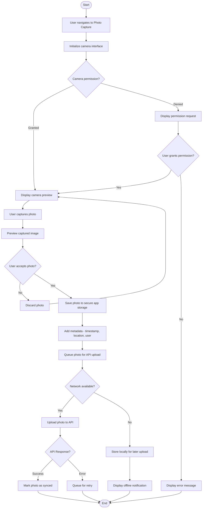

# Technical Specifications

## 1. INTRODUCTION

### EXECUTIVE SUMMARY

The project involves developing a .NET MAUI mobile application primarily for Android devices, designed for security personnel or patrol officers to track their activities, locations, and complete checkpoint-based patrols. The application addresses the need for real-time location tracking, activity documentation, and systematic patrol management.

**Core Business Problem:** Security and patrol operations currently lack efficient digital tools for authentication, time tracking, location monitoring, and documentation of patrol activities. Manual processes lead to inconsistency, lack of accountability, and inefficient patrol management.

**Key Stakeholders and Users:**
- Security personnel/patrol officers (primary users)
- Security management/supervisors
- System administrators
- API service providers

**Value Proposition:**
- Enhanced accountability through authenticated clock-in/out and location tracking
- Improved patrol efficiency with checkpoint verification
- Streamlined documentation with in-app photo capture and activity reporting
- Centralized data collection through API integration

### SYSTEM OVERVIEW

#### Project Context

| Aspect | Description |
|--------|-------------|
| Business Context | The application serves security operations requiring authenticated time tracking, location monitoring, and systematic patrol verification |
| Current Limitations | Existing processes likely rely on manual documentation, lack real-time location tracking, and have limited accountability measures |
| Integration Landscape | The application will integrate with backend services via APIs for authentication, data synchronization, and location services |

#### High-Level Description

The .NET MAUI application will provide a comprehensive mobile solution for security patrol operations with the following capabilities:

- Phone number-based authentication with verification code
- Clock-in/out functionality with historical record keeping
- Continuous GPS location tracking during active shifts
- In-app photo capture and storage
- Activity reporting with note-taking capabilities
- Interactive patrol management with map-based checkpoint verification

The architecture employs .NET MAUI for cross-platform compatibility (focusing on Android), integrates with device GPS and camera capabilities, implements secure local storage, and communicates with backend services through RESTful APIs.

#### Success Criteria

| Criteria | Measurement |
|----------|-------------|
| User Adoption | >90% of patrol staff actively using the application |
| Data Accuracy | >95% accuracy in location tracking and checkpoint verification |
| System Reliability | <1% failure rate for critical operations (authentication, clock-in/out, location tracking) |
| Operational Efficiency | >20% reduction in patrol completion time and reporting effort |

### SCOPE

#### In-Scope

**Core Features and Functionalities:**
- Phone number authentication with verification code
- Clock-in/out functionality with history tracking
- Continuous GPS location tracking during active shifts
- In-app photo capture and storage
- Activity reporting with notes
- Patrol management with map-based checkpoint verification

**Implementation Boundaries:**
- User Groups: Security personnel and patrol officers
- Platform: Android devices via .NET MAUI
- Data Domains: User authentication, location data, time records, patrol checkpoints, activity reports, and captured images

#### Out-of-Scope

- iOS, Windows, or macOS platform support
- Offline operation without eventual synchronization
- Real-time video streaming
- Integration with third-party security systems
- Advanced analytics and reporting dashboards
- User management and role-based access control (assumed to be handled by backend)
- Push notifications and alerts
- Custom hardware integration beyond standard mobile devices

## 2. PRODUCT REQUIREMENTS

### 2.1 FEATURE CATALOG

#### Authentication (F-001)

| Metadata | Details |
|----------|---------|
| Feature Name | Phone Number Authentication |
| Feature Category | Security |
| Priority Level | Critical |
| Status | Proposed |

**Description:**
- **Overview:** Authentication system using phone number and verification code
- **Business Value:** Ensures only authorized personnel can access the application
- **User Benefits:** Simple authentication without complex password management
- **Technical Context:** Requires integration with SMS verification API

**Dependencies:**
- **System Dependencies:** API for verification code generation and validation
- **External Dependencies:** SMS delivery service
- **Integration Requirements:** Secure API communication for verification code exchange

#### Location Tracking (F-002)

| Metadata | Details |
|----------|---------|
| Feature Name | GPS Location Tracking |
| Feature Category | Monitoring |
| Priority Level | Critical |
| Status | Proposed |

**Description:**
- **Overview:** Continuous GPS tracking when user is clocked in
- **Business Value:** Provides accountability and location verification for security personnel
- **User Benefits:** Automatic tracking without manual check-ins
- **Technical Context:** Requires background service for continuous location monitoring

**Dependencies:**
- **Prerequisite Features:** Clock-in functionality (F-003)
- **System Dependencies:** Device GPS capabilities
- **Integration Requirements:** API for location data transmission

#### Time Tracking (F-003)

| Metadata | Details |
|----------|---------|
| Feature Name | Clock In/Out System |
| Feature Category | Operations |
| Priority Level | Critical |
| Status | Proposed |

**Description:**
- **Overview:** Functionality to start and end work shifts with history tracking
- **Business Value:** Accurate time tracking for payroll and accountability
- **User Benefits:** Simple mechanism to record work hours
- **Technical Context:** Requires local storage and API synchronization

**Dependencies:**
- **System Dependencies:** Secure local storage
- **External Dependencies:** Time tracking API
- **Integration Requirements:** API for clock events transmission

#### Photo Capture (F-004)

| Metadata | Details |
|----------|---------|
| Feature Name | In-App Photo Capture |
| Feature Category | Documentation |
| Priority Level | High |
| Status | Proposed |

**Description:**
- **Overview:** Ability to take and store photos within the application
- **Business Value:** Visual documentation of security incidents or conditions
- **User Benefits:** Integrated photo capture without switching applications
- **Technical Context:** Requires camera access and secure image storage

**Dependencies:**
- **System Dependencies:** Device camera capabilities
- **Integration Requirements:** API for photo upload

#### Activity Reporting (F-005)

| Metadata | Details |
|----------|---------|
| Feature Name | Activity Reports |
| Feature Category | Documentation |
| Priority Level | High |
| Status | Proposed |

**Description:**
- **Overview:** System for creating and storing activity notes
- **Business Value:** Documented record of security observations and actions
- **User Benefits:** Centralized note-taking for shift activities
- **Technical Context:** Requires text input and storage capabilities

**Dependencies:**
- **System Dependencies:** Local storage for reports
- **Integration Requirements:** API for report synchronization

#### Patrol Management (F-006)

| Metadata | Details |
|----------|---------|
| Feature Name | Checkpoint-Based Patrols |
| Feature Category | Operations |
| Priority Level | Critical |
| Status | Proposed |

**Description:**
- **Overview:** Map-based patrol system with checkpoint verification
- **Business Value:** Ensures complete coverage of security patrol routes
- **User Benefits:** Visual guidance and verification of patrol completion
- **Technical Context:** Requires mapping integration and proximity detection

**Dependencies:**
- **Prerequisite Features:** Location Tracking (F-002)
- **System Dependencies:** Mapping capabilities
- **External Dependencies:** Checkpoint location data from API
- **Integration Requirements:** API for patrol data and checkpoint status

### 2.2 FUNCTIONAL REQUIREMENTS TABLE

#### Authentication Requirements

| Requirement ID | Description | Acceptance Criteria | Priority |
|----------------|-------------|---------------------|----------|
| F-001-RQ-001 | User shall be able to enter phone number for authentication | Phone number input field accepts valid formats | Must-Have |
| F-001-RQ-002 | System shall send verification code via API | API call successfully made with phone number | Must-Have |
| F-001-RQ-003 | User shall be able to enter verification code | Code input field accepts numeric entry | Must-Have |
| F-001-RQ-004 | System shall validate verification code | Valid code grants access, invalid code shows error | Must-Have |

**Technical Specifications:**
- **Input Parameters:** Phone number, verification code
- **Output/Response:** Authentication success/failure
- **Performance Criteria:** Authentication process completes within 30 seconds
- **Data Requirements:** Temporary storage of verification code

**Validation Rules:**
- **Data Validation:** Phone number format validation
- **Security Requirements:** Secure transmission of authentication data
- **Compliance Requirements:** Adherence to data protection regulations

#### Location Tracking Requirements

| Requirement ID | Description | Acceptance Criteria | Priority |
|----------------|-------------|---------------------|----------|
| F-002-RQ-001 | System shall track GPS location when user is clocked in | Location data captured at defined intervals | Must-Have |
| F-002-RQ-002 | System shall stop tracking when user is clocked out | Location tracking stops within 1 minute of clock-out | Must-Have |
| F-002-RQ-003 | System shall transmit location data to API | Location data successfully sent to backend | Must-Have |
| F-002-RQ-004 | System shall handle temporary loss of GPS signal | Graceful recovery when signal returns | Should-Have |

**Technical Specifications:**
- **Input Parameters:** GPS coordinates, timestamp
- **Output/Response:** Confirmation of location data transmission
- **Performance Criteria:** Minimal battery impact, accuracy within 10 meters
- **Data Requirements:** Latitude, longitude, timestamp, accuracy

**Validation Rules:**
- **Business Rules:** Location tracking only during active shifts
- **Security Requirements:** Secure transmission of location data
- **Compliance Requirements:** User notification of location tracking

#### Time Tracking Requirements

| Requirement ID | Description | Acceptance Criteria | Priority |
|----------------|-------------|---------------------|----------|
| F-003-RQ-001 | User shall be able to clock in | Clock-in event recorded with timestamp | Must-Have |
| F-003-RQ-002 | User shall be able to clock out | Clock-out event recorded with timestamp | Must-Have |
| F-003-RQ-003 | System shall display clock history | History list shows all clock events | Must-Have |
| F-003-RQ-004 | System shall transmit clock events to API | Events successfully sent to backend | Must-Have |

**Technical Specifications:**
- **Input Parameters:** User action (clock in/out)
- **Output/Response:** Confirmation of clock event
- **Performance Criteria:** Event recording within 2 seconds
- **Data Requirements:** Event type, timestamp, location

**Validation Rules:**
- **Business Rules:** Cannot clock in if already clocked in
- **Data Validation:** Valid timestamp format
- **Security Requirements:** Prevent unauthorized clock modifications

#### Photo Capture Requirements

| Requirement ID | Description | Acceptance Criteria | Priority |
|----------------|-------------|---------------------|----------|
| F-004-RQ-001 | User shall be able to capture photos in-app | Camera interface accessible and functional | Must-Have |
| F-004-RQ-002 | System shall store photos within app storage | Photos saved and retrievable | Must-Have |
| F-004-RQ-003 | System shall not save photos to device camera roll | Photos absent from device gallery | Must-Have |
| F-004-RQ-004 | System shall transmit photos to API | Photos successfully uploaded to backend | Must-Have |

**Technical Specifications:**
- **Input Parameters:** Camera capture
- **Output/Response:** Stored image file
- **Performance Criteria:** Photo capture within 3 seconds
- **Data Requirements:** Image file, timestamp, location metadata

**Validation Rules:**
- **Data Validation:** Image quality check
- **Security Requirements:** Secure storage of sensitive images
- **Compliance Requirements:** Privacy considerations for captured content

#### Activity Reporting Requirements

| Requirement ID | Description | Acceptance Criteria | Priority |
|----------------|-------------|---------------------|----------|
| F-005-RQ-001 | User shall be able to create activity reports | Report creation interface functional | Must-Have |
| F-005-RQ-002 | User shall be able to enter and save notes | Text input and storage functional | Must-Have |
| F-005-RQ-003 | System shall store reports within app | Reports saved and retrievable | Must-Have |
| F-005-RQ-004 | System shall transmit reports to API | Reports successfully sent to backend | Must-Have |

**Technical Specifications:**
- **Input Parameters:** Text input, timestamp
- **Output/Response:** Stored report
- **Performance Criteria:** Text saving within 2 seconds
- **Data Requirements:** Report text, timestamp, location metadata

**Validation Rules:**
- **Business Rules:** Reports must include timestamp
- **Data Validation:** Text length limitations
- **Security Requirements:** Secure transmission of report data

#### Patrol Management Requirements

| Requirement ID | Description | Acceptance Criteria | Priority |
|----------------|-------------|---------------------|----------|
| F-006-RQ-001 | System shall display map with user's current location | Map shows accurate position | Must-Have |
| F-006-RQ-002 | System shall retrieve checkpoint data from API | Checkpoints successfully loaded | Must-Have |
| F-006-RQ-003 | System shall display checkpoints on map when location selected | Checkpoints visually represented | Must-Have |
| F-006-RQ-004 | System shall detect proximity to checkpoints (within 50 feet) | Proximity detection accurate | Must-Have |
| F-006-RQ-005 | System shall allow checkpoint verification when in proximity | Checkpoint can be marked as completed | Must-Have |
| F-006-RQ-006 | System shall visually indicate completed checkpoints | Completed checkpoints shown in green | Must-Have |

**Technical Specifications:**
- **Input Parameters:** GPS coordinates, checkpoint data
- **Output/Response:** Visual map display, checkpoint status
- **Performance Criteria:** Map updates within 3 seconds, proximity detection within 5 seconds
- **Data Requirements:** Checkpoint coordinates, status, completion timestamp

**Validation Rules:**
- **Business Rules:** Checkpoints only verifiable when in proximity
- **Data Validation:** Valid checkpoint data format
- **Security Requirements:** Secure transmission of patrol data

### 2.3 FEATURE RELATIONSHIPS

#### Feature Dependencies Map


#### Integration Points

| Feature | Integration Point | Description |
|---------|-------------------|-------------|
| F-001 | Authentication API | Verification code generation and validation |
| F-002 | Location API | Transmission of GPS coordinates |
| F-003 | Time Tracking API | Transmission of clock events |
| F-004 | Photo Upload API | Transmission of captured images |
| F-005 | Report API | Transmission of activity reports |
| F-006 | Checkpoint API | Retrieval of checkpoint data and status updates |

#### Shared Components

| Component | Used By Features | Description |
|-----------|------------------|-------------|
| API Service | F-001, F-002, F-003, F-004, F-005, F-006 | Common service for API communication |
| Local Storage | F-003, F-004, F-005 | Secure storage for app data |
| Location Service | F-002, F-006 | GPS tracking and location management |
| Authentication State | F-001, F-002, F-003, F-004, F-005, F-006 | User authentication status |

### 2.4 IMPLEMENTATION CONSIDERATIONS

#### Technical Constraints

| Feature | Constraint | Impact |
|---------|------------|--------|
| F-002 | Battery usage during continuous tracking | Optimize location polling frequency |
| F-004 | Device storage limitations | Implement image compression |
| F-006 | GPS accuracy limitations | Account for margin of error in proximity detection |
| All | Network connectivity requirements | Implement offline data queuing |

#### Performance Requirements

| Feature | Requirement | Measurement |
|---------|-------------|------------|
| F-001 | Authentication process < 30 seconds | End-to-end timing |
| F-002 | Battery impact < 15% per 8-hour shift | Battery usage monitoring |
| F-003 | Clock event recording < 2 seconds | Operation timing |
| F-006 | Map rendering < 3 seconds | Screen load timing |

#### Security Implications

| Feature | Security Consideration | Mitigation |
|---------|------------------------|------------|
| F-001 | Authentication data protection | Secure transmission, no local storage of credentials |
| F-002 | Location data privacy | Clear user consent, data minimization |
| F-004 | Sensitive image protection | Encrypted storage, no device gallery access |
| All | API communication security | HTTPS, authentication tokens |

#### Maintenance Requirements

| Feature | Maintenance Need | Approach |
|---------|------------------|----------|
| F-001 | Authentication API changes | Version-aware API client |
| F-002 | Location permission changes | Adaptive permission handling |
| F-006 | Map provider updates | Abstraction layer for map services |
| All | API endpoint configuration | Externalized configuration |

## 3. TECHNOLOGY STACK

### 3.1 PROGRAMMING LANGUAGES

| Language | Purpose | Justification |
|----------|---------|---------------|
| C# | Primary development language | Core language for .NET MAUI development with strong typing and performance characteristics |
| XAML | UI definition | Declarative markup language for defining cross-platform user interfaces in .NET MAUI |
| SQL | Local database queries | Required for SQLite interactions for local data persistence |

The selection of C# as the primary language aligns with the .NET MAUI framework requirement, providing access to the complete .NET ecosystem while enabling cross-platform development with focus on Android as specified.

### 3.2 FRAMEWORKS & LIBRARIES

| Framework/Library | Version | Purpose | Justification |
|-------------------|---------|---------|---------------|
| .NET MAUI | 8.0+ | Cross-platform application framework | Primary framework enabling Android development with single codebase |
| .NET | 8.0+ | Base platform | Latest stable version with long-term support |
| SQLite-net-pcl | 1.8+ | Local database access | Lightweight embedded database for offline storage of user data |
| Xamarin.Essentials | Latest | Device feature access | Provides APIs for accessing native device features like camera and GPS |
| CommunityToolkit.Maui | Latest | UI components and helpers | Extends MAUI with additional controls and utilities |
| CommunityToolkit.Mvvm | Latest | MVVM implementation | Simplifies implementation of the MVVM pattern for cleaner architecture |
| Newtonsoft.Json | 13.0+ | JSON serialization/deserialization | Industry standard for handling JSON data from APIs |
| Xamarin.Forms.Maps | Latest | Map integration | Required for displaying maps and user location |
| Polly | Latest | Resilience and transient-fault handling | Provides retry policies for API communication reliability |

The framework selection prioritizes the .NET MAUI ecosystem to fulfill the Android compatibility requirement while maintaining a path for potential future expansion to other platforms if needed.

### 3.3 DATABASES & STORAGE

| Storage Solution | Purpose | Justification |
|------------------|---------|---------------|
| SQLite | Local data persistence | Embedded database for storing user data, clock events, and activity reports when offline |
| Secure File Storage | Image storage | Encrypted local storage for photos captured within the app |
| In-memory cache | Temporary data | Efficient storage of frequently accessed data like authentication state |

Data persistence strategy includes:
- Local-first approach with SQLite for offline capability
- Synchronization with backend APIs when connectivity is available
- Secure storage for sensitive data like images
- Encrypted storage for all local data

### 3.4 THIRD-PARTY SERVICES

| Service | Purpose | Integration Method |
|---------|---------|-------------------|
| SMS Verification Service | Authentication code delivery | API integration for phone verification |
| Mapping Service (Google Maps/Mapbox) | Map display and location services | SDK integration via Xamarin.Forms.Maps |
| Backend APIs | Data synchronization | RESTful API integration for all data exchange |

The application will integrate with several backend services:
- Authentication API for phone verification
- Location tracking API for GPS data transmission
- Time tracking API for clock events
- Photo upload API for image transmission
- Activity report API for notes synchronization
- Checkpoint API for patrol data

### 3.5 DEVELOPMENT & DEPLOYMENT

| Tool/Platform | Purpose | Justification |
|---------------|---------|---------------|
| Visual Studio 2022 | Primary IDE | Comprehensive development environment with .NET MAUI support |
| Android SDK | Android development | Required for building Android applications |
| Android Emulator | Testing | Virtual device testing during development |
| MSBuild | Build system | Standard build system for .NET applications |
| NuGet | Package management | .NET standard for managing library dependencies |
| Azure DevOps/GitHub Actions | CI/CD pipeline | Automated build and deployment processes |
| App Center | Distribution and analytics | Simplified distribution to testers and production |

Development workflow includes:
- Local development in Visual Studio with Android emulator
- Source control with Git
- Automated builds via CI/CD pipeline
- Testing on physical Android devices
- Distribution through App Center or Google Play Store

### 3.6 TECHNOLOGY ARCHITECTURE DIAGRAM


## 4. PROCESS FLOWCHART

### 4.1 SYSTEM WORKFLOWS

#### 4.1.1 Core Business Processes

##### Authentication Flow


##### Clock In/Out Process


##### Patrol Checkpoint Verification


##### Photo Capture Process



##### Activity Reporting Process


#### 4.1.2 Integration Workflows

##### Data Synchronization Flow


##### API Communication Sequence


### 4.2 FLOWCHART REQUIREMENTS

#### 4.2.1 Error Handling and Recovery


#### 4.2.2 State Transition Diagram


### 4.3 TECHNICAL IMPLEMENTATION

#### 4.3.1 Background Service Flow


#### 4.3.2 Checkpoint Proximity Detection


#### 4.3.3 Data Persistence Strategy


### 4.4 VALIDATION RULES

#### 4.4.1 Business Rule Enforcement


#### 4.4.2 Data Validation Requirements

| Feature | Data Element | Validation Rule | Error Message |
|---------|--------------|-----------------|---------------|
| Authentication | Phone Number | Must match pattern: +[country code][number] | "Please enter a valid phone number with country code" |
| Authentication | Verification Code | Must be 6 digits | "Verification code must be 6 digits" |
| Clock In/Out | Clock Action | Cannot clock in if already clocked in | "You are already clocked in" |
| Clock In/Out | Clock Action | Cannot clock out if already clocked out | "You are already clocked out" |
| Location Tracking | GPS | Location permission must be granted | "Location permission required for tracking" |
| Photo Capture | Camera | Camera permission must be granted | "Camera permission required for photo capture" |
| Photo Capture | Storage | Minimum 10MB available storage | "Insufficient storage for photo capture" |
| Activity Report | Report Text | Cannot be empty | "Report text cannot be empty" |
| Activity Report | Report Text | Maximum 500 characters | "Report text exceeds maximum length" |
| Patrol | Checkpoint Verification | Must be within 50 feet of checkpoint | "Must be within 50 feet to verify checkpoint" |
| Patrol | Checkpoint Verification | Cannot verify already verified checkpoint | "Checkpoint already verified" |

### 4.5 TIMING AND PERFORMANCE CONSIDERATIONS

| Process | Timing Constraint | SLA | Mitigation Strategy |
|---------|-------------------|-----|---------------------|
| Authentication | Complete within 30 seconds | 95% of attempts | Timeout handling with retry option |
| Location Tracking | Update every 30-60 seconds | Battery impact <15% per 8-hour shift | Adaptive polling based on movement |
| API Synchronization | Complete within 5 seconds | 90% of operations | Background processing with retry mechanism |
| Photo Upload | Complete within 30 seconds | 85% of uploads | Compression and background upload |
| Map Loading | Complete within 3 seconds | 90% of loads | Progressive loading and caching |
| Checkpoint Detection | Detect within 5 seconds of proximity | 95% accuracy | Optimized geofencing algorithm |
| Clock In/Out | Process within 2 seconds | 98% of operations | Local-first operation with background sync |

## 5. SYSTEM ARCHITECTURE

### 5.1 HIGH-LEVEL ARCHITECTURE

#### 5.1.1 System Overview

The Security Patrol Application follows a client-centric architecture with a mobile-first approach, implementing a layered architecture pattern within the .NET MAUI framework. The system is designed with the following key architectural principles:

- **Mobile-First Design**: Optimized for Android devices with a focus on battery efficiency and responsive UI
- **Layered Architecture**: Clear separation between presentation, business logic, and data access layers
- **Repository Pattern**: Abstraction of data persistence operations for both local storage and API communication
- **MVVM Pattern**: Separation of UI (Views) from business logic (ViewModels) for maintainable code and testability
- **Service-Oriented Integration**: RESTful API communication with backend services for all data synchronization
- **Offline-First Capability**: Local-first data operations with background synchronization for resilience

System boundaries are defined with the mobile application as the primary client, communicating with multiple backend API services for authentication, data synchronization, and patrol management. The application interfaces directly with device hardware (GPS, camera) while maintaining a clear separation between device-specific implementations and business logic.

#### 5.1.2 Core Components Table

| Component Name | Primary Responsibility | Key Dependencies | Critical Considerations |
|----------------|------------------------|------------------|-------------------------|
| Authentication Module | User verification and session management | Authentication API, Secure Storage | Token management, session expiration |
| Location Tracking Service | GPS monitoring and location data management | Device GPS, Location API | Battery optimization, background processing |
| Time Tracking Module | Clock in/out management and history | Time Tracking API, Local Database | Accurate timestamps, offline operation |
| Photo Capture Module | Camera access and image management | Device Camera, Photo API | Secure storage, image compression |
| Activity Reporting Module | Report creation and management | Report API, Local Database | Data validation, offline capability |
| Patrol Management Module | Checkpoint verification and patrol tracking | Checkpoint API, Mapping Service | Geofencing accuracy, map rendering performance |
| Data Synchronization Service | Background data synchronization | All APIs, Network Service | Conflict resolution, retry logic |

#### 5.1.3 Data Flow Description

The application implements a bidirectional data flow between the mobile client and backend services. All user-generated data (clock events, location updates, photos, reports, checkpoint verifications) follows a local-first approach where data is first persisted locally before being synchronized with backend services.

Authentication data flows directly between the client and Authentication API, with tokens stored securely on the device. Location data is continuously collected when the user is clocked in and batched for efficient transmission to the Location API. Clock events, photos, and activity reports are stored locally and synchronized with their respective APIs based on network availability.

Patrol data follows a more complex flow: checkpoint data is retrieved from the Checkpoint API and stored locally, user location is continuously compared against checkpoint coordinates for proximity detection, and verification events are sent to the API when checkpoints are completed.

The system employs SQLite for structured data persistence (clock events, reports, checkpoint status) and secure file storage for binary data (photos). A local cache is maintained for frequently accessed data like authentication state and active patrol information.

#### 5.1.4 External Integration Points

| System Name | Integration Type | Data Exchange Pattern | Protocol/Format | SLA Requirements |
|-------------|------------------|------------------------|-----------------|------------------|
| Authentication API | REST API | Request-Response | HTTPS/JSON | Response < 3s, 99.9% availability |
| Location API | REST API | Batch Upload | HTTPS/JSON | Batch processing < 5s, 99.5% availability |
| Time Tracking API | REST API | Request-Response | HTTPS/JSON | Response < 2s, 99.9% availability |
| Photo Upload API | REST API | Multipart Form Data | HTTPS/Binary | Upload processing < 30s, 99% availability |
| Report API | REST API | Request-Response | HTTPS/JSON | Response < 2s, 99.5% availability |
| Checkpoint API | REST API | Request-Response | HTTPS/JSON | Response < 3s, 99.5% availability |
| Mapping Service | SDK Integration | Client-Side Rendering | HTTPS/Tiles | Tile loading < 1s, 99.9% availability |

### 5.2 COMPONENT DETAILS

#### 5.2.1 Authentication Module

**Purpose and Responsibilities:**
- Phone number validation and verification code handling
- Secure storage of authentication tokens
- Session management and expiration handling
- Authentication state propagation to other modules

**Technologies and Frameworks:**
- .NET MAUI Secure Storage for token persistence
- CommunityToolkit.Mvvm for authentication state management
- Polly for resilient API communication

**Key Interfaces:**
- `IAuthenticationService`: Interface for authentication operations
- `ISecureStorage`: Interface for secure token storage
- `IAuthenticationStateProvider`: Interface for authentication state access

**Data Persistence:**
- Authentication tokens stored in platform-specific secure storage
- No persistent storage of credentials (phone number, verification code)

**Scaling Considerations:**
- Token refresh mechanism for extended sessions
- Support for multiple authentication methods in future


#### 5.2.2 Location Tracking Service

**Purpose and Responsibilities:**
- Continuous GPS monitoring when user is clocked in
- Efficient location data collection and batching
- Background service management for tracking when app is minimized
- Geofencing for checkpoint proximity detection

**Technologies and Frameworks:**
- Xamarin.Essentials.Geolocation for GPS access
- .NET MAUI Background Services for continuous tracking
- SQLite for location data caching

**Key Interfaces:**
- `ILocationService`: Interface for location tracking operations
- `IGeofenceManager`: Interface for checkpoint proximity detection
- `ILocationRepository`: Interface for location data persistence

**Data Persistence:**
- Location data temporarily stored in SQLite
- Periodic purging of historical location data after successful API synchronization

**Scaling Considerations:**
- Adaptive polling frequency based on movement and battery level
- Configurable accuracy levels for different operations


#### 5.2.3 Time Tracking Module

**Purpose and Responsibilities:**
- Clock in/out functionality with timestamp recording
- History management of clock events
- Synchronization of clock events with backend API

**Technologies and Frameworks:**
- SQLite for local clock event storage
- CommunityToolkit.Mvvm for state management
- Polly for resilient API communication

**Key Interfaces:**
- `ITimeTrackingService`: Interface for clock operations
- `ITimeRecordRepository`: Interface for clock event persistence
- `ITimeTrackingStateProvider`: Interface for current clock state

**Data Persistence:**
- Clock events stored in SQLite database
- Synchronization status tracked for each event

**Scaling Considerations:**
- Support for different shift types and break tracking
- Historical data archiving strategy


#### 5.2.4 Photo Capture Module

**Purpose and Responsibilities:**
- Camera interface management
- Photo capture and secure storage
- Image compression and metadata attachment
- Synchronization with Photo Upload API

**Technologies and Frameworks:**
- .NET MAUI MediaPicker for camera access
- Secure file storage for image persistence
- Image compression libraries

**Key Interfaces:**
- `IPhotoService`: Interface for photo capture operations
- `IPhotoRepository`: Interface for photo storage and retrieval
- `IPhotoSyncService`: Interface for photo API synchronization

**Data Persistence:**
- Photos stored in application-specific secure storage
- Metadata (timestamp, location, sync status) stored in SQLite

**Scaling Considerations:**
- Configurable image quality and compression ratios
- Storage management with automatic cleanup of synchronized photos


#### 5.2.5 Activity Reporting Module

**Purpose and Responsibilities:**
- Activity report creation and management
- Text input validation and processing
- Report synchronization with backend API

**Technologies and Frameworks:**
- SQLite for report storage
- CommunityToolkit.Mvvm for state management
- Polly for resilient API communication

**Key Interfaces:**
- `IReportService`: Interface for report operations
- `IReportRepository`: Interface for report persistence
- `IReportSyncService`: Interface for report API synchronization

**Data Persistence:**
- Reports stored in SQLite database
- Synchronization status tracked for each report

**Scaling Considerations:**
- Support for rich text formatting
- Categorization and tagging of reports


#### 5.2.6 Patrol Management Module

**Purpose and Responsibilities:**
- Map display and user location visualization
- Checkpoint data retrieval and management
- Proximity detection and checkpoint verification
- Patrol completion tracking

**Technologies and Frameworks:**
- Xamarin.Forms.Maps for map display
- Geofencing for checkpoint proximity detection
- SQLite for checkpoint and patrol data storage

**Key Interfaces:**
- `IPatrolService`: Interface for patrol operations
- `ICheckpointRepository`: Interface for checkpoint data
- `IMapService`: Interface for map operations
- `IGeofenceService`: Interface for proximity detection

**Data Persistence:**
- Checkpoint data stored in SQLite database
- Patrol status and completion data in SQLite
- Synchronization status tracked for verifications

**Scaling Considerations:**
- Support for complex patrol routes and sequences
- Optimization for large numbers of checkpoints

```mermaid
sequenceDiagram
    participant User
    participant PatrolView as Patrol View
    participant PatrolVM as Patrol ViewModel
    participant PatrolService as Patrol Service
    participant MapService as Map Service
    participant LocService as Location Service
    participant DB as Local Database
    participant API as Checkpoint API

    User->>PatrolView: Open Patrol Screen
    PatrolView->>PatrolVM: Initialize()
    PatrolVM->>MapService: InitializeMap()
    MapService-->>PatrolVM: Map Ready
    PatrolVM->>PatrolService: GetLocations()
    PatrolService->>API: GET /locations
    API-->>PatrolService: Return Locations
    PatrolService->>DB: Store Locations
    PatrolService-->>PatrolVM: Return Locations
    PatrolVM-->>PatrolView: Display Location Dropdown
    
    User->>PatrolView: Select Location
    PatrolView->>PatrolVM: LocationSelected(id)
    PatrolVM->>PatrolService: GetCheckpoints(locationId)
    PatrolService->>DB: Retrieve Checkpoints
    PatrolService-->>PatrolVM: Return Checkpoints
    PatrolVM->>MapService: DisplayCheckpoints(checkpoints)
    MapService-->>PatrolVM: Checkpoints Displayed
    PatrolVM-->>PatrolView: Update Checkpoint List
    
    loop Location Monitoring
        LocService->>PatrolService: LocationUpdated(coordinates)
        PatrolService->>PatrolService: CheckProximity(coordinates)
        PatrolService-->>PatrolVM: NearbyCheckpoint(id)
        PatrolVM-->>PatrolView: Highlight Checkpoint
    end
    
    User->>PatrolView: Verify Checkpoint
    PatrolView->>PatrolVM: VerifyCheckpoint(id)
    PatrolVM->>PatrolService: VerifyCheckpoint(id)
    PatrolService->>DB: Update Checkpoint Status
    PatrolService->>API: POST /checkpoints/verify
    API-->>PatrolService: Confirm Verification
    PatrolService->>DB: Update Sync Status
    PatrolService-->>PatrolVM: Verification Complete
    PatrolVM-->>PatrolView: Update UI
```

#### 5.2.7 Data Synchronization Service

**Purpose and Responsibilities:**
- Background synchronization of all data types
- Network availability monitoring
- Conflict resolution and retry logic
- Synchronization status tracking

**Technologies and Frameworks:**
- .NET MAUI Background Services
- Polly for resilient API communication
- Connectivity monitoring

**Key Interfaces:**
- `ISyncService`: Interface for synchronization operations
- `INetworkService`: Interface for network status monitoring
- `ISyncRepository`: Interface for sync status tracking

**Data Persistence:**
- Synchronization status and history in SQLite
- Pending operations queue in SQLite

**Scaling Considerations:**
- Prioritization of different data types
- Bandwidth optimization strategies

```mermaid
stateDiagram-v2
    [*] --> Idle: Initialize
    Idle --> CheckingNetwork: Sync Requested
    CheckingNetwork --> Idle: No Network
    CheckingNetwork --> Preparing: Network Available
    Preparing --> Synchronizing: Data Ready
    Synchronizing --> Processing: API Response
    Processing --> Synchronizing: More Items
    Processing --> Completing: All Items Processed
    Completing --> Idle: Sync Complete
    Synchronizing --> ErrorHandling: API Error
    ErrorHandling --> Retrying: Retry Possible
    Retrying --> Synchronizing: Retry
    ErrorHandling --> Completing: Skip Item
    Idle --> [*]: Terminate
```

### 5.3 TECHNICAL DECISIONS

#### 5.3.1 Architecture Style Decisions

| Decision | Selected Approach | Alternatives Considered | Rationale |
|----------|-------------------|-------------------------|-----------|
| Application Architecture | Layered Architecture with MVVM | Monolithic, Clean Architecture | Provides clear separation of concerns while maintaining simplicity for a mobile application |
| Communication Pattern | RESTful API with JSON | GraphQL, gRPC | REST provides simplicity, wide support, and compatibility with existing backend services |
| Offline Strategy | Local-First with Background Sync | Online-Only, Offline-First with Manual Sync | Balances user experience in poor connectivity with data integrity requirements |
| UI Pattern | MVVM | MVC, MVP | MVVM provides better testability and is well-supported by .NET MAUI frameworks |

The layered architecture with MVVM pattern was selected to provide a clear separation between UI, business logic, and data access while maintaining simplicity appropriate for a mobile application. This approach aligns well with .NET MAUI's design principles and facilitates code reuse and testability.

The local-first approach with background synchronization was chosen to ensure the application remains functional in areas with poor connectivity, which is essential for security patrol operations that may occur in remote locations or buildings with limited signal.

```mermaid
graph TD
    subgraph "Architecture Decision: Communication Pattern"
        A[Need: API Communication] --> B{Evaluation Criteria}
        B --> C[Simplicity]
        B --> D[Backend Compatibility]
        B --> E[Mobile Performance]
        B --> F[Developer Familiarity]
        
        C --> G{Options}
        D --> G
        E --> G
        F --> G
        
        G --> H[REST]
        G --> I[GraphQL]
        G --> J[gRPC]
        
        H --> K{Decision Factors}
        I --> K
        J --> K
        
        K --> L[REST Selected]
        
        L --> M[Widely supported]
        L --> N[Simple implementation]
        L --> O[Compatible with existing systems]
        L --> P[Efficient JSON parsing]
    end
```

#### 5.3.2 Data Storage Solution Rationale

| Storage Need | Selected Solution | Alternatives Considered | Rationale |
|--------------|-------------------|-------------------------|-----------|
| Structured Data | SQLite | Realm, LiteDB | Native support in .NET MAUI, mature ecosystem, SQL familiarity |
| Authentication Tokens | Secure Storage | Encrypted SQLite, Preferences | Platform-specific secure storage mechanisms for sensitive data |
| Images | File System with Encryption | SQLite BLOB, Cloud Storage | Better performance for binary data while maintaining security |
| Temporary Cache | In-Memory Dictionary | SQLite with Cache Table | Performance optimization for frequently accessed data |

SQLite was selected as the primary data storage solution due to its native support in .NET MAUI, small footprint, and ability to handle structured data efficiently. The decision to store images in the file system rather than as BLOBs in SQLite was made to optimize performance, as file system access is generally more efficient for large binary data.

Secure Storage was chosen for authentication tokens to leverage platform-specific security mechanisms, providing an additional layer of protection for sensitive authentication data.

```mermaid
graph TD
    subgraph "Architecture Decision Record: Data Storage"
        A[Context: Mobile App Data Storage] --> B[Decision: Multiple Storage Types]
        B --> C[Status: Accepted]
        
        C --> D{Consequences}
        D --> E[Positive: Optimized for different data types]
        D --> F[Positive: Enhanced security for sensitive data]
        D --> G[Negative: Increased complexity]
        D --> H[Negative: Multiple persistence mechanisms to maintain]
        
        I[Implementation: SQLite + Secure Storage + File System] --> J{Compliance}
        J --> K[Meets security requirements]
        J --> L[Supports offline operation]
        J --> M[Efficient for different data types]
    end
```

#### 5.3.3 Caching Strategy Justification

| Cache Type | Implementation | Purpose | Lifecycle |
|------------|----------------|---------|-----------|
| Authentication State | In-Memory | Quick access to auth status | Session duration |
| Location Cache | In-Memory Queue | Batch processing of location updates | Until successfully synced |
| Checkpoint Data | SQLite | Offline access to patrol information | Until patrol completion |
| Map Tiles | Native Map Control Cache | Reduce bandwidth for map rendering | Application lifecycle |

The caching strategy is designed to balance performance, offline capability, and memory usage. Authentication state is kept in memory for quick access throughout the application, while location data is queued in memory for efficient batch processing before being persisted to SQLite and eventually synchronized with the backend.

Checkpoint data is cached in SQLite to ensure availability even when offline, with a lifecycle tied to patrol completion to prevent unnecessary storage consumption. Map tiles leverage the native caching capabilities of the mapping control to reduce bandwidth usage and improve map rendering performance.

#### 5.3.4 Security Mechanism Selection

| Security Concern | Selected Mechanism | Alternatives Considered | Rationale |
|------------------|--------------------|-----------------------|-----------|
| Authentication | Token-based Authentication | Username/Password, Biometric | Simplifies user experience while maintaining security |
| Data Protection | Platform Secure Storage + Encryption | Custom Encryption, Plain Storage | Leverages platform security features with additional encryption layer |
| API Communication | HTTPS with Certificate Pinning | Plain HTTP, Custom Encryption | Industry standard with additional protection against MITM attacks |
| Sensitive Data | Secure Storage API | Encrypted SQLite, Custom Solution | Platform-optimized secure storage for sensitive information |

Security mechanisms were selected with a focus on balancing security requirements with user experience and development complexity. Token-based authentication provides a streamlined experience while maintaining security, and platform secure storage mechanisms leverage OS-level security features.

HTTPS with certificate pinning was chosen for API communication to protect against man-in-the-middle attacks, which is particularly important for a security application handling sensitive location and patrol data.

### 5.4 CROSS-CUTTING CONCERNS

#### 5.4.1 Monitoring and Observability Approach

The application implements a comprehensive monitoring strategy to ensure reliability and performance:

- **Application Insights Integration**: Telemetry collection for performance monitoring and usage analytics
- **Crash Reporting**: Automated crash reporting with stack traces and device information
- **Performance Metrics**: Tracking of key operations (authentication, API calls, map rendering)
- **Usage Analytics**: Anonymous usage patterns to identify optimization opportunities
- **Health Checks**: Periodic verification of API connectivity and service health

Monitoring data is collected with user consent and transmitted securely to backend analytics services. Critical errors trigger immediate alerts to the development team, while performance metrics are aggregated for trend analysis.

#### 5.4.2 Logging and Tracing Strategy

| Log Level | Usage | Storage Location | Retention |
|-----------|-------|------------------|-----------|
| Error | Exceptions, critical failures | Local + Remote | 30 days |
| Warning | Potential issues, degraded functionality | Local + Remote | 14 days |
| Information | Key user actions, state transitions | Local | 7 days |
| Debug | Detailed operation information | Local (dev only) | Session only |

The logging strategy employs a structured logging approach with contextual information (user ID, session ID, device information) attached to each log entry. Logs are stored locally with size-based rotation and uploaded to remote logging services when network is available.

Tracing is implemented for complex operations (patrol verification, synchronization) to provide end-to-end visibility into system behavior. Trace context is maintained across asynchronous operations to enable correlation of related events.

#### 5.4.3 Error Handling Patterns

The application implements a layered error handling approach:

- **UI Layer**: User-friendly error messages with actionable guidance
- **ViewModel Layer**: Error aggregation and transformation for presentation
- **Service Layer**: Business logic error handling and recovery attempts
- **Repository Layer**: Data access error handling and fallback strategies
- **API Layer**: Network error handling with retry policies

Common error scenarios are handled with specific recovery strategies:

- **Network Connectivity Issues**: Automatic retry with exponential backoff
- **Authentication Failures**: Token refresh attempt before requiring re-authentication
- **Data Validation Errors**: Clear feedback with field-specific guidance
- **Device Permission Denials**: Contextual explanation and settings navigation

```mermaid
flowchart TD
    A[Error Occurs] --> B{Error Type}
    
    B -->|Network Error| C{Critical Operation?}
    C -->|Yes| D[Apply Retry Policy]
    C -->|No| E[Queue for Background Retry]
    
    D --> F{Retry Successful?}
    F -->|Yes| G[Continue Operation]
    F -->|No| H[Fallback to Cached Data]
    H --> I[Notify User]
    E --> J[Background Sync Service]
    
    B -->|Authentication Error| K[Attempt Token Refresh]
    K --> L{Refresh Successful?}
    L -->|Yes| M[Retry Original Operation]
    L -->|No| N[Redirect to Login]
    
    B -->|Validation Error| O[Highlight Invalid Fields]
    O --> P[Show Specific Guidance]
    
    B -->|Permission Error| Q[Show Permission Rationale]
    Q --> R[Provide Settings Link]
    
    B -->|Unknown Error| S[Log Detailed Error]
    S --> T[Show Generic Message]
    T --> U[Report to Error Service]
    
    G --> V[Operation Complete]
    I --> V
    M --> V
    N --> V
    P --> V
    R --> V
    U --> V
```

#### 5.4.4 Authentication and Authorization Framework

The authentication framework is built around phone number verification with the following components:

- **Authentication Service**: Manages verification process and token lifecycle
- **Token Manager**: Handles secure storage and retrieval of authentication tokens
- **Authorization Filter**: Ensures protected operations require valid authentication
- **Session Monitor**: Tracks session activity and handles timeouts

The authorization model is simplified for this application, with a single user role (security personnel) and authorization based on valid authentication. Future extensions could include role-based access control if needed.

Authentication tokens are refreshed automatically when approaching expiration, and the system handles token revocation scenarios gracefully by redirecting to the login flow.

#### 5.4.5 Performance Requirements and SLAs

| Operation | Performance Target | Measurement Method | Mitigation Strategy |
|-----------|-------------------|-------------------|---------------------|
| Application Startup | < 3 seconds | Cold start timing | Optimized initialization, progressive loading |
| Authentication | < 5 seconds | End-to-end timing | Streamlined verification process |
| Map Rendering | < 2 seconds | Screen load timing | Tile caching, progressive loading |
| Photo Capture | < 1 second | Camera to preview timing | Optimized camera initialization |
| Location Updates | < 15% battery impact per 8-hour shift | Battery usage monitoring | Adaptive polling frequency |
| API Operations | < 2 seconds | Network request timing | Caching, background processing |

The application is designed to meet these performance targets across a range of Android devices, with graceful degradation on lower-end hardware. Performance is monitored continuously through telemetry, with optimization efforts focused on operations that fall below target thresholds.

#### 5.4.6 Disaster Recovery Procedures

The application implements several mechanisms to ensure data integrity and recovery:

- **Data Backup**: Automatic backup of critical local data to secure cloud storage
- **Synchronization Resilience**: Robust retry mechanisms for failed synchronization
- **Corruption Detection**: Integrity checks on local database with automatic repair
- **Version Rollback**: Ability to restore previous application version if critical issues occur
- **Remote Configuration**: Dynamic configuration to disable problematic features remotely

Recovery procedures are designed to be as automated as possible, with clear user guidance when manual intervention is required. The local-first data approach ensures that even in catastrophic failure scenarios, user data can be recovered from local storage.

## 6. SYSTEM COMPONENTS DESIGN

### 6.1 AUTHENTICATION COMPONENT

#### 6.1.1 Component Overview

The Authentication component handles user verification through phone number authentication, manages authentication state, and provides secure token storage.

#### 6.1.2 Class Structure

| Class | Responsibility | Key Methods |
|-------|----------------|-------------|
| `PhoneAuthService` | Manages phone verification process | `RequestVerificationCode()`, `VerifyCode()`, `GetAuthenticationState()` |
| `AuthenticationStateProvider` | Maintains authentication state | `GetCurrentState()`, `UpdateState()`, `IsAuthenticated()` |
| `TokenManager` | Handles secure token storage | `StoreToken()`, `RetrieveToken()`, `ClearToken()` |
| `AuthenticationViewModel` | Handles authentication UI logic | `SendVerificationCode()`, `SubmitVerificationCode()`, `Logout()` |

#### 6.1.3 Interface Definitions

```mermaid
classDiagram
    class IAuthenticationService {
        <<interface>>
        +RequestVerificationCode(string phoneNumber) Task~bool~
        +VerifyCode(string code) Task~bool~
        +GetAuthenticationState() Task~AuthState~
        +Logout() Task
        +RefreshToken() Task~bool~
    }
    
    class ITokenManager {
        <<interface>>
        +StoreToken(string token) Task
        +RetrieveToken() Task~string~
        +ClearToken() Task
        +IsTokenValid() Task~bool~
    }
    
    class IAuthenticationStateProvider {
        <<interface>>
        +GetCurrentState() Task~AuthState~
        +UpdateState(AuthState state) void
        +IsAuthenticated() Task~bool~
        +NotifyStateChanged() void
    }
    
    IAuthenticationService --> ITokenManager : uses
    IAuthenticationService --> IAuthenticationStateProvider : uses
```

#### 6.1.4 Data Models

| Model | Properties | Purpose |
|-------|------------|---------|
| `AuthenticationRequest` | `PhoneNumber` | Request model for verification code |
| `VerificationRequest` | `PhoneNumber`, `VerificationCode` | Request model for code verification |
| `AuthenticationResponse` | `Token`, `ExpiresAt` | Response model from authentication API |
| `AuthState` | `IsAuthenticated`, `PhoneNumber`, `LastAuthenticated` | Internal authentication state |

#### 6.1.5 API Integration

| Endpoint | Method | Request Data | Response Data | Purpose |
|----------|--------|--------------|---------------|---------|
| `/auth/verify` | POST | `{ "phoneNumber": string }` | `{ "verificationId": string }` | Request verification code |
| `/auth/validate` | POST | `{ "phoneNumber": string, "code": string }` | `{ "token": string, "expiresAt": datetime }` | Validate verification code |
| `/auth/refresh` | POST | `{ "token": string }` | `{ "token": string, "expiresAt": datetime }` | Refresh authentication token |

### 6.2 LOCATION TRACKING COMPONENT

#### 6.2.1 Component Overview

The Location Tracking component manages continuous GPS monitoring, location data collection, and transmission to backend services when the user is clocked in.

#### 6.2.2 Class Structure

| Class | Responsibility | Key Methods |
|-------|----------------|-------------|
| `LocationService` | Manages location tracking | `StartTracking()`, `StopTracking()`, `GetCurrentLocation()` |
| `LocationRepository` | Handles location data persistence | `SaveLocationBatch()`, `GetPendingLocations()`, `ClearSyncedLocations()` |
| `LocationSyncService` | Manages API synchronization | `SyncLocations()`, `ScheduleSync()`, `HandleSyncFailure()` |
| `BackgroundLocationService` | Handles background tracking | `OnStart()`, `OnStop()`, `ProcessLocationUpdate()` |

#### 6.2.3 Interface Definitions

```mermaid
classDiagram
    class ILocationService {
        <<interface>>
        +StartTracking() Task
        +StopTracking() Task
        +GetCurrentLocation() Task~LocationModel~
        +IsTracking() bool
        +LocationChanged EventHandler~LocationChangedEventArgs~
    }
    
    class ILocationRepository {
        <<interface>>
        +SaveLocation(LocationModel location) Task
        +SaveLocationBatch(IEnumerable~LocationModel~ locations) Task
        +GetPendingLocations() Task~IEnumerable~LocationModel~~
        +ClearSyncedLocations(IEnumerable~int~ locationIds) Task
    }
    
    class ILocationSyncService {
        <<interface>>
        +SyncLocations() Task~bool~
        +ScheduleSync(TimeSpan interval) void
        +CancelScheduledSync() void
    }
    
    class IBackgroundService {
        <<interface>>
        +Start() Task
        +Stop() Task
        +IsRunning() bool
    }
    
    class BackgroundLocationService {
    }
    
    ILocationService --> ILocationRepository : uses
    ILocationService --> ILocationSyncService : uses
    ILocationSyncService --> ILocationRepository : uses
    IBackgroundService <|-- BackgroundLocationService : implements
    BackgroundLocationService --> ILocationService : uses
```

#### 6.2.4 Data Models

| Model | Properties | Purpose |
|-------|------------|---------|
| `LocationModel` | `Id`, `Latitude`, `Longitude`, `Accuracy`, `Timestamp`, `IsSynced` | Represents a location data point |
| `LocationBatchRequest` | `UserId`, `Locations` | Request model for batch location upload |
| `LocationSyncResponse` | `SyncedIds`, `FailedIds` | Response model from location sync API |
| `LocationChangedEventArgs` | `Location` | Event arguments for location updates |

#### 6.2.5 Background Service Implementation

The background location service uses .NET MAUI's background service capabilities to maintain location tracking even when the application is minimized:

- Implements power-saving strategies with adaptive polling frequency
- Uses foreground service notification on Android for reliable operation
- Implements batch processing to minimize network usage
- Handles location permission changes and GPS availability dynamically

#### 6.2.6 API Integration

| Endpoint | Method | Request Data | Response Data | Purpose |
|----------|--------|--------------|---------------|---------|
| `/location/batch` | POST | `{ "userId": string, "locations": [ { "latitude": double, "longitude": double, "accuracy": double, "timestamp": datetime } ] }` | `{ "syncedIds": [int], "failedIds": [int] }` | Upload batch of location data |

### 6.3 TIME TRACKING COMPONENT

#### 6.3.1 Component Overview

The Time Tracking component manages clock in/out functionality, maintains history of time records, and synchronizes with backend services.

#### 6.3.2 Class Structure

| Class | Responsibility | Key Methods |
|-------|----------------|-------------|
| `TimeTrackingService` | Manages clock operations | `ClockIn()`, `ClockOut()`, `GetCurrentStatus()`, `GetHistory()` |
| `TimeRecordRepository` | Handles time record persistence | `SaveTimeRecord()`, `GetTimeRecords()`, `GetPendingRecords()` |
| `TimeTrackingSyncService` | Manages API synchronization | `SyncTimeRecords()`, `HandleSyncFailure()` |
| `TimeTrackingViewModel` | Handles time tracking UI logic | `PerformClockIn()`, `PerformClockOut()`, `LoadHistory()` |

#### 6.3.3 Interface Definitions

```mermaid
classDiagram
    class ITimeTrackingService {
        <<interface>>
        +ClockIn() Task~TimeRecordModel~
        +ClockOut() Task~TimeRecordModel~
        +GetCurrentStatus() Task~ClockStatus~
        +GetHistory(int count) Task~IEnumerable~TimeRecordModel~~
        +StatusChanged EventHandler~ClockStatusChangedEventArgs~
    }
    
    class ITimeRecordRepository {
        <<interface>>
        +SaveTimeRecord(TimeRecordModel record) Task~int~
        +GetTimeRecords(int count) Task~IEnumerable~TimeRecordModel~~
        +GetPendingRecords() Task~IEnumerable~TimeRecordModel~~
        +UpdateSyncStatus(int id, bool isSynced) Task
    }
    
    class ITimeTrackingSyncService {
        <<interface>>
        +SyncTimeRecords() Task~bool~
        +SyncRecord(TimeRecordModel record) Task~bool~
    }
    
    ITimeTrackingService --> ITimeRecordRepository : uses
    ITimeTrackingService --> ITimeTrackingSyncService : uses
    ITimeTrackingSyncService --> ITimeRecordRepository : uses
```

#### 6.3.4 Data Models

| Model | Properties | Purpose |
|-------|------------|---------|
| `TimeRecordModel` | `Id`, `Type`, `Timestamp`, `Latitude`, `Longitude`, `IsSynced` | Represents a clock in/out event |
| `ClockStatus` | `IsClocked`, `LastClockInTime`, `LastClockOutTime` | Represents current clock status |
| `TimeRecordRequest` | `Type`, `Timestamp`, `Location` | Request model for time record API |
| `TimeRecordResponse` | `Id`, `Status` | Response model from time record API |
| `ClockStatusChangedEventArgs` | `Status` | Event arguments for status changes |

#### 6.3.5 API Integration

| Endpoint | Method | Request Data | Response Data | Purpose |
|----------|--------|--------------|---------------|---------|
| `/time/record` | POST | `{ "type": string, "timestamp": datetime, "location": { "latitude": double, "longitude": double } }` | `{ "id": string, "status": string }` | Record clock in/out event |
| `/time/history` | GET | N/A | `[ { "id": string, "type": string, "timestamp": datetime, "location": { "latitude": double, "longitude": double } } ]` | Retrieve time record history |

### 6.4 PHOTO CAPTURE COMPONENT

#### 6.4.1 Component Overview

The Photo Capture component manages camera access, photo capture, secure storage, and synchronization with backend services.

#### 6.4.2 Class Structure

| Class | Responsibility | Key Methods |
|-------|----------------|-------------|
| `PhotoService` | Manages photo capture operations | `CapturePhoto()`, `GetStoredPhotos()`, `DeletePhoto()` |
| `PhotoRepository` | Handles photo storage and metadata | `SavePhoto()`, `GetPhotos()`, `GetPendingPhotos()` |
| `PhotoSyncService` | Manages API synchronization | `SyncPhotos()`, `UploadPhoto()`, `HandleUploadFailure()` |
| `PhotoViewModel` | Handles photo capture UI logic | `TakePhoto()`, `ViewPhotoDetails()`, `DeletePhoto()` |

#### 6.4.3 Interface Definitions

```mermaid
classDiagram
    class IPhotoService {
        <<interface>>
        +CapturePhoto() Task~PhotoModel~
        +GetStoredPhotos() Task~IEnumerable~PhotoModel~~
        +GetPhotoFile(string id) Task~Stream~
        +DeletePhoto(string id) Task~bool~
    }
    
    class IPhotoRepository {
        <<interface>>
        +SavePhoto(PhotoModel photo, Stream imageStream) Task~string~
        +GetPhotos() Task~IEnumerable~PhotoModel~~
        +GetPendingPhotos() Task~IEnumerable~PhotoModel~~
        +GetPhotoStream(string id) Task~Stream~
        +UpdateSyncStatus(string id, bool isSynced) Task
        +DeletePhoto(string id) Task~bool~
    }
    
    class IPhotoSyncService {
        <<interface>>
        +SyncPhotos() Task~bool~
        +UploadPhoto(string id) Task~bool~
        +CancelUpload(string id) void
    }
    
    IPhotoService --> IPhotoRepository : uses
    IPhotoService --> IPhotoSyncService : uses
    IPhotoSyncService --> IPhotoRepository : uses
```

#### 6.4.4 Data Models

| Model | Properties | Purpose |
|-------|------------|---------|
| `PhotoModel` | `Id`, `Timestamp`, `Latitude`, `Longitude`, `FilePath`, `IsSynced`, `SyncProgress` | Represents a captured photo with metadata |
| `PhotoUploadRequest` | `Timestamp`, `Location`, `ImageData` | Request model for photo upload API |
| `PhotoUploadResponse` | `Id`, `Status` | Response model from photo upload API |
| `PhotoUploadProgress` | `Id`, `Progress`, `Status` | Progress tracking for photo uploads |

#### 6.4.5 Secure Storage Implementation

The photo storage implementation ensures that photos are stored securely within the application sandbox:

- Photos stored in application-specific directory not accessible to other apps
- Optional encryption for sensitive images
- Metadata stored separately in SQLite database
- Automatic cleanup of synchronized photos based on storage constraints

#### 6.4.6 API Integration

| Endpoint | Method | Request Data | Response Data | Purpose |
|----------|--------|--------------|---------------|---------|
| `/photos/upload` | POST (multipart/form-data) | `timestamp`, `latitude`, `longitude`, `image` (file) | `{ "id": string, "status": string }` | Upload captured photo |

### 6.5 ACTIVITY REPORTING COMPONENT

#### 6.5.1 Component Overview

The Activity Reporting component manages creation, storage, and synchronization of activity reports.

#### 6.5.2 Class Structure

| Class | Responsibility | Key Methods |
|-------|----------------|-------------|
| `ReportService` | Manages report operations | `CreateReport()`, `GetReports()`, `DeleteReport()` |
| `ReportRepository` | Handles report persistence | `SaveReport()`, `GetReports()`, `GetPendingReports()` |
| `ReportSyncService` | Manages API synchronization | `SyncReports()`, `UploadReport()`, `HandleSyncFailure()` |
| `ReportViewModel` | Handles report UI logic | `SubmitReport()`, `LoadReports()`, `DeleteReport()` |

#### 6.5.3 Interface Definitions

```mermaid
classDiagram
    class IReportService {
        <<interface>>
        +CreateReport(string text) Task~ReportModel~
        +GetReports() Task~IEnumerable~ReportModel~~
        +DeleteReport(int id) Task~bool~
    }
    
    class IReportRepository {
        <<interface>>
        +SaveReport(ReportModel report) Task~int~
        +GetReports() Task~IEnumerable~ReportModel~~
        +GetPendingReports() Task~IEnumerable~ReportModel~~
        +UpdateSyncStatus(int id, bool isSynced) Task
        +DeleteReport(int id) Task~bool~
    }
    
    class IReportSyncService {
        <<interface>>
        +SyncReports() Task~bool~
        +UploadReport(int id) Task~bool~
    }
    
    IReportService --> IReportRepository : uses
    IReportService --> IReportSyncService : uses
    IReportSyncService --> IReportRepository : uses
```

#### 6.5.4 Data Models

| Model | Properties | Purpose |
|-------|------------|---------|
| `ReportModel` | `Id`, `Text`, `Timestamp`, `Latitude`, `Longitude`, `IsSynced` | Represents an activity report |
| `ReportRequest` | `Text`, `Timestamp`, `Location` | Request model for report API |
| `ReportResponse` | `Id`, `Status` | Response model from report API |

#### 6.5.5 API Integration

| Endpoint | Method | Request Data | Response Data | Purpose |
|----------|--------|--------------|---------------|---------|
| `/reports` | POST | `{ "text": string, "timestamp": datetime, "location": { "latitude": double, "longitude": double } }` | `{ "id": string, "status": string }` | Submit activity report |
| `/reports` | GET | N/A | `[ { "id": string, "text": string, "timestamp": datetime, "location": { "latitude": double, "longitude": double } } ]` | Retrieve activity reports |

### 6.6 PATROL MANAGEMENT COMPONENT

#### 6.6.1 Component Overview

The Patrol Management component handles map display, checkpoint management, proximity detection, and verification of patrol checkpoints.

#### 6.6.2 Class Structure

| Class | Responsibility | Key Methods |
|-------|----------------|-------------|
| `PatrolService` | Manages patrol operations | `GetLocations()`, `GetCheckpoints()`, `VerifyCheckpoint()` |
| `CheckpointRepository` | Handles checkpoint data persistence | `SaveLocations()`, `SaveCheckpoints()`, `GetCheckpointStatus()` |
| `MapService` | Manages map operations | `InitializeMap()`, `ShowUserLocation()`, `DisplayCheckpoints()` |
| `GeofenceService` | Handles proximity detection | `StartMonitoring()`, `StopMonitoring()`, `CheckProximity()` |
| `PatrolViewModel` | Handles patrol UI logic | `LoadLocations()`, `SelectLocation()`, `VerifyCheckpoint()` |

#### 6.6.3 Interface Definitions

```mermaid
classDiagram
    class IPatrolService {
        <<interface>>
        +GetLocations() Task~IEnumerable~LocationModel~~
        +GetCheckpoints(int locationId) Task~IEnumerable~CheckpointModel~~
        +VerifyCheckpoint(int checkpointId) Task~bool~
        +GetPatrolStatus(int locationId) Task~PatrolStatus~
        +CheckpointProximityChanged EventHandler~CheckpointProximityEventArgs~
    }
    
    class ICheckpointRepository {
        <<interface>>
        +SaveLocations(IEnumerable~LocationModel~ locations) Task
        +SaveCheckpoints(IEnumerable~CheckpointModel~ checkpoints) Task
        +GetLocations() Task~IEnumerable~LocationModel~~
        +GetCheckpoints(int locationId) Task~IEnumerable~CheckpointModel~~
        +UpdateCheckpointStatus(int checkpointId, bool verified) Task
        +GetCheckpointStatus(int locationId) Task~IEnumerable~CheckpointStatus~~
    }
    
    class IMapService {
        <<interface>>
        +InitializeMap(MapView mapView) Task
        +ShowUserLocation(bool enabled) void
        +DisplayCheckpoints(IEnumerable~CheckpointModel~ checkpoints) Task
        +CenterMap(double latitude, double longitude, double radius) Task
        +HighlightCheckpoint(int checkpointId, bool highlight) void
    }
    
    class IGeofenceService {
        <<interface>>
        +StartMonitoring(IEnumerable~CheckpointModel~ checkpoints) Task
        +StopMonitoring() Task
        +CheckProximity(double latitude, double longitude) Task~IEnumerable~int~~
        +ProximityChanged EventHandler~ProximityChangedEventArgs~
    }
    
    IPatrolService --> ICheckpointRepository : uses
    IPatrolService --> IGeofenceService : uses
    IPatrolService --> IMapService : uses
```

#### 6.6.4 Data Models

| Model | Properties | Purpose |
|-------|------------|---------|
| `LocationModel` | `Id`, `Name`, `Latitude`, `Longitude` | Represents a patrol location |
| `CheckpointModel` | `Id`, `LocationId`, `Name`, `Latitude`, `Longitude`, `IsVerified` | Represents a patrol checkpoint |
| `PatrolStatus` | `LocationId`, `TotalCheckpoints`, `VerifiedCheckpoints` | Represents patrol completion status |
| `CheckpointStatus` | `CheckpointId`, `IsVerified`, `VerificationTime` | Represents checkpoint verification status |
| `CheckpointProximityEventArgs` | `CheckpointId`, `Distance` | Event arguments for proximity changes |

#### 6.6.5 Proximity Detection Algorithm

The proximity detection algorithm uses efficient distance calculation to determine when a user is within range of a checkpoint:

1. Calculate distance between user location and each checkpoint using Haversine formula
2. Filter checkpoints within specified radius (50 feet)
3. Sort by distance to identify nearest checkpoint
4. Trigger proximity events for nearby checkpoints
5. Update UI to highlight checkpoints within range

#### 6.6.6 API Integration

| Endpoint | Method | Request Data | Response Data | Purpose |
|----------|--------|--------------|---------------|---------|
| `/patrol/locations` | GET | N/A | `[ { "id": int, "name": string, "latitude": double, "longitude": double } ]` | Retrieve patrol locations |
| `/patrol/checkpoints` | GET | `locationId` (query param) | `[ { "id": int, "locationId": int, "name": string, "latitude": double, "longitude": double } ]` | Retrieve checkpoints for location |
| `/patrol/verify` | POST | `{ "checkpointId": int, "timestamp": datetime, "location": { "latitude": double, "longitude": double } }` | `{ "status": string }` | Verify checkpoint completion |

### 6.7 DATA SYNCHRONIZATION COMPONENT

#### 6.7.1 Component Overview

The Data Synchronization component manages background synchronization of all data types, handles network connectivity changes, and implements retry logic.

#### 6.7.2 Class Structure

| Class | Responsibility | Key Methods |
|-------|----------------|-------------|
| `SyncService` | Manages overall synchronization | `SyncAll()`, `SyncEntity()`, `ScheduleSync()` |
| `NetworkService` | Monitors network connectivity | `IsConnected()`, `GetConnectionType()`, `StartMonitoring()` |
| `SyncRepository` | Tracks synchronization status | `GetPendingSync()`, `UpdateSyncStatus()`, `LogSyncAttempt()` |
| `ConnectivityChangedEventArgs` | Event arguments for connectivity changes | N/A |

#### 6.7.3 Interface Definitions

```mermaid
classDiagram
    class ISyncService {
        <<interface>>
        +SyncAll() Task~SyncResult~
        +SyncEntity(EntityType type, string id) Task~bool~
        +ScheduleSync(TimeSpan interval) void
        +CancelScheduledSync() void
        +SyncStatusChanged EventHandler~SyncStatusChangedEventArgs~
    }
    
    class INetworkService {
        <<interface>>
        +IsConnected() bool
        +GetConnectionType() ConnectionType
        +StartMonitoring() void
        +StopMonitoring() void
        +ConnectivityChanged EventHandler~ConnectivityChangedEventArgs~
    }
    
    class ISyncRepository {
        <<interface>>
        +GetPendingSync(EntityType type) Task~IEnumerable~SyncItem~~
        +UpdateSyncStatus(EntityType type, string id, SyncStatus status) Task
        +LogSyncAttempt(EntityType type, string id, bool success) Task
        +GetSyncHistory(EntityType type, string id) Task~IEnumerable~SyncAttempt~~
    }
    
    ISyncService --> INetworkService : uses
    ISyncService --> ISyncRepository : uses
```

#### 6.7.4 Data Models

| Model | Properties | Purpose |
|-------|------------|---------|
| `SyncItem` | `EntityType`, `EntityId`, `Priority`, `RetryCount`, `LastAttempt` | Represents an item pending synchronization |
| `SyncResult` | `SuccessCount`, `FailureCount`, `PendingCount`, `EntityResults` | Represents results of a sync operation |
| `SyncAttempt` | `EntityType`, `EntityId`, `Timestamp`, `Success`, `ErrorMessage` | Represents a synchronization attempt |
| `SyncStatusChangedEventArgs` | `EntityType`, `Status`, `CompletedCount`, `TotalCount` | Event arguments for sync status changes |

#### 6.7.5 Synchronization Strategy

The synchronization strategy implements a robust approach to data synchronization:

1. **Prioritization**: Critical data (clock events, checkpoint verifications) synchronized first
2. **Batching**: Location data batched for efficient transmission
3. **Retry Logic**: Exponential backoff for failed synchronization attempts
4. **Conflict Resolution**: Server-wins strategy for conflicting updates
5. **Background Processing**: Synchronization performed in background service
6. **Network Awareness**: Adaptive behavior based on network quality and availability

#### 6.7.6 Retry Policy Implementation

```mermaid
flowchart TD
    A[Sync Attempt] --> B{Success?}
    B -->|Yes| C[Mark as Synced]
    B -->|No| D{Retry Count < Max?}
    D -->|Yes| E[Increment Retry Count]
    E --> F[Calculate Backoff]
    F --> G[Schedule Retry]
    G --> H[Wait for Backoff Period]
    H --> A
    D -->|No| I[Mark as Failed]
    I --> J[Log Permanent Failure]
    J --> K[Notify User if Critical]
    C --> L[Update Local Status]
    K --> L
    L --> M[End]
```

### 6.8 COMMON SERVICES

#### 6.8.1 API Service

| Method | Purpose | Parameters | Return Type |
|--------|---------|------------|-------------|
| `GetAsync<T>` | Perform HTTP GET request | `string endpoint`, `Dictionary<string, string> queryParams`, `bool requiresAuth` | `Task<T>` |
| `PostAsync<T>` | Perform HTTP POST request | `string endpoint`, `object data`, `bool requiresAuth` | `Task<T>` |
| `PostMultipartAsync<T>` | Perform multipart form data POST | `string endpoint`, `MultipartFormDataContent content`, `bool requiresAuth` | `Task<T>` |
| `PutAsync<T>` | Perform HTTP PUT request | `string endpoint`, `object data`, `bool requiresAuth` | `Task<T>` |
| `DeleteAsync<T>` | Perform HTTP DELETE request | `string endpoint`, `bool requiresAuth` | `Task<T>` |

#### 6.8.2 Database Service

| Method | Purpose | Parameters | Return Type |
|--------|---------|------------|-------------|
| `InitializeAsync` | Initialize database | N/A | `Task` |
| `GetConnection` | Get database connection | N/A | `SQLiteAsyncConnection` |
| `ExecuteAsync` | Execute SQL command | `string query`, `object[] parameters` | `Task<int>` |
| `QueryAsync<T>` | Execute SQL query | `string query`, `object[] parameters` | `Task<List<T>>` |

#### 6.8.3 Settings Service

| Method | Purpose | Parameters | Return Type |
|--------|---------|------------|-------------|
| `GetValue<T>` | Get setting value | `string key`, `T defaultValue` | `T` |
| `SetValue<T>` | Set setting value | `string key`, `T value` | `void` |
| `ContainsKey` | Check if setting exists | `string key` | `bool` |
| `Remove` | Remove setting | `string key` | `void` |
| `Clear` | Clear all settings | N/A | `void` |

#### 6.8.4 Navigation Service

| Method | Purpose | Parameters | Return Type |
|--------|---------|------------|-------------|
| `NavigateToAsync` | Navigate to page | `string route`, `Dictionary<string, object> parameters` | `Task` |
| `NavigateBackAsync` | Navigate back | N/A | `Task` |
| `NavigateToRootAsync` | Navigate to root | N/A | `Task` |
| `NavigateToModalAsync` | Open modal page | `string route`, `Dictionary<string, object> parameters` | `Task` |
| `CloseModalAsync` | Close modal page | N/A | `Task` |

### 6.9 CROSS-COMPONENT INTERACTIONS

#### 6.9.1 Component Interaction Diagram

```mermaid
graph TD
    A[Authentication Component] --> B[Time Tracking Component]
    A --> C[Location Tracking Component]
    A --> D[Photo Capture Component]
    A --> E[Activity Reporting Component]
    A --> F[Patrol Management Component]
    
    B --> C
    B --> G[Data Synchronization Component]
    
    C --> F
    C --> G
    
    D --> G
    
    E --> G
    
    F --> G
    
    H[Common Services] --> A
    H --> B
    H --> C
    H --> D
    H --> E
    H --> F
    H --> G
```

#### 6.9.2 Event-Based Communication

| Event | Publisher | Subscribers | Purpose |
|-------|-----------|-------------|---------|
| `AuthenticationStateChanged` | `AuthenticationStateProvider` | Multiple Components | Notify of login/logout events |
| `ClockStatusChanged` | `TimeTrackingService` | `LocationService`, UI Components | Trigger location tracking start/stop |
| `LocationChanged` | `LocationService` | `PatrolService`, UI Components | Update UI with current location |
| `CheckpointProximityChanged` | `GeofenceService` | `PatrolService`, UI Components | Highlight nearby checkpoints |
| `ConnectivityChanged` | `NetworkService` | `SyncService`, UI Components | Adapt to network changes |
| `SyncStatusChanged` | `SyncService` | UI Components | Update sync indicators |

#### 6.9.3 Dependency Injection Configuration

```mermaid
graph TD
    A[MauiProgram.cs] --> B[Register Services]
    B --> C[Singleton Services]
    B --> D[Transient Services]
    B --> E[Scoped Services]
    
    C --> F[IAuthenticationStateProvider]
    C --> G[ISettingsService]
    C --> H[IDatabaseService]
    C --> I[INetworkService]
    
    D --> J[INavigationService]
    D --> K[IApiService]
    
    E --> L[IAuthenticationService]
    E --> M[ITimeTrackingService]
    E --> N[ILocationService]
    E --> O[IPhotoService]
    E --> P[IReportService]
    E --> Q[IPatrolService]
    E --> R[ISyncService]
    
    S[Register ViewModels] --> T[Transient ViewModels]
    
    U[Register Pages] --> V[Transient Pages]
```

## 6.1 CORE SERVICES ARCHITECTURE

### 6.1.1 SERVICE COMPONENTS

While this mobile application does not employ a microservices architecture, it does utilize a service-oriented approach within the application itself. The application is structured around core services that handle specific responsibilities and communicate with each other through well-defined interfaces.

#### Service Boundaries and Responsibilities

| Service | Primary Responsibility | Key Dependencies |
|---------|------------------------|------------------|
| Authentication Service | Phone verification and session management | API Service, Secure Storage |
| Location Tracking Service | GPS monitoring and data management | Device GPS, Background Services |
| Time Tracking Service | Clock in/out operations and history | Location Service, Local Database |
| Photo Capture Service | Camera access and image management | Device Camera, Secure File Storage |
| Activity Reporting Service | Report creation and management | Local Database, API Service |
| Patrol Management Service | Checkpoint verification and mapping | Location Service, Map Service |
| Synchronization Service | Background data synchronization | Network Service, All Data Services |

#### Inter-Service Communication Patterns

```mermaid
graph TD
    A[Authentication Service] -->|Authentication State| B[Time Tracking Service]
    A -->|Authentication State| C[Location Tracking Service]
    A -->|Authentication State| D[Photo Capture Service]
    A -->|Authentication State| E[Activity Reporting Service]
    A -->|Authentication State| F[Patrol Management Service]
    
    B -->|Clock Status| C
    B -->|Clock Events| G[Synchronization Service]
    
    C -->|Location Updates| F
    C -->|Location Data| G
    
    D -->|Photo Data| G
    
    E -->|Report Data| G
    
    F -->|Checkpoint Data| G
    
    H[API Service] <-->|HTTP Requests/Responses| G
    
    I[Network Service] -->|Connectivity Status| G
```

#### Retry and Fallback Mechanisms

The application implements robust retry and fallback mechanisms to handle transient failures:

| Mechanism | Implementation | Purpose |
|-----------|----------------|---------|
| Exponential Backoff | Polly retry policies | Gradually increase delay between retry attempts |
| Circuit Breaker | Threshold-based failure detection | Prevent repeated calls to failing services |
| Local Caching | SQLite database | Provide data when backend services are unavailable |
| Offline Mode | Background synchronization | Continue operation without network connectivity |

```mermaid
sequenceDiagram
    participant App as Mobile App
    participant Local as Local Storage
    participant API as Backend API
    
    App->>API: API Request
    alt Success
        API-->>App: Success Response
        App->>Local: Update Local Data
    else Network Failure
        API--xApp: Connection Error
        App->>Local: Store Operation for Later
        Note over App,Local: Continue in Offline Mode
    else API Error
        API-->>App: Error Response
        alt Retry Possible
            App->>App: Apply Backoff Delay
            App->>API: Retry Request
        else Max Retries Exceeded
            App->>Local: Store Operation for Manual Retry
            App->>App: Show Error Notification
        end
    end
```

### 6.1.2 SCALABILITY DESIGN

As a mobile application, traditional server-side scalability concerns are primarily handled by the backend services. However, the application is designed with client-side scalability considerations to ensure optimal performance across different device capabilities and usage patterns.

#### Performance Optimization Techniques

| Technique | Implementation | Benefit |
|-----------|----------------|---------|
| Lazy Loading | On-demand resource initialization | Reduced memory footprint and startup time |
| Background Processing | Asynchronous operations | Responsive UI during intensive operations |
| Data Pagination | Chunked data retrieval | Efficient handling of large datasets |
| Adaptive Polling | Context-aware update frequency | Battery and network optimization |

#### Resource Allocation Strategy

The application implements an adaptive resource allocation strategy to optimize performance based on device capabilities and usage patterns:

- **Location Tracking**: Adjusts GPS polling frequency based on movement patterns and battery level
- **Photo Capture**: Dynamically adjusts image compression based on available storage and network conditions
- **Map Rendering**: Adapts map detail level based on device performance capabilities
- **Background Synchronization**: Schedules sync operations based on network quality and data priority

```mermaid
graph TD
    subgraph "Resource Optimization Strategy"
        A[Device Monitoring] --> B{Resource Constraints?}
        B -->|Low Battery| C[Reduce Location Polling]
        B -->|Limited Storage| D[Increase Photo Compression]
        B -->|Slow Network| E[Prioritize Critical Data Sync]
        B -->|Low Memory| F[Reduce Map Detail Level]
        
        C --> G[Update Resource Profile]
        D --> G
        E --> G
        F --> G
        
        G --> H[Apply Optimized Settings]
        H --> I[Monitor Application Performance]
        I --> A
    end
```

### 6.1.3 RESILIENCE PATTERNS

The application implements several resilience patterns to ensure reliable operation under various conditions:

#### Fault Tolerance Mechanisms

| Mechanism | Implementation | Purpose |
|-----------|----------------|---------|
| Local-First Data Operations | SQLite + API Sync | Ensure functionality during connectivity issues |
| Graceful Degradation | Feature-specific fallbacks | Maintain core functionality when resources are limited |
| Error Isolation | Component-level error handling | Prevent cascading failures across the application |
| State Recovery | Persistent state management | Recover from unexpected termination |

#### Data Redundancy Approach

The application employs a multi-layered data redundancy strategy:

- **Primary Storage**: SQLite database for structured data and file system for binary data
- **Memory Cache**: In-memory cache for frequently accessed data
- **Backend Synchronization**: All critical data synchronized with backend when connectivity is available
- **Automatic Backup**: Periodic backup of critical local data to prevent corruption

```mermaid
graph TD
    subgraph "Data Resilience Strategy"
        A[User Action] --> B[In-Memory Operation]
        B --> C[Local Storage]
        C --> D{Network Available?}
        
        D -->|Yes| E[API Synchronization]
        D -->|No| F[Queue for Later Sync]
        
        E -->|Success| G[Mark as Synced]
        E -->|Failure| H[Apply Retry Policy]
        
        F --> I[Background Sync Service]
        H --> I
        
        I --> J{Network Restored?}
        J -->|Yes| E
        J -->|No| K[Continue Queuing]
        
        L[Periodic Integrity Check] --> M{Corruption Detected?}
        M -->|Yes| N[Restore from Backup]
        M -->|No| O[Create New Backup]
    end
```

#### Service Degradation Policies

The application implements progressive service degradation to maintain core functionality under resource constraints:

| Constraint | Degradation Policy | Recovery Trigger |
|------------|-------------------|------------------|
| Low Battery | Reduce location tracking frequency | Battery level above threshold |
| Poor Network | Switch to essential-only synchronization | Network quality improvement |
| Limited Storage | Increase compression, limit new photos | Storage space freed |
| High CPU/Memory Usage | Disable animations, reduce map detail | Resource usage normalization |

### 6.1.4 INTEGRATION ARCHITECTURE

The application integrates with multiple backend services through a unified API service layer:

```mermaid
graph TD
    subgraph "Mobile Application"
        A[Authentication Service]
        B[Time Tracking Service]
        C[Location Tracking Service]
        D[Photo Capture Service]
        E[Activity Reporting Service]
        F[Patrol Management Service]
        G[API Service Layer]
        
        A --> G
        B --> G
        C --> G
        D --> G
        E --> G
        F --> G
    end
    
    subgraph "Backend Services"
        H[Authentication API]
        I[Time Tracking API]
        J[Location API]
        K[Photo Upload API]
        L[Report API]
        M[Checkpoint API]
    end
    
    G --> H
    G --> I
    G --> J
    G --> K
    G --> L
    G --> M
```

The API Service Layer provides a unified interface for all backend communication, implementing:

- Authentication token management
- Request/response serialization
- Error handling and retry logic
- Connectivity monitoring
- Request queuing for offline operation

This architecture allows the application to maintain a consistent communication pattern while isolating the individual services from the complexities of network communication.

## 6.2 DATABASE DESIGN

### 6.2.1 SCHEMA DESIGN

The application uses SQLite as the primary local database for structured data storage, with secure file storage for binary data such as photos. The database schema is designed to support offline-first operations with synchronization capabilities.

#### Entity Relationships

```mermaid
erDiagram
    User ||--o{ TimeRecord : "tracks"
    User ||--o{ LocationRecord : "generates"
    User ||--o{ Photo : "captures"
    User ||--o{ ActivityReport : "creates"
    User ||--o{ CheckpointVerification : "completes"
    
    PatrolLocation ||--o{ Checkpoint : "contains"
    Checkpoint ||--o{ CheckpointVerification : "verified by"
    
    SyncQueue ||--o{ TimeRecord : "tracks"
    SyncQueue ||--o{ LocationRecord : "tracks"
    SyncQueue ||--o{ Photo : "tracks"
    SyncQueue ||--o{ ActivityReport : "tracks"
    SyncQueue ||--o{ CheckpointVerification : "tracks"
```

#### Data Models and Structures

| Entity | Description | Primary Fields |
|--------|-------------|----------------|
| User | Stores authenticated user information | UserId, PhoneNumber, LastAuthenticated |
| TimeRecord | Records clock in/out events | Id, UserId, Type, Timestamp, Latitude, Longitude, IsSynced |
| LocationRecord | Stores GPS location points | Id, UserId, Timestamp, Latitude, Longitude, Accuracy, IsSynced |
| Photo | Metadata for captured photos | Id, UserId, Timestamp, Latitude, Longitude, FilePath, IsSynced |
| ActivityReport | User-created activity notes | Id, UserId, Text, Timestamp, Latitude, Longitude, IsSynced |
| PatrolLocation | Represents patrol locations | Id, Name, Latitude, Longitude, LastUpdated |
| Checkpoint | Represents checkpoints within locations | Id, LocationId, Name, Latitude, Longitude, LastUpdated |
| CheckpointVerification | Records checkpoint completions | Id, UserId, CheckpointId, Timestamp, Latitude, Longitude, IsSynced |
| SyncQueue | Tracks items pending synchronization | Id, EntityType, EntityId, Priority, RetryCount, LastAttempt |

#### Detailed Schema Definition

```mermaid
classDiagram
    class User {
        +string UserId
        +string PhoneNumber
        +DateTime LastAuthenticated
        +string AuthToken
        +DateTime TokenExpiry
    }
    
    class TimeRecord {
        +int Id
        +string UserId
        +string Type
        +DateTime Timestamp
        +double Latitude
        +double Longitude
        +bool IsSynced
        +string RemoteId
    }
    
    class LocationRecord {
        +int Id
        +string UserId
        +DateTime Timestamp
        +double Latitude
        +double Longitude
        +double Accuracy
        +bool IsSynced
        +string RemoteId
    }
    
    class Photo {
        +string Id
        +string UserId
        +DateTime Timestamp
        +double Latitude
        +double Longitude
        +string FilePath
        +bool IsSynced
        +string RemoteId
        +int SyncProgress
    }
    
    class ActivityReport {
        +int Id
        +string UserId
        +string Text
        +DateTime Timestamp
        +double Latitude
        +double Longitude
        +bool IsSynced
        +string RemoteId
    }
    
    class PatrolLocation {
        +int Id
        +string Name
        +double Latitude
        +double Longitude
        +DateTime LastUpdated
        +string RemoteId
    }
    
    class Checkpoint {
        +int Id
        +int LocationId
        +string Name
        +double Latitude
        +double Longitude
        +DateTime LastUpdated
        +string RemoteId
    }
    
    class CheckpointVerification {
        +int Id
        +string UserId
        +int CheckpointId
        +DateTime Timestamp
        +double Latitude
        +double Longitude
        +bool IsSynced
        +string RemoteId
    }
    
    class SyncQueue {
        +int Id
        +string EntityType
        +string EntityId
        +int Priority
        +int RetryCount
        +DateTime LastAttempt
        +string ErrorMessage
    }
```

#### Indexing Strategy

| Table | Index | Type | Purpose |
|-------|-------|------|---------|
| TimeRecord | IX_TimeRecord_UserId | Non-Clustered | Optimize queries by user |
| TimeRecord | IX_TimeRecord_IsSynced | Non-Clustered | Optimize sync queries |
| LocationRecord | IX_LocationRecord_UserId_Timestamp | Composite | Optimize location history queries |
| LocationRecord | IX_LocationRecord_IsSynced | Non-Clustered | Optimize sync queries |
| Photo | IX_Photo_UserId | Non-Clustered | Optimize queries by user |
| Photo | IX_Photo_IsSynced | Non-Clustered | Optimize sync queries |
| ActivityReport | IX_ActivityReport_UserId | Non-Clustered | Optimize queries by user |
| ActivityReport | IX_ActivityReport_IsSynced | Non-Clustered | Optimize sync queries |
| Checkpoint | IX_Checkpoint_LocationId | Non-Clustered | Optimize checkpoint queries by location |
| CheckpointVerification | IX_CheckpointVerification_CheckpointId | Non-Clustered | Optimize verification queries by checkpoint |
| CheckpointVerification | IX_CheckpointVerification_IsSynced | Non-Clustered | Optimize sync queries |
| SyncQueue | IX_SyncQueue_EntityType_EntityId | Composite | Optimize sync queue queries |
| SyncQueue | IX_SyncQueue_Priority_LastAttempt | Composite | Optimize sync scheduling |

### 6.2.2 DATA MANAGEMENT

#### Migration Procedures

The application implements a version-based migration strategy to handle schema changes:

1. Each database version is assigned an incremental version number
2. Migration scripts are defined for each version transition
3. On application startup, the current database version is checked
4. If migrations are needed, they are applied sequentially
5. Migrations are atomic and include rollback capabilities

```mermaid
graph TD
    A[Application Start] --> B{Database Exists?}
    B -->|No| C[Create Database Schema]
    B -->|Yes| D{Current Version < App Version?}
    D -->|No| E[Normal Operation]
    D -->|Yes| F[Begin Migration Process]
    F --> G[Backup Current Database]
    G --> H[Apply Migrations Sequentially]
    H --> I{Migration Successful?}
    I -->|Yes| J[Update Schema Version]
    I -->|No| K[Restore from Backup]
    J --> E
    K --> L[Log Error]
    L --> M[Continue with Previous Version]
    C --> E
    M --> E
```

#### Versioning Strategy

| Version | Changes | Migration Actions |
|---------|---------|------------------|
| 1.0 | Initial schema | Create all tables |
| 1.1 | Add SyncProgress to Photo | ALTER TABLE Photo ADD COLUMN SyncProgress INTEGER DEFAULT 0 |
| 1.2 | Add RemoteId to all tables | ALTER TABLE operations for each table |
| 1.3 | Add ErrorMessage to SyncQueue | ALTER TABLE SyncQueue ADD COLUMN ErrorMessage TEXT |

#### Archival Policies

| Data Type | Retention Period | Archival Trigger | Cleanup Action |
|-----------|------------------|------------------|----------------|
| LocationRecord | 30 days | Age + Synced Status | Delete records older than 30 days if synced |
| TimeRecord | 90 days | Age + Synced Status | Delete records older than 90 days if synced |
| Photo | 30 days | Age + Synced Status + Storage Pressure | Delete oldest synced photos when storage is low |
| ActivityReport | 90 days | Age + Synced Status | Delete records older than 90 days if synced |
| CheckpointVerification | 90 days | Age + Synced Status | Delete records older than 90 days if synced |
| SyncQueue | 7 days | Age + Completion Status | Delete successful sync records older than 7 days |

#### Data Storage and Retrieval Mechanisms

The application implements a repository pattern for data access with the following components:

1. **Repository Interfaces**: Define data access contracts for each entity
2. **SQLite Implementations**: Concrete implementations using SQLite-net-pcl
3. **Unit of Work**: Coordinates transactions across multiple repositories
4. **Query Objects**: Encapsulate complex query logic
5. **Mappers**: Convert between domain models and database entities

```mermaid
graph TD
    A[Application Services] --> B[Repository Interfaces]
    B --> C[SQLite Implementations]
    C --> D[SQLite Database]
    
    E[Unit of Work] --> B
    A --> E
    
    F[Query Objects] --> C
    A --> F
    
    G[Domain Models] <--> H[Mappers]
    H <--> I[Database Entities]
    
    C --> I
    A --> G
```

#### Caching Policies

| Data Type | Cache Strategy | Invalidation Trigger | Storage Location |
|-----------|----------------|----------------------|------------------|
| User | Keep in memory | Logout or token expiry | Memory |
| PatrolLocation | Cache after fetch | Manual refresh or 24-hour timeout | SQLite |
| Checkpoint | Cache after fetch | Manual refresh or 24-hour timeout | SQLite |
| TimeRecord (recent) | Cache after fetch | New clock event or sync | Memory + SQLite |
| LocationRecord | Batch processing | Batch size threshold or timer | Memory queue  SQLite |
| ActivityReport (recent) | Cache after fetch | New report or sync | Memory + SQLite |

### 6.2.3 COMPLIANCE CONSIDERATIONS

#### Data Retention Rules

| Data Category | Retention Period | Justification | Implementation |
|---------------|------------------|---------------|----------------|
| Authentication Data | Session only | Security best practice | In-memory only, not persisted |
| Location History | 30 days | Operational needs | Automatic purging via scheduled job |
| Time Records | 90 days | Operational needs | Automatic purging via scheduled job |
| Photos | 30 days | Storage optimization | Automatic purging via scheduled job |
| Activity Reports | 90 days | Operational needs | Automatic purging via scheduled job |
| Patrol Verifications | 90 days | Operational needs | Automatic purging via scheduled job |

#### Backup and Fault Tolerance Policies

The application implements a multi-layered backup strategy:

1. **Automatic Database Backup**: Created before migrations or major operations
2. **Scheduled Backups**: Daily backup of critical data
3. **Pre-Sync Snapshots**: Temporary backups before large synchronization operations
4. **Corruption Detection**: Regular integrity checks with automatic repair
5. **Recovery Mechanism**: Ability to restore from most recent valid backup

```mermaid
graph TD
    A[Database Operation] --> B{Critical Operation?}
    B -->|Yes| C[Create Backup]
    B -->|No| D[Proceed with Operation]
    C --> D
    
    E[Scheduled Task] --> F[Daily Backup]
    
    G[Integrity Check] --> H{Corruption Detected?}
    H -->|Yes| I[Attempt Repair]
    I --> J{Repair Successful?}
    J -->|No| K[Restore from Backup]
    J -->|Yes| L[Log Repair Action]
    H -->|No| M[Update Last Check Timestamp]
    
    N[Sync Operation] --> O[Create Pre-Sync Snapshot]
    O --> P[Perform Sync]
    P --> Q{Sync Successful?}
    Q -->|Yes| R[Delete Snapshot]
    Q -->|No| S[Evaluate Rollback Need]
    S --> T{Rollback Required?}
    T -->|Yes| U[Restore from Snapshot]
    T -->|No| V[Log Error and Continue]
```

#### Privacy Controls

| Data Type | Privacy Measure | Implementation |
|-----------|-----------------|----------------|
| User Authentication | Secure storage | Platform-specific secure storage for tokens |
| Location Data | Minimization | Store only necessary precision and frequency |
| Photos | Isolation | Store in app-specific directory, not device gallery |
| All Data | Encryption | SQLite encryption for sensitive data |
| All Data | Access Control | Authentication required for all data access |

#### Audit Mechanisms

The application implements comprehensive audit logging:

1. **Authentication Events**: Login attempts, logouts, token refreshes
2. **Data Modifications**: Create, update, delete operations on critical data
3. **Synchronization Events**: Sync attempts, successes, failures
4. **Error Events**: Application errors, database errors, network errors
5. **Usage Patterns**: Feature usage, screen navigation (anonymized)

Audit logs are stored locally with a 30-day retention period and synchronized with backend services when available.

#### Access Controls

| Access Level | Permissions | Implementation |
|--------------|-------------|----------------|
| Unauthenticated | Access login screen only | Navigation guards, authentication state |
| Authenticated | Access all app features | Token-based authentication, session management |
| Background Services | Read/write specific data | Internal permission system, service isolation |

### 6.2.4 PERFORMANCE OPTIMIZATION

#### Query Optimization Patterns

The application implements several query optimization patterns:

1. **Eager Loading**: Load related data in single query when appropriate
2. **Projection Queries**: Select only needed columns for specific operations
3. **Paging**: Limit result sets for large data collections
4. **Deferred Execution**: Use lazy loading for expensive operations
5. **Compiled Queries**: Pre-compile frequent queries for better performance

```mermaid
graph TD
    A[Data Access Request] --> B{Large Dataset?}
    B -->|Yes| C[Apply Paging]
    B -->|No| D{Related Data Needed?}
    
    C --> D
    
    D -->|Yes| E{Immediate Need?}
    D -->|No| F[Use Projection Query]
    
    E -->|Yes| G[Use Eager Loading]
    E -->|No| H[Use Lazy Loading]
    
    F --> I[Execute Query]
    G --> I
    H --> I
    
    I --> J{Frequent Query?}
    J -->|Yes| K[Cache Query Plan]
    J -->|No| L[Standard Execution]
    
    K --> M[Return Results]
    L --> M
```

#### Caching Strategy

The application implements a multi-level caching strategy:

| Cache Level | Implementation | Purpose | Invalidation Strategy |
|-------------|----------------|---------|----------------------|
| Memory Cache | In-memory dictionary | Frequently accessed data | Time-based expiration, explicit invalidation |
| Entity Cache | SQLite with cache flags | Recently used entities | LRU eviction, sync-based invalidation |
| Query Cache | Cached query results | Expensive queries | Time-based expiration, data change detection |
| Resource Cache | File system | Binary resources (images, map tiles) | Size-based limits, LRU eviction |

#### Connection Pooling

SQLite connection pooling is implemented to optimize database access:

1. **Single Connection**: Primary database connection maintained throughout app lifecycle
2. **Connection Reuse**: Connection kept open between operations
3. **Transaction Management**: Explicit transaction boundaries for related operations
4. **Connection Recovery**: Automatic recovery from connection failures
5. **Background Connection**: Separate connection for background operations

#### Read/Write Splitting

While SQLite doesn't support true read/write splitting, the application implements logical separation:

1. **Read Operations**: Optimized for minimal locking and maximum concurrency
2. **Write Operations**: Batched where possible to reduce transaction overhead
3. **Background Writes**: Non-critical writes performed in background threads
4. **Priority System**: Critical writes prioritized over background operations
5. **Conflict Resolution**: Optimistic concurrency control for potential conflicts

#### Batch Processing Approach

The application implements batch processing for efficiency:

| Operation | Batch Strategy | Trigger | Implementation |
|-----------|----------------|---------|----------------|
| Location Updates | Collect in memory, batch write | 50 records or 60 seconds | Memory queue  SQLite transaction |
| API Synchronization | Group by entity type | Network availability or 15 minutes | Prioritized sync queue |
| Photo Processing | Process in background | Capture completion | Background task queue |
| Database Cleanup | Batch delete operations | Daily or storage pressure | Scheduled maintenance task |

```mermaid
graph TD
    subgraph "Location Batch Processing"
        A[Location Update] --> B[Add to Memory Queue]
        B --> C{Queue Threshold?}
        C -->|Yes| D[Begin Database Transaction]
        C -->|No| E{Timer Elapsed?}
        E -->|Yes| D
        E -->|No| B
        D --> F[Write All Records]
        F --> G[Commit Transaction]
        G --> H[Clear Memory Queue]
        H --> I{Network Available?}
        I -->|Yes| J[Queue API Sync]
        I -->|No| K[Schedule Later Sync]
    end
```

### 6.2.5 DATA FLOW DIAGRAMS

#### Local Data Flow

```mermaid
graph TD
    subgraph "User Interface"
        A[Authentication UI]
        B[Time Tracking UI]
        C[Location Tracking UI]
        D[Photo Capture UI]
        E[Activity Reporting UI]
        F[Patrol Management UI]
    end
    
    subgraph "Business Logic"
        G[Authentication Service]
        H[Time Tracking Service]
        I[Location Tracking Service]
        J[Photo Service]
        K[Report Service]
        L[Patrol Service]
    end
    
    subgraph "Data Access"
        M[User Repository]
        N[Time Record Repository]
        O[Location Repository]
        P[Photo Repository]
        Q[Report Repository]
        R[Patrol Repository]
        S[Sync Repository]
    end
    
    subgraph "Storage"
        T[SQLite Database]
        U[Secure File Storage]
        V[Secure Preferences]
    end
    
    A --> G
    B --> H
    C --> I
    D --> J
    E --> K
    F --> L
    
    G --> M
    H --> N
    I --> O
    J --> P
    K --> Q
    L --> R
    
    M --> T
    N --> T
    O --> T
    P --> T
    P --> U
    Q --> T
    R --> T
    S --> T
    
    G --> V
```

#### Synchronization Data Flow

```mermaid
graph TD
    subgraph "Local Storage"
        A[SQLite Database]
        B[File Storage]
    end
    
    subgraph "Sync Service"
        C[Sync Orchestrator]
        D[Network Monitor]
        E[Sync Queue Manager]
        F[Retry Handler]
    end
    
    subgraph "Entity Sync Handlers"
        G[Time Record Sync]
        H[Location Sync]
        I[Photo Sync]
        J[Report Sync]
        K[Checkpoint Sync]
    end
    
    subgraph "API Communication"
        L[API Service]
        M[Authentication Handler]
        N[Serialization]
        O[Error Handler]
    end
    
    subgraph "Backend APIs"
        P[Time API]
        Q[Location API]
        R[Photo API]
        S[Report API]
        T[Checkpoint API]
    end
    
    A --> E
    B --> I
    
    D --> C
    E --> C
    
    C --> G
    C --> H
    C --> I
    C --> J
    C --> K
    
    G --> L
    H --> L
    I --> L
    J --> L
    K --> L
    
    L --> M
    L --> N
    L --> O
    
    O --> F
    F --> E
    
    L --> P
    L --> Q
    L --> R
    L --> S
    L --> T
    
    P --> L
    Q --> L
    R --> L
    S --> L
    T --> L
    
    G --> A
    H --> A
    I --> A
    I --> B
    J --> A
    K --> A
```

### 6.2.6 REPLICATION ARCHITECTURE

While traditional database replication is not applicable to this mobile application, the synchronization system serves as a form of replication between the local SQLite database and backend services.

```mermaid
graph TD
    subgraph "Mobile Device"
        A[SQLite Database]
        B[Sync Service]
        C[File Storage]
    end
    
    subgraph "Backend Services"
        D[API Gateway]
        E[Authentication Service]
        F[Data Services]
        G[Storage Services]
        H[Primary Database]
    end
    
    A <-->|Bidirectional Sync| B
    C <-->|File Sync| B
    
    B <-->|API Calls| D
    D --> E
    D <--> F
    D <--> G
    
    F <--> H
    G <--> H
    
    subgraph "Sync Patterns"
        I[Create/Update/Delete]
        J[Conflict Resolution]
        K[Batch Processing]
        L[Delta Sync]
    end
    
    B --> I
    B --> J
    B --> K
    B --> L
```

The synchronization architecture implements:

1. **Bidirectional Sync**: Changes can originate from either mobile or backend
2. **Conflict Resolution**: Server-wins strategy for conflicting changes
3. **Incremental Sync**: Only changed data is transmitted when possible
4. **Prioritized Sync**: Critical data synchronized first
5. **Resilient Operation**: Continues functioning during connectivity issues

This approach ensures data consistency between the mobile application and backend services while allowing offline operation with eventual consistency.

## 6.3 INTEGRATION ARCHITECTURE

The Security Patrol Application relies heavily on integration with backend services to fulfill its core functionality. This section outlines the integration architecture that enables communication between the mobile application and external systems.

### 6.3.1 API DESIGN

#### Protocol Specifications

| Aspect | Specification | Justification |
|--------|---------------|---------------|
| Protocol | HTTPS | Secure communication for sensitive data |
| Format | JSON | Lightweight, widely supported data format |
| Architecture | RESTful | Stateless, resource-oriented approach |
| Content Type | application/json | Standard content type for JSON payloads |

#### Authentication Methods

| Method | Implementation | Usage |
|--------|---------------|-------|
| Token-based | JWT Bearer Token | Primary authentication mechanism |
| SMS Verification | One-time codes | Initial authentication flow |
| Token Refresh | Silent refresh | Maintain session without re-authentication |

The application uses a two-step authentication process:
1. Phone number verification via SMS code
2. JWT token issuance upon successful verification
3. Token included in Authorization header for subsequent requests

```mermaid
sequenceDiagram
    participant App as Mobile App
    participant Auth as Auth API
    participant SMS as SMS Service
    participant Backend as Backend Services
    
    App->>Auth: POST /auth/verify (phone number)
    Auth->>SMS: Request verification code
    SMS-->>Auth: Code generated
    Auth-->>App: Return verification ID
    
    App->>Auth: POST /auth/validate (verification ID, code)
    Auth->>Auth: Validate code
    Auth-->>App: Return JWT token
    
    App->>Backend: API Request with Bearer token
    Backend->>Backend: Validate token
    Backend-->>App: Protected resource response
    
    Note over App,Backend: Token Refresh Flow
    App->>Auth: POST /auth/refresh (with refresh token)
    Auth-->>App: New access token
```

#### Authorization Framework

| Aspect | Implementation | Description |
|--------|---------------|-------------|
| Access Control | Role-based | Single role (security personnel) |
| Token Validation | Signature verification | Ensure token integrity and authenticity |
| Token Claims | User ID, phone number | Identify user for operations |
| Token Expiration | Short-lived access tokens | Typically 1 hour validity |

#### Rate Limiting Strategy

| Limit Type | Threshold | Scope | Response |
|------------|-----------|-------|----------|
| Authentication | 5 attempts/10 minutes | Per phone number | 429 Too Many Requests |
| API Requests | 60 requests/minute | Per user | 429 Too Many Requests |
| Photo Uploads | 20 uploads/hour | Per user | 429 Too Many Requests |

Rate limit responses include Retry-After headers to indicate when the client should retry.

#### Versioning Approach

| Aspect | Implementation | Description |
|--------|---------------|-------------|
| Version Indicator | URL Path | /api/v1/resource |
| Compatibility | Backward compatible | New versions maintain support for old clients |
| Deprecation | Header notification | Warning header for deprecated endpoints |
| Documentation | Per-version docs | Separate documentation for each API version |

#### Documentation Standards

| Standard | Implementation | Purpose |
|----------|---------------|---------|
| API Specification | OpenAPI 3.0 | Machine-readable API documentation |
| Code Comments | XML Documentation | In-code documentation for API clients |
| Status Codes | Standard HTTP codes | Consistent response status indicators |
| Error Format | Standardized JSON | Consistent error response structure |

### 6.3.2 MESSAGE PROCESSING

#### Event Processing Patterns

```mermaid
graph TD
    A[Mobile App] -->|Generate Event| B[API Gateway]
    B -->|Route Event| C[Event Processor]
    C -->|Store Event| D[Event Store]
    C -->|Process Event| E[Service Handler]
    E -->|Update State| F[Database]
    E -->|Generate Notification| G[Notification Service]
    G -->|Push Update| A
```

The application implements several event processing patterns:

1. **Command Pattern**: Direct requests for immediate actions (clock in/out, photo upload)
2. **Event Sourcing**: Location tracking events stored as immutable records
3. **Publish-Subscribe**: Checkpoint verifications trigger notifications to supervisors

#### Message Queue Architecture

| Queue | Purpose | Processing Pattern |
|-------|---------|-------------------|
| Location Updates | Buffer location data | Batch processing |
| Photo Uploads | Manage photo transmission | Sequential processing |
| Checkpoint Verifications | Track patrol progress | Priority-based processing |

```mermaid
graph TD
    subgraph "Mobile Application"
        A[Location Service] -->|Queue| B[Location Queue]
        C[Photo Service] -->|Queue| D[Photo Queue]
        E[Patrol Service] -->|Queue| F[Verification Queue]
    end
    
    subgraph "Sync Service"
        G[Queue Processor]
        H[Network Monitor]
        I[Retry Handler]
    end
    
    B -->|Batch| G
    D -->|Sequential| G
    F -->|Priority| G
    
    H -->|Connectivity Status| G
    G -->|Failed Items| I
    I -->|Retry| G
    
    G -->|API Requests| J[API Service]
```

#### Stream Processing Design

The application implements stream processing for continuous location data:

1. **Data Collection**: GPS coordinates collected at regular intervals
2. **Local Buffering**: Coordinates stored in memory queue
3. **Batch Processing**: Coordinates grouped for efficient transmission
4. **Throttling**: Adaptive sampling rate based on movement and battery
5. **Compression**: Redundant points filtered before transmission

#### Batch Processing Flows

| Process | Trigger | Batch Size | Frequency |
|---------|---------|------------|-----------|
| Location Sync | Queue threshold or timer | 50 points | Every 60 seconds |
| Photo Sync | Network availability | 5 photos | When network available |
| Report Sync | Network availability | 10 reports | When network available |

```mermaid
sequenceDiagram
    participant App as Mobile App
    participant Queue as Local Queue
    participant API as Backend API
    
    loop Location Collection
        App->>Queue: Add location point
    end
    
    Note over App,Queue: Batch Threshold Reached
    
    App->>App: Prepare batch payload
    App->>API: POST /location/batch
    API-->>App: Batch confirmation
    App->>Queue: Clear processed items
    
    Note over App,API: Error Handling
    
    App->>API: POST /location/batch
    API--xApp: Connection error
    App->>Queue: Mark batch for retry
    App->>App: Apply backoff policy
```

#### Error Handling Strategy

| Error Type | Handling Strategy | Recovery Mechanism |
|------------|-------------------|-------------------|
| Network Timeout | Exponential backoff | Retry with increasing delays |
| API Error (4xx) | Error analysis | Correct request or notify user |
| API Error (5xx) | Circuit breaker | Temporary service degradation |
| Validation Error | Local validation | Prevent invalid submissions |

The application implements a comprehensive error handling strategy:

1. **Local Validation**: Validate data before submission to reduce API errors
2. **Retry Policies**: Automatic retry for transient failures with exponential backoff
3. **Circuit Breaker**: Prevent repeated calls to failing services
4. **Fallback Mechanisms**: Degrade gracefully when services are unavailable
5. **Error Logging**: Detailed error logging for troubleshooting

### 6.3.3 EXTERNAL SYSTEMS

#### Third-party Integration Patterns

```mermaid
graph TD
    subgraph "Mobile Application"
        A[API Service]
    end
    
    subgraph "Backend Services"
        B[Authentication API]
        C[Time Tracking API]
        D[Location API]
        E[Photo API]
        F[Report API]
        G[Checkpoint API]
    end
    
    subgraph "Third-Party Services"
        H[SMS Provider]
        I[Mapping Service]
        J[Storage Service]
    end
    
    A <-->|Authentication| B
    A <-->|Clock Events| C
    A <-->|Location Data| D
    A <-->|Photos| E
    A <-->|Reports| F
    A <-->|Checkpoints| G
    
    B <--> H
    D <--> I
    E <--> J
```

The application integrates with several third-party services:

1. **SMS Provider**: For phone verification codes
2. **Mapping Service**: For map display and geolocation
3. **Storage Service**: For secure photo storage

#### Legacy System Interfaces

The application is designed to integrate with potential legacy systems through adapter patterns:

| Legacy System | Integration Method | Data Transformation |
|---------------|-------------------|-------------------|
| Time Tracking Systems | API Adapter | Format conversion for clock events |
| Security Databases | ETL Process | Batch synchronization of patrol data |
| Reporting Systems | Message Queue | Asynchronous report submission |

#### API Gateway Configuration

```mermaid
graph TD
    A[Mobile App] -->|HTTPS| B[API Gateway]
    
    B -->|Route| C[Authentication Service]
    B -->|Route| D[Time Tracking Service]
    B -->|Route| E[Location Service]
    B -->|Route| F[Photo Service]
    B -->|Route| G[Report Service]
    B -->|Route| H[Patrol Service]
    
    B -->|Cross-Cutting Concerns| I[Authentication]
    B -->|Cross-Cutting Concerns| J[Rate Limiting]
    B -->|Cross-Cutting Concerns| K[Logging]
    B -->|Cross-Cutting Concerns| L[Monitoring]
```

The API Gateway handles several cross-cutting concerns:

1. **Authentication**: Validate tokens for all requests
2. **Rate Limiting**: Enforce usage limits
3. **Request Routing**: Direct requests to appropriate services
4. **Logging**: Centralized request logging
5. **Monitoring**: Track API usage and performance

#### External Service Contracts

| Service | Contract Type | Documentation | Versioning |
|---------|--------------|---------------|------------|
| Authentication API | REST/JSON | OpenAPI Spec | URL-based |
| Time Tracking API | REST/JSON | OpenAPI Spec | URL-based |
| Location API | REST/JSON | OpenAPI Spec | URL-based |
| Photo API | REST/Multipart | OpenAPI Spec | URL-based |
| Report API | REST/JSON | OpenAPI Spec | URL-based |
| Checkpoint API | REST/JSON | OpenAPI Spec | URL-based |

### 6.3.4 INTEGRATION FLOWS

#### Authentication Flow

```mermaid
sequenceDiagram
    participant User
    participant App
    participant Gateway
    participant Auth
    participant SMS
    
    User->>App: Enter Phone Number
    App->>Gateway: POST /auth/verify
    Gateway->>Auth: Forward Request
    Auth->>SMS: Request Verification Code
    SMS-->>Auth: Code Generated
    Auth-->>Gateway: Verification ID
    Gateway-->>App: Verification ID
    App-->>User: Prompt for Code
    
    User->>App: Enter Verification Code
    App->>Gateway: POST /auth/validate
    Gateway->>Auth: Forward Request
    Auth->>Auth: Validate Code
    Auth-->>Gateway: JWT Token
    Gateway-->>App: JWT Token
    App->>App: Store Token
    App-->>User: Authentication Complete
```

#### Location Tracking Flow

```mermaid
sequenceDiagram
    participant App
    participant Queue
    participant Gateway
    participant Location
    participant Storage
    
    Note over App: User Clocks In
    
    loop While Clocked In
        App->>App: Collect GPS Coordinates
        App->>Queue: Add to Location Queue
        
        alt Queue Threshold Reached
            Queue->>App: Notify Threshold
            App->>App: Prepare Batch
            App->>Gateway: POST /location/batch
            Gateway->>Location: Forward Batch
            Location->>Storage: Store Locations
            Storage-->>Location: Confirmation
            Location-->>Gateway: Success Response
            Gateway-->>App: Batch Confirmation
            App->>Queue: Clear Processed Items
        end
    end
    
    Note over App: User Clocks Out
    App->>App: Stop Location Collection
    App->>Queue: Process Remaining Items
```

#### Patrol Verification Flow

```mermaid
sequenceDiagram
    participant User
    participant App
    participant Gateway
    participant Patrol
    participant Notify
    
    User->>App: Open Patrol Screen
    App->>Gateway: GET /patrol/locations
    Gateway->>Patrol: Forward Request
    Patrol-->>Gateway: Location List
    Gateway-->>App: Location List
    
    User->>App: Select Location
    App->>Gateway: GET /patrol/checkpoints?locationId=123
    Gateway->>Patrol: Forward Request
    Patrol-->>Gateway: Checkpoint List
    Gateway-->>App: Checkpoint List
    App->>App: Display on Map
    
    loop Location Monitoring
        App->>App: Check Proximity to Checkpoints
        
        alt Within 50 feet of Checkpoint
            App->>App: Highlight Checkpoint
            User->>App: Verify Checkpoint
            App->>Gateway: POST /patrol/verify
            Gateway->>Patrol: Forward Request
            Patrol->>Patrol: Record Verification
            Patrol->>Notify: Send Notification
            Patrol-->>Gateway: Success Response
            Gateway-->>App: Verification Confirmation
            App->>App: Update UI (Mark as Green)
        end
    end
```

### 6.3.5 API SPECIFICATIONS

#### Authentication API

| Endpoint | Method | Request | Response |
|----------|--------|---------|----------|
| /auth/verify | POST | `{ "phoneNumber": string }` | `{ "verificationId": string }` |
| /auth/validate | POST | `{ "verificationId": string, "code": string }` | `{ "token": string, "expiresAt": string }` |
| /auth/refresh | POST | `{ "refreshToken": string }` | `{ "token": string, "refreshToken": string, "expiresAt": string }` |

#### Time Tracking API

| Endpoint | Method | Request | Response |
|----------|--------|---------|----------|
| /time/clock | POST | `{ "type": string, "timestamp": string, "location": { "latitude": number, "longitude": number } }` | `{ "id": string, "status": string }` |
| /time/history | GET | N/A | `[{ "id": string, "type": string, "timestamp": string, "location": { "latitude": number, "longitude": number } }]` |

#### Location API

| Endpoint | Method | Request | Response |
|----------|--------|---------|----------|
| /location/batch | POST | `{ "locations": [{ "timestamp": string, "latitude": number, "longitude": number, "accuracy": number }] }` | `{ "processed": number, "failed": number }` |
| /location/current | GET | N/A | `{ "timestamp": string, "latitude": number, "longitude": number }` |

#### Photo API

| Endpoint | Method | Request | Response |
|----------|--------|---------|----------|
| /photos/upload | POST | Multipart form data with image file and metadata | `{ "id": string, "status": string }` |
| /photos | GET | N/A | `[{ "id": string, "timestamp": string, "location": { "latitude": number, "longitude": number } }]` |

#### Report API

| Endpoint | Method | Request | Response |
|----------|--------|---------|----------|
| /reports | POST | `{ "text": string, "timestamp": string, "location": { "latitude": number, "longitude": number } }` | `{ "id": string, "status": string }` |
| /reports | GET | N/A | `[{ "id": string, "text": string, "timestamp": string }]` |

#### Patrol API

| Endpoint | Method | Request | Response |
|----------|--------|---------|----------|
| /patrol/locations | GET | N/A | `[{ "id": number, "name": string, "latitude": number, "longitude": number }]` |
| /patrol/checkpoints | GET | `locationId` (query param) | `[{ "id": number, "name": string, "latitude": number, "longitude": number }]` |
| /patrol/verify | POST | `{ "checkpointId": number, "timestamp": string, "location": { "latitude": number, "longitude": number } }` | `{ "status": string }` |

### 6.3.6 EXTERNAL DEPENDENCIES

| Dependency | Purpose | Integration Method | Contingency Plan |
|------------|---------|-------------------|------------------|
| SMS Provider | Phone verification | REST API | Fallback to email verification |
| Mapping Service | Map display and geolocation | SDK/API | Offline maps with periodic updates |
| Cloud Storage | Photo storage | REST API | Local storage with delayed sync |
| Push Notification Service | Real-time alerts | SDK/API | In-app polling as fallback |

The application is designed with resilience in mind, implementing fallback mechanisms for each external dependency to ensure continued operation even when services are unavailable.

## 6.4 SECURITY ARCHITECTURE

### 6.4.1 AUTHENTICATION FRAMEWORK

The Security Patrol Application implements a robust authentication framework centered around phone number verification, which provides a balance between security and usability for mobile security personnel.

#### Identity Management

| Component | Implementation | Purpose |
|-----------|----------------|---------|
| User Identity | Phone number-based | Primary identifier for security personnel |
| Identity Verification | SMS verification code | Confirms possession of registered phone |
| Identity Storage | Backend user registry | Centralized management of authorized users |

The application does not store user credentials locally, instead relying on token-based authentication after initial verification. This approach minimizes the security risk associated with storing sensitive credentials on mobile devices that may be lost or stolen.

#### Multi-factor Authentication

The application implements a two-factor authentication approach:

1. **Something you have**: The registered phone number (verified via SMS)
2. **Something you know**: The verification code sent to that phone

This provides stronger security than single-factor approaches while maintaining usability for security personnel in the field.

#### Session Management

| Aspect | Implementation | Security Control |
|--------|----------------|------------------|
| Session Establishment | JWT token issuance | Created upon successful verification |
| Session Duration | Configurable expiry (default: 8 hours) | Matches typical security shift duration |
| Session Termination | Explicit logout or token expiration | Prevents unauthorized access after use |
| Session Persistence | Secure storage | Protected from unauthorized access |

```mermaid
stateDiagram-v2
    [*] --> Unauthenticated
    Unauthenticated --> PhoneEntry: Open App
    PhoneEntry --> VerificationPending: Submit Phone
    VerificationPending --> Authenticated: Valid Code
    VerificationPending --> VerificationPending: Invalid Code
    Authenticated --> Active: Session Valid
    Active --> SessionExpiring: Approaching Expiry
    SessionExpiring --> Active: Token Refresh
    SessionExpiring --> Unauthenticated: Refresh Failed
    Active --> Unauthenticated: Manual Logout
    Active --> Unauthenticated: Session Timeout
```

#### Token Handling

| Token Type | Purpose | Storage Location | Lifecycle |
|------------|---------|------------------|-----------|
| Access Token | API authorization | Secure storage | Short-lived (8 hours) |
| Refresh Token | Obtain new access token | Secure storage | Medium-lived (30 days) |
| Verification ID | Link phone to verification code | Memory only | Very short-lived (10 minutes) |

The application implements secure token handling practices:

- Tokens stored using platform-specific secure storage mechanisms
- Tokens never exposed in logs or error messages
- Automatic token refresh when approaching expiration
- Complete token invalidation on logout

#### Authentication Flow

```mermaid
sequenceDiagram
    participant User
    participant App
    participant API
    participant SMS

    User->>App: Enter Phone Number
    App->>API: POST /auth/verify (phone)
    API->>SMS: Request Verification Code
    SMS-->>User: SMS with Code
    User->>App: Enter Verification Code
    App->>API: POST /auth/validate (code)
    API-->>App: JWT Access & Refresh Tokens
    App->>App: Store Tokens in Secure Storage
    App-->>User: Authentication Complete

    Note over App,API: Token Refresh Flow
    App->>App: Detect Token Expiring
    App->>API: POST /auth/refresh
    API-->>App: New Access Token
    App->>App: Update Stored Token
```

### 6.4.2 AUTHORIZATION SYSTEM

The Security Patrol Application implements a straightforward authorization system appropriate for its focused use case.

#### Role-Based Access Control

| Role | Description | Access Level |
|------|-------------|-------------|
| Security Personnel | Primary app users | Full application access |

The application is designed for a single user role (security personnel) with uniform access to all features. This simplified approach is appropriate given the application's focused purpose and user base.

#### Permission Management

While the application does not implement complex permission hierarchies, it does enforce feature-specific permissions:

| Feature | Permission | Enforcement Point |
|---------|------------|-------------------|
| Clock In/Out | Authenticated User | TimeTrackingService |
| Location Tracking | Authenticated + Clocked In | LocationService |
| Photo Capture | Authenticated User | PhotoService |
| Activity Reporting | Authenticated User | ReportService |
| Patrol Management | Authenticated User | PatrolService |

#### Resource Authorization

| Resource | Authorization Rule | Implementation |
|----------|-------------------|----------------|
| User Profile | Self only | Token validation |
| Clock History | Self only | User ID filtering |
| Location Data | Self only | User ID filtering |
| Photos | Self only | User ID filtering |
| Reports | Self only | User ID filtering |
| Patrol Data | Assigned locations only | Location assignment check |

#### Authorization Flow

```mermaid
flowchart TD
    A[Request] --> B{Valid Token?}
    B -->|No| C[Redirect to Login]
    B -->|Yes| D{Token Expired?}
    D -->|Yes| E{Refresh Token Valid?}
    D -->|No| F{Required Permission?}
    E -->|Yes| G[Refresh Access Token]
    E -->|No| C
    G --> F
    F -->|Has Permission| H[Allow Access]
    F -->|Missing Permission| I[Access Denied]
```

#### Audit Logging

The application implements comprehensive audit logging for security-relevant events:

| Event Category | Events Logged | Data Captured |
|----------------|--------------|---------------|
| Authentication | Login attempts, logouts, token refresh | Timestamp, phone number, success/failure |
| Clock Events | Clock in, clock out | Timestamp, location, device info |
| Location | Location tracking start/stop | Timestamp, initial location |
| Patrol | Checkpoint verification | Timestamp, checkpoint ID, location |
| System | Permission denied, errors | Timestamp, action attempted, error code |

Audit logs are:
- Stored locally with tamper-evident mechanisms
- Synchronized with backend when connectivity is available
- Retained according to configurable retention policies
- Protected from unauthorized access or modification

### 6.4.3 DATA PROTECTION

#### Encryption Standards

| Data Category | Encryption Standard | Implementation |
|---------------|---------------------|----------------|
| Authentication Tokens | AES-256 | Platform secure storage |
| Local Database | SQLCipher (AES-256) | Encrypted SQLite database |
| Photos | AES-256 | File-level encryption |
| API Communication | TLS 1.2+ | HTTPS for all API calls |

The application implements industry-standard encryption to protect sensitive data both at rest and in transit.

#### Key Management

| Key Type | Generation | Storage | Rotation |
|----------|------------|---------|----------|
| Database Encryption Key | Secure random generation | Android Keystore | Application update |
| File Encryption Keys | Secure random generation | Android Keystore | Per-file basis |
| API Authentication | Server-generated JWT | Secure storage | Token expiration |

The application leverages platform security features (Android Keystore) to securely store encryption keys, protecting them from extraction even on compromised devices.

#### Data Masking Rules

| Data Type | Masking Rule | Implementation |
|-----------|--------------|----------------|
| Phone Numbers | Partial masking (e.g., ***-***-1234) | When displayed in UI |
| Location Data | Precision reduction | When stored for history |
| Authentication Tokens | Complete masking | In logs and diagnostics |

#### Secure Communication

All communication between the mobile application and backend services is secured using:

- TLS 1.2+ with strong cipher suites
- Certificate pinning to prevent man-in-the-middle attacks
- Token-based authentication for all API requests
- Request and response validation to prevent injection attacks

```mermaid
graph TD
    subgraph "Mobile Device"
        A[Application] -->|Encrypted Storage| B[Local Data]
        A -->|HTTPS + Certificate Pinning| C[API Gateway]
    end
    
    subgraph "Network"
        C -->|TLS 1.2+| D[Backend Services]
    end
    
    subgraph "Backend"
        D -->|Authentication| E[Identity Services]
        D -->|Authorization| F[Business Services]
        F -->|Encrypted| G[Data Storage]
    end
```

#### Security Zones

```mermaid
graph TD
    subgraph "Zone 1: User Interface"
        A[UI Components]
        B[Input Validation]
    end
    
    subgraph "Zone 2: Business Logic"
        C[Services]
        D[ViewModels]
    end
    
    subgraph "Zone 3: Data Access"
        E[Repositories]
        F[API Clients]
    end
    
    subgraph "Zone 4: Secure Storage"
        G[Encrypted SQLite]
        H[Secure File Storage]
        I[Secure Preferences]
    end
    
    A --> B
    B --> D
    D --> C
    C --> E
    C --> F
    E --> G
    F --> External[External APIs]
    E --> H
    E --> I
```

### 6.4.4 SECURITY CONTROLS MATRIX

| Security Control | Implementation | Threat Mitigated | Verification Method |
|------------------|----------------|------------------|---------------------|
| Authentication | Phone verification + JWT | Unauthorized access | Penetration testing |
| Authorization | Token validation | Privilege escalation | Code review |
| Data Encryption | AES-256 | Data theft | Cryptographic review |
| Secure Communication | TLS 1.2+ with pinning | Network interception | TLS scanning |
| Input Validation | Client and server validation | Injection attacks | Security testing |
| Secure Storage | Platform secure storage | Local data theft | Security assessment |
| Session Management | Token expiration | Session hijacking | Security testing |
| Audit Logging | Comprehensive event logging | Accountability gaps | Log review |

### 6.4.5 COMPLIANCE CONSIDERATIONS

The Security Patrol Application is designed to comply with relevant security standards and regulations:

| Requirement | Implementation | Verification |
|-------------|----------------|-------------|
| Data Privacy | Minimal data collection | Privacy impact assessment |
| Data Protection | Encryption at rest and in transit | Security assessment |
| Access Control | Authentication and authorization | Penetration testing |
| Audit Trails | Comprehensive logging | Log review |
| Secure Development | Secure SDLC practices | Code review |

The application specifically addresses the following compliance areas:

1. **GDPR Considerations**:
   - Minimal collection of personal data
   - Secure processing and storage
   - Data retention policies

2. **Industry Standards**:
   - OWASP Mobile Top 10 mitigations
   - NIST guidelines for mobile application security

3. **Security Personnel Requirements**:
   - Chain of custody for patrol evidence (photos, reports)
   - Non-repudiation of patrol activities
   - Verifiable location tracking

### 6.4.6 SECURITY TESTING APPROACH

| Test Type | Scope | Frequency | Tools |
|-----------|-------|-----------|-------|
| Static Analysis | Source code | Continuous (CI/CD) | SonarQube, Microsoft Security Code Analysis |
| Dynamic Analysis | Running application | Pre-release | OWASP ZAP, Mobile Security Framework |
| Penetration Testing | Full application | Major releases | Manual testing, specialized tools |
| Vulnerability Scanning | Dependencies | Weekly | OWASP Dependency Check, NuGet security scanning |

The security testing approach follows a "shift-left" philosophy, integrating security testing throughout the development lifecycle rather than treating it as a final gate.

### 6.4.7 INCIDENT RESPONSE PLAN

The application includes capabilities to support security incident response:

1. **Detection**:
   - Anomaly detection for unusual authentication patterns
   - Monitoring for unauthorized access attempts
   - Alerting for potential security violations

2. **Containment**:
   - Remote token invalidation capability
   - Ability to force application updates
   - Configurable feature toggles to disable vulnerable components

3. **Recovery**:
   - Secure data backup and restoration
   - Clean reinstallation procedures
   - Secure credential reset process

4. **Post-Incident**:
   - Comprehensive security logging for forensic analysis
   - Telemetry for security-relevant events
   - Audit trail for user actions

This approach ensures that security incidents can be effectively managed while minimizing impact on security operations.

## 6.5 MONITORING AND OBSERVABILITY

### 6.5.1 MONITORING INFRASTRUCTURE

The Security Patrol Application implements a comprehensive monitoring strategy to ensure reliable operation and provide insights into application performance and usage patterns.

#### Metrics Collection

| Metric Type | Collection Method | Storage | Retention |
|-------------|-------------------|---------|-----------|
| Application Performance | In-app telemetry | App Center Analytics | 90 days |
| API Communication | Request/response timing | App Center Analytics | 90 days |
| Device Health | Battery, memory, storage | Local + App Center | 30 days |
| Feature Usage | Event tracking | App Center Analytics | 90 days |

The application uses Microsoft App Center as the primary metrics collection platform, with a lightweight in-app telemetry system that minimizes battery and network impact while providing comprehensive monitoring data.

#### Log Aggregation

```mermaid
graph TD
    A[Application Logs] -->|Batched Upload| B[App Center]
    C[Crash Reports] -->|Immediate Upload| B
    D[API Communication Logs] -->|Filtered Upload| B
    
    B -->|Export| E[Long-term Storage]
    B -->|Analysis| F[Log Analytics]
    
    G[Critical Errors] -->|Real-time Alert| H[Development Team]
```

The log aggregation strategy implements:

1. **Structured Logging**: Consistent log format with contextual metadata
2. **Severity Levels**: Debug, Information, Warning, Error, Critical
3. **Contextual Information**: User ID, session ID, device information
4. **Batched Uploading**: Efficient network usage for non-critical logs
5. **Immediate Reporting**: Real-time upload for crashes and critical errors

#### Distributed Tracing

For this mobile application, distributed tracing focuses on end-to-end tracking of user operations across the client and backend services:

| Trace Component | Implementation | Data Captured |
|-----------------|----------------|--------------|
| Request Tracing | Correlation IDs | Request path, timing, dependencies |
| User Flows | Session tracking | Feature usage sequence, completion rates |
| API Dependencies | Service monitoring | API availability, response times |

Each significant user operation (authentication, clock events, patrol verification) generates a trace that can be analyzed to identify performance bottlenecks or failure points.

#### Alert Management

```mermaid
graph TD
    A[Alert Trigger] -->|Evaluate| B{Severity?}
    
    B -->|Critical| C[Immediate Notification]
    B -->|High| D[Grouped Notification]
    B -->|Medium| E[Daily Digest]
    B -->|Low| F[Dashboard Only]
    
    C -->|SMS + Email| G[On-Call Developer]
    D -->|Email| H[Development Team]
    E -->|Email| I[Product Owner]
    
    G --> J[Acknowledge Alert]
    J --> K[Investigate Issue]
    K --> L[Resolve or Escalate]
```

The alert management system is designed to provide timely notifications without alert fatigue:

1. **Severity-Based Routing**: Different notification channels based on impact
2. **Grouping**: Similar alerts grouped to reduce noise
3. **Throttling**: Limits on notification frequency
4. **Context**: Detailed information to aid troubleshooting
5. **Acknowledgment**: Tracking of alert response

#### Dashboard Design

```mermaid
graph TD
    subgraph "Application Health Dashboard"
        A[Crash Rate]
        B[API Success Rate]
        C[Session Duration]
        D[Battery Impact]
    end
    
    subgraph "User Activity Dashboard"
        E[Active Users]
        F[Clock In/Out Events]
        G[Patrol Completions]
        H[Photo Captures]
    end
    
    subgraph "Performance Dashboard"
        I[API Response Times]
        J[App Startup Time]
        K[Map Rendering Time]
        L[Sync Completion Rate]
    end
    
    subgraph "Error Dashboard"
        M[Top Crash Reasons]
        N[API Failures]
        O[Sync Failures]
        P[Permission Issues]
    end
```

The dashboard design provides multiple views tailored to different stakeholders:

1. **Executive View**: High-level health and usage metrics
2. **Technical View**: Detailed performance and error metrics
3. **User Experience View**: Usability and satisfaction metrics
4. **Operations View**: Real-time status and alert history

### 6.5.2 OBSERVABILITY PATTERNS

#### Health Checks

| Health Check | Frequency | Failure Threshold | Recovery Action |
|--------------|-----------|-------------------|----------------|
| API Connectivity | Every 15 minutes when active | 3 consecutive failures | Switch to offline mode |
| Database Integrity | Daily | Any corruption detected | Attempt repair, restore from backup |
| Storage Availability | On app start + hourly | < 50MB free | Clear cache, prompt user |
| Location Services | On patrol screen load | Unavailable or inaccurate | Prompt for settings change |

The application implements both passive and active health checks:

1. **Passive Monitoring**: Observing normal operations for failures
2. **Active Probing**: Periodic verification of critical dependencies
3. **Self-Healing**: Automatic recovery procedures where possible
4. **Degraded Operation**: Fallback modes when dependencies are unavailable

#### Performance Metrics

| Metric | Target | Warning Threshold | Critical Threshold |
|--------|--------|-------------------|-------------------|
| App Startup Time | < 2 seconds | > 3 seconds | > 5 seconds |
| API Response Time | < 1 second | > 2 seconds | > 5 seconds |
| Map Rendering | < 1 second | > 2 seconds | > 4 seconds |
| Photo Capture | < 1.5 seconds | > 3 seconds | > 5 seconds |
| Battery Usage | < 5% per hour | > 8% per hour | > 12% per hour |
| Memory Usage | < 150MB | > 200MB | > 250MB |

Performance metrics are collected through a combination of:

1. **In-App Timing**: Instrumentation of key operations
2. **System Metrics**: Platform-provided performance data
3. **User Perception**: Timing of UI responsiveness
4. **Resource Utilization**: Monitoring of device resources

#### Business Metrics

| Metric | Purpose | Target | Data Source |
|--------|---------|--------|------------|
| Active Users | Usage tracking | > 90% of security staff | Session starts |
| Patrol Completion Rate | Operational efficiency | > 95% completion | Checkpoint verifications |
| Clock Compliance | Time tracking accuracy | < 5% missed clocks | Clock events |
| Report Submission | Documentation compliance | > 1 report per shift | Report submissions |
| Photo Documentation | Visual evidence collection | As needed basis | Photo captures |

Business metrics provide insights into how effectively the application is supporting security operations, helping to identify areas for improvement or additional training needs.

#### SLA Monitoring

| Service | SLA Target | Measurement Method | Reporting Frequency |
|---------|------------|-------------------|---------------------|
| Authentication | 99.9% success rate | Success/failure ratio | Daily |
| Location Tracking | 99% accuracy | GPS accuracy readings | Weekly |
| API Availability | 99.5% uptime | Successful API calls | Daily |
| Offline Operation | 100% functionality | Feature availability | Weekly |
| Data Synchronization | 99% completion | Sync success rate | Daily |

SLA monitoring ensures that the application is meeting its performance and reliability commitments, with regular reporting to stakeholders on compliance status.

#### Capacity Tracking

```mermaid
graph TD
    A[Capacity Monitoring] --> B[Device Resources]
    A --> C[Backend Resources]
    
    B --> D[Storage Usage]
    B --> E[Memory Utilization]
    B --> F[Battery Consumption]
    
    C --> G[API Request Volume]
    C --> H[Data Transfer Size]
    C --> I[Photo Storage]
    
    J[Trending Analysis] --> K[Forecast Storage Needs]
    J --> L[Predict API Scaling]
    J --> M[Optimize Battery Usage]
```

Capacity tracking focuses on:

1. **Device Resources**: Ensuring the application operates within device constraints
2. **Backend Utilization**: Monitoring API and storage usage for capacity planning
3. **Growth Trending**: Analyzing usage patterns to predict future needs
4. **Optimization Opportunities**: Identifying areas for efficiency improvements

### 6.5.3 INCIDENT RESPONSE

#### Alert Routing

| Alert Type | Primary Recipient | Secondary Recipient | Notification Method |
|------------|-------------------|---------------------|---------------------|
| Critical Application Error | On-call Developer | Development Team Lead | SMS + Email |
| API Communication Failure | Backend Team | Development Team | Email |
| Data Synchronization Issue | Development Team | Product Owner | Email |
| Performance Degradation | Development Team | QA Team | Email Digest |
| Security Concern | Security Team | Development Team Lead | SMS + Email |

Alert routing is configured to ensure that incidents are directed to the appropriate team members based on the nature of the issue, with escalation paths for unacknowledged alerts.

#### Escalation Procedures

```mermaid
graph TD
    A[Incident Detected] --> B[Initial Alert]
    B --> C{Acknowledged?}
    
    C -->|Yes| D[Investigation]
    C -->|No, 15 min| E[Escalation Level 1]
    
    E --> F{Acknowledged?}
    F -->|Yes| D
    F -->|No, 15 min| G[Escalation Level 2]
    
    G --> H{Acknowledged?}
    H -->|Yes| D
    H -->|No, 15 min| I[Escalation Level 3]
    
    D --> J{Resolved?}
    J -->|Yes| K[Close Incident]
    J -->|No, 1 hour| L[Team Collaboration]
    
    L --> M{Resolved?}
    M -->|Yes| K
    M -->|No, 2 hours| N[Management Notification]
```

The escalation procedure ensures that incidents receive timely attention:

1. **Initial Alert**: Notification to primary responder
2. **Timed Escalation**: Automatic escalation if not acknowledged
3. **Widening Circle**: Progressive involvement of additional team members
4. **Management Visibility**: Escalation to management for prolonged incidents
5. **Resolution Tracking**: Monitoring of incident status through to resolution

#### Runbooks

The application is supported by a comprehensive set of runbooks for common incidents:

| Incident Type | Runbook | Key Steps |
|--------------|---------|-----------|
| Authentication Failures | AUTH-RB-001 | Check SMS service, verify API status, check token validation |
| Location Tracking Issues | LOC-RB-001 | Verify device permissions, check GPS status, validate API connectivity |
| Data Synchronization Failures | SYNC-RB-001 | Check network connectivity, verify API status, inspect local data |
| Database Corruption | DB-RB-001 | Run integrity check, attempt repair, restore from backup |
| Performance Degradation | PERF-RB-001 | Identify bottleneck, check resource usage, apply optimization |

Runbooks are maintained in a central knowledge base and regularly updated based on incident learnings and application changes.

#### Post-Mortem Processes

```mermaid
graph TD
    A[Incident Resolved] --> B[Schedule Post-Mortem]
    B --> C[Collect Data]
    C --> D[Analyze Root Cause]
    D --> E[Document Timeline]
    E --> F[Identify Improvements]
    F --> G[Assign Action Items]
    G --> H[Update Runbooks]
    H --> I[Share Learnings]
    I --> J[Track Implementation]
```

The post-mortem process follows a blameless approach focused on system improvement:

1. **Data Collection**: Gathering all relevant logs, metrics, and observations
2. **Root Cause Analysis**: Identifying the underlying causes, not just symptoms
3. **Timeline Documentation**: Creating a clear sequence of events
4. **Improvement Identification**: Determining preventive and detective measures
5. **Action Assignment**: Clear ownership of follow-up items
6. **Knowledge Sharing**: Distributing learnings across the team

#### Improvement Tracking

| Improvement Category | Tracking Method | Review Frequency | Success Criteria |
|----------------------|-----------------|------------------|------------------|
| Incident Prevention | Action item tracker | Bi-weekly | Reduction in similar incidents |
| Detection Enhancement | Monitoring improvements | Monthly | Reduced time to detection |
| Response Optimization | Response time metrics | Monthly | Faster resolution times |
| Runbook Updates | Documentation reviews | Quarterly | Improved runbook effectiveness |

Continuous improvement is tracked through:

1. **Metrics Tracking**: Measuring incident frequency, detection time, and resolution time
2. **Action Item Completion**: Monitoring implementation of post-mortem recommendations
3. **Effectiveness Assessment**: Evaluating whether improvements achieve desired outcomes
4. **Feedback Loop**: Incorporating operational experience into development practices

### 6.5.4 MONITORING ARCHITECTURE

```mermaid
graph TD
    subgraph "Mobile Application"
        A[Telemetry Module]
        B[Crash Reporter]
        C[Performance Monitor]
        D[Log Manager]
    end
    
    subgraph "Backend Services"
        E[API Gateway]
        F[Authentication Service]
        G[Location Service]
        H[Data Services]
    end
    
    subgraph "Monitoring Infrastructure"
        I[App Center]
        J[Log Analytics]
        K[Alert Manager]
        L[Dashboard Service]
    end
    
    A -->|Metrics| I
    B -->|Crash Reports| I
    C -->|Performance Data| I
    D -->|Logs| I
    
    E -->|API Metrics| J
    F -->|Auth Metrics| J
    G -->|Location Metrics| J
    H -->|Data Metrics| J
    
    I --> J
    J --> K
    J --> L
    
    K -->|Alerts| M[Development Team]
    L -->|Dashboards| N[Stakeholders]
```

The monitoring architecture integrates client-side and server-side monitoring to provide a comprehensive view of application health and performance:

1. **Client Instrumentation**: In-app telemetry for user experience and device metrics
2. **API Monitoring**: Performance and availability tracking for backend services
3. **Centralized Analytics**: Aggregation of metrics and logs for correlation
4. **Visualization**: Dashboards tailored to different stakeholder needs
5. **Alerting**: Proactive notification of issues requiring attention

### 6.5.5 ALERT FLOW DIAGRAMS

```mermaid
sequenceDiagram
    participant App as Mobile App
    participant AC as App Center
    participant AM as Alert Manager
    participant Dev as Developer
    participant TL as Team Lead
    
    App->>App: Detect Critical Error
    App->>AC: Send Crash Report
    AC->>AM: Trigger Alert
    
    AM->>Dev: Send SMS + Email Alert
    
    alt Alert Acknowledged
        Dev->>AM: Acknowledge Alert
        Dev->>AC: Investigate Issue
        Dev->>App: Deploy Fix if Needed
    else Alert Not Acknowledged (15 min)
        AM->>TL: Escalate Alert
        TL->>AM: Acknowledge Alert
        TL->>AC: Investigate Issue
        TL->>Dev: Coordinate Response
        TL->>App: Deploy Fix if Needed
    end
    
    alt Issue Resolved
        Dev->>AM: Close Alert
        Dev->>AC: Document Resolution
    end
```

### 6.5.6 DASHBOARD LAYOUTS

```mermaid
graph TD
    subgraph "Executive Dashboard"
        A[Active Users Trend]
        B[Patrol Completion Rate]
        C[System Health Status]
        D[Critical Incidents]
    end
    
    subgraph "Technical Dashboard"
        E[API Performance]
        F[Error Rates]
        G[Battery Impact]
        H[Sync Success Rate]
        I[Database Size]
        J[Network Usage]
    end
    
    subgraph "User Experience Dashboard"
        K[Feature Usage]
        L[Screen Load Times]
        M[User Flows]
        N[Completion Rates]
    end
    
    subgraph "Operational Dashboard"
        O[Active Sessions]
        P[Clock In/Out Events]
        Q[Patrol Progress]
        R[Photo Captures]
        S[Report Submissions]
    end
```

### 6.5.7 METRICS DEFINITIONS

#### Application Performance Metrics

| Metric | Definition | Collection Method | Target |
|--------|------------|-------------------|--------|
| App Start Time | Time from launch to interactive | Performance API | < 2s |
| Screen Load Time | Time to render each screen | UI timing events | < 1s |
| API Response Time | Round-trip time for API calls | Request timing | < 1s |
| Frame Rate | UI rendering smoothness | Device API | > 30 FPS |

#### User Experience Metrics

| Metric | Definition | Collection Method | Target |
|--------|------------|-------------------|--------|
| Session Duration | Time spent in active session | Session tracking | > 15 min |
| Feature Completion | Success rate of key workflows | Event tracking | > 95% |
| Error Encounters | Errors experienced per session | Error tracking | < 0.1 |
| Crash Rate | Crashes per user per day | Crash reporting | < 0.01 |

#### Business Metrics

| Metric | Definition | Collection Method | Target |
|--------|------------|-------------------|--------|
| Patrol Completion | % of checkpoints verified | Event tracking | > 95% |
| Clock Compliance | % of shifts with proper clock in/out | Event tracking | > 98% |
| Documentation Rate | Reports submitted per shift | Event tracking |  1 |
| Photo Documentation | Photos captured when needed | Event tracking | As needed |

#### System Health Metrics

| Metric | Definition | Collection Method | Target |
|--------|------------|-------------------|--------|
| Battery Impact | % battery used per hour | Device API | < 5% |
| Storage Usage | App storage consumption | Device API | < 200MB |
| Memory Usage | App memory consumption | Device API | < 150MB |
| Network Usage | Data transferred per day | Network monitoring | < 10MB |

### 6.5.8 ALERT THRESHOLD MATRIX

| Metric | Warning Threshold | Critical Threshold | Alert Recipients |
|--------|-------------------|-------------------|------------------|
| Crash Rate | > 1% of sessions | > 5% of sessions | Development Team |
| API Failure Rate | > 5% of requests | > 10% of requests | Development + Backend Teams |
| Battery Drain | > 8% per hour | > 12% per hour | Development Team |
| App Start Time | > 3 seconds | > 5 seconds | Development Team |
| Storage Usage | > 80% of allocation | > 90% of allocation | Development Team |
| Sync Failure | > 10% of attempts | > 25% of attempts | Development + Backend Teams |
| Authentication Failure | > 5% of attempts | > 10% of attempts | Development + Security Teams |

### 6.5.9 SLA REQUIREMENTS

| Service | SLA Metric | Target | Measurement Period |
|---------|------------|--------|-------------------|
| Application Availability | Uptime | 99.5% | Monthly |
| Authentication Success | Success rate | 99.9% | Daily |
| Location Tracking | Accuracy | Within 10m 99% of time | Weekly |
| Data Synchronization | Completion rate | 99% | Daily |
| API Response Time | Average response | < 1 second | Hourly |
| Patrol Verification | Success rate | 99.5% | Daily |
| Photo Capture | Success rate | 99% | Weekly |

The SLA requirements are monitored continuously and reported to stakeholders on a regular basis. Any SLA violations trigger an incident response and are subject to root cause analysis to prevent recurrence.

## 6.6 TESTING STRATEGY

### 6.6.1 TESTING APPROACH

#### Unit Testing

| Aspect | Implementation | Details |
|--------|----------------|---------|
| Testing Framework | xUnit | Primary framework for unit testing .NET MAUI components |
| Supporting Tools | Moq, AutoFixture | For mocking dependencies and generating test data |
| Test Organization | Per-component structure | Tests organized to mirror application structure |
| Code Coverage Target | 80% minimum | Focus on business logic and service layers |

**Mocking Strategy:**
- Use Moq for mocking interfaces and dependencies
- Abstract platform-specific services behind interfaces for testability
- Create test-specific implementations for device capabilities (GPS, camera)
- Use dependency injection to facilitate component isolation

**Test Naming Convention:**
```
[ClassName]_[MethodName]_[Scenario]_[ExpectedResult]
```

Example: `AuthenticationService_VerifyCode_WithValidCode_ReturnsTrue`

**Test Data Management:**
- Use AutoFixture for generating test data
- Create reusable test data builders for complex objects
- Store test data in-memory for unit tests
- Avoid external dependencies in unit tests

#### Integration Testing

| Aspect | Implementation | Details |
|--------|----------------|---------|
| API Testing | RestSharp, xUnit | Test API client implementations against mock endpoints |
| Database Testing | SQLite in-memory | Test repository implementations with in-memory database |
| Service Integration | Integration test fixtures | Test interaction between services with real implementations |
| External Services | WireMock.NET | Mock external API responses for controlled testing |

**API Testing Strategy:**
- Test API client implementations against mock servers
- Verify correct request formation and response handling
- Test error handling and retry logic
- Validate authentication token management

**Database Integration Testing:**
- Use in-memory SQLite database for repository tests
- Test data access patterns and query performance
- Verify data integrity constraints
- Test migration scripts and schema updates

**External Service Mocking:**
- Create mock implementations of location services
- Simulate camera functionality for photo tests
- Mock SMS verification API responses
- Provide controlled map service responses

#### End-to-End Testing

| Aspect | Implementation | Details |
|--------|----------------|---------|
| UI Automation | Xamarin.UITest | Automate UI interactions and validations |
| Device Testing | App Center | Test on physical devices and emulators |
| Performance Testing | Application Insights | Monitor and test performance metrics |
| Security Testing | OWASP ZAP, dependency scanning | Identify security vulnerabilities |

**Key E2E Test Scenarios:**

1. **Authentication Flow**
   - Phone number entry and verification
   - Token persistence and refresh
   - Session management

2. **Clock In/Out Process**
   - Clock state changes
   - History recording and display
   - Location tracking activation/deactivation

3. **Location Tracking**
   - Background tracking accuracy
   - Battery consumption monitoring
   - Location data synchronization

4. **Photo Capture**
   - Camera access and photo taking
   - Photo storage and retrieval
   - Photo synchronization with API

5. **Patrol Management**
   - Map display and location rendering
   - Checkpoint visualization
   - Proximity detection and verification

**Test Environment Management:**
- Dedicated test environments for backend services
- Emulators for common Android versions
- Physical device testing for critical paths
- Isolated test data to prevent production impact

### 6.6.2 TEST AUTOMATION

#### CI/CD Integration

```mermaid
graph TD
    A[Code Commit] --> B[Build]
    B --> C[Unit Tests]
    C --> D{Tests Pass?}
    D -->|Yes| E[Integration Tests]
    D -->|No| F[Fail Build]
    E --> G{Tests Pass?}
    G -->|Yes| H[Deploy to Test]
    G -->|No| F
    H --> I[UI Automation Tests]
    I --> J{Tests Pass?}
    J -->|Yes| K[Deploy to Staging]
    J -->|No| L[Report Issues]
    K --> M[Manual Testing]
    M --> N{Approved?}
    N -->|Yes| O[Deploy to Production]
    N -->|No| L
```

#### Automated Test Triggers

| Trigger | Test Types | Environment |
|---------|------------|-------------|
| Pull Request | Unit, Integration | Build Agent |
| Merge to Main | Unit, Integration, UI Automation | Test Environment |
| Nightly Build | All Tests + Performance | Test Environment |
| Release Candidate | Full Test Suite | Staging Environment |

#### Test Reporting Requirements

| Report Type | Audience | Frequency | Content |
|-------------|----------|-----------|---------|
| Test Summary | Development Team | Per Build | Pass/fail counts, coverage |
| Detailed Test Results | QA Team | Per Build | Specific test failures, logs |
| Regression Analysis | Product Owner | Weekly | Trend analysis, quality metrics |
| Release Readiness | Stakeholders | Per Release | Test completion, open issues |

**Failed Test Handling:**
- Immediate notification to development team
- Automatic retry for potentially flaky tests (max 3 attempts)
- Detailed failure logs with context information
- Screenshot capture for UI test failures
- Video recording of test execution when possible

**Flaky Test Management:**
- Tracking of intermittently failing tests
- Quarantine mechanism for unstable tests
- Regular review and remediation of flaky tests
- Performance impact analysis for test stability

### 6.6.3 TEST ENVIRONMENT ARCHITECTURE

```mermaid
graph TD
    subgraph "Development Environment"
        A[Local Dev Machine]
        B[Emulators]
        C[Mock Services]
    end
    
    subgraph "CI Environment"
        D[Build Agents]
        E[Test Runners]
        F[Code Coverage]
    end
    
    subgraph "Test Environment"
        G[Test API Services]
        H[Test Databases]
        I[Test Storage]
    end
    
    subgraph "Device Lab"
        J[Physical Android Devices]
        K[App Center Test Devices]
        L[Performance Monitoring]
    end
    
    A --> D
    B --> A
    C --> A
    
    D --> E
    E --> F
    E --> G
    
    G --> H
    G --> I
    
    E --> J
    E --> K
    L --> J
    L --> K
```

### 6.6.4 TEST DATA FLOW

```mermaid
graph TD
    A[Test Data Generation] --> B{Test Type?}
    
    B -->|Unit Tests| C[In-Memory Data]
    B -->|Integration Tests| D[Test Database]
    B -->|E2E Tests| E[Seeded Test Environment]
    
    C --> F[Mock Repositories]
    D --> G[Real Repositories]
    E --> H[API Endpoints]
    
    F --> I[Service Under Test]
    G --> I
    H --> J[Mobile App Under Test]
    
    I --> K[Assertions]
    J --> L[UI Validations]
    
    K --> M[Test Results]
    L --> M
    
    M --> N[Test Reports]
    M --> O[Coverage Analysis]
```

### 6.6.5 QUALITY METRICS

| Metric | Target | Measurement Method | Remediation |
|--------|--------|-------------------|-------------|
| Code Coverage | 80% overall, 90% for core services | Coverlet, dotCover | Identify and test uncovered paths |
| Test Success Rate | 100% for all test types | CI/CD reporting | Fix failing tests before merging |
| UI Test Stability | >95% pass rate | Test run history | Identify and fix flaky tests |
| Performance Thresholds | See performance requirements | Application Insights | Optimize underperforming components |

**Quality Gates:**

1. **Pull Request Gate**
   - All unit tests pass
   - Code coverage meets targets
   - No new code smells or vulnerabilities
   - Code review approval

2. **Build Gate**
   - All unit and integration tests pass
   - API contract tests pass
   - Security scan passes

3. **Release Gate**
   - All automated tests pass
   - Performance tests meet thresholds
   - Accessibility requirements met
   - Manual test scenarios completed

### 6.6.6 SPECIALIZED TESTING

#### Security Testing

| Test Type | Tools | Frequency | Focus Areas |
|-----------|-------|-----------|------------|
| SAST | SonarQube, Security Code Scan | Every build | Code vulnerabilities |
| Dependency Scanning | OWASP Dependency Check | Daily | Vulnerable packages |
| Dynamic Analysis | OWASP ZAP | Weekly | API vulnerabilities |
| Penetration Testing | Manual + tools | Pre-release | Authentication, data protection |

**Security Test Scenarios:**
- Authentication bypass attempts
- Token manipulation
- Data encryption verification
- Secure storage validation
- Permission validation
- API security testing

#### Performance Testing

| Test Type | Tools | Metrics | Thresholds |
|-----------|-------|---------|------------|
| Startup Time | Custom instrumentation | Time to interactive | < 2 seconds |
| API Response | Load testing | Response time | < 1 second |
| Battery Impact | Device monitoring | Battery drain | < 5% per hour |
| Memory Usage | Profiling | Peak memory | < 150MB |

**Performance Test Scenarios:**
- Continuous location tracking impact
- Large dataset synchronization
- Photo capture and storage
- Map rendering with multiple checkpoints
- Background operation efficiency

#### Accessibility Testing

| Test Type | Tools | Standards | Verification |
|-----------|-------|-----------|-------------|
| Screen Reader | TalkBack | WCAG 2.1 | Manual testing |
| Color Contrast | Contrast Analyzer | WCAG AA | Automated + manual |
| Touch Target Size | UI inspection | Android guidelines | Manual verification |
| Keyboard Navigation | Manual testing | Android accessibility | Manual verification |

### 6.6.7 TEST CASE EXAMPLES

#### Authentication Component

| Test ID | Description | Preconditions | Steps | Expected Result |
|---------|-------------|--------------|-------|----------------|
| AUTH-001 | Valid phone verification | App installed, network available | 1. Enter valid phone<br>2. Request code<br>3. Enter valid code | Authentication successful, main screen displayed |
| AUTH-002 | Invalid verification code | Phone number submitted | 1. Enter invalid code<br>2. Submit code | Error message displayed, retry allowed |
| AUTH-003 | Network failure during verification | Phone number submitted, airplane mode on | 1. Enter valid code<br>2. Submit code | Appropriate error message, retry option |
| AUTH-004 | Token persistence | Previously authenticated | 1. Close app<br>2. Reopen app | Session maintained, no re-authentication required |

#### Location Tracking Component

| Test ID | Description | Preconditions | Steps | Expected Result |
|---------|-------------|--------------|-------|----------------|
| LOC-001 | Start tracking on clock in | Authenticated, clocked out | 1. Navigate to clock page<br>2. Clock in | Location tracking starts, confirmed by indicator |
| LOC-002 | Stop tracking on clock out | Authenticated, clocked in | 1. Navigate to clock page<br>2. Clock out | Location tracking stops, confirmed by indicator |
| LOC-003 | Background tracking | Clocked in | 1. Send app to background<br>2. Move location<br>3. Return to app | Location updates recorded while in background |
| LOC-004 | Location permission handling | Fresh install | 1. Clock in<br>2. Respond to permission prompt | Appropriate handling of permission response |

#### Patrol Management Component

| Test ID | Description | Preconditions | Steps | Expected Result |
|---------|-------------|--------------|-------|----------------|
| PAT-001 | Load patrol locations | Authenticated | 1. Navigate to patrol screen | Map displays with current location, locations loaded |
| PAT-002 | Select location | On patrol screen | 1. Select location from dropdown | Checkpoints displayed on map |
| PAT-003 | Checkpoint proximity | Near checkpoint | 1. Move within 50 feet of checkpoint | Checkpoint highlighted in list, verification enabled |
| PAT-004 | Verify checkpoint | Within proximity | 1. Tap verify button | Checkpoint marked as completed, turns green |

### 6.6.8 TESTING TOOLS AND FRAMEWORKS

| Category | Tool | Purpose | Implementation |
|----------|------|---------|----------------|
| Unit Testing | xUnit | Test framework | Core test structure and assertions |
| Unit Testing | Moq | Mocking framework | Isolate components from dependencies |
| Unit Testing | AutoFixture | Test data generation | Create test objects efficiently |
| UI Testing | Xamarin.UITest | UI automation | Automate UI interactions |
| UI Testing | App Center | Device testing | Test on multiple physical devices |
| Performance | Application Insights | Metrics collection | Monitor performance metrics |
| Performance | Profiling tools | Resource usage | Analyze memory and CPU usage |
| Security | OWASP ZAP | Dynamic analysis | Test API security |
| Security | SonarQube | Static analysis | Identify code vulnerabilities |
| CI/CD | Azure DevOps/GitHub Actions | Test automation | Automate test execution |

### 6.6.9 TEST RESOURCE REQUIREMENTS

| Resource | Specification | Purpose | Quantity |
|----------|--------------|---------|----------|
| Build Agents | 4-core CPU, 8GB RAM | CI/CD pipeline | 2 |
| Test Devices | Various Android versions | Device testing | 5+ |
| Test Environment | API services, databases | Integration testing | 1 |
| Device Farm | App Center subscription | Broad device coverage | As needed |
| Test Storage | 100GB | Test artifacts, logs | 1 |

### 6.6.10 RISK ASSESSMENT AND MITIGATION

| Risk Area | Potential Issues | Mitigation Strategy |
|-----------|-----------------|---------------------|
| Device Fragmentation | Inconsistent behavior across Android versions | Test on representative device matrix |
| Location Services | Inaccurate GPS in certain environments | Test with GPS simulation tools |
| Background Processing | OS restrictions on background services | Test with various power/background scenarios |
| Network Conditions | Poor connectivity affecting sync | Test with network condition simulation |
| Security Vulnerabilities | Data exposure, authentication bypass | Regular security testing and code reviews |

```mermaid
graph TD
    A[Risk Identification] --> B[Test Coverage Analysis]
    B --> C[Risk-Based Test Planning]
    C --> D[Specialized Test Cases]
    D --> E[Test Execution]
    E --> F[Risk Reassessment]
    F --> G{Acceptable Risk?}
    G -->|Yes| H[Release Approval]
    G -->|No| I[Additional Testing]
    I --> E
```

### 6.6.11 TEST DELIVERABLES

| Deliverable | Format | Audience | Timing |
|-------------|--------|----------|--------|
| Test Plan | Document | Project Team | Project Start |
| Test Cases | Test Management System | QA Team | Before Development |
| Automated Tests | Code Repository | Development Team | During Development |
| Test Reports | Dashboard | All Stakeholders | After Test Runs |
| Defect Reports | Issue Tracking System | Development Team | As Discovered |
| Test Summary | Document | Project Management | Release Milestone |

## 7. USER INTERFACE DESIGN

### 7.1 DESIGN PRINCIPLES

The Security Patrol Application follows these core design principles:

1. **Simplicity**: Clean, uncluttered interfaces focused on the task at hand
2. **Consistency**: Uniform patterns, components, and behaviors throughout the app
3. **Accessibility**: High contrast, adequate touch targets, and clear labeling
4. **Efficiency**: Minimize taps required for frequent actions
5. **Feedback**: Clear indication of system status and action results
6. **Offline-First**: Functional UI even when connectivity is limited

### 7.2 WIREFRAME KEY

```
SYMBOLS:
[Button]     - Interactive button
[...]        - Text input field
[v]          - Dropdown selector
[ ]          - Checkbox (unchecked)
[x]          - Checkbox (checked)
[====]       - Progress bar
[#]          - Menu/dashboard icon
[<]          - Back navigation
[+]          - Add new item
[@]          - User/profile
[!]          - Alert/warning
[i]          - Information
[?]          - Help
[^]          - Upload
[*]          - Favorite/important
[$]          - Financial/payment

CONTAINERS:
+------------+ - Container/card border
|            | - Container content area
+------------+

STATUS INDICATORS:
() - Active/online
() - Inactive/offline
(!) - Warning/attention needed
() - Completed/verified
```

### 7.3 SCREEN LAYOUTS

#### 7.3.1 Authentication Screens

##### Phone Number Entry Screen

```
+--------------------------------------------------+
|                                              [?] |
+--------------------------------------------------+
|                                                  |
|                                                  |
|                                                  |
|                                                  |
|                                                  |
|                                                  |
|                                                  |
|                                                  |
|                                                  |
|                                                  |
|                                                  |
|                                                  |
|                                                  |
|                                                  |
|                                                  |
|                                                  |
|                                                  |
|                                                  |
|                                                  |
|                                                  |
|                                                  |
|                                                  |
|                                                  |
|                                                  |
|                                                  |
|                                                  |
|                                                  |
|                                                  |
|                                                  |
|                                                  |
|                                                  |
|                                                  |
|                                                  |
|                                                  |
|                                                  |
|                                                  |
|                                                  |
|                                                  |
|                                                  |
|                                                  |
|                                                  |
|                                                  |
|                                                  |
|                                                  |
|                                                  |
|                                                  |
|                                                  |
|                                                  |
|                                                  |
|                                                  |
|                                                  |
|                                                  |
|                                                  |
|                                                  |
|                                                  |
|                                                  |
|                                                  |
|                                                  |
|                                                  |
|                                                  |
|                                                  |
|                                                  |
|                                                  |
|                                                  |
|                                                  |
|                                                  |
|                                                  |
|                                                  |
|                                                  |
|                                                  |
|                                                  |
|                                                  |
|                                                  |
|                                                  |
|                                                  |
|                                                  |
|                                                  |
|                                                  |
|                                                  |
|                                                  |
|                                                  |
|                                                  |
|                                                  |
|                                                  |
|                                                  |
|                                                  |
|                                                  |
|                                                  |
|                                                  |
|                                                  |
|                                                  |
|                                                  |
|                                                  |
|                                                  |
|                                                  |
|                                                  |
|                                                  |
|                                                  |
|                                                  |
|                                                  |
|                                                  |
|                                                  |
|                                                  |
|                                                  |
|                                                  |
|                                                  |
|                                                  |
|                                                  |
|                                                  |
|                                                  |
|                                                  |
|                                                  |
|                                                  |
|                                                  |
|                                                  |
|                                                  |
|                                                  |
|                                                  |
|                                                  |
|                                                  |
|                                                  |
|                                                  |
|                                                  |
|                                                  |
|                                                  |
|                                                  |
|                                                  |
|                                                  |
|                                                  |
|                                                  |
|                                                  |
|                                                  |
|                                                  |
|                                                  |
|                                                  |
|                                                  |
|                                                  |
|                                                  |
|                                                  |
|                                                  |
|                                                  |
|                                                  |
|                                                  |
|                                                  |
|                                                  |
|                                                  |
|                                                  |
|                                                  |
|                                                  |
|                                                  |
|                                                  |
|                                                  |
|                                                  |
|                                                  |
|                                                  |
|                                                  |
|                                                  |
|                                                  |
|                                                  |
|                                                  |
|                                                  |
|                                                  |
|                                                  |
|                                                  |
|                                                  |
|                                                  |
|                                                  |
|                                                  |
|                                                  |
|                                                  |
|                                                  |
|                                                  |
|                                                  |
|                                                  |
|                                                  |
|                                                  |
|                                                  |
|                                                  |
|                                                  |
|                                                  |
|                                                  |
|                                                  |
|                                                  |
|                                                  |
|                                                  |
|                                                  |
|                                                  |
|                                                  |
|                                                  |
|                                                  |
|                                                  |
|                                                  |
|                                                  |
|                                                  |
|                                                  |
|                                                  |
|                                                  |
|                                                  |
|                                                  |
|                                                  |
|                                                  |
|                                                  |
|                                                  |
|                                                  |
|                                                  |
|                                                  |
|                                                  |
|                                                  |
|                                                  |
|                                                  |
|                                                  |
|                                                  |
|                                                  |
|                                                  |
|                                                  |
|                                                  |
|                                                  |
|                                                  |
|                                                  |
|                                                  |
|                                                  |
|                                                  |
|                                                  |
|                                                  |
|                                                  |
|                                                  |
|                                                  |
|                                                  |
|                                                  |
|                                                  |
|                                                  |
|                                                  |
|                                                  |
|                                                  |
|                                                  |
|                                                  |
|                                                  |
|                                                  |
|                                                  |
|                                                  |
|                                                  |
|                                                  |
|                                                  |
|                                                  |
|                                                  |
|                                                  |
|                                                  |
|                                                  |
|                                                  |
|                                                  |
|                                                  |
|                                                  |
|                                                  |
|                                                  |
|                                                  |
|                                                  |
|                                                  |
|                                                  |
|                                                  |
|                                                  |
|                                                  |
|                                                  |
|                                                  |
|                                                  |
|                                                  |
|                                                  |
|                                                  |
|                                                  |
|                                                  |
|                                                  |
|                                                  |
|                                                  |
|                                                  |
|                                                  |
|                                                  |
|                                                  |
|                                                  |
|                                                  |
|                                                  |
|                                                  |
|                                                  |
|                                                  |
|                                                  |
|                                                  |
|                                                  |
|                                                  |
|                                                  |
|                                                  |
|                                                  |
|                                                  |
|                                                  |
|                                                  |
|                                                  |
|                                                  |
|                                                  |
|                                                  |
|                                                  |
|                                                  |
|                                                  |
|                                                  |
|                                                  |
|                                                  |
|                                                  |
|                                                  |
|                                                  |
|                                                  |
|                                                  |
|                                                  |
|                                                  |
|                                                  |
|                                                  |
|                                                  |
|                                                  |
|                                                  |
|                                                  |
|                                                  |
|                                                  |
|                                                  |
|                                                  |
|                                                  |
|                                                  |
|                                                  |
|                                                  |
|                                                  |
|                                                  |
|                                                  |
|                                                  |
|                                                  |
|                                                  |
|                                                  |
|                                                  |
|                                                  |
|                                                  |
|                                                  |
|                                                  |
|                                                  |
|                                                  |
|                                                  |
|                                                  |
|                                                  |
|                                                  |
|                                                  |
|                                                  |
|                                                  |
|                                                  |
|                                                  |
|                                                  |
|                                                  |
|                                                  |
|                                                  |
|                                                  |
|                                                  |
|                                                  |
|                                                  |
|                                                  |
|                                                  |
|                                                  |
|                                                  |
|                                                  |
|                                                  |
|                                                  |
|                                                  |
|                                                  |
|                                                  |
|                                                  |
|                                                  |
|                                                  |
|                                                  |
|                                                  |
|                                                  |
|                                                  |
|                                                  |
|                                                  |
|                                                  |
|                                                  |
|                                                  |
|                                                  |
|                                                  |
|                                                  |
|                                                  |
|                                                  |
|                                                  |
|                                                  |
|                                                  |
|                                                  |
|                                                  |
|                                                  |
|                                                  |
|                                                  |
|                                                  |
|                                                  |
|                                                  |
|                                                  |
|                                                  |
|                                                  |
|                                                  |
|                                                  |
|                                                  |
|                                                  |
|                                                  |
|                                                  |
|                                                  |
|                                                  |
|                                                  |
|                                                  |
|                                                  |
|                                                  |
|                                                  |
|                                                  |
|                                                  |
|                                                  |
|                                                  |
|                                                  |
|                                                  |
|                                                  |
|                                                  |
|                                                  |
|                                                  |
|                                                  |
|                                                  |
|                                                  |
|                                                  |
|                                                  |
|                                                  |
|                                                  |
|                                                  |
|                                                  |
|                                                  |
|                                                  |
|                                                  |
|                                                  |
|                                                  |
|                                                  |
|                                                  |
|                                                  |
|                                                  |
|                                                  |
|                                                  |
|                                                  |
|                                                  |
|                                                  |
|                                                  |
|                                                  |
|                                                  |
|                                                  |
|                                                  |
|                                                  |
|                                                  |
|                                                  |
|                                                  |
|                                                  |
|                                                  |
|                                                  |
|                                                  |
|                                                  |
|                                                  |
|                                                  |
|                                                  |
|                                                  |
|                                                  |
|                                                  |
|                                                  |
|                                                  |
|                                                  |
|                                                  |
|                                                  |
|                                                  |
|                                                  |
|                                                  |
|                                                  |
|                                                  |
|                                                  |
|                                                  |
|                                                  |
|                                                  |
|                                                  |
|                                                  |
|                                                  |
|                                                  |
|                                                  |
|                                                  |
|                                                  |
|                                                  |
|                                                  |
|                                                  |
|                                                  |
|                                                  |
|                                                  |
|                                                  |
|                                                  |
|                                                  |
|                                                  |
|                                                  |
|                                                  |
|                                                  |
|                                                  |
|                                                  |
|                                                  |
|                                                  |
|                                                  |
|                                                  |
|                                                  |
|                                                  |
|                                                  |
|                                                  |
|                                                  |
|                                                  |
|                                                  |
|                                                  |
|                                                  |
|                                                  |
|                                                  |
|                                                  |
|                                                  |
|                                                  |
|                                                  |
|                                                  |
|                                                  |
|                                                  |
|                                                  |
|                                                  |
|                                                  |
|                                                  |
|                                                  |
|                                                  |
|                                                  |
|                                                  |
|                                                  |
|                                                  |
|                                                  |
|                                                  |
|                                                  |
|                                                  |
|                                                  |
|                                                  |
|                                                  |
|                                                  |
|                                                  |
|                                                  |
|                                                  |
|                                                  |
|                                                  |
|                                                  |
|                                                  |
|                                                  |
|                                                  |
|                                                  |
|                                                  |
|                                                  |
|                                                  |
|                                                  |
|                                                  |
|                                                  |
|                                                  |
|                                                  |
|                                                  |
|                                                  |
|                                                  |
|                                                  |
|                                                  |
|                                                  |
|                                                  |
|                                                  |
|                                                  |
|                                                  |
|                                                  |
|                                                  |
|                                                  |
|                                                  |
|                                                  |
|                                                  |
|                                                  |
|                                                  |
|                                                  |
|                                                  |
|                                                  |
|                                                  |
|                                                  |
|                                                  |
|                                                  |
|                                                  |
|                                                  |
|                                                  |
|                                                  |
|                                                  |
|                                                  |
|                                                  |
|                                                  |
|                                                  |
|                                                  |
|                                                  |
|                                                  |
|                                                  |
|                                                  |
|                                                  |
|                                                  |
|                                                  |
|                                                  |
|                                                  |
|                                                  |
|                                                  |
|                                                  |
|                                                  |
|                                                  |
|                                                  |
|                                                  |
|                                                  |
|                                                  |
|                                                  |
|                                                  |
|                                                  |
|                                                  |
|                                                  |
|                                                  |
|                                                  |
|                                                  |
|                                                  |
|                                                  |
|                                                  |
|                                                  |
|                                                  |
|                                                  |
|                                                  |
|                                                  |
|                                                  |
|                                                  |
|                                                  |
|                                                  |
|                                                  |
|                                                  |
|                                                  |
|                                                  |
|                                                  |
|                                                  |
|                                                  |
|                                                  |
|                                                  |
|                                                  |
|                                                  |
|                                                  |
|                                                  |
|                                                  |
|                                                  |
|                                                  |
|                                                  |
|                                                  |
|                                                  |
|                                                  |
|                                                  |
|                                                  |
|                                                  |
|                                                  |
|                                                  |
|                                                  |
|                                                  |
|                                                  |
|                                                  |
|                                                  |
|                                                  |
|                                                  |
|                                                  |
|                                                  |
|                                                  |
|                                                  |
|                                                  |
|                                                  |
|                                                  |
|                                                  |
|                                                  |
|                                                  |
|                                                  |
|                                                  |
|                                                  |
|                                                  |
|                                                  |
|                                                  |
|                                                  |
|                                                  |
|                                                  |
|                                                  |
|                                                  |
|                                                  |
|                                                  |
|                                                  |
|                                                  |
|                                                  |
|                                                  |
|                                                  |
|                                                  |
|                                                  |
|                                                  |
|                                                  |
|                                                  |
|                                                  |
|                                                  |
|                                                  |
|                                                  |
|                                                  |
|                                                  |
|                                                  |
|                                                  |
|                                                  |
|                                                  |
|                                                  |
|                                                  |
|                                                  |
|                                                  |
|                                                  |
|                                                  |
|                                                  |
|                                                  |
|                                                  |
|                                                  |
|                                                  |
|                                                  |
|                                                  |
|                                                  |
|                                                  |
|                                                  |
|                                                  |
|                                                  |
|                                                  |
|                                                  |
|                                                  |
|                                                  |
|                                                  |
|                                                  |
|                                                  |
|                                                  |
|                                                  |
|                                                  |
|                                                  |
|                                                  |
|                                                  |
|                                                  |
|                                                  |
|                                                  |
|                                                  |
|                                                  |
|                                                  |
|                                                  |
|                                                  |
|                                                  |
|                                                  |
|                                                  |
|                                                  |
|                                                  |
|                                                  |
|                                                  |
|                                                  |
|                                                  |
|                                                  |
|                                                  |
|                                                  |
|                                                  |
|                                                  |
|                                                  |
|                                                  |
|                                                  |
|                                                  |
|                                                  |
|                                                  |
|                                                  |
|                                                  |
|                                                  |
|                                                  |
|                                                  |
|                                                  |
|                                                  |
|                                                  |
|                                                  |
|                                                  |
|                                                  |
|                                                  |
|                                                  |
|                                                  |
|                                                  |
|                                                  |
|                                                  |
|                                                  |
|                                                  |
|                                                  |
|                                                  |
|                                                  |
|                                                  |
|                                                  |
|                                                  |
|                                                  |
|                                                  |
|                                                  |
|                                                  |
|                                                  |
|                                                  |
|                                                  |
|                                                  |
|                                                  |
|                                                  |
|                                                  |
|                                                  |
|                                                  |
|                                                  |
|                                                  |
|                                                  |
|                                                  |
|                                                  |
|                                                  |
|                                                  |
|                                                  |
|                                                  |
|                                                  |
|                                                  |
|                                                  |
|                                                  |
|                                                  |
|                                                  |
|                                                  |
|                                                  |
|                                                  |
|                                                  |
|                                                  |
|                                                  |
|                                                  |
|                                                  |
|                                                  |
|                                                  |
|                                                  |
|                                                  |
|                                                  |
|                                                  |
|                                                  |
|                                                  |
|                                                  |
|                                                  |
|                                                  |
|                                                  |
|                                                  |
|                                                  |
|                                                  |
|                                                  |
|                                                  |
|                                                  |
|                                                  |
|                                                  |
|                                                  |
|                                                  |
|                                                  |
|                                                  |
|                                                  |
|                                                  |
|                                                  |
|                                                  |
|                                                  |
|                                                  |
|                                                  |
|                                                  |
|                                                  |
|                                                  |
|                                                  |
|                                                  |
|                                                  |
|                                                  |
|                                                  |
|                                                  |
|                                                  |
|                                                  |
|                                                  |
|                                                  |
|                                                  |
|                                                  |
|                                                  |
|                                                  |
|                                                  |
|                                                  |
|                                                  |
|                                                  |
|                                                  |
|                                                  |
|                                                  |
|                                                  |
|                                                  |
|                                                  |
|                                                  |
|                                                  |
|                                                  |
|                                                  |
|                                                  |
|                                                  |
|                                                  |
|                                                  |
|                                                  |
|                                                  |
|                                                  |
|                                                  |
|                                                  |
|                                                  |
|                                                  |
|                                                  |
|                                                  |
|                                                  |
|                                                  |
|                                                  |
|                                                  |
|                                                  |
|                                                  |
|                                                  |
|                                                  |
|                                                  |
|                                                  |
|                                                  |
|                                                  |
|                                                  |
|                                                  |
|                                                  |
|                                                  |
|                                                  |
|                                                  |
|                                                  |
|                                                  |
|                                                  |
|                                                  |
|                                                  |
|                                                  |
|                                                  |
|                                                  |
|                                                  |
|                                                  |
|                                                  |
|                                                  |
|                                                  |
|                                                  |
|                                                  |
|                                                  |
|                                                  |
|                                                  |
|                                                  |
|                                                  |
|                                                  |
|                                                  |
|                                                  |
|                                                  |
|                                                  |
|                                                  |
|                                                  |
|                                                  |
|                                                  |
|                                                  |
|                                                  |
|                                                  |
|                                                  |
|                                                  |
|                                                  |
|                                                  |
|                                                  |
|                                                  |
|                                                  |
|                                                  |
|                                                  |
|                                                  |
|                                                  |
|                                                  |
|                                                  |
|                                                  |
|                                                  |
|                                                  |
|                                                  |
|                                                  |
|                                                  |
|                                                  |
|                                                  |
|                                                  |
|                                                  |
|                                                  |
|                                                  |
|                                                  |
|                                                  |
|                                                  |
|                                                  |
|                                                  |
|                                                  |
|                                                  |
|                                                  |
|                                                  |
|                                                  |
|                                                  |
|                                                  |
|                                                  |
|                                                  |
|                                                  |
|                                                  |
|                                                  |
|                                                  |
|                                                  |
|                                                  |
|                                                  |
|                                                  |
|                                                  |
|                                                  |
|                                                  |
|                                                  |
|                                                  |
|                                                  |
|                                                  |
|                                                  |
|                                                  |
|                                                  |
|                                                  |
|                                                  |
|                                                  |
|                                                  |
|                                                  |
|                                                  |
|                                                  |
|                                                  |
|                                                  |
|                                                  |
|                                                  |
|                                                  |
|                                                  |
|                                                  |
|                                                  |
|                                                  |
|                                                  |
|                                                  |
|                                                  |
|                                                  |
|                                                  |
|                                                  |
|                                                  |
|                                                  |
|                                                  |
|                                                  |
|                                                  |
|                                                  |
|                                                  |
|                                                  |
|                                                  |
|                                                  |
|                                                  |
|                                                  |
|                                                  |
|                                                  |
|                                                  |
|                                                  |
|                                                  |
|                                                  |
|                                                  |
|                                                  |
|                                                  |
|                                                  |
|                                                  |
|                                                  |
|                                                  |
|                                                  |
|                                                  |
|                                                  |
|                                                  |
|                                                  |
|                                                  |
|                                                  |
|                                                  |
|                                                  |
|                                                  |
|                                                  |
|                                                  |
|                                                  |
|                                                  |
|                                                  |
|                                                  |
|                                                  |
|                                                  |
|                                                  |
|                                                  |
|                                                  |
|                                                  |
|                                                  |
|                                                  |
|                                                  |
|                                                  |
|                                                  |
|                                                  |
|                                                  |
|                                                  |
|                                                  |
|                                                  |
|                                                  |
|                                                  |
|                                                  |
|                                                  |
|                                                  |
|                                                  |
|                                                  |
|                                                  |
|                                                  |
|                                                  |
|                                                  |
|                                                  |
|                                                  |
|                                                  |
|                                                  |
|                                                  |
|                                                  |
|                                                  |
|                                                  |
|                                                  |
|                                                  |
|                                                  |
|                                                  |
|                                                  |
|                                                  |
|                                                  |
|                                                  |
|                                                  |
|                                                  |
|                                                  |
|                                                  |
|                                                  |
|                                                  |
|                                                  |
|                                                  |
|                                                  |
|                                                  |
|                                                  |
|                                                  |
|                                                  |
|                                                  |
|                                                  |
|                                                  |
|                                                  |
|                                                  |
|                                                  |
|                                                  |
|                                                  |
|                                                  |
|                                                  |
|                                                  |
|                                                  |
|                                                  |
|                                                  |
|                                                  |
|                                                  |
|                                                  |
|                                                  |
|                                                  |
|                                                  |
|                                                  |
|                                                  |
|                                                  |
|                                                  |
|                                                  |
|                                                  |
|                                                  |
|                                                  |
|                                                  |
|                                                  |
|                                                  |
|                                                  |
|                                                  |
|                                                  |
|                                                  |
|                                                  |
|                                                  |
|                                                  |
|                                                  |
|                                                  |
|                                                  |
|                                                  |
|                                                  |
|                                                  |
|                                                  |
|                                                  |
|                                                  |
|                                                  |
|                                                  |
|                                                  |
|                                                  |
|                                                  |
|                                                  |
|                                                  |
|                                                  |
|                                                  |
|                                                  |
|                                                  |
|                                                  |
|                                                  |
|                                                  |
|                                                  |
|                                                  |
|                                                  |
|                                                  |
|                                                  |
|                                                  |
|                                                  |
|                                                  |
|                                                  |
|                                                  |
|                                                  |
|                                                  |
|                                                  |
|                                                  |
|                                                  |
|                                                  |
|                                                  |
|                                                  |
|                                                  |
|                                                  |
|                                                  |
|                                                  |
|                                                  |
|                                                  |
|                                                  |
|                                                  |
|                                                  |
|                                                  |
|                                                  |
|                                                  |
|                                                  |
|                                                  |
|                                                  |
|                                                  |
|                                                  |
|                                                  |
|                                                  |
|                                                  |
|                                                  |
|                                                  |
|                                                  |
|                                                  |
|                                                  |
|                                                  |
|                                                  |
|                                                  |
|                                                  |
|                                                  |
|                                                  |
|                                                  |
|                                                  |
|                                                  |
|                                                  |
|                                                  |
|                                                  |
|                                                  |
|                                                  |
|                                                  |
|                                                  |
|                                                  |
|                                                  |
|                                                  |
|                                                  |
|                                                  |
|                                                  |
|                                                  |
|                                                  |
|                                                  |
|                                                  |
|                                                  |
|                                                  |
|                                                  |
|                                                  |
|                                                  |
|                                                  |
|                                                  |
|                                                  |
|                                                  |
|                                                  |
|                                                  |
|                                                  |
|                                                  |
|                                                  |
|                                                  |
|                                                  |
|                                                  |
|                                                  |
|                                                  |
|                                                  |
|                                                  |
|                                                  |
|                                                  |
|                                                  |
|                                                  |
|                                                  |
|                                                  |
|                                                  |
|                                                  |
|                                                  |
|                                                  |
|                                                  |
|                                                  |
|                                                  |
|                                                  |
|                                                  |
|                                                  |
|                                                  |
|                                                  |
|                                                  |
|                                                  |
|                                                  |
|                                                  |
|                                                  |
|                                                  |
|                                                  |
|                                                  |
|                                                  |
|                                                  |
|                                                  |
|                                                  |
|                                                  |
|                                                  |
|                                                  |
|                                                  |
|                                                  |
|                                                  |
|                                                  |
|                                                  |
|                                                  |
|                                                  |
|                                                  |
|                                                  |
|                                                  |
|                                                  |
|                                                  |
|                                                  |
|                                                  |
|                                                  |
|                                                  |
|                                                  |
|                                                  |
|                                                  |
|                                                  |
|                                                  |
|                                                  |
|                                                  |
|                                                  |
|                                                  |
|                                                  |
|                                                  |
|                                                  |
|                                                  |
|                                                  |
|                                                  |
|                                                  |
|                                                  |
|                                                  |
|                                                  |
|                                                  |
|                                                  |
|                                                  |
|                                                  |
|                                                  |
|                                                  |
|                                                  |
|                                                  |
|                                                  |
|                                                  |
|                                                  |
|                                                  |
|                                                  |
|                                                  |
|                                                  |
|                                                  |
|                                                  |
|                                                  |
|                                                  |
|                                                  |
|                                                  |
|                                                  |
|                                                  |
|                                                  |
|                                                  |
|                                                  |
|                                                  |
|                                                  |
|                                                  |
|                                                  |
|                                                  |
|                                                  |
|                                                  |
|                                                  |
|                                                  |
|                                                  |
|                                                  |
|                                                  |
|                                                  |
|                                                  |
|                                                  |
|                                                  |
|                                                  |
|                                                  |
|                                                  |
|                                                  |
|                                                  |
|                                                  |
|                                                  |
|                                                  |
|                                                  |
|                                                  |
|                                                  |
|                                                  |
|                                                  |
|                                                  |
|                                                  |
|                                                  |
|                                                  |
|                                                  |
|                                                  |
|                                                  |
|                                                  |
|                                                  |
|                                                  |
|                                                  |
|                                                  |
|                                                  |
|                                                  |
|                                                  |
|                                                  |
|                                                  |
|                                                  |
|                                                  |
|                                                  |
|                                                  |
|                                                  |
|                                                  |
|                                                  |
|                                                  |
|                                                  |
|                                                  |
|                                                  |
|                                                  |
|                                                  |
|                                                  |
|                                                  |
|                                                  |
|                                                  |
|                                                  |
|                                                  |
|                                                  |
|                                                  |
|                                                  |
|                                                  |
|                                                  |
|                                                  |
|                                                  |
|                                                  |
|                                                  |
|                                                  |
|                                                  |
|                                                  |
|                                                  |
|                                                  |
|                                                  |
|                                                  |
|                                                  |
|                                                  |
|                                                  |
|                                                  |
|                                                  |
|                                                  |
|                                                  |
|                                                  |
|                                                  |
|                                                  |
|                                                  |
|                                                  |
|                                                  |
|                                                  |
|                                                  |
|                                                  |
|                                                  |
|                                                  |
|                                                  |
|                                                  |
|                                                  |
|                                                  |
|                                                  |
|                                                  |
|                                                  |
|                                                  |
|                                                  |
|                                                  |
|                                                  |
|                                                  |
|                                                  |
|                                                  |
|                                                  |
|                                                  |
|                                                  |
|                                                  |
|                                                  |
|                                                  |
|                                                  |
|                                                  |
|                                                  |
|                                                  |
|                                                  |
|                                                  |
|                                                  |
|                                                  |
|                                                  |
|                                                  |
|                                                  |
|                                                  |
|                                                  |
|                                                  |
|                                                  |
|                                                  |
|                                                  |
|                                                  |
|                                                  |
|                                                  |
|                                                  |
|                                                  |
|                                                  |
|                                                  |
|                                                  |
|                                                  |
|                                                  |
|                                                  |
|                                                  |
|                                                  |
|                                                  |
|                                                  |
|                                                  |
|                                                  |
|                                                  |
|                                                  |
|                                                  |
|                                                  |
|                                                  |
|                                                  |
|                                                  |
|                                                  |
|                                                  |
|                                                  |
|                                                  |
|                                                  |
|                                                  |
|                                                  |
|                                                  |
|                                                  |
|                                                  |
|                                                  |
|                                                  |
|                                                  |
|                                                  |
|                                                  |
|                                                  |
|                                                  |
|                                                  |
|                                                  |
|                                                  |
|                                                  |
|                                                  |
|                                                  |
|                                                  |
|                                                  |
|                                                  |
|                                                  |
|                                                  |
|                                                  |
|                                                  |
|                                                  |
|                                                  |
|                                                  |
|                                                  |
|                                                  |
|                                                  |
|                                                  |
|                                                  |
|                                                  |
|                                                  |
|                                                  |
|                                                  |
|                                                  |
|                                                  |
|                                                  |
|                                                  |
|                                                  |
|                                                  |
|                                                  |
|                                                  |
|                                                  |
|                                                  |
|                                                  |
|                                                  |
|                                                  |
|                                                  |
|                                                  |
|                                                  |
|                                                  |
|                                                  |
|                                                  |
|                                                  |
|                                                  |
|                                                  |
|                                                  |
|                                                  |
|                                                  |
|                                                  |
|                                                  |
|                                                  |
|                                                  |
|                                                  |
|                                                  |
|                                                  |
|                                                  |
|                                                  |
|                                                  |
|                                                  |
|                                                  |
|                                                  |
|                                                  |
|                                                  |
|                                                  |
|                                                  |
|                                                  |
|                                                  |
|                                                  |
|                                                  |
|                                                  |
|                                                  |
|                                                  |
|                                                  |
|                                                  |
|                                                  |
|                                                  |
|                                                  |
|                                                  |
|                                                  |
|                                                  |
|                                                  |
|                                                  |
|                                                  |
|                                                  |
|                                                  |
|                                                  |
|                                                  |
|                                                  |
|                                                  |
|                                                  |
|                                                  |
|                                                  |
|                                                  |
|                                                  |
|                                                  |
|                                                  |
|                                                  |
|                                                  |
|                                                  |
|                                                  |
|                                                  |
|                                                  |
|                                                  |
|                                                  |
|                                                  |
|                                                  |
|                                                  |
|                                                  |
|                                                  |
|                                                  |
|                                                  |
|                                                  |
|                                                  |
|                                                  |
|                                                  |
|                                                  |
|                                                  |
|                                                  |
|                                                  |
|                                                  |
|                                                  |
|                                                  |
|                                                  |
|                                                  |
|                                                  |
|                                                  |
|                                                  |
|                                                  |
|                                                  |
|                                                  |
|                                                  |
|                                                  |
|                                                  |
|                                                  |
|                                                  |
|                                                  |
|                                                  |
|                                                  |
|                                                  |
|                                                  |
|                                                  |
|                                                  |
|                                                  |
|                                                  |
|                                                  |
|                                                  |
|                                                  |
|                                                  |
|                                                  |
|                                                  |
|                                                  |
|                                                  |
|                                                  |
|                                                  |
|                                                  |
|                                                  |
|                                                  |
|                                                  |
|                                                  |
|                                                  |
|                                                  |
|                                                  |
|                                                  |
|                                                  |
|                                                  |
|                                                  |
|                                                  |
|                                                  |
|                                                  |
|                                                  |
|                                                  |
|                                                  |
|                                                  |
|                                                  |
|                                                  |
|                                                  |
|                                                  |
|                                                  |
|                                                  |
|                                                  |
|                                                  |
|                                                  |
|                                                  |
|                                                  |
|                                                  |
|                                                  |
|                                                  |
|                                                  |
|                                                  |
|                                                  |
|                                                  |
|                                                  |
|                                                  |
|                                                  |
|                                                  |
|                                                  |
|                                                  |
|                                                  |
|                                                  |
|                                                  |
|                                                  |
|                                                  |
|                                                  |
|                                                  |
|                                                  |
|                                                  |
|                                                  |
|                                                  |
|                                                  |
|                                                  |
|                                                  |
|                                                  |
|                                                  |
|                                                  |
|                                                  |
|                                                  |
|                                                  |
|                                                  |
|                                                  |
|                                                  |
|                                                  |
|                                                  |
|                                                  |
|                                                  |
|                                                  |
|                                                  |
|                                                  |
|                                                  |
|                                                  |
|                                                  |
|                                                  |
|                                                  |
|                                                  |
|                                                  |
|                                                  |
|                                                  |
|                                                  |
|                                                  |
|                                                  |
|                                                  |
|                                                  |
|                                                  |
|                                                  |
|                                                  |
|                                                  |
|                                                  |
|                                                  |
|                                                  |
|                                                  |
|                                                  |
|                                                  |
|                                                  |
|                                                  |
|                                                  |
|                                                  |
|                                                  |
|                                                  |
|                                                  |
|                                                  |
|                                                  |
|                                                  |
|                                                  |
|                                                  |
|                                                  |
|                                                  |
|                                                  |
|                                                  |
|                                                  |
|                                                  |
|                                                  |
|                                                  |
|                                                  |
|                                                  |
|                                                  |
|                                                  |
|                                                  |
|                                                  |
|                                                  |
|                                                  |
|                                                  |
|                                                  |
|                                                  |
|                                                  |
|                                                  |
|                                                  |
|                                                  |
|                                                  |
|                                                  |
|                                                  |
|                                                  |
|                                                  |
|                                                  |
|                                                  |
|                                                  |
|                                                  |
|                                                  |
|                                                  |
|                                                  |
|                                                  |
|                                                  |
|                                                  |
|                                                  |
|                                                  |
|                                                  |
|                                                  |
|                                                  |
|                                                  |
|                                                  |
|                                                  |
|                                                  |
|                                                  |
|                                                  |
|                                                  |
|                                                  |
|                                                  |
|                                                  |
|                                                  |
|                                                  |
|                                                  |
|                                                  |
|                                                  |
|                                                  |
|                                                  |
|                                                  |
|                                                  |
|                                                  |
|                                                  |
|                                                  |
|                                                  |
|                                                  |
|                                                  |
|                                                  |
|                                                  |
|                                                  |
|                                                  |
|                                                  |
|                                                  |
|                                                  |
|                                                  |
|                                                  |
|                                                  |
|                                                  |
|                                                  |
|                                                  |
|                                                  |
|                                                  |
|                                                  |
|                                                  |
|                                                  |
|                                                  |
|                                                  |
|                                                  |
|                                                  |
|                                                  |
|                                                  |
|                                                  |
|                                                  |
|                                                  |
|                                                  |
|                                                  |
|                                                  |
|                                                  |
|                                                  |
|                                                  |
|                                                  |
|                                                  |
|                                                  |
|                                                  |
|                                                  |
|                                                  |
|                                                  |
|                                                  |
|                                                  |
|                                                  |
|                                                  |
|                                                  |
|                                                  |
|                                                  |
|                                                  |
|                                                  |
|                                                  |
|                                                  |
|                                                  |
|                                                  |
|                                                  |
|                                                  |
|                                                  |
|                                                  |
|                                                  |
|                                                  |
|                                                  |
|                                                  |
|                                                  |
|                                                  |
|                                                  |
|                                                  |
|                                                  |
|                                                  |
|                                                  |
|                                                  |
|                                                  |
|                                                  |
|                                                  |
|                                                  |
|                                                  |
|                                                  |
|                                                  |
|                                                  |
|                                                  |
|                                                  |
|                                                  |
|                                                  |
|                                                  |
|                                                  |
|                                                  |
|                                                  |
|                                                  |
|                                                  |
|                                                  |
|                                                  |
|                                                  |
|                                                  |
|                                                  |
|                                                  |
|                                                  |
|                                                  |
|                                                  |
|                                                  |
|                                                  |
|                                                  |
|                                                  |
|                                                  |
|                                                  |
|                                                  |
|                                                  |
|                                                  |
|                                                  |
|                                                  |
|                                                  |
|                                                  |
|                                                  |
|                                                  |
|                                                  |
|                                                  |
|                                                  |
|                                                  |
|                                                  |
|                                                  |
|                                                  |
|                                                  |
|                                                  |
|                                                  |
|                                                  |
|                                                  |
|                                                  |
|                                                  |
|                                                  |
|                                                  |
|                                                  |
|                                                  |
|                                                  |
|                                                  |
|                                                  |
|                                                  |
|                                                  |
|                                                  |
|                                                  |
|                                                  |
|                                                  |
|                                                  |
|                                                  |
|                                                  |
|                                                  |
|                                                  |
|                                                  |
|                                                  |
|                                                  |
|                                                  |
|                                                  |
|                                                  |
|                                                  |
|                                                  |
|                                                  |
|                                                  |
|                                                  |
|                                                  |
|                                                  |
|                                                  |
|                                                  |
|                                                  |
|                                                  |
|                                                  |
|                                                  |
|                                                  |
|                                                  |
|                                                  |
|                                                  |
|                                                  |
|                                                  |
|                                                  |
|                                                  |
|                                                  |
|                                                  |
|                                                  |
|                                                  |
|                                                  |
|                                                  |
|                                                  |
|                                                  |
|                                                  |
|                                                  |
|                                                  |
|                                                  |
|                                                  |
|                                                  |
|                                                  |
|                                                  |
|                                                  |
|                                                  |
|                                                  |
|                                                  |
|                                                  |
|                                                  |
|                                                  |
|                                                  |
|                                                  |
|                                                  |
|                                                  |
|                                                  |
|                                                  |
|                                                  |
|                                                  |
|                                                  |
|                                                  |
|                                                  |
|                                                  |
|                                                  |
|                                                  |
|                                                  |
|                                                  |
|                                                  |
|                                                  |
|                                                  |
|                                                  |
|                                                  |
|                                                  |
|                                                  |
|                                                  |
|                                                  |
|                                                  |
|                                                  |
|                                                  |
|                                                  |
|                                                  |
|                                                  |
|                                                  |
|                                                  |
|                                                  |
|                                                  |
|                                                  |
|                                                  |
|                                                  |
|                                                  |
|                                                  |
|                                                  |
|                                                  |
|                                                  |
|                                                  |
|                                                  |
|                                                  |
|                                                  |
|                                                  |
|                                                  |
|                                                  |
|                                                  |
|                                                  |
|                                                  |
|                                                  |
|                                                  |
|                                                  |
|                                                  |
|                                                  |
|                                                  |
|                                                  |
|                                                  |
|                                                  |
|                                                  |
|                                                  |
|                                                  |
|                                                  |
|                                                  |
|                                                  |
|                                                  |
|                                                  |
|                                                  |
|                                                  |
|                                                  |
|                                                  |
|                                                  |
|                                                  |
|                                                  |
|                                                  |
|                                                  |
|                                                  |
|                                                  |
|                                                  |
|                                                  |
|                                                  |
|                                                  |
|                                                  |
|                                                  |
|                                                  |
|                                                  |
|                                                  |
|                                                  |
|                                                  |
|                                                  |
|                                                  |
|                                                  |
|                                                  |
|                                                  |
|                                                  |
|                                                  |
|                                                  |
|                                                  |
|                                                  |
|                                                  |
|                                                  |
|                                                  |
|                                                  |
|                                                  |
|                                                  |
|                                                  |
|                                                  |
|                                                  |
|                                                  |
|                                                  |
|                                                  |
|                                                  |
|                                                  |
|                                                  |
|                                                  |
|                                                  |
|                                                  |
|                                                  |
|                                                  |
|                                                  |
|                                                  |
|                                                  |
|                                                  |
|                                                  |
|                                                  |
|                                                  |
|                                                  |
|                                                  |
|                                                  |
|                                                  |
|                                                  |
|                                                  |
|                                                  |
|                                                  |
|                                                  |
|                                                  |
|                                                  |
|                                                  |
|                                                  |
|                                                  |
|                                                  |
|                                                  |
|                                                  |
|                                                  |
|                                                  |
|                                                  |
|                                                  |
|                                                  |
|                                                  |
|                                                  |
|                                                  |
|                                                  |
|

## 8. INFRASTRUCTURE

### 8.1 DEPLOYMENT ENVIRONMENT

#### 8.1.1 Target Environment Assessment

| Aspect | Details |
|--------|---------|
| Environment Type | Hybrid (Mobile app with cloud backend) |
| Geographic Distribution | Mobile app distributed via app stores; Backend services in cloud region(s) closest to user base |
| Mobile Platform | Android devices via .NET MAUI |
| Backend Requirements | API services for authentication, data storage, and synchronization |

The Security Patrol Application is primarily a mobile application targeting Android devices through .NET MAUI. The application requires backend API services for authentication, data storage, and synchronization of patrol data, photos, and activity reports.

**Resource Requirements:**

| Resource Type | Minimum Requirements | Recommended |
|---------------|----------------------|-------------|
| Mobile Device | Android 8.0+, 2GB RAM, 100MB storage | Android 10.0+, 4GB RAM, 1GB storage |
| Network | 3G connectivity minimum | 4G/LTE or WiFi connectivity |
| Backend Services | Standard API hosting tier | Scalable API hosting with auto-scaling |

**Compliance and Regulatory Requirements:**

- Data privacy regulations compliance for user location data
- Secure storage of authentication information
- Encrypted transmission of all data between app and backend
- Secure storage of patrol verification data for audit purposes

#### 8.1.2 Environment Management

**Configuration Management Strategy:**

| Environment | Purpose | Configuration Approach |
|-------------|---------|------------------------|
| Development | Active development and testing | Developer-specific configurations, mock services |
| Testing | QA and integration testing | Isolated test environment with test data |
| Staging | Pre-production validation | Mirror of production with sanitized data |
| Production | Live application environment | Locked-down configuration, restricted access |

**Environment Promotion Strategy:**

```mermaid
graph TD
    A[Development] -->|Automated Tests Pass| B[Testing]
    B -->|QA Approval| C[Staging]
    C -->|Final Validation| D[Production]
    D -->|Hotfix Needed| E[Hotfix Branch]
    E -->|Emergency Fix| B
```

**Backup and Disaster Recovery Plans:**

| Asset | Backup Frequency | Retention | Recovery Approach |
|-------|------------------|-----------|-------------------|
| Mobile App Data | Continuous sync when online | 90 days | Automatic re-sync from backend |
| Backend Databases | Daily full, hourly incremental | 30 days | Point-in-time recovery |
| Application Code | Every commit | Indefinite | Source control restoration |
| Configuration | Every change | 90 days | Infrastructure as Code deployment |

### 8.2 CLOUD SERVICES

#### 8.2.1 Cloud Provider Selection

The backend services for the Security Patrol Application will be hosted in Microsoft Azure, selected for the following reasons:

- Native integration with .NET ecosystem
- Comprehensive security features for sensitive data
- Scalable API hosting options
- Robust authentication services
- Global presence for geographic distribution

#### 8.2.2 Core Services Required

| Service | Purpose | Tier/Version |
|---------|---------|--------------|
| Azure App Service | API hosting | Standard S1 (2 instances) |
| Azure SQL Database | Relational data storage | Standard S1 |
| Azure Blob Storage | Photo storage | Hot tier with LRS |
| Azure Key Vault | Secrets management | Standard |
| Azure Active Directory B2C | Authentication | Standard |
| Azure Application Insights | Monitoring | Basic |

#### 8.2.3 High Availability Design

```mermaid
graph TD
    subgraph "Primary Region"
        A[App Service Plan] --> B[App Service Instance 1]
        A --> C[App Service Instance 2]
        D[Azure SQL Database] --> E[Primary Database]
        F[Azure Blob Storage] --> G[LRS Storage]
    end
    
    subgraph "Secondary Region"
        H[App Service Plan] --> I[App Service Instance 1]
        H --> J[App Service Instance 2]
        K[Azure SQL Database] --> L[Geo-Replicated Database]
        M[Azure Blob Storage] --> N[Backup Storage]
    end
    
    O[Azure Traffic Manager] --> A
    O --> H
    
    P[Mobile Clients] --> O
```

The high availability design includes:

- Multiple App Service instances in each region
- Azure Traffic Manager for regional failover
- Geo-replicated SQL Database for data redundancy
- Cross-region blob storage replication for photos
- Automatic failover configuration for critical services

#### 8.2.4 Cost Optimization Strategy

| Strategy | Implementation | Estimated Savings |
|----------|----------------|-------------------|
| Auto-scaling | Scale down during off-hours | 30-40% on compute |
| Reserved Instances | 1-year commitment for base capacity | 20-25% on committed resources |
| Storage Tiering | Move older photos to cool storage | 40-50% on storage costs |
| Performance Tier Optimization | Right-size SQL Database based on usage patterns | 15-30% on database costs |

**Estimated Monthly Costs:**

| Service | Estimated Cost (USD) |
|---------|----------------------|
| App Service | $150-$300 |
| SQL Database | $100-$200 |
| Blob Storage | $50-$150 |
| Other Services | $100-$200 |
| **Total** | **$400-$850** |

#### 8.2.5 Security and Compliance Considerations

| Security Aspect | Implementation |
|-----------------|----------------|
| Data Encryption | Encryption at rest and in transit for all services |
| Network Security | Virtual Network integration, IP restrictions |
| Identity Management | Azure AD B2C with MFA for backend access |
| Secrets Management | Key Vault for all credentials and secrets |
| Compliance Monitoring | Security Center for continuous assessment |

### 8.3 CONTAINERIZATION

Containerization is not applicable for the mobile application component as it runs natively on Android devices. For the backend API services, a containerized approach is optional but not required given the selected Azure App Service deployment model.

If containerization becomes necessary in the future (for example, to support more complex backend services or improve deployment consistency), the following approach would be recommended:

- Container Platform: Docker with Azure Container Registry
- Base Images: Microsoft-provided .NET images
- Build Process: Multi-stage builds to minimize image size
- Security: Container scanning integrated into CI/CD pipeline

### 8.4 ORCHESTRATION

Full container orchestration is not required for the initial deployment of the Security Patrol Application backend services, as Azure App Service provides the necessary scaling and management capabilities for the API services.

If application complexity increases or deployment requirements change, Azure Kubernetes Service (AKS) would be the recommended orchestration platform, with the following configuration:

- Cluster Architecture: Multi-node cluster with system and user node pools
- Deployment Strategy: Helm charts for service definitions
- Auto-scaling: Horizontal Pod Autoscaler based on CPU/memory metrics
- Resource Allocation: Request and limits defined for all containers

### 8.5 CI/CD PIPELINE

#### 8.5.1 Build Pipeline

```mermaid
graph TD
    A[Source Code Repository] -->|Commit/PR| B[Trigger Build]
    B --> C[Restore Dependencies]
    C --> D[Build Application]
    D --> E[Run Unit Tests]
    E --> F[Run Code Analysis]
    F --> G{Quality Gates}
    G -->|Pass| H[Create Artifacts]
    G -->|Fail| I[Notify Developers]
    H --> J[Store Artifacts]
    J --> K[Trigger Deployment Pipeline]
```

**Build Environment Requirements:**

| Requirement | Specification |
|-------------|---------------|
| Build Agent | Azure DevOps Hosted Agent (Windows) |
| .NET Version | .NET 8.0 |
| Android SDK | Latest stable version |
| Build Tools | MSBuild, NuGet |

**Quality Gates:**

- Unit test pass rate > 90%
- Code coverage > 80%
- No critical or high security vulnerabilities
- No critical or high code quality issues

#### 8.5.2 Deployment Pipeline

```mermaid
graph TD
    A[Build Artifacts] --> B[Deploy to Development]
    B --> C[Run Integration Tests]
    C --> D{Tests Pass?}
    D -->|Yes| E[Deploy to Testing]
    D -->|No| F[Notify Developers]
    E --> G[QA Approval]
    G --> H[Deploy to Staging]
    H --> I[Run Smoke Tests]
    I --> J{Tests Pass?}
    J -->|Yes| K[Deploy to Production]
    J -->|No| L[Rollback Staging]
    K --> M[Run Validation Tests]
    M --> N{Validation Pass?}
    N -->|Yes| O[Release Complete]
    N -->|No| P[Rollback Production]
```

**Deployment Strategy:**

| Environment | Strategy | Validation |
|-------------|----------|------------|
| Development | Direct deployment | Automated integration tests |
| Testing | Direct deployment | QA testing |
| Staging | Blue-green deployment | Automated smoke tests |
| Production | Blue-green deployment | Automated validation tests |

**Rollback Procedures:**

1. Automated rollback if validation tests fail
2. Manual rollback option via deployment pipeline
3. Database rollback through point-in-time restore if needed
4. Mobile app rollback through app store version management

### 8.6 MOBILE APP DISTRIBUTION

#### 8.6.1 App Store Deployment

| Aspect | Implementation |
|--------|----------------|
| Store Presence | Google Play Store |
| Release Channels | Production, Beta, Alpha |
| Update Frequency | Monthly for features, as needed for critical fixes |
| Version Management | Semantic versioning (Major.Minor.Patch) |

#### 8.6.2 Mobile App Signing

| Requirement | Implementation |
|-------------|----------------|
| Signing Keys | Stored in Azure Key Vault |
| Build Signing | Automated during CI/CD pipeline |
| Key Rotation | Annual or upon security team recommendation |

#### 8.6.3 App Distribution Workflow

```mermaid
graph TD
    A[Build Mobile App] --> B[Sign APK/AAB]
    B --> C[Run Device Tests]
    C --> D{Tests Pass?}
    D -->|Yes| E[Upload to App Center]
    D -->|No| F[Fix Issues]
    F --> A
    E --> G[Internal Testing]
    G --> H{Approval?}
    H -->|Yes| I[Beta Release]
    H -->|No| F
    I --> J[Beta Testing]
    J --> K{Approval?}
    K -->|Yes| L[Production Release]
    K -->|No| F
    L --> M[Google Play Store]
```

### 8.7 INFRASTRUCTURE MONITORING

#### 8.7.1 Resource Monitoring Approach

| Component | Monitoring Tool | Key Metrics |
|-----------|-----------------|------------|
| Backend APIs | Application Insights | Response time, failure rate, request count |
| Databases | Azure Monitor | DTU/CPU usage, storage, query performance |
| Storage | Azure Monitor | Capacity, transaction count, availability |
| Mobile App | App Center Analytics | Crashes, sessions, feature usage |

#### 8.7.2 Performance Metrics Collection

```mermaid
graph TD
    A[Mobile App Telemetry] --> B[App Center]
    C[Backend API Telemetry] --> D[Application Insights]
    E[Infrastructure Metrics] --> F[Azure Monitor]
    
    B --> G[Consolidated Dashboard]
    D --> G
    F --> G
    
    G --> H[Alerts]
    G --> I[Reports]
    G --> J[Performance Analysis]
```

**Key Performance Indicators:**

| KPI | Target | Alert Threshold |
|-----|--------|-----------------|
| API Response Time | < 500ms | > 1000ms |
| Mobile App Crash Rate | < 0.5% | > 1% |
| Database Performance | < 60% DTU | > 80% DTU |
| App Startup Time | < 2 seconds | > 4 seconds |

#### 8.7.3 Cost Monitoring and Optimization

| Approach | Implementation | Review Frequency |
|----------|----------------|------------------|
| Budget Alerts | Set at 80% of monthly budget | Real-time alerts |
| Cost Analysis | Azure Cost Management | Weekly |
| Resource Optimization | Azure Advisor | Monthly |
| Unused Resource Cleanup | Automated scripts | Bi-weekly |

#### 8.7.4 Security Monitoring

| Security Aspect | Monitoring Approach | Response Plan |
|-----------------|---------------------|--------------|
| Authentication Failures | Real-time monitoring and alerting | Investigate after 5 consecutive failures |
| Data Access Patterns | Log analysis for unusual patterns | Security team review |
| Vulnerability Scanning | Weekly automated scans | Prioritized remediation |
| Compliance Checks | Monthly automated audits | Documented resolution process |

### 8.8 DISASTER RECOVERY

#### 8.8.1 Recovery Objectives

| Metric | Target | Definition |
|--------|--------|------------|
| RTO (Recovery Time Objective) | 4 hours | Maximum acceptable time to restore service |
| RPO (Recovery Point Objective) | 1 hour | Maximum acceptable data loss period |

#### 8.8.2 Disaster Recovery Procedures

```mermaid
graph TD
    A[Disaster Event] --> B{Service Impact?}
    B -->|Minor| C[Automated Recovery]
    B -->|Major| D[Invoke DR Plan]
    
    C --> E[Monitor Recovery]
    D --> F[Activate Secondary Region]
    
    F --> G[Verify Data Integrity]
    G --> H[Redirect Traffic]
    H --> I[Notify Stakeholders]
    
    E --> J{Successful?}
    J -->|Yes| K[Resume Normal Operations]
    J -->|No| D
    
    I --> L[Begin Service Restoration]
    L --> M[Restore Primary Region]
    M --> N[Validate Systems]
    N --> O[Failback to Primary]
    O --> P[Post-Incident Review]
```

**Recovery Scenarios:**

| Scenario | Recovery Approach | Estimated Recovery Time |
|----------|-------------------|-------------------------|
| Single Service Failure | Automated recovery or redeployment | 15-30 minutes |
| Region Outage | Failover to secondary region | 1-2 hours |
| Data Corruption | Point-in-time database restore | 1-3 hours |
| Complete System Failure | Full DR plan activation | 2-4 hours |

### 8.9 INFRASTRUCTURE ARCHITECTURE DIAGRAM

```mermaid
graph TD
    subgraph "End Users"
        A[Security Personnel] --> B[Android Devices]
    end
    
    subgraph "Mobile Application"
        B --> C[.NET MAUI App]
        C --> D[Local SQLite Database]
        C --> E[Secure Storage]
    end
    
    subgraph "Distribution"
        C --> F[Google Play Store]
        C --> G[App Center Distribution]
    end
    
    subgraph "Azure Primary Region"
        H[Azure Traffic Manager]
        I[App Service Plan]
        J[API App Service]
        K[Azure SQL Database]
        L[Blob Storage]
        M[Azure AD B2C]
        N[Key Vault]
        O[Application Insights]
    end
    
    subgraph "Azure Secondary Region"
        P[App Service Plan]
        Q[API App Service]
        R[Azure SQL Database]
        S[Blob Storage]
    end
    
    C --> H
    H --> J
    H --> Q
    
    J --> K
    J --> L
    J --> M
    J --> N
    J --> O
    
    Q --> R
    Q --> S
    Q --> M
    Q --> N
    
    K --> R
    L --> S
```

### 8.10 MAINTENANCE PROCEDURES

#### 8.10.1 Routine Maintenance

| Maintenance Task | Frequency | Impact | Notification |
|------------------|-----------|--------|-------------|
| Backend Patching | Monthly | Minimal (rolling updates) | 48 hours notice |
| Database Maintenance | Weekly | None (automated) | No notification |
| Mobile App Updates | Monthly | User action required | In-app notification |
| Security Updates | As needed | Varies by update | Based on severity |

#### 8.10.2 Maintenance Windows

| Environment | Preferred Window | Duration | Approval Process |
|-------------|------------------|----------|------------------|
| Development | Anytime | As needed | None required |
| Testing | Business hours | As needed | Team lead approval |
| Staging | Weekdays 6-8 PM | 2 hours max | Product owner approval |
| Production | Weekends 1-5 AM | 4 hours max | Change advisory board |

### 8.11 SCALING STRATEGY

#### 8.11.1 Vertical Scaling

| Component | Scaling Trigger | Scaling Approach |
|-----------|-----------------|------------------|
| App Service | >70% CPU sustained | Increase instance size |
| SQL Database | >70% DTU sustained | Increase performance tier |
| Blob Storage | >80% capacity | Automatic scaling |

#### 8.11.2 Horizontal Scaling

| Component | Scaling Trigger | Scaling Approach |
|-----------|-----------------|------------------|
| App Service | >60% CPU across instances | Add instances (auto-scale) |
| API Services | >100 req/sec per instance | Add instances (auto-scale) |

#### 8.11.3 Scaling Limits

| Resource | Minimum | Maximum | Scaling Increment |
|----------|---------|---------|-------------------|
| App Service Instances | 2 | 10 | 1 instance |
| SQL Database | S1 (20 DTU) | S3 (100 DTU) | One tier |
| Storage | 100 GB | 5 TB | 100 GB |

## APPENDICES

### A.1 ADDITIONAL TECHNICAL INFORMATION

#### A.1.1 Device Compatibility Matrix

| Android Version | Compatibility | Notes |
|-----------------|---------------|-------|
| Android 8.0 (Oreo) | Minimum | Limited background service reliability |
| Android 9.0 (Pie) | Supported | Improved background service handling |
| Android 10.0 | Recommended | Enhanced location permissions model |
| Android 11.0+ | Optimal | Best background service reliability |

#### A.1.2 Location Tracking Power Optimization

| Tracking Mode | Battery Impact | Accuracy | Use Case |
|---------------|----------------|----------|----------|
| High Accuracy | 10-15% per hour | 3-10 meters | Active patrol verification |
| Balanced | 5-8% per hour | 10-40 meters | General shift tracking |
| Low Power | 2-4% per hour | 40-100 meters | Extended shift tracking |
| Adaptive | Variable | Variable | Default mode (adjusts based on activity) |

#### A.1.3 Offline Operation Capabilities

| Feature | Offline Capability | Sync Behavior |
|---------|-------------------|---------------|
| Authentication | Initial auth requires connectivity | Token cached for offline use |
| Clock In/Out | Full offline support | Queued for sync when online |
| Location Tracking | Full offline support | Batched and synced when online |
| Photo Capture | Full offline support | Queued for sync when online |
| Activity Reports | Full offline support | Queued for sync when online |
| Patrol Management | Limited (requires initial checkpoint data) | Verifications queued for sync |

#### A.1.4 Data Storage Limits

| Data Type | Local Storage Limit | Retention Period | Cleanup Strategy |
|-----------|---------------------|------------------|------------------|
| Location Points | 10,000 points | 30 days | Oldest first after sync |
| Photos | 500 MB | 30 days | Oldest first after sync |
| Clock Events | No practical limit | 90 days | Age-based cleanup |
| Activity Reports | No practical limit | 90 days | Age-based cleanup |
| Patrol Data | No practical limit | 30 days | Location-based cleanup |

### A.2 GLOSSARY

| Term | Definition |
|------|------------|
| Checkpoint | A specific geographic location that must be verified during a patrol |
| Clock In | The action of starting a work shift in the application |
| Clock Out | The action of ending a work shift in the application |
| Geofencing | Technology that creates a virtual boundary around a geographical location |
| Offline Mode | Application state where network connectivity is unavailable but functionality continues |
| Patrol | A scheduled security route with multiple checkpoints to verify |
| Proximity Detection | Determining when a user is within a specified distance of a checkpoint |
| Security Personnel | The primary users of the application who perform security patrols |
| Sync Queue | A list of operations waiting to be synchronized with the backend when connectivity is available |
| Verification | The act of confirming presence at a checkpoint during a patrol |

### A.3 ACRONYMS

| Acronym | Definition |
|---------|------------|
| API | Application Programming Interface |
| CI/CD | Continuous Integration/Continuous Deployment |
| DTU | Database Transaction Unit |
| GPS | Global Positioning System |
| JWT | JSON Web Token |
| LRS | Locally Redundant Storage |
| MAUI | .NET Multi-platform App UI |
| MFA | Multi-Factor Authentication |
| MVVM | Model-View-ViewModel |
| REST | Representational State Transfer |
| RPO | Recovery Point Objective |
| RTO | Recovery Time Objective |
| SDK | Software Development Kit |
| SLA | Service Level Agreement |
| SMS | Short Message Service |
| SQL | Structured Query Language |
| TLS | Transport Layer Security |
| UI | User Interface |
| UX | User Experience |
| XAML | Extensible Application Markup Language |

### A.4 PERMISSION REQUIREMENTS

```mermaid
graph TD
    A[Application Permissions] --> B[Location Permissions]
    A --> C[Camera Permissions]
    A --> D[Storage Permissions]
    A --> E[Network Permissions]
    A --> F[Background Processing]
    
    B --> B1[ACCESS_FINE_LOCATION]
    B --> B2[ACCESS_COARSE_LOCATION]
    B --> B3[ACCESS_BACKGROUND_LOCATION]
    
    C --> C1[CAMERA]
    
    D --> D1[READ_EXTERNAL_STORAGE]
    D --> D2[WRITE_EXTERNAL_STORAGE]
    
    E --> E1[INTERNET]
    E --> E2[ACCESS_NETWORK_STATE]
    
    F --> F1[FOREGROUND_SERVICE]
    F --> F2[WAKE_LOCK]
```

### A.5 API ENDPOINT SUMMARY

| Category | Endpoint | Purpose |
|----------|----------|---------|
| Authentication | `/auth/verify` | Request verification code |
| Authentication | `/auth/validate` | Validate verification code |
| Authentication | `/auth/refresh` | Refresh authentication token |
| Time Tracking | `/time/clock` | Record clock in/out events |
| Time Tracking | `/time/history` | Retrieve clock history |
| Location | `/location/batch` | Upload location data batch |
| Photos | `/photos/upload` | Upload captured photos |
| Reports | `/reports` | Submit and retrieve activity reports |
| Patrol | `/patrol/locations` | Get available patrol locations |
| Patrol | `/patrol/checkpoints` | Get checkpoints for location |
| Patrol | `/patrol/verify` | Verify checkpoint completion |

### A.6 THIRD-PARTY DEPENDENCIES

| Dependency | Version | Purpose | License |
|------------|---------|---------|---------|
| SQLite-net-pcl | 1.8+ | Local database access | MIT |
| Xamarin.Essentials | Latest | Device feature access | MIT |
| CommunityToolkit.Maui | Latest | UI components and helpers | MIT |
| CommunityToolkit.Mvvm | Latest | MVVM implementation | MIT |
| Newtonsoft.Json | 13.0+ | JSON serialization | MIT |
| Xamarin.Forms.Maps | Latest | Map integration | MIT |
| Polly | Latest | Resilience patterns | BSD 3-Clause |