graph TD
    subgraph "Mobile Application"
        UI[".NET MAUI UI Layer (XAML)"]
        VM["ViewModel Layer (MVVM)"]
        SVC["Services Layer"]
        DATA["Data Access Layer"]
        
        UI --> VM
        VM --> SVC
        SVC --> DATA
    end
    
    subgraph "Device Features"
        GPS["GPS Location"]
        CAM["Camera"]
        STORE["Local Storage"]
        
        SVC --> GPS
        SVC --> CAM
        DATA --> STORE
    end
    
    subgraph "Backend Services"
        AUTH["Authentication API"]
        LOC["Location API"]
        TIME["Time Tracking API"]
        PHOTO["Photo Upload API"]
        REPORT["Report API"]
        CHECK["Checkpoint API"]
        MAP["Mapping Service"]
        
        SVC --> AUTH
        SVC --> LOC
        SVC --> TIME
        SVC --> PHOTO
        SVC --> REPORT
        SVC --> CHECK
        SVC --> MAP
    end
```

## Introduction

This document provides detailed component diagrams for the Security Patrol Application, illustrating the structure, relationships, and interactions between the various components of the system. These diagrams provide a detailed view of the system's components and their interactions, complementing the high-level architecture overview.

Component diagrams are essential for understanding the system's internal structure, dependencies, and communication patterns. They serve as a reference for developers working on the system and help ensure that the implementation aligns with the architectural design.

### Purpose

The purpose of this document is to:

- Provide detailed visual representations of the system's components
- Document the relationships and dependencies between components
- Illustrate the communication patterns and interfaces between components
- Serve as a reference for developers implementing or modifying the system
- Support architectural decision-making and system evolution

### Diagram Notation

The component diagrams in this document use the following notation:

- **Boxes**: Represent components or modules
- **Arrows**: Indicate dependencies or communication paths
- **Dashed Lines**: Represent indirect or event-based communication
- **Solid Lines**: Represent direct method calls or strong dependencies
- **Subgraphs**: Group related components

All diagrams are created using Mermaid, a markdown-based diagramming tool.

### Document Structure

This document is organized as follows:

1. **High-Level Component Architecture**: Overview of the main system components
2. **Mobile Application Components**: Detailed diagrams of the mobile application components
3. **Backend Service Components**: Detailed diagrams of the backend service components
4. **Cross-Component Interactions**: Diagrams showing interactions between major components
5. **Component Dependencies**: Detailed dependency diagrams for key components
6. **Component Interface Definitions**: Specifications of component interfaces

## High-Level Component Architecture

The Security Patrol Application follows a client-centric architecture with a mobile-first approach, implementing a layered architecture pattern within the .NET MAUI framework. The system consists of three main parts: the mobile application, device features integration, and backend services.

### System Component Overview


This diagram shows the high-level components of the system and their relationships. The mobile application is structured in layers, with the UI layer at the top, followed by the ViewModel layer, Services layer, and Data Access layer. The Services layer interacts with device features such as GPS and camera, while the Data Access layer interacts with local storage. The Services layer also communicates with backend services for authentication, data synchronization, and other operations.

### Component Interaction Overview


This diagram illustrates the interactions between the major components of the system. The Authentication Component is central, as all other components depend on it for user authentication. The Time Tracking Component interacts with the Location Tracking Component to start and stop location tracking when the user clocks in or out. All components that generate data (Time Tracking, Location Tracking, Photo Capture, Activity Reporting, and Patrol Management) interact with the Data Synchronization Component to ensure data is synchronized with the backend services. Common Services provide shared functionality to all components.

### Component Responsibility Matrix

| Component | Primary Responsibility | Key Dependencies | Interfaces |
|-----------|------------------------|------------------|------------|
| Authentication | User verification and session management | API Service, Secure Storage | IAuthenticationService, ITokenManager |
| Time Tracking | Clock in/out management and history | Authentication, Location Service | ITimeTrackingService |
| Location Tracking | GPS monitoring and location data management | Device GPS, API Service | ILocationService |
| Photo Capture | Camera access and image management | Device Camera, Secure Storage | IPhotoService |
| Activity Reporting | Report creation and management | Authentication, API Service | IReportService |
| Patrol Management | Checkpoint verification and patrol tracking | Location Service, Map Service | IPatrolService |
| Data Synchronization | Background data synchronization | Network Service, All Data Services | ISyncService |
| Common Services | Cross-cutting concerns (logging, navigation, etc.) | None | Various |

This matrix outlines the primary responsibilities of each major component, its key dependencies, and the interfaces it implements or exposes.

## Mobile Application Components

The mobile application is built using .NET MAUI, primarily targeting Android devices. It implements a layered architecture with the MVVM pattern for separation of UI and business logic.

### Layered Architecture Components


This diagram shows the detailed components of the mobile application's layered architecture. Each layer contains multiple components with specific responsibilities. The Presentation Layer contains the XAML views, which are bound to ViewModels in the ViewModel Layer. The ViewModels interact with Services in the Service Layer, which in turn use Repositories in the Repository Layer for data access. The Repositories use components in the Data Access Layer to interact with the underlying storage mechanisms.

### MVVM Component Structure


This class diagram illustrates the MVVM component structure, focusing on the ViewModels. All ViewModels inherit from BaseViewModel, which provides common functionality such as busy state management, error handling, and navigation lifecycle methods. Each specific ViewModel exposes properties and commands relevant to its functionality, which are bound to the corresponding View.

### Service Layer Components

```mermaid
classDiagram
    class IAuthenticationService {
        <<interface>>
        +Task~bool~ RequestVerificationCode(string phoneNumber)
        +Task~bool~ VerifyCode(string code)
        +Task~AuthState~ GetAuthenticationState()
        +Task Logout()
        +Task~bool~ RefreshToken()
    }
    
    class ITimeTrackingService {
        <<interface>>
        +Task~TimeRecordModel~ ClockIn()
        +Task~TimeRecordModel~ ClockOut()
        +Task~ClockStatus~ GetCurrentStatus()
        +Task~IEnumerable~TimeRecordModel~~ GetHistory(int count)
        +event EventHandler~ClockStatusChangedEventArgs~ StatusChanged
    }
    
    class ILocationService {
        <<interface>>
        +Task StartTracking()
        +Task StopTracking()
        +Task~LocationModel~ GetCurrentLocation()
        +bool IsTracking
        +event EventHandler~LocationChangedEventArgs~ LocationChanged
    }
    
    class IPhotoService {
        <<interface>>
        +Task~PhotoModel~ CapturePhoto()
        +Task~IEnumerable~PhotoModel~~ GetStoredPhotos()
        +Task~Stream~ GetPhotoFile(string id)
        +Task~bool~ DeletePhoto(string id)
    }
    
    class IReportService {
        <<interface>>
        +Task~ReportModel~ CreateReport(string text)
        +Task~IEnumerable~ReportModel~~ GetReports()
        +Task~bool~ DeleteReport(int id)
    }
    
    class IPatrolService {
        <<interface>>
        +Task~IEnumerable~LocationModel~~ GetLocations()
        +Task~IEnumerable~CheckpointModel~~ GetCheckpoints(int locationId)
        +Task~bool~ VerifyCheckpoint(int checkpointId)
        +Task~PatrolStatus~ GetPatrolStatus(int locationId)
        +event EventHandler~CheckpointProximityEventArgs~ CheckpointProximityChanged
    }
    
    class ISyncService {
        <<interface>>
        +Task~SyncResult~ SyncAll()
        +Task~bool~ SyncEntity(string entityType, string entityId)
        +void ScheduleSync(TimeSpan interval)
        +void CancelScheduledSync()
        +event EventHandler~SyncStatusChangedEventArgs~ SyncStatusChanged
        +bool IsSyncing
    }
    
    class IApiService {
        <<interface>>
        +Task~T~ GetAsync~T~(string endpoint, Dictionary~string,string~ queryParams, bool requiresAuth)
        +Task~T~ PostAsync~T~(string endpoint, object data, bool requiresAuth)
        +Task~T~ PostMultipartAsync~T~(string endpoint, MultipartFormDataContent content, bool requiresAuth)
        +Task~T~ PutAsync~T~(string endpoint, object data, bool requiresAuth)
        +Task~T~ DeleteAsync~T~(string endpoint, bool requiresAuth)
    }
    
    class AuthenticationService {
        -IApiService _apiService
        -ITokenManager _tokenManager
        -IAuthenticationStateProvider _stateProvider
    }
    
    class TimeTrackingService {
        -ITimeRecordRepository _repository
        -ILocationService _locationService
        -ISyncService _syncService
        -IAuthenticationStateProvider _authStateProvider
    }
    
    class LocationService {
        -ILocationRepository _repository
        -IAuthenticationStateProvider _authStateProvider
    }
    
    IAuthenticationService <|.. AuthenticationService : implements
    ITimeTrackingService <|.. TimeTrackingService : implements
    ILocationService <|.. LocationService : implements
```



This class diagram shows the key service interfaces and their implementations. Each service interface defines the operations that the service provides, while the implementations encapsulate the business logic and orchestrate operations between the UI and data layers. The diagram shows the dependencies between services, such as the TimeTrackingService depending on the LocationService to start and stop location tracking when the user clocks in or out.

### Repository Layer Components


This class diagram illustrates the repository layer components. The BaseRepository provides common functionality for database access, while specific repository interfaces define the operations for each entity type. The repository implementations handle the mapping between domain models and database entities, as well as the actual database operations.

### Data Access Layer Components


This class diagram shows the data access layer components. The DatabaseService provides access to the SQLite database, while the DatabaseInitializer handles database creation and migrations. The TokenManager handles secure storage and retrieval of authentication tokens. These components provide the foundation for data persistence in the application.

## Backend Service Components

The backend services provide authentication, data storage, and business logic for the mobile application. They are implemented as RESTful APIs with a focus on scalability, security, and reliability.

### API Architecture Components


This diagram illustrates the components of the backend API architecture. The API Gateway handles incoming requests and applies middleware for authentication, logging, and exception handling. Requests are then routed to the appropriate API Controllers, which use Application Services to implement business logic. The Application Services interact with the Domain Layer entities and Infrastructure components such as repositories and external services.

### Authentication Service Components


This class diagram shows the components of the Authentication Service in the backend. The AuthenticationService implements the IAuthenticationService interface and depends on several other services: IUserRepository for user data access, ITokenService for JWT token generation and validation, IVerificationCodeService for verification code management, and ISmsService for sending SMS verification codes.

### Location Service Components


This class diagram illustrates the components of the Location Service in the backend. The LocationService implements the ILocationService interface and depends on the ILocationRecordRepository for data access and ICurrentUserService for user context. The LocationRecordRepository implements the ILocationRecordRepository interface and uses the SecurityPatrolDbContext for database operations.

### Patrol Service Components


This class diagram shows the components of the Patrol Service in the backend. The PatrolService implements the IPatrolService interface and depends on the IPatrolRepository for data access and ICurrentUserService for user context. The PatrolRepository implements the IPatrolRepository interface and uses the SecurityPatrolDbContext for database operations. The diagram also shows the relationships between the domain entities: PatrolLocation contains multiple Checkpoints, and each Checkpoint can have multiple CheckpointVerifications.

## Cross-Component Interactions

This section illustrates the interactions between major components across the system, showing how they communicate and collaborate to implement the application's functionality.

### Authentication Flow


This sequence diagram illustrates the authentication flow, showing the interactions between the UI, ViewModel, AuthenticationService, TokenManager, ApiService, and the backend Authentication API. The flow begins with the user entering their phone number, which triggers a request for a verification code. Once the user receives and enters the verification code, it is validated by the backend, which returns an authentication token. The token is stored securely by the TokenManager, and the user is navigated to the main page.

### Clock In/Out Flow


This sequence diagram shows the clock in flow, illustrating the interactions between the UI, ViewModel, TimeTrackingService, LocationService, TimeRecordRepository, SyncService, ApiService, and the backend Time API. When the user taps the Clock In button, the TimeTrackingService gets the current location, saves a time record to the local database, starts location tracking, and initiates synchronization with the backend. The SyncService sends the time record to the backend API and updates the sync status in the local database.

### Location Tracking Flow


This sequence diagram illustrates the location tracking flow, showing how the LocationService continuously collects GPS locations, saves them to the local database via the LocationRepository, and periodically synchronizes them with the backend via the SyncService. When the location queue reaches a threshold, the SyncService retrieves pending locations from the repository, sends them to the backend API in a batch, and clears the synced locations from the queue.

### Patrol Verification Flow


This sequence diagram shows the patrol verification flow, illustrating the interactions between the UI, ViewModel, PatrolService, LocationService, CheckpointRepository, SyncService, ApiService, and the backend Patrol API. The flow begins with loading patrol locations and checkpoints, then continuously monitors the user's location to detect proximity to checkpoints. When the user verifies a checkpoint, the verification is saved locally and synchronized with the backend.

### Synchronization Flow


This sequence diagram illustrates the synchronization flow, showing how the SyncService orchestrates the synchronization of different entity types with the backend. When network connectivity is restored, the SyncService retrieves pending sync items from the SyncRepository, gets the corresponding data from the entity repositories, sends the data to the backend APIs via the ApiService, and updates the sync status in both the SyncRepository and the entity repositories.

## Component Dependencies

This section provides detailed dependency diagrams for key components, showing their dependencies on other components and external libraries.

### Mobile Application Dependencies


This diagram shows the dependencies between the major components of the mobile application and their dependencies on external libraries. The application depends on ViewModels, which depend on Services. Services depend on Repositories, which depend on Data Access components. All components depend on Models for data structures. The diagram also shows dependencies on external libraries such as .NET MAUI, SQLite-net-pcl, Newtonsoft.Json, and various toolkit libraries.

### Authentication Component Dependencies


This diagram shows the dependencies of the Authentication Component. The AuthenticationService depends on the ApiService for communication with the backend, the TokenManager for secure token storage, and the AuthenticationStateProvider for maintaining authentication state. The TokenManager depends on SecureStorage for secure storage of tokens and SettingsService for configuration. The PhoneEntryViewModel depends on the AuthenticationService and NavigationService, while the PhoneEntryPage depends on the PhoneEntryViewModel.

### Location Tracking Component Dependencies


This diagram shows the dependencies of the Location Tracking Component. The LocationService depends on the LocationRepository for data persistence, the AuthenticationStateProvider for user context, the PermissionHelper for permission management, and Xamarin.Essentials.Geolocation for accessing the device's GPS. The LocationRepository depends on the DatabaseService for database access and SQLite-net-pcl for database operations. The BackgroundLocationService depends on the LocationService and SyncService for background location tracking and synchronization.

### Patrol Management Component Dependencies


This diagram shows the dependencies of the Patrol Management Component. The PatrolService depends on the CheckpointRepository for data persistence, the GeofenceService for proximity detection, the LocationService for location tracking, and the AuthenticationStateProvider for user context. The CheckpointRepository depends on the DatabaseService for database access and SQLite-net-pcl for database operations. The PatrolViewModel depends on the PatrolService, MapService, and NavigationService, while the PatrolPage depends on the PatrolViewModel.

## Component Interface Definitions

This section provides detailed definitions of the interfaces exposed by key components, specifying the contracts that components must adhere to when interacting with each other.

### Authentication Service Interface

```csharp
public interface IAuthenticationService
{
    /// <summary>
    /// Requests a verification code to be sent to the specified phone number.
    /// </summary>
    /// <param name="phoneNumber">The phone number to send the verification code to.</param>
    /// <returns>True if the verification code was sent successfully, false otherwise.</returns>
    Task<bool> RequestVerificationCode(string phoneNumber);
    
    /// <summary>
    /// Verifies the code entered by the user against the verification code sent to their phone.
    /// </summary>
    /// <param name="code">The verification code entered by the user.</param>
    /// <returns>True if the verification was successful, false otherwise.</returns>
    Task<bool> VerifyCode(string code);
    
    /// <summary>
    /// Gets the current authentication state of the user.
    /// </summary>
    /// <returns>The current authentication state.</returns>
    Task<AuthState> GetAuthenticationState();
    
    /// <summary>
    /// Logs the user out by clearing authentication tokens and state.
    /// </summary>
    /// <returns>A task representing the asynchronous operation.</returns>
    Task Logout();
    
    /// <summary>
    /// Refreshes the authentication token if it is about to expire.
    /// </summary>
    /// <returns>True if the token was refreshed successfully, false otherwise.</returns>
    Task<bool> RefreshToken();
}
```

The IAuthenticationService interface defines the contract for the Authentication Service component. It provides methods for requesting a verification code, verifying the code entered by the user, getting the current authentication state, logging out, and refreshing the authentication token.

### Location Service Interface

```csharp
public interface ILocationService
{
    /// <summary>
    /// Starts tracking the user's location.
    /// </summary>
    /// <returns>A task representing the asynchronous operation.</returns>
    Task StartTracking();
    
    /// <summary>
    /// Stops tracking the user's location.
    /// </summary>
    /// <returns>A task representing the asynchronous operation.</returns>
    Task StopTracking();
    
    /// <summary>
    /// Gets the user's current location.
    /// </summary>
    /// <returns>The current location.</returns>
    Task<LocationModel> GetCurrentLocation();
    
    /// <summary>
    /// Gets a value indicating whether location tracking is currently active.
    /// </summary>
    bool IsTracking { get; }
    
    /// <summary>
    /// Event that is raised when the user's location changes.
    /// </summary>
    event EventHandler<LocationChangedEventArgs> LocationChanged;
}
```

The ILocationService interface defines the contract for the Location Service component. It provides methods for starting and stopping location tracking, getting the current location, and a property to check if tracking is active. It also defines an event that is raised when the user's location changes.

### Time Tracking Service Interface

```csharp
public interface ITimeTrackingService
{
    /// <summary>
    /// Records a clock-in event for the current user.
    /// </summary>
    /// <returns>The created time record.</returns>
    Task<TimeRecordModel> ClockIn();
    
    /// <summary>
    /// Records a clock-out event for the current user.
    /// </summary>
    /// <returns>The created time record.</returns>
    Task<TimeRecordModel> ClockOut();
    
    /// <summary>
    /// Gets the current clock status for the user.
    /// </summary>
    /// <returns>The current clock status.</returns>
    Task<ClockStatus> GetCurrentStatus();
    
    /// <summary>
    /// Gets the time record history for the current user.
    /// </summary>
    /// <param name="count">The maximum number of records to retrieve.</param>
    /// <returns>A collection of time records.</returns>
    Task<IEnumerable<TimeRecordModel>> GetHistory(int count);
    
    /// <summary>
    /// Event that is raised when the user's clock status changes.
    /// </summary>
    event EventHandler<ClockStatusChangedEventArgs> StatusChanged;
}
```

The ITimeTrackingService interface defines the contract for the Time Tracking Service component. It provides methods for clocking in, clocking out, getting the current clock status, and retrieving time record history. It also defines an event that is raised when the user's clock status changes.

### Patrol Service Interface

```csharp
public interface IPatrolService
{
    /// <summary>
    /// Gets all available patrol locations.
    /// </summary>
    /// <returns>A collection of patrol locations.</returns>
    Task<IEnumerable<LocationModel>> GetLocations();
    
    /// <summary>
    /// Gets all checkpoints for the specified location.
    /// </summary>
    /// <param name="locationId">The ID of the location.</param>
    /// <returns>A collection of checkpoints.</returns>
    Task<IEnumerable<CheckpointModel>> GetCheckpoints(int locationId);
    
    /// <summary>
    /// Verifies a checkpoint as completed.
    /// </summary>
    /// <param name="checkpointId">The ID of the checkpoint.</param>
    /// <returns>True if the checkpoint was verified successfully, false otherwise.</returns>
    Task<bool> VerifyCheckpoint(int checkpointId);
    
    /// <summary>
    /// Gets the patrol status for the specified location.
    /// </summary>
    /// <param name="locationId">The ID of the location.</param>
    /// <returns>The patrol status.</returns>
    Task<PatrolStatus> GetPatrolStatus(int locationId);
    
    /// <summary>
    /// Event that is raised when the user's proximity to a checkpoint changes.
    /// </summary>
    event EventHandler<CheckpointProximityEventArgs> CheckpointProximityChanged;
}
```

The IPatrolService interface defines the contract for the Patrol Service component. It provides methods for getting patrol locations, getting checkpoints for a location, verifying a checkpoint as completed, and getting the patrol status for a location. It also defines an event that is raised when the user's proximity to a checkpoint changes.

### Sync Service Interface

```csharp
public interface ISyncService
{
    /// <summary>
    /// Synchronizes all pending data with the backend.
    /// </summary>
    /// <param name="cancellationToken">A cancellation token to cancel the operation.</param>
    /// <returns>The result of the synchronization operation.</returns>
    Task<SyncResult> SyncAll(CancellationToken cancellationToken = default);
    
    /// <summary>
    /// Synchronizes a specific entity with the backend.
    /// </summary>
    /// <param name="entityType">The type of entity to synchronize.</param>
    /// <param name="entityId">The ID of the entity to synchronize.</param>
    /// <param name="cancellationToken">A cancellation token to cancel the operation.</param>
    /// <returns>True if the entity was synchronized successfully, false otherwise.</returns>
    Task<bool> SyncEntity(string entityType, string entityId, CancellationToken cancellationToken = default);
    
    /// <summary>
    /// Schedules periodic synchronization with the specified interval.
    /// </summary>
    /// <param name="interval">The interval between synchronization attempts.</param>
    void ScheduleSync(TimeSpan interval);
    
    /// <summary>
    /// Cancels scheduled synchronization.
    /// </summary>
    void CancelScheduledSync();
    
    /// <summary>
    /// Event that is raised when the synchronization status changes.
    /// </summary>
    event EventHandler<SyncStatusChangedEventArgs> SyncStatusChanged;
    
    /// <summary>
    /// Gets a value indicating whether synchronization is currently in progress.
    /// </summary>
    bool IsSyncing { get; }
}
```

The ISyncService interface defines the contract for the Sync Service component. It provides methods for synchronizing all pending data, synchronizing a specific entity, scheduling periodic synchronization, and canceling scheduled synchronization. It also defines an event that is raised when the synchronization status changes and a property to check if synchronization is in progress.

### API Service Interface

```csharp
public interface IApiService
{
    /// <summary>
    /// Sends an HTTP GET request to the specified endpoint.
    /// </summary>
    /// <typeparam name="T">The type of the response.</typeparam>
    /// <param name="endpoint">The API endpoint.</param>
    /// <param name="queryParams">Optional query parameters.</param>
    /// <param name="requiresAuth">Whether the request requires authentication.</param>
    /// <returns>The response from the API.</returns>
    Task<T> GetAsync<T>(string endpoint, Dictionary<string, string> queryParams = null, bool requiresAuth = true) where T : class;
    
    /// <summary>
    /// Sends an HTTP POST request to the specified endpoint.
    /// </summary>
    /// <typeparam name="T">The type of the response.</typeparam>
    /// <param name="endpoint">The API endpoint.</param>
    /// <param name="data">The data to send in the request body.</param>
    /// <param name="requiresAuth">Whether the request requires authentication.</param>
    /// <returns>The response from the API.</returns>
    Task<T> PostAsync<T>(string endpoint, object data, bool requiresAuth = true) where T : class;
    
    /// <summary>
    /// Sends an HTTP POST request with multipart form data to the specified endpoint.
    /// </summary>
    /// <typeparam name="T">The type of the response.</typeparam>
    /// <param name="endpoint">The API endpoint.</param>
    /// <param name="content">The multipart form data content.</param>
    /// <param name="requiresAuth">Whether the request requires authentication.</param>
    /// <returns>The response from the API.</returns>
    Task<T> PostMultipartAsync<T>(string endpoint, MultipartFormDataContent content, bool requiresAuth = true) where T : class;
    
    /// <summary>
    /// Sends an HTTP PUT request to the specified endpoint.
    /// </summary>
    /// <typeparam name="T">The type of the response.</typeparam>
    /// <param name="endpoint">The API endpoint.</param>
    /// <param name="data">The data to send in the request body.</param>
    /// <param name="requiresAuth">Whether the request requires authentication.</param>
    /// <returns>The response from the API.</returns>
    Task<T> PutAsync<T>(string endpoint, object data, bool requiresAuth = true) where T : class;
    
    /// <summary>
    /// Sends an HTTP DELETE request to the specified endpoint.
    /// </summary>
    /// <typeparam name="T">The type of the response.</typeparam>
    /// <param name="endpoint">The API endpoint.</param>
    /// <param name="requiresAuth">Whether the request requires authentication.</param>
    /// <returns>The response from the API.</returns>
    Task<T> DeleteAsync<T>(string endpoint, bool requiresAuth = true) where T : class;
}
```

The IApiService interface defines the contract for the API Service component. It provides methods for sending HTTP requests to the backend API, including GET, POST, PUT, and DELETE requests. It also supports multipart form data for file uploads.

### Service Layer Implementation

The Service Layer is responsible for implementing the business logic of the application. It orchestrates the interactions between the user interface, repositories, and external services. Each service typically follows these patterns:

1. **Interface-First Design**: Services are defined by interfaces for loose coupling
2. **Dependency Injection**: Dependencies are injected through constructors
3. **Event-Based Communication**: Services use events for cross-component communication
4. **Async Operation**: Methods return Task for asynchronous operations

A typical service implementation follows this pattern:

```csharp
public class LocationService : ILocationService
{
    private readonly ILocationRepository _repository;
    private readonly IAuthenticationStateProvider _authStateProvider;
    private readonly IPermissionHelper _permissionHelper;
    private bool _isTracking;
    
    public event EventHandler<LocationChangedEventArgs> LocationChanged;
    
    public bool IsTracking => _isTracking;
    
    public LocationService(
        ILocationRepository repository,
        IAuthenticationStateProvider authStateProvider,
        IPermissionHelper permissionHelper)
    {
        _repository = repository;
        _authStateProvider = authStateProvider;
        _permissionHelper = permissionHelper;
    }
    
    public async Task StartTracking()
    {
        if (_isTracking)
            return;
            
        // Check permissions
        var status = await _permissionHelper.CheckAndRequestLocationPermission();
        if (status != PermissionStatus.Granted)
            throw new UnauthorizedAccessException("Location permission is required");
            
        // Get current user
        var authState = await _authStateProvider.GetCurrentState();
        if (!authState.IsAuthenticated)
            throw new UnauthorizedAccessException("User must be authenticated");
            
        // Start tracking
        _isTracking = true;
        // Implementation details for starting device location tracking
        // ...
    }
    
    public async Task StopTracking()
    {
        if (!_isTracking)
            return;
            
        // Stop tracking
        _isTracking = false;
        // Implementation details for stopping device location tracking
        // ...
    }
    
    public async Task<LocationModel> GetCurrentLocation()
    {
        // Implementation details for getting current location
        // ...
        return new LocationModel();
    }
    
    protected virtual void OnLocationChanged(LocationChangedEventArgs e)
    {
        LocationChanged?.Invoke(this, e);
    }
}
```

This pattern ensures that services are testable, maintainable, and follow separation of concerns principles.

### Repository Layer Implementation

The Repository Layer provides a centralized data access layer, abstracting the details of data persistence and retrieval from the business logic. Repositories follow these patterns:

1. **Interface-Based Design**: Repositories are defined by interfaces
2. **Base Repository Pattern**: Common functionality in a base class
3. **Entity-Specific Repositories**: Specialized repositories for each entity type
4. **Async Operations**: All data operations are asynchronous

A typical repository implementation looks like this:

```csharp
public class TimeRecordRepository : BaseRepository, ITimeRecordRepository
{
    public TimeRecordRepository(IDatabaseService databaseService)
        : base(databaseService)
    {
    }
    
    public async Task<int> SaveTimeRecord(TimeRecordModel record)
    {
        var connection = await GetConnectionAsync();
        var entity = new TimeRecordEntity
        {
            UserId = record.UserId,
            Type = record.Type,
            Timestamp = record.Timestamp,
            Latitude = record.Latitude,
            Longitude = record.Longitude,
            IsSynced = record.IsSynced
        };
        
        if (record.Id > 0)
        {
            entity.Id = record.Id;
            await connection.UpdateAsync(entity);
            return entity.Id;
        }
        else
        {
            return await connection.InsertAsync(entity);
        }
    }
    
    public async Task<IEnumerable<TimeRecordModel>> GetTimeRecords(int count)
    {
        var connection = await GetConnectionAsync();
        var entities = await connection.Table<TimeRecordEntity>()
            .OrderByDescending(x => x.Timestamp)
            .Take(count)
            .ToListAsync();
            
        return entities.Select(e => new TimeRecordModel
        {
            Id = e.Id,
            UserId = e.UserId,
            Type = e.Type,
            Timestamp = e.Timestamp,
            Latitude = e.Latitude,
            Longitude = e.Longitude,
            IsSynced = e.IsSynced
        });
    }
    
    public async Task<IEnumerable<TimeRecordModel>> GetPendingRecords()
    {
        var connection = await GetConnectionAsync();
        var entities = await connection.Table<TimeRecordEntity>()
            .Where(x => !x.IsSynced)
            .ToListAsync();
            
        return entities.Select(e => new TimeRecordModel
        {
            Id = e.Id,
            UserId = e.UserId,
            Type = e.Type,
            Timestamp = e.Timestamp,
            Latitude = e.Latitude,
            Longitude = e.Longitude,
            IsSynced = e.IsSynced
        });
    }
    
    public async Task UpdateSyncStatus(int id, bool isSynced)
    {
        var connection = await GetConnectionAsync();
        var entity = await connection.Table<TimeRecordEntity>()
            .Where(x => x.Id == id)
            .FirstOrDefaultAsync();
            
        if (entity != null)
        {
            entity.IsSynced = isSynced;
            await connection.UpdateAsync(entity);
        }
    }
}