# Data Flow Architecture

## Introduction

This document provides a comprehensive overview of the data flow architecture in the Security Patrol Application. It details how data moves through the system, from user interactions in the mobile application to storage in backend services, including the synchronization mechanisms that ensure data consistency across components.

### Purpose

The purpose of this document is to provide a detailed understanding of:

- How data flows between the mobile application and backend services
- The local-first approach that enables offline operation
- The synchronization mechanisms that ensure data consistency
- The message processing patterns used for efficient data exchange
- The resilience patterns that handle network interruptions and failures

This document serves as a reference for developers implementing or modifying the system's data flow components.

### Scope

This document covers:

- High-level data flow architecture
- Detailed data flows for key features (authentication, time tracking, location tracking, etc.)
- Local data persistence strategies
- Synchronization architecture and implementation
- Message processing patterns
- Error handling and recovery mechanisms
- Performance considerations for data operations

### System Architecture Context

The Security Patrol Application follows a client-centric architecture with a mobile-first approach, implementing a layered architecture pattern within the .NET MAUI framework. The system is designed with the following key architectural principles:

- **Mobile-First Design**: Optimized for Android devices with a focus on battery efficiency and responsive UI
- **Layered Architecture**: Clear separation between presentation, business logic, and data access layers
- **Repository Pattern**: Abstraction of data persistence operations for both local storage and API communication
- **MVVM Pattern**: Separation of UI (Views) from business logic (ViewModels) for maintainable code and testability
- **Service-Oriented Integration**: RESTful API communication with backend services for all data synchronization
- **Offline-First Capability**: Local-first data operations with background synchronization for resilience

These architectural principles provide the foundation for the data flow patterns described in this document.

### Data Flow Principles

The Security Patrol Application's data flow architecture is guided by several key principles:

1. **Local-First Operations**: All user actions are processed locally first, then synchronized with the backend
2. **Offline Capability**: The application functions fully offline with eventual synchronization
3. **Data Integrity**: Strong guarantees for data consistency and conflict resolution
4. **Efficiency**: Optimized data transfer to minimize bandwidth and battery usage
5. **Resilience**: Robust handling of network interruptions and failures
6. **Security**: Protection of data both at rest and in transit

These principles ensure that the application provides a responsive user experience while maintaining data consistency and security.

## High-Level Data Flow Architecture

The Security Patrol Application implements a bidirectional data flow between the mobile client and backend services, with a local-first approach to ensure offline functionality.

### System Data Flow Overview

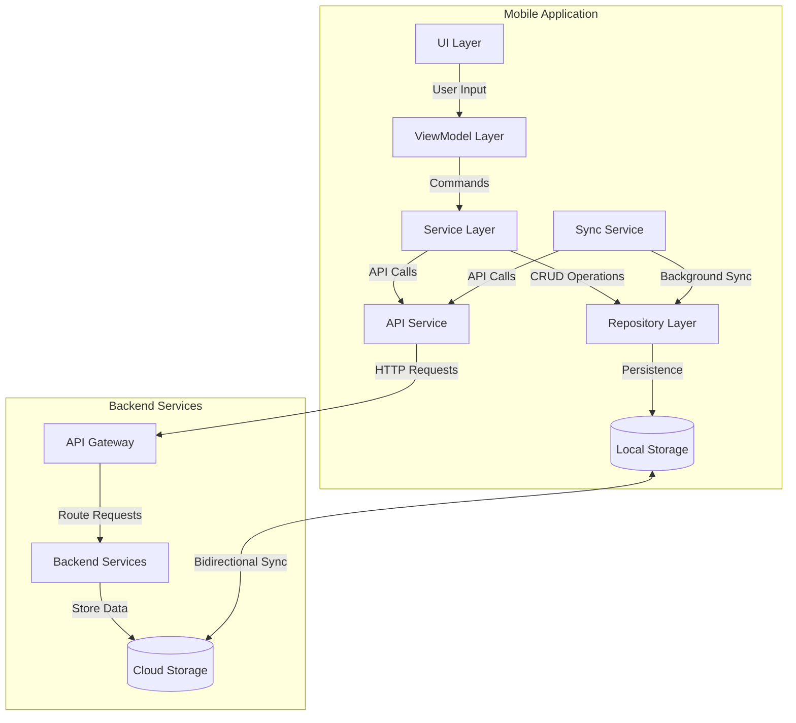

The data flow architecture follows a layered approach with clear separation of concerns:

1. **UI Layer**: Captures user interactions and displays data
2. **ViewModel Layer**: Processes user commands and manages UI state
3. **Service Layer**: Implements business logic and orchestrates operations
4. **Repository Layer**: Abstracts data access operations
5. **Local Storage**: Persists data locally using SQLite and secure file storage
6. **API Service**: Handles communication with backend services
7. **Sync Service**: Manages background synchronization of local and remote data
8. **Backend Services**: Process requests and store data in cloud storage

This architecture ensures that the application remains responsive and functional even without network connectivity, while maintaining data consistency when connectivity is available.

### Component Interaction Patterns

The Security Patrol Application implements structured component interaction patterns to ensure modular, maintainable architecture:

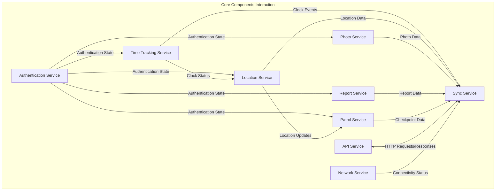

Key component interaction patterns include:

1. **Dependency Injection**: Components receive their dependencies through constructor injection, promoting loose coupling and testability
2. **Observer Pattern**: Components observe state changes in other components through events
3. **Mediator Pattern**: The Sync Service mediates between data repositories and backend services
4. **Strategy Pattern**: Different synchronization strategies are applied based on data type and network conditions
5. **Facade Pattern**: The API Service provides a simplified interface to the complex HTTP communication

These patterns ensure that components can interact efficiently while maintaining separation of concerns and facilitating maintainability.

### Cross-Component Communication

Cross-component communication in the Security Patrol Application occurs through various mechanisms:

1. **Direct Method Calls**: For synchronous operations within the same layer
2. **Event-Based Communication**: For asynchronous notifications across components
3. **Reactive Properties**: For UI state updates using observable properties
4. **Message Queues**: For background processing of operations

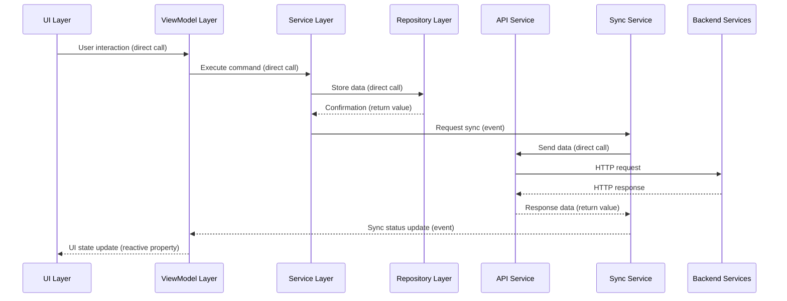

This multi-faceted approach ensures efficient communication between components while maintaining appropriate separation of concerns and architectural boundaries.

### Data Flow Patterns

The Security Patrol Application implements several data flow patterns:

1. **Local-First Pattern**: All user actions are immediately processed locally, then synchronized with the backend when connectivity is available. This ensures immediate responsiveness and offline functionality.

2. **Event-Based Communication**: Components communicate through events to maintain loose coupling. For example, the LocationService raises events when the user's location changes, which are consumed by the PatrolService for proximity detection.

3. **Command Pattern**: User actions are encapsulated as commands in the ViewModel layer, which are executed by the Service layer. This provides a clear separation between UI and business logic.

4. **Repository Pattern**: Data access is abstracted through repositories, which provide a consistent interface for working with different data sources (local database, file system, remote APIs).

5. **Publish-Subscribe Pattern**: Components can subscribe to specific events without direct knowledge of the publishers. This is used for cross-cutting concerns like connectivity changes and synchronization status updates.

6. **Batch Processing Pattern**: Data is processed in batches for efficient network usage, particularly for high-volume data like location updates.

These patterns work together to create a robust, maintainable data flow architecture that supports the application's requirements for offline operation and data consistency.

### Data Storage Strategy

The application uses multiple storage mechanisms optimized for different data types:

| Data Type | Storage Mechanism | Encryption | Purpose |
|-----------|-------------------|------------|----------|
| Structured Data | SQLite Database | Yes | Store entities and relationships |
| Binary Data (Photos) | File System | Yes | Store captured images |
| Authentication Tokens | Secure Storage | Platform-specific | Store sensitive authentication data |
| Application Settings | Preferences | No | Store user preferences and app settings |

The storage strategy is designed to:

1. **Optimize for Data Type**: Different storage mechanisms are used based on the nature of the data
2. **Ensure Security**: Sensitive data is encrypted at rest
3. **Support Offline Operation**: All critical data is stored locally
4. **Enable Efficient Synchronization**: Data is structured for efficient sync operations
5. **Manage Storage Usage**: Retention policies prevent excessive storage consumption

This multi-faceted approach ensures efficient, secure data storage while supporting the application's offline capabilities.

### Synchronization Overview

The synchronization architecture ensures data consistency between the mobile application and backend services:

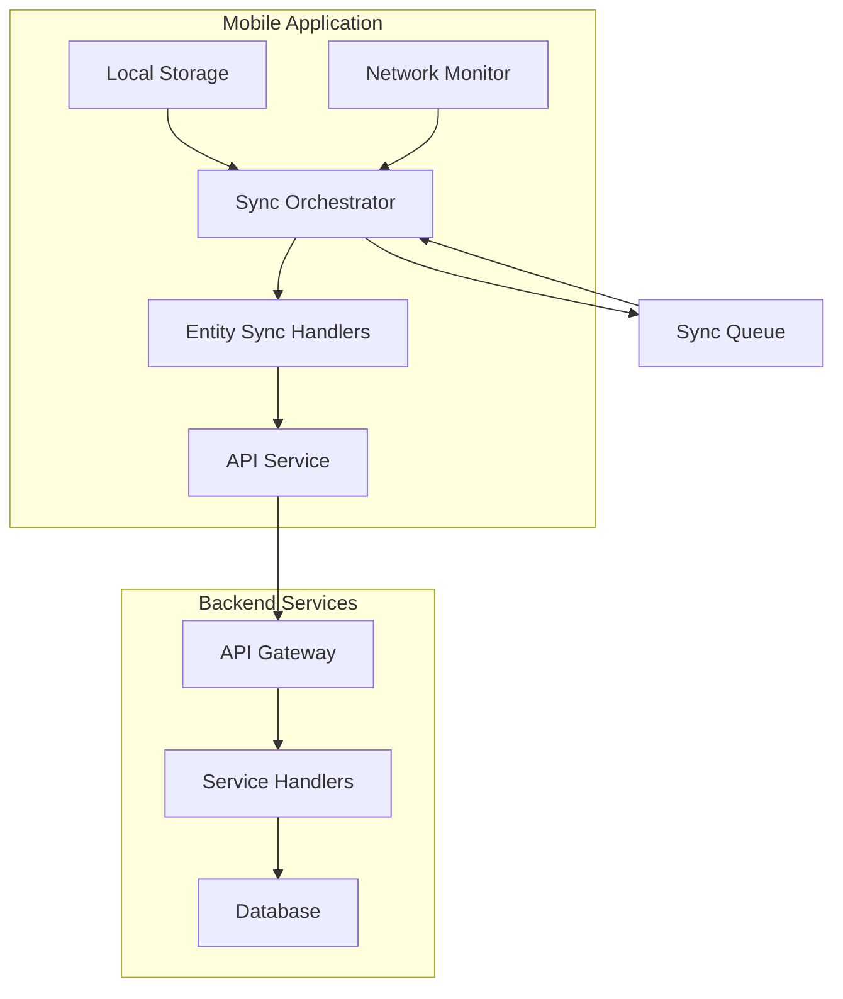

Key aspects of the synchronization architecture include:

1. **Sync Orchestrator**: Central component (SyncService) that manages the overall synchronization process
2. **Entity-Specific Sync Handlers**: Specialized components for synchronizing different entity types
3. **Network Monitor**: Detects connectivity changes and triggers synchronization when appropriate
4. **Sync Queue**: Tracks entities pending synchronization with prioritization
5. **Conflict Resolution**: Strategies for resolving conflicts between local and remote data

The synchronization process is designed to be resilient to network interruptions and efficient in its use of network resources, ensuring reliable data consistency while minimizing battery and bandwidth usage.

## Feature-Specific Data Flows

This section details the data flows for key features of the Security Patrol Application, showing how data moves through the system for specific user scenarios.

### Authentication Data Flow

The authentication data flow handles user verification through phone number authentication:

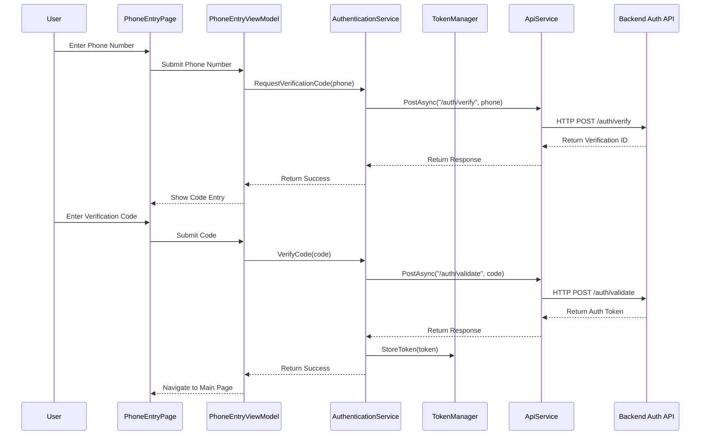

Data flow steps:

1. User enters phone number in the PhoneEntryPage
2. PhoneEntryViewModel calls AuthenticationService.RequestVerificationCode()
3. AuthenticationService calls ApiService to send the phone number to the backend
4. Backend generates a verification code and sends it via SMS
5. User enters the verification code in the UI
6. PhoneEntryViewModel calls AuthenticationService.VerifyCode()
7. AuthenticationService calls ApiService to validate the code with the backend
8. Backend validates the code and returns an authentication token
9. TokenManager securely stores the token for future API calls
10. User is navigated to the main application page

This flow requires network connectivity for the initial authentication but stores the token securely for offline use afterward.

### Clock In/Out Data Flow

The clock in/out data flow handles time tracking operations:

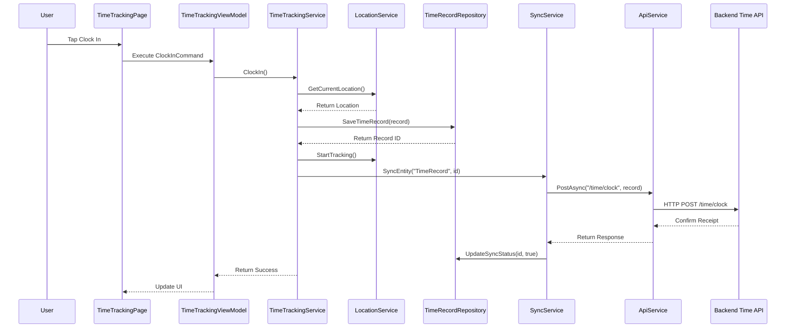

Data flow steps:

1. User taps Clock In button on TimeTrackingPage
2. TimeTrackingViewModel executes ClockInCommand
3. TimeTrackingService gets current location from LocationService
4. TimeTrackingService creates a time record and saves it to the repository
5. TimeTrackingService starts location tracking
6. SyncService attempts to synchronize the time record with the backend
7. If successful, the record's sync status is updated in the repository
8. UI is updated to reflect the clocked-in state

This flow demonstrates the local-first approach: the clock operation is immediately processed locally, then synchronized with the backend. If offline, the synchronization will be queued for later when connectivity is restored.

### Location Tracking Data Flow

The location tracking data flow handles continuous GPS monitoring and data synchronization:

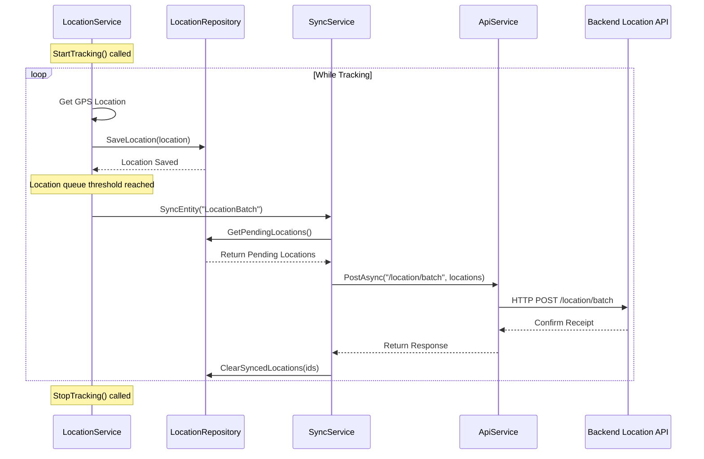

Data flow steps:

1. LocationService starts tracking when user clocks in
2. LocationService periodically gets GPS coordinates from the device
3. Each location point is saved to the LocationRepository
4. When a threshold is reached (number of points or time interval), a batch sync is triggered
5. SyncService retrieves pending locations from the repository
6. Locations are sent to the backend in a batch to minimize network usage
7. Successfully synced locations are marked as synced in the repository
8. The process continues until tracking is stopped (user clocks out)

This flow demonstrates batch processing for efficient network usage, which is particularly important for high-frequency data like location updates.

### Patrol Verification Data Flow

The patrol verification data flow handles checkpoint verification during security patrols:

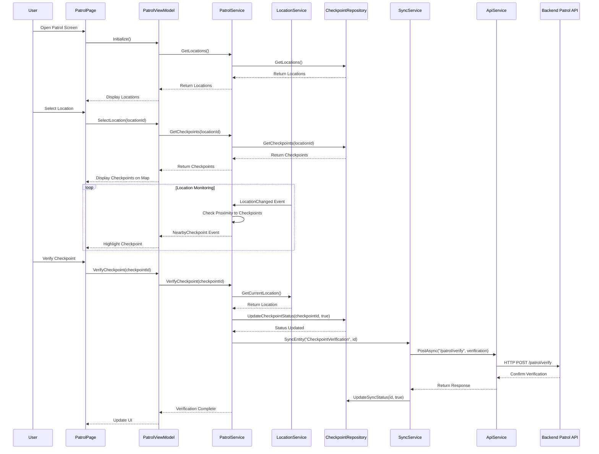

Data flow steps:

1. User opens the Patrol screen and selects a location
2. PatrolViewModel loads checkpoints for the selected location from the repository
3. LocationService continuously monitors the user's location
4. PatrolService checks proximity to checkpoints and notifies when user is near a checkpoint
5. User verifies a checkpoint when in proximity
6. Verification is saved locally in the CheckpointRepository
7. SyncService attempts to synchronize the verification with the backend
8. UI is updated to show the checkpoint as verified

This flow demonstrates event-based communication (location updates triggering proximity checks) and the local-first approach for checkpoint verification.

### Photo Capture Data Flow

The photo capture data flow handles in-app photo documentation:

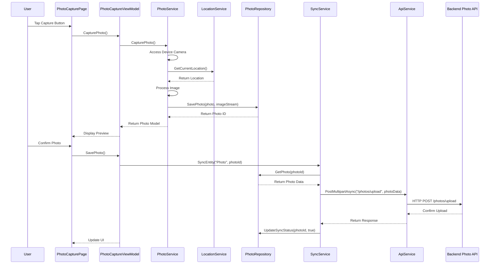

Data flow steps:

1. User taps the capture button on PhotoCapturePage
2. PhotoService accesses the device camera to capture a photo
3. PhotoService gets the current location for photo metadata
4. The image is processed (compressed, resized) for efficient storage
5. The photo and metadata are saved to the PhotoRepository
6. User confirms the photo after preview
7. SyncService attempts to upload the photo to the backend
8. The photo's sync status is updated in the repository

This flow demonstrates handling binary data (photos) with appropriate processing for storage efficiency and network optimization.

### Activity Reporting Data Flow

The activity reporting data flow handles creation and management of security reports:

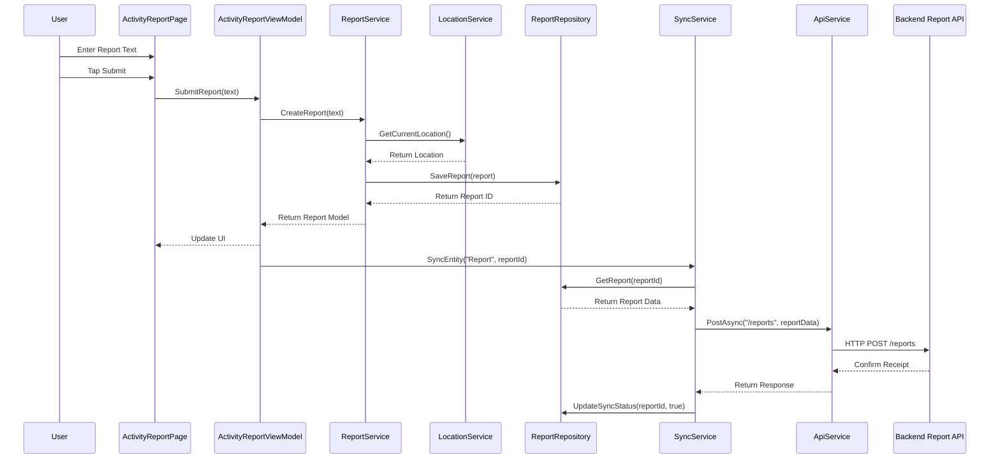

Data flow steps:

1. User enters report text and submits on ActivityReportPage
2. ReportService gets the current location for report metadata
3. The report is saved to the ReportRepository
4. UI is updated to show the report in the list
5. SyncService attempts to synchronize the report with the backend
6. The report's sync status is updated in the repository

This flow demonstrates the local-first approach for text-based data, with immediate local storage and background synchronization.

## Synchronization Mechanisms

The Security Patrol Application implements robust synchronization mechanisms to ensure data consistency between the mobile client and backend services.

### Sync Service Architecture

The SyncService is the central component of the synchronization architecture:

```csharp
public class SyncService : ISyncService
{
    private readonly ISyncRepository _syncRepository;
    private readonly INetworkService _networkService;
    private readonly ITimeTrackingSyncService _timeTrackingSyncService;
    private readonly ILocationSyncService _locationSyncService;
    private readonly IPhotoSyncService _photoSyncService;
    private readonly IReportSyncService _reportSyncService;
    private readonly IPatrolSyncService _patrolSyncService;
    private readonly ILogger<SyncService> _logger;
    
    private Timer _syncTimer;
    private CancellationTokenSource _cancellationTokenSource;
    private SemaphoreSlim _syncLock = new SemaphoreSlim(1, 1);
    private bool _isSyncing;
    
    public event EventHandler<SyncStatusChangedEventArgs> SyncStatusChanged;
    
    public bool IsSyncing => _isSyncing;
    
    // Constructor and initialization
    
    public async Task<SyncResult> SyncAll(CancellationToken cancellationToken = default)
    {
        if (_isSyncing)
            return new SyncResult { SuccessCount = 0, FailureCount = 0, PendingCount = 0 };
            
        if (!_networkService.IsConnected)
            return new SyncResult { SuccessCount = 0, FailureCount = 0, PendingCount = await GetPendingCount() };
            
        await _syncLock.WaitAsync(cancellationToken);
        
        try
        {
            _isSyncing = true;
            _cancellationTokenSource = CancellationTokenSource.CreateLinkedTokenSource(cancellationToken);
            
            RaiseSyncStatusChanged("All", "Started", 0, 0);
            
            // Sync in priority order
            var timeResult = await SyncEntityType("TimeRecord", _cancellationTokenSource.Token);
            var patrolResult = await SyncEntityType("CheckpointVerification", _cancellationTokenSource.Token);
            var reportResult = await SyncEntityType("Report", _cancellationTokenSource.Token);
            var photoResult = await SyncEntityType("Photo", _cancellationTokenSource.Token);
            var locationResult = await SyncEntityType("LocationRecord", _cancellationTokenSource.Token);
            
            var result = new SyncResult
            {
                SuccessCount = timeResult.SuccessCount + patrolResult.SuccessCount + 
                               reportResult.SuccessCount + photoResult.SuccessCount + 
                               locationResult.SuccessCount,
                               
                FailureCount = timeResult.FailureCount + patrolResult.FailureCount + 
                              reportResult.FailureCount + photoResult.FailureCount + 
                              locationResult.FailureCount,
                              
                PendingCount = await GetPendingCount()
            };
            
            RaiseSyncStatusChanged("All", "Completed", result.SuccessCount, 
                                  result.SuccessCount + result.FailureCount);
            
            return result;
        }
        catch (Exception ex)
        {
            _logger.LogError(ex, "Error during synchronization");
            RaiseSyncStatusChanged("All", "Failed", 0, 0);
            return new SyncResult { SuccessCount = 0, FailureCount = 1, PendingCount = await GetPendingCount() };
        }
        finally
        {
            _isSyncing = false;
            _cancellationTokenSource?.Dispose();
            _cancellationTokenSource = null;
            _syncLock.Release();
        }
    }
    
    // Additional synchronization methods
}
```

The SyncService orchestrates the synchronization of different entity types, implementing resilience patterns and providing status updates to the UI. It works with entity-specific sync services to handle the details of synchronizing each data type.

### Prioritization Strategy

The application implements a prioritization strategy for synchronization:

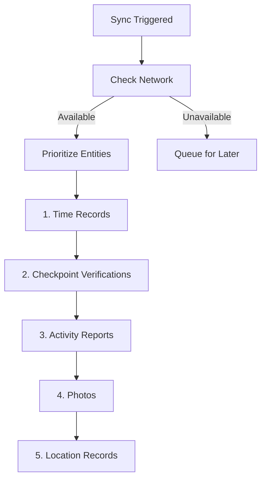

Prioritization rationale:

| Entity Type | Priority | Rationale |
|------------|----------|-----------|
| TimeRecord | Highest (1) | Critical for time tracking accuracy and payroll |
| CheckpointVerification | High (2) | Important for patrol verification and security compliance |
| ActivityReport | Medium (3) | User-generated content with operational value |
| Photo | Low (4) | Large size, bandwidth-intensive, less time-sensitive |
| LocationRecord | Lowest (5) | High volume, primarily for historical tracking |

This prioritization ensures that the most critical data is synchronized first when connectivity is restored after an offline period, optimizing the use of potentially limited or unstable network connections.

### Batch Processing

The application implements batch processing for efficient network usage:

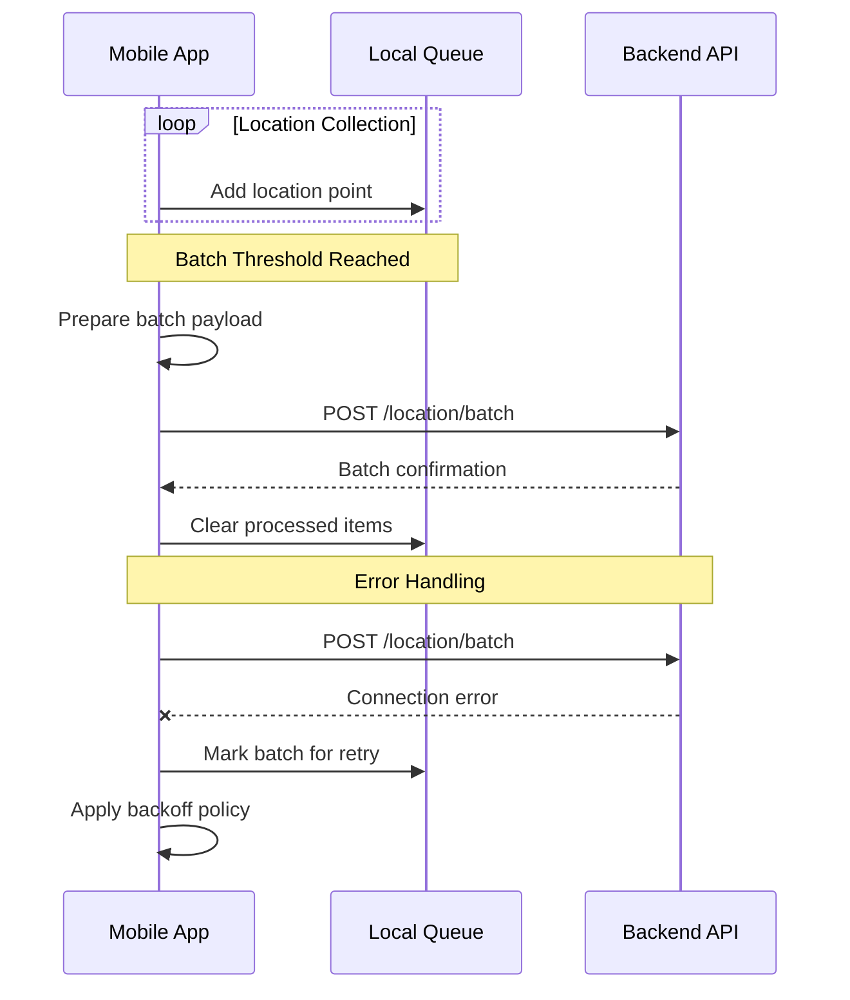

Batch processing is particularly important for high-frequency data like location updates. Instead of sending each location point individually, the application collects them in a local queue and sends them in batches when:

1. A threshold number of items is reached (e.g., 50 location points)
2. A time interval has elapsed (e.g., 60 seconds)
3. The user performs a specific action (e.g., clocks out)
4. The application transitions to the foreground

This approach significantly reduces network overhead, battery consumption, and server load while maintaining data consistency.

### Conflict Resolution

The application implements a server-wins conflict resolution strategy:

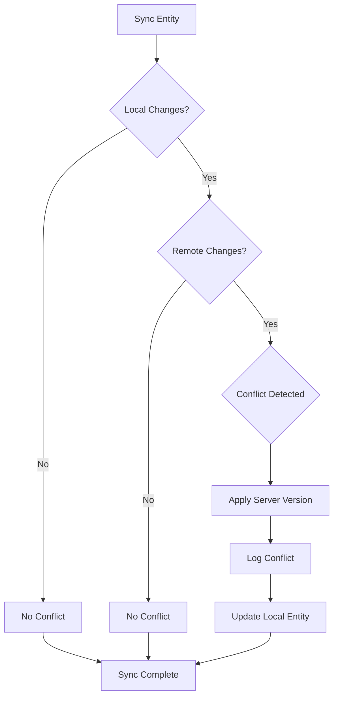

Conflict resolution approach:

1. **Timestamp-Based Detection**: Each entity includes a `LastModified` timestamp
2. **Version Tracking**: Version numbers track changes to detect conflicts
3. **Server Authority**: In case of conflict, server data takes precedence
4. **Field-Level Merging**: Where possible, non-conflicting fields are merged
5. **Conflict Logging**: Conflicts are logged for analysis

This approach ensures data consistency while minimizing data loss during synchronization. The server-wins strategy is appropriate for this application because:

- Backend systems may have additional validation rules
- Multiple devices may update the same data
- Backend may have access to more complete information
- Simplifies conflict resolution logic in the mobile application

### Retry and Circuit Breaker Patterns

The application implements retry and circuit breaker patterns for resilient synchronization:

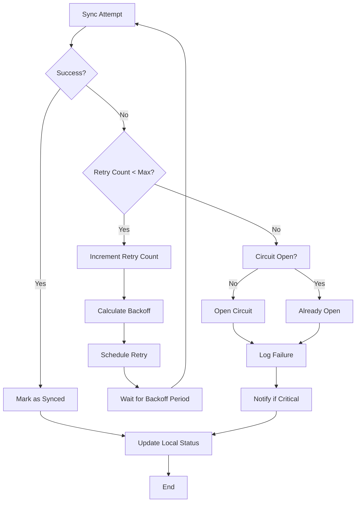

Retry policy implementation:

```csharp
private async Task<T> ExecuteWithRetryAsync<T>(Func<Task<T>> operation, string entityType)
{
    // Get circuit breaker for entity type
    var circuitBreaker = GetCircuitBreaker(entityType);
    
    // Check if circuit is closed or half-open
    if (!circuitBreaker.CanExecute())
        throw new CircuitBreakerOpenException($"Circuit breaker open for {entityType}");
    
    // Initialize retry count
    int retryCount = 0;
    
    while (true)
    {
        try
        {
            // Execute operation
            var result = await operation();
            
            // Record success and return result
            circuitBreaker.RecordSuccess();
            return result;
        }
        catch (Exception ex) when (IsTransientException(ex))
        {
            // Record failure
            circuitBreaker.RecordFailure();
            
            // Check retry count
            if (retryCount >= MaxRetryCount)
                throw;
                
            // Calculate backoff delay
            var delay = CalculateBackoffDelay(retryCount);
            
            // Increment retry count
            retryCount++;
            
            // Wait before retry
            await Task.Delay(delay);
        }
    }
}
```

These patterns ensure resilient synchronization by:

1. **Retrying Transient Failures**: Automatically retrying operations that fail due to temporary issues
2. **Exponential Backoff**: Increasing delay between retries to avoid overwhelming services
3. **Circuit Breaking**: Preventing repeated calls to failing services
4. **Failure Isolation**: Containing failures to specific entity types

This approach optimizes network usage, battery consumption, and user experience during synchronization.

## Message Processing Patterns

The Security Patrol Application implements several message processing patterns to ensure efficient and reliable data exchange between components.

### Event Processing

The application uses event-based communication for loose coupling between components:

```csharp
// Event definition
public class LocationChangedEventArgs : EventArgs
{
    public LocationModel Location { get; set; }
}

// Event publisher
public class LocationService : ILocationService
{
    public event EventHandler<LocationChangedEventArgs> LocationChanged;
    
    protected virtual void OnLocationChanged(LocationChangedEventArgs e)
    {
        LocationChanged?.Invoke(this, e);
    }
    
    private async Task TrackLocationAsync(CancellationToken cancellationToken)
    {
        while (!cancellationToken.IsCancellationRequested)
        {
            try
            {
                var location = await GetCurrentLocation();
                
                // Store location in repository
                await _repository.SaveLocation(location);
                
                // Notify subscribers
                OnLocationChanged(new LocationChangedEventArgs { Location = location });
                
                // Wait before next update
                await Task.Delay(GetOptimalTrackingInterval(location), cancellationToken);
            }
            catch (Exception ex)
            {
                _logger.LogError(ex, "Error tracking location");
                await Task.Delay(TimeSpan.FromSeconds(30), cancellationToken);
            }
        }
    }
}

// Event subscriber
public class PatrolService : IPatrolService
{
    public PatrolService(ILocationService locationService, /* other dependencies */)
    {
        _locationService = locationService;
        _locationService.LocationChanged += OnLocationChanged;
    }
    
    private void OnLocationChanged(object sender, LocationChangedEventArgs e)
    {
        // Check proximity to checkpoints
        var nearbyCheckpoints = CheckProximity(e.Location);
        
        // Notify subscribers if checkpoints are nearby
        foreach (var checkpoint in nearbyCheckpoints)
        {
            OnCheckpointProximityChanged(new CheckpointProximityEventArgs
            {
                CheckpointId = checkpoint.Id,
                Distance = checkpoint.Distance
            });
        }
    }
    
    // Cleanup
    public void Dispose()
    {
        _locationService.LocationChanged -= OnLocationChanged;
    }
}
```

This pattern enables components to communicate without direct dependencies, making the system more modular and maintainable. Key events in the system include:

- LocationChanged: Notifies when the user's location changes
- ClockStatusChanged: Notifies when the user's clock status changes
- CheckpointProximityChanged: Notifies when the user is near a checkpoint
- ConnectivityChanged: Notifies when network connectivity changes
- SyncStatusChanged: Notifies when synchronization status changes

### Command Pattern

The application uses the command pattern to encapsulate user actions:

```csharp
public class TimeTrackingViewModel : BaseViewModel
{
    private readonly ITimeTrackingService _timeTrackingService;
    
    [RelayCommand]
    private async Task ClockIn()
    {
        await ExecuteWithBusyIndicator(async () =>
        {
            try
            {
                var result = await _timeTrackingService.ClockIn();
                
                // Update UI state
                CanClockIn = false;
                CanClockOut = true;
                
                // Show success message
                await _dialogService.ShowAlertAsync("Success", "You have successfully clocked in.", "OK");
            }
            catch (Exception ex)
            {
                // Handle error
                await _dialogService.ShowAlertAsync("Error", $"Failed to clock in: {ex.Message}", "OK");
                _logger.LogError(ex, "Error clocking in");
            }
        });
    }
    
    [RelayCommand]
    private async Task ClockOut()
    {
        await ExecuteWithBusyIndicator(async () =>
        {
            try
            {
                var result = await _timeTrackingService.ClockOut();
                
                // Update UI state
                CanClockIn = true;
                CanClockOut = false;
                
                // Show success message
                await _dialogService.ShowAlertAsync("Success", "You have successfully clocked out.", "OK");
            }
            catch (Exception ex)
            {
                // Handle error
                await _dialogService.ShowAlertAsync("Error", $"Failed to clock out: {ex.Message}", "OK");
                _logger.LogError(ex, "Error clocking out");
            }
        });
    }
}
```

The command pattern provides several benefits:

1. **Separation of Concerns**: UI elements are decoupled from the logic that executes when they are activated
2. **Testability**: Commands can be tested independently of the UI
3. **Reusability**: The same command can be bound to multiple UI elements
4. **State Management**: Commands can be enabled/disabled based on application state

The application uses the CommunityToolkit.Mvvm library's RelayCommand implementation for a clean, declarative approach to commands.

### Queue-Based Processing

The application uses queue-based processing for asynchronous operations:

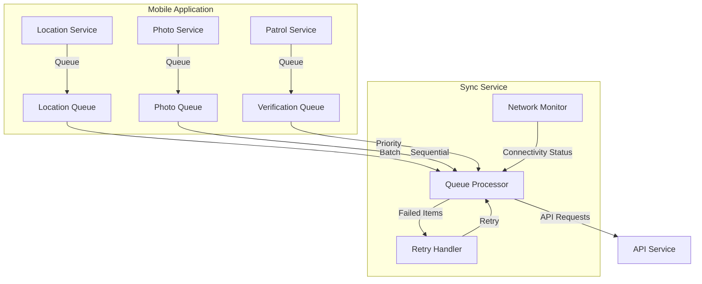

Queue-based processing is used for:

1. **Location Updates**: Collected in a queue and processed in batches
2. **Photo Uploads**: Queued for sequential processing due to size
3. **Synchronization**: Entities queued for sync with prioritization
4. **Background Tasks**: Operations queued for background processing

This approach provides several benefits:

- **Responsiveness**: UI remains responsive while operations are processed in the background
- **Resilience**: Operations can be retried if they fail
- **Efficiency**: Related operations can be batched for better performance
- **Prioritization**: Critical operations can be prioritized over less important ones

### Stream Processing

The application uses stream processing for handling large data like photos:

```csharp
public async Task<string> SavePhoto(PhotoModel photo, Stream imageStream)
{
    // Save metadata to database
    var connection = await GetConnectionAsync();
    var entity = new PhotoEntity
    {
        UserId = photo.UserId,
        Timestamp = photo.Timestamp,
        Latitude = photo.Latitude,
        Longitude = photo.Longitude,
        IsSynced = false
    };
    
    int id;
    if (photo.Id != null)
    {
        entity.Id = photo.Id;
        await connection.UpdateAsync(entity);
        id = entity.Id;
    }
    else
    {
        id = await connection.InsertAsync(entity);
    }
    
    // Save image file using streams for memory efficiency
    string filePath = Path.Combine(_photoDirectory, $"{id}.jpg");
    using (var fileStream = File.Create(filePath))
    {
        await imageStream.CopyToAsync(fileStream);
    }
    
    entity.FilePath = filePath;
    await connection.UpdateAsync(entity);
    
    return id.ToString();
}

public async Task<bool> SyncPhoto(string photoId)
{
    var photo = await GetPhoto(photoId);
    if (photo == null)
        return false;
        
    try
    {
        // Create multipart form data content
        using (var content = new MultipartFormDataContent())
        {
            // Add metadata
            content.Add(new StringContent(photo.Timestamp.ToString("o")), "timestamp");
            content.Add(new StringContent(photo.Latitude.ToString()), "latitude");
            content.Add(new StringContent(photo.Longitude.ToString()), "longitude");
            
            // Add image file using stream to avoid loading entire image into memory
            using (var fileStream = File.OpenRead(photo.FilePath))
            {
                var streamContent = new StreamContent(fileStream);
                streamContent.Headers.ContentType = new MediaTypeHeaderValue("image/jpeg");
                content.Add(streamContent, "image", Path.GetFileName(photo.FilePath));
                
                // Upload to API
                var response = await _apiService.PostMultipartAsync<PhotoUploadResponse>(
                    ApiEndpoints.PhotosUpload, content, true);
                    
                // Update sync status
                if (response != null)
                {
                    photo.IsSynced = true;
                    photo.RemoteId = response.Id;
                    await UpdatePhoto(photo);
                    return true;
                }
            }
        }
        
        return false;
    }
    catch (Exception ex)
    {
        _logger.LogError(ex, $"Error syncing photo {photoId}");
        return false;
    }
}
```

Stream processing is used for:

1. **Photo Capture**: Images are processed as streams to avoid memory issues
2. **Photo Upload**: Images are uploaded using streams for memory efficiency
3. **Large Data Transfer**: Any large data is processed as streams rather than loaded entirely into memory

This approach ensures efficient memory usage when dealing with large binary data like photos, preventing out-of-memory errors and providing better performance on devices with limited resources.

## Error Handling and Recovery

The Security Patrol Application implements robust error handling and recovery mechanisms to ensure data integrity and system reliability.

### Error Handling Strategy

The application implements a comprehensive error handling strategy:

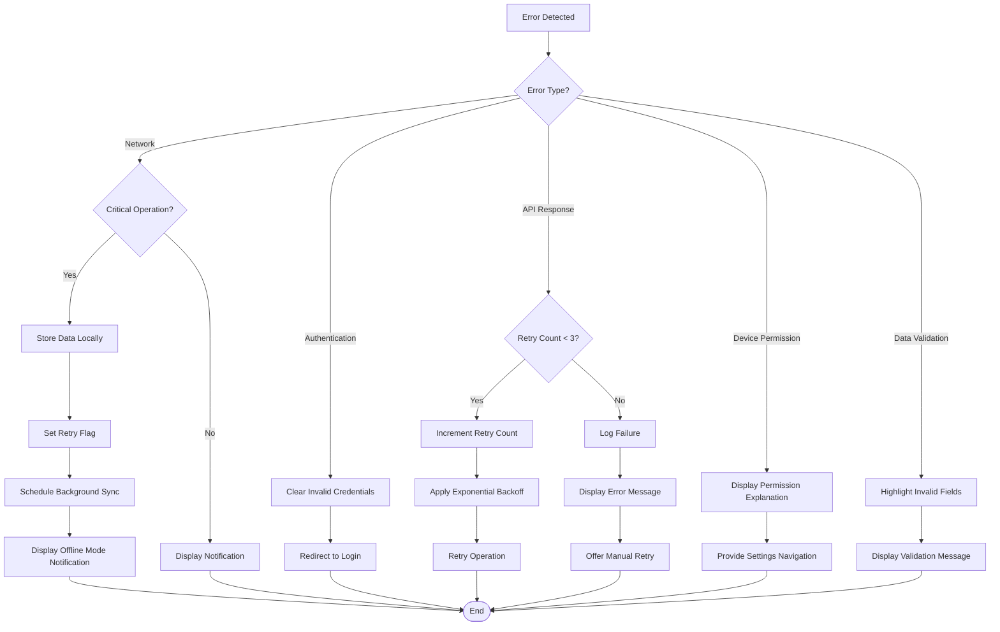

The error handling strategy is implemented at multiple levels:

1. **UI Layer**: User-friendly error messages with actionable guidance
2. **ViewModel Layer**: Error aggregation and transformation for presentation
3. **Service Layer**: Business logic error handling and recovery attempts
4. **Repository Layer**: Data access error handling and fallback strategies
5. **API Layer**: Network error handling with retry policies

This layered approach ensures that errors are handled at the appropriate level while providing a consistent user experience.

### Exception Handling Implementation

The application implements consistent exception handling:

```csharp
// BaseViewModel provides common error handling for ViewModels
public abstract class BaseViewModel : ObservableObject
{
    private string _errorMessage;
    private bool _hasError;
    
    public string ErrorMessage
    {
        get => _errorMessage;
        private set => SetProperty(ref _errorMessage, value);
    }
    
    public bool HasError
    {
        get => _hasError;
        private set => SetProperty(ref _hasError, value);
    }
    
    protected void SetError(string message)
    {
        ErrorMessage = message;
        HasError = !string.IsNullOrEmpty(message);
    }
    
    protected void ClearError()
    {
        ErrorMessage = null;
        HasError = false;
    }
    
    protected async Task ExecuteWithBusyIndicator(Func<Task> action)
    {
        ClearError();
        IsBusy = true;
        
        try
        {
            await action();
        }
        catch (NetworkException ex)
        {
            SetError($"Network error: {ex.Message}");
            _logger.LogError(ex, "Network error");
        }
        catch (ApiException ex)
        {
            SetError($"API error: {ex.Message}");
            _logger.LogError(ex, "API error");
        }
        catch (Exception ex)
        {
            SetError($"An error occurred: {ex.Message}");
            _logger.LogError(ex, "Unhandled error");
        }
        finally
        {
            IsBusy = false;
        }
    }
}

// Custom exception types for specific error scenarios
public class NetworkException : Exception
{
    public NetworkException(string message) : base(message) { }
    public NetworkException(string message, Exception innerException) : base(message, innerException) { }
}

public class ApiException : Exception
{
    public HttpStatusCode StatusCode { get; }
    public string ResponseContent { get; }
    
    public ApiException(HttpStatusCode statusCode, string responseContent)
        : base($"API error: {statusCode}")
    {
        StatusCode = statusCode;
        ResponseContent = responseContent;
    }
}

public class ValidationException : Exception
{
    public Dictionary<string, string> ValidationErrors { get; }
    
    public ValidationException(string message, Dictionary<string, string> validationErrors)
        : base(message)
    {
        ValidationErrors = validationErrors;
    }
}
```

This implementation provides:

1. **Type-Specific Handling**: Different exception types for different error scenarios
2. **Consistent UI Feedback**: Common error display mechanism across the application
3. **Logging**: All errors are logged for troubleshooting
4. **Clean Error Messages**: User-friendly error messages derived from exceptions

### Recovery Mechanisms

The application implements several recovery mechanisms:

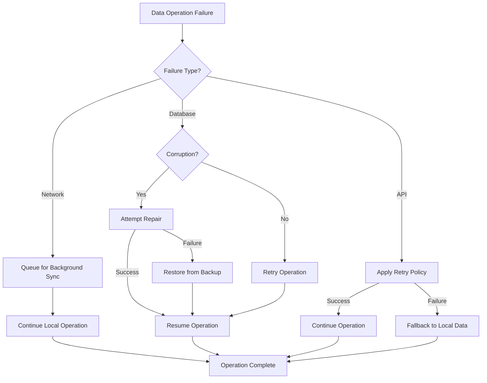

Key recovery mechanisms include:

1. **Automatic Retry**: Operations are automatically retried with exponential backoff
2. **Background Synchronization**: Failed sync operations are queued for later retry
3. **Data Repair**: Attempts to repair corrupted data when possible
4. **Backup Restoration**: Critical data is backed up and can be restored if needed
5. **Graceful Degradation**: The application continues to function with reduced capabilities when services are unavailable

These mechanisms ensure that the application can recover from various failure scenarios while maintaining data integrity and user experience.

### Offline Recovery

The application implements specific recovery mechanisms for offline scenarios:

```csharp
public class SyncService : ISyncService
{
    // Recover from interrupted sync
    public async Task<SyncResult> RecoverInterruptedSync()
    {
        // Get entities that were in the process of syncing
        var inProgressEntities = await _syncRepository.GetInProgressSync();
        
        foreach (var entity in inProgressEntities)
        {
            // Reset sync status to pending
            await _syncRepository.UpdateSyncStatus(
                entity.EntityType, 
                entity.EntityId, 
                SyncStatus.Pending);
        }
        
        // Trigger normal sync process
        return await SyncAll();
    }
    
    // Resume sync after connectivity restored
    private async void OnConnectivityChanged(object sender, ConnectivityChangedEventArgs e)
    {
        if (e.IsConnected)
        {
            // Wait a short delay to ensure stable connection
            await Task.Delay(TimeSpan.FromSeconds(5));
            
            // Check if still connected after delay
            if (_networkService.IsConnected)
            {
                // Recover any interrupted sync operations
                await RecoverInterruptedSync();
                
                // Start normal sync
                await SyncAll();
            }
        }
    }
}
```

Offline recovery mechanisms include:

1. **Sync State Tracking**: Each entity's sync state is tracked (Pending, InProgress, Completed, Failed)
2. **Interrupted Sync Recovery**: Sync operations interrupted by app termination or crashes are recovered
3. **Connectivity Monitoring**: The application detects when connectivity is restored and resumes sync
4. **Partial Sync Recovery**: If a batch sync partially completes, successfully synced items are tracked
5. **Conflict Resolution**: Data conflicts that arise during offline operation are resolved

These mechanisms ensure reliable recovery from offline periods, maintaining data integrity across connectivity transitions.

## Performance Considerations

The Security Patrol Application's data flow architecture is designed with performance in mind, ensuring efficient operation on mobile devices with limited resources.

### Data Transfer Optimization

The application implements several data transfer optimizations:

1. **Batch Processing**: Location data is collected and sent in batches rather than individual points
2. **Compression**: Data is compressed before transmission to reduce bandwidth usage
3. **Delta Synchronization**: Only changed data is transmitted when possible
4. **Binary Data Optimization**: Photos are resized and compressed before upload
5. **Prioritization**: Critical data is prioritized over less important data

```csharp
// Example of photo optimization before upload
public async Task<Stream> OptimizePhotoForUpload(Stream originalImageStream)
{
    // Reset stream position
    originalImageStream.Position = 0;
    
    // Load image
    var image = SKBitmap.Decode(originalImageStream);
    
    // Resize if too large
    SKBitmap resizedImage = image;
    if (image.Width > 1920 || image.Height > 1080)
    {
        // Calculate new dimensions maintaining aspect ratio
        float ratio = (float)image.Width / image.Height;
        int newWidth, newHeight;
        
        if (ratio > 1) // Landscape
        {
            newWidth = 1920;
            newHeight = (int)(1920 / ratio);
        }
        else // Portrait
        {
            newHeight = 1080;
            newWidth = (int)(1080 * ratio);
        }
        
        resizedImage = image.Resize(new SKImageInfo(newWidth, newHeight), SKFilterQuality.Medium);
        image.Dispose();
    }
    
    // Compress to JPEG with quality setting based on network conditions
    int quality = _networkService.GetConnectionQuality() switch
    {
        ConnectionQuality.High => 85,
        ConnectionQuality.Medium => 75,
        ConnectionQuality.Low => 65,
        _ => 60
    };
    
    var memoryStream = new MemoryStream();
    using (var encodedImage = resizedImage.Encode(SKEncodedImageFormat.Jpeg, quality))
    {
        await encodedImage.AsStream().CopyToAsync(memoryStream);
    }
    
    // Cleanup
    resizedImage.Dispose();
    
    // Reset position and return
    memoryStream.Position = 0;
    return memoryStream;
}
```

These optimizations ensure efficient use of network resources, reducing bandwidth usage, battery consumption, and data costs.

### Memory Management

The application implements careful memory management for data operations:

1. **Stream Processing**: Large data is processed as streams rather than loaded entirely into memory
2. **Resource Disposal**: Disposable resources are properly released using using statements
3. **Pagination**: Large datasets are loaded in pages rather than all at once
4. **Memory Caching**: Frequently accessed data is cached with size limits and eviction policies
5. **Image Handling**: Images are processed efficiently to avoid memory issues

```csharp
// Example of efficient image handling
public async Task<PhotoModel> CapturePhoto()
{
    var photo = await MediaPicker.CapturePhotoAsync();
    if (photo == null)
        return null;
        
    // Create photo model with metadata
    var photoModel = new PhotoModel
    {
        UserId = (await _authStateProvider.GetCurrentState()).UserId,
        Timestamp = DateTime.UtcNow,
        Latitude = (await _locationService.GetCurrentLocation()).Latitude,
        Longitude = (await _locationService.GetCurrentLocation()).Longitude,
        IsSynced = false
    };
    
    // Process and save photo using streams for memory efficiency
    using (var stream = await photo.OpenReadAsync())
    {
        // Compress image if needed
        using (var compressedStream = await ImageCompressor.CompressImage(stream, 80))
        {
            photoModel.Id = await _repository.SavePhoto(photoModel, compressedStream);
        }
    }
    
    return photoModel;
}
```

These memory management practices ensure that the application runs efficiently on devices with limited memory, preventing out-of-memory errors and providing a smooth user experience.

### Database Optimization

The application implements database optimizations for efficient data access:

1. **Indexed Queries**: Frequently queried fields are indexed for faster access
2. **Transaction Batching**: Related operations are grouped in transactions
3. **Query Optimization**: Queries are optimized to retrieve only needed data
4. **Connection Management**: Database connections are reused and properly managed
5. **Data Pruning**: Old data is automatically pruned to maintain performance

```csharp
// Example of database optimization
public async Task SaveLocationBatch(IEnumerable<LocationModel> locations)
{
    var connection = await GetConnectionAsync();
    
    // Use transaction for better performance with batch operations
    await connection.RunInTransactionAsync(transaction =>
    {
        foreach (var location in locations)
        {
            var entity = new LocationRecordEntity
            {
                UserId = location.UserId,
                Timestamp = location.Timestamp,
                Latitude = location.Latitude,
                Longitude = location.Longitude,
                Accuracy = location.Accuracy,
                IsSynced = location.IsSynced
            };
            
            transaction.Insert(entity);
        }
    });
}

// Example of indexed entity for efficient queries
[Table(DatabaseConstants.TableTimeRecord)]
public class TimeRecordEntity
{
    [PrimaryKey, AutoIncrement]
    public int Id { get; set; }
    
    [Indexed]
    public string UserId { get; set; }
    
    public string Type { get; set; }
    
    [Indexed]
    public DateTime Timestamp { get; set; }
    
    public double Latitude { get; set; }
    public double Longitude { get; set; }
    
    [Indexed]
    public bool IsSynced { get; set; }
    
    public string RemoteId { get; set; }
}
```

These database optimizations ensure efficient data access and storage, providing good performance even with large datasets.

### Background Processing

The application uses background processing for data operations to maintain UI responsiveness:

1. **Background Synchronization**: Data is synchronized in the background
2. **Deferred Processing**: Non-critical operations are deferred to idle time
3. **Task Scheduling**: Operations are scheduled based on priority and resource availability
4. **Batched Background Operations**: Related operations are batched for efficiency
5. **Power-Aware Processing**: Background operations adapt to battery level

```csharp
public class BackgroundSyncService : IBackgroundService
{
    private readonly ISyncService _syncService;
    private readonly INetworkService _networkService;
    private readonly IBatteryService _batteryService;
    private readonly ILogger<BackgroundSyncService> _logger;
    
    private Timer _syncTimer;
    private bool _isRunning;
    
    public BackgroundSyncService(
        ISyncService syncService,
        INetworkService networkService,
        IBatteryService batteryService,
        ILogger<BackgroundSyncService> logger)
    {
        _syncService = syncService;
        _networkService = networkService;
        _batteryService = batteryService;
        _logger = logger;
    }
    
    public Task Start()
    {
        if (_isRunning)
            return Task.CompletedTask;
            
        // Determine sync interval based on battery level
        var interval = GetSyncInterval();
        
        // Start timer
        _syncTimer = new Timer(SyncCallback, null, TimeSpan.Zero, interval);
        _isRunning = true;
        
        return Task.CompletedTask;
    }
    
    private TimeSpan GetSyncInterval()
    {
        // Adapt sync interval based on battery level
        var batteryLevel = _batteryService.ChargeLevel;
        
        if (batteryLevel < 0.15) // Below 15%
            return TimeSpan.FromMinutes(30); // Reduce frequency significantly
        else if (batteryLevel < 0.3) // Below 30%
            return TimeSpan.FromMinutes(15); // Reduce frequency moderately
        else
            return TimeSpan.FromMinutes(5); // Normal frequency
    }
    
    private async void SyncCallback(object state)
    {
        try
        {
            // Check if conditions are suitable for sync
            if (!_networkService.IsConnected)
                return;
                
            // Perform sync
            await _syncService.SyncAll();
            
            // Update sync interval based on current battery level
            if (_isRunning && _syncTimer != null)
            {
                var interval = GetSyncInterval();
                _syncTimer.Change(interval, interval);
            }
        }
        catch (Exception ex)
        {
            _logger.LogError(ex, "Error in background sync");
        }
    }
    
    // Additional methods
}
```

Background processing ensures that the UI remains responsive while data operations are performed, providing a smooth user experience.

## Security Considerations

The Security Patrol Application implements several security measures to protect data during flow through the system.

### Data Protection in Transit

All data transmitted between the mobile application and backend services is protected:

1. **HTTPS**: All API communication uses HTTPS with TLS 1.2+
2. **Certificate Pinning**: The application verifies server certificates to prevent man-in-the-middle attacks
3. **Token-Based Authentication**: All API requests include authentication tokens
4. **Request/Response Validation**: All requests and responses are validated

```csharp
public class ApiService : IApiService
{
    private readonly HttpClient _httpClient;
    private readonly ITokenManager _tokenManager;
    
    public ApiService(ITokenManager tokenManager, INetworkService networkService)
    {
        _tokenManager = tokenManager;
        
        // Configure HttpClient with certificate pinning
        var handler = new HttpClientHandler();
        
        // Add certificate pinning
        handler.ServerCertificateCustomValidationCallback = (message, cert, chain, errors) =>
        {
            // Verify against pinned certificate
            var pinnedCertificate = LoadPinnedCertificate();
            return cert.Thumbprint.Equals(pinnedCertificate.Thumbprint, StringComparison.OrdinalIgnoreCase);
        };
        
        _httpClient = new HttpClient(handler);
        _httpClient.BaseAddress = new Uri(ApiEndpoints.BaseUrl);
        _httpClient.DefaultRequestHeaders.Accept.Add(new MediaTypeWithQualityHeaderValue("application/json"));
    }
    
    private async Task AddAuthenticationHeader(HttpRequestMessage request)
    {
        var token = await _tokenManager.RetrieveToken();
        if (string.IsNullOrEmpty(token))
            throw new UnauthorizedException("No authentication token available");
            
        request.Headers.Authorization = new AuthenticationHeaderValue("Bearer", token);
    }
}
```

These measures ensure that data is protected during transmission, preventing unauthorized access or tampering.

### Data Protection at Rest

Data stored on the device is protected:

1. **Database Encryption**: The SQLite database is encrypted using SQLCipher
2. **Secure Storage**: Authentication tokens are stored in platform-specific secure storage
3. **File Encryption**: Photos and other sensitive files are encrypted
4. **Key Management**: Encryption keys are managed securely

```csharp
public class DatabaseInitializer : IDatabaseInitializer
{
    private readonly string _dbPath;
    private SQLiteAsyncConnection _connection;
    private bool _isInitialized;
    
    public DatabaseInitializer()
    {
        _dbPath = Path.Combine(FileSystem.AppDataDirectory, DatabaseConstants.DatabaseFilename);
    }
    
    public async Task InitializeAsync()
    {
        if (_isInitialized)
            return;
            
        // Get encryption key from secure storage or generate if not exists
        string encryptionKey = await GetEncryptionKey();
        
        // Use encryption key with SQLite
        var connectionString = new SQLiteConnectionString(_dbPath, true, key: encryptionKey);
        _connection = new SQLiteAsyncConnection(connectionString);
        
        // Create tables and apply migrations
        // ...
        
        _isInitialized = true;
    }
    
    private async Task<string> GetEncryptionKey()
    {
        // Try to get existing key from secure storage
        var key = await SecureStorage.GetAsync("db_encryption_key");
        
        if (string.IsNullOrEmpty(key))
        {
            // Generate new key
            var buffer = new byte[32]; // 256-bit key
            using (var rng = RandomNumberGenerator.Create())
            {
                rng.GetBytes(buffer);
            }
            
            key = Convert.ToBase64String(buffer);
            
            // Store in secure storage
            await SecureStorage.SetAsync("db_encryption_key", key);
        }
        
        return key;
    }
}
```

These measures ensure that data is protected when stored on the device, preventing unauthorized access if the device is lost or stolen.

### Authentication and Authorization

The application implements secure authentication and authorization:

1. **Phone Verification**: Two-step verification using phone number and SMS code
2. **JWT Tokens**: Secure, signed tokens for API authentication
3. **Token Refresh**: Automatic token refresh to maintain session
4. **Token Validation**: Tokens are validated for every API request

```csharp
public class AuthenticationService : IAuthenticationService
{
    private readonly IApiService _apiService;
    private readonly ITokenManager _tokenManager;
    private readonly IAuthenticationStateProvider _authStateProvider;
    
    private string _verificationId;
    private string _phoneNumber;
    
    public async Task<bool> RequestVerificationCode(string phoneNumber)
    {
        try
        {
            var request = new AuthenticationRequest { PhoneNumber = phoneNumber };
            var response = await _apiService.PostAsync<VerificationResponse>(
                ApiEndpoints.AuthVerify, request, false);
                
            // Store verification ID in memory (not persisted)
            _verificationId = response.VerificationId;
            _phoneNumber = phoneNumber;
            
            return true;
        }
        catch (Exception ex)
        {
            _logger.LogError(ex, "Error requesting verification code");
            return false;
        }
    }
    
    public async Task<bool> VerifyCode(string code)
    {
        try
        {
            var request = new VerificationRequest 
            { 
                VerificationId = _verificationId,
                Code = code 
            };
            
            var response = await _apiService.PostAsync<AuthenticationResponse>(
                ApiEndpoints.AuthValidate, request, false);
                
            // Store tokens securely
            await _tokenManager.StoreToken(response.Token, response.ExpiresAt);
            
            // Update authentication state
            var authState = new AuthState
            {
                IsAuthenticated = true,
                PhoneNumber = _phoneNumber,
                UserId = response.UserId,
                LastAuthenticated = DateTime.UtcNow
            };
            
            _authStateProvider.UpdateState(authState);
            
            return true;
        }
        catch (Exception ex)
        {
            _logger.LogError(ex, "Error verifying code");
            return false;
        }
    }
}
```

These measures ensure that only authorized users can access the application and its data.

### Audit Logging

The application implements audit logging for security-relevant events:

1. **Authentication Events**: Login attempts, logouts, token refreshes
2. **Data Modifications**: Create, update, delete operations on critical data
3. **Synchronization Events**: Sync attempts, successes, failures
4. **Error Events**: Security-related errors and exceptions

```csharp
public class TelemetryService : ITelemetryService
{
    private readonly IAuthenticationStateProvider _authStateProvider;
    
    public void LogSecurityEvent(string eventName, Dictionary<string, string> properties = null)
    {
        try
        {
            var eventProperties = properties ?? new Dictionary<string, string>();
            
            // Add user context if authenticated
            var authState = _authStateProvider.GetCurrentState().Result;
            if (authState.IsAuthenticated)
            {
                eventProperties["UserId"] = authState.UserId;
                eventProperties["PhoneNumber"] = authState.PhoneNumber;
            }
            
            // Add device context
            eventProperties["DeviceId"] = DeviceInfo.Name;
            eventProperties["AppVersion"] = AppInfo.VersionString;
            eventProperties["Timestamp"] = DateTime.UtcNow.ToString("o");
            
            // Log event
            Analytics.TrackEvent($"Security_{eventName}", eventProperties);
            
            // Store in local audit log
            _auditRepository.LogSecurityEvent(eventName, eventProperties);
        }
        catch (Exception ex)
        {
            // Ensure logging errors don't disrupt application
            _logger.LogError(ex, "Error logging security event");
        }
    }
}
```

Audit logging provides accountability and supports security incident investigation by tracking security-relevant events.

## Conclusion

The data flow architecture of the Security Patrol Application provides a robust foundation for reliable operation in various connectivity scenarios. The local-first approach with background synchronization ensures that security personnel can continue working even when network connectivity is limited or unavailable.

Key strengths of the data flow architecture include:

1. **Local-First Operations**: All user actions are processed locally first, providing immediate responsiveness
2. **Resilient Synchronization**: Robust mechanisms for data synchronization when connectivity is available
3. **Efficient Data Transfer**: Optimized data transfer to minimize bandwidth and battery usage
4. **Comprehensive Error Handling**: Robust error handling and recovery mechanisms
5. **Security**: Protection of data both at rest and in transit

These capabilities ensure that the Security Patrol Application meets the needs of security personnel working in environments with limited connectivity while maintaining data integrity and security.

## References

- [Mobile Architecture](../mobile/architecture.md)
- [SQLite-net Documentation](https://github.com/praeclarum/sqlite-net)
- [Polly Documentation](https://github.com/App-vNext/Polly)
- [.NET MAUI Connectivity](https://docs.microsoft.com/dotnet/maui/platform-integration/communication/networking)