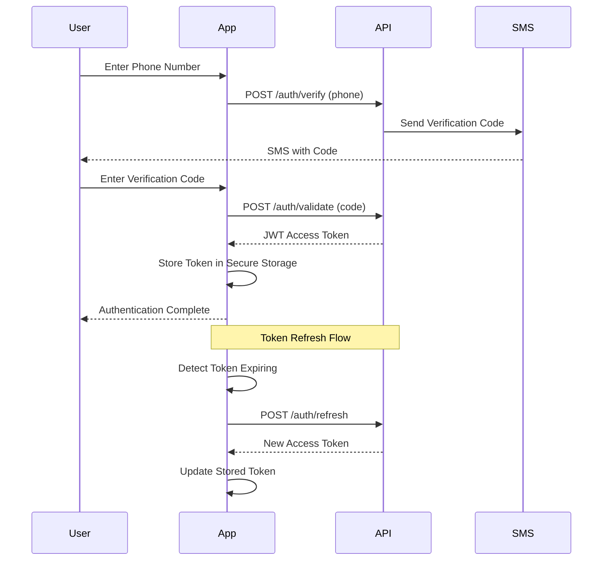
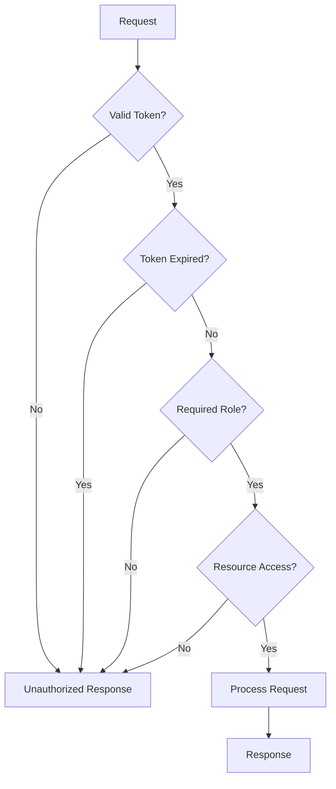
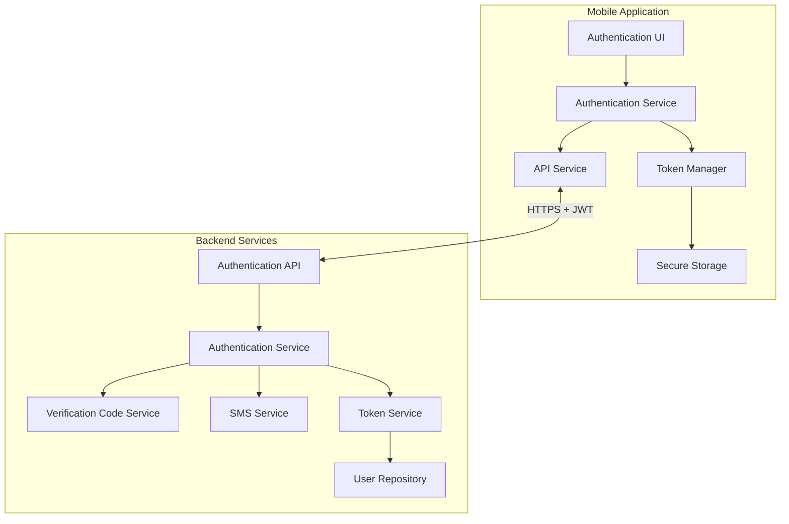
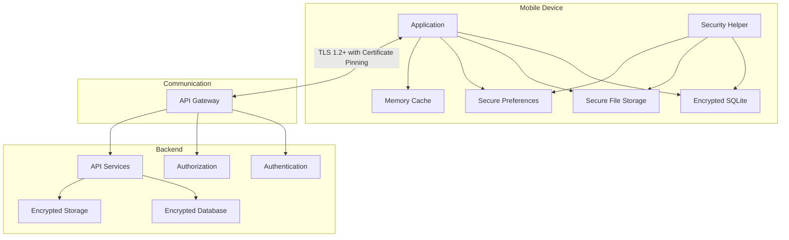
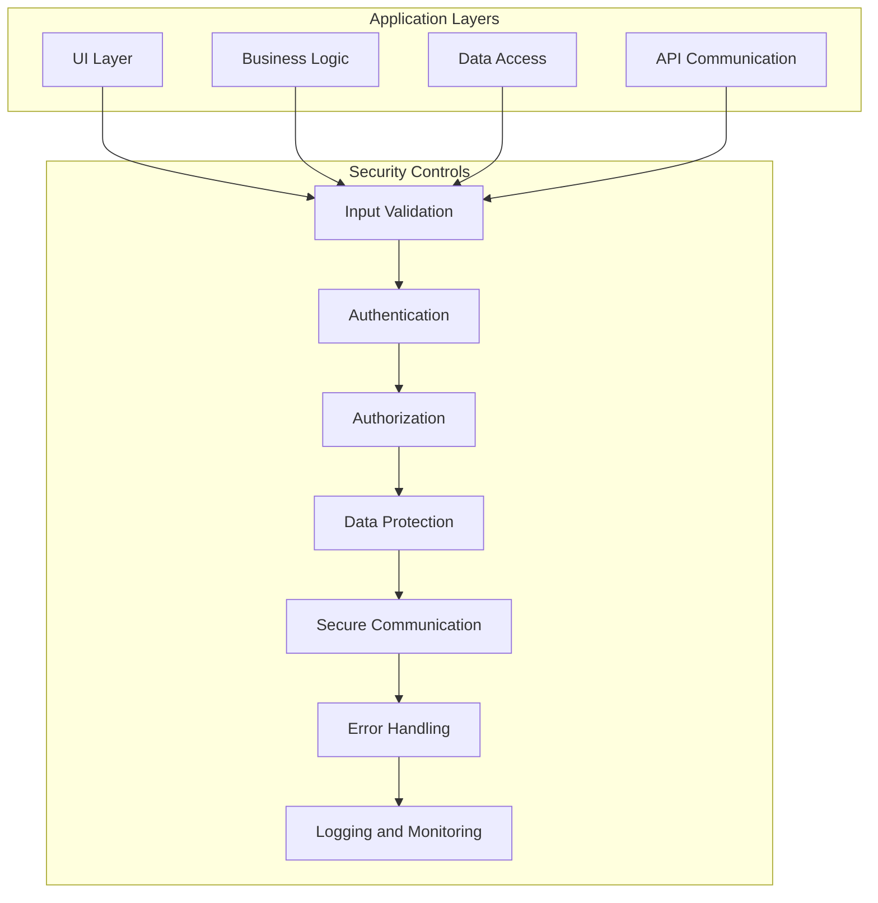

# Security Architecture

## 1. Introduction

This document outlines the security architecture of the Security Patrol application, covering both mobile and backend components. It describes the authentication mechanisms, authorization framework, data protection measures, and security controls implemented to protect sensitive data and ensure secure operations.

### 1.1 Security Objectives

The primary security objectives of the Security Patrol application are:

- Ensure only authorized security personnel can access the application
- Protect sensitive data including location information, patrol records, and authentication credentials
- Maintain data integrity for patrol verification and activity reporting
- Provide secure communication between mobile clients and backend services
- Implement defense-in-depth security controls to mitigate various threats
- Comply with relevant security standards and regulations

### 1.2 Security Architecture Overview

The Security Patrol application implements a layered security architecture with the following key components:

- **Authentication Layer**: Phone number verification with SMS codes and JWT token-based session management
- **Authorization Layer**: Role-based access control with security personnel role
- **Data Protection Layer**: Encryption at rest and in transit, secure storage mechanisms
- **Communication Security**: TLS 1.2+ with certificate pinning for all API communication
- **Monitoring and Auditing**: Comprehensive logging of security-relevant events

### 1.3 Application Context

The Security Patrol Application is a .NET MAUI mobile application primarily for Android devices, designed for security personnel to track activities, locations, and complete checkpoint-based patrols. The application addresses the need for real-time location tracking, activity documentation, and systematic patrol management.

The application follows a client-centric architecture with a mobile-first approach, implementing a layered architecture pattern within the .NET MAUI framework. It communicates with multiple backend API services for authentication, data synchronization, and patrol management, while interfacing directly with device hardware including GPS and camera.

## 2. Authentication Framework

The Security Patrol application implements a robust authentication framework centered around phone number verification and token-based session management.

### 2.1 Identity Management

- **User Identity**: Security personnel are identified by their phone numbers
- **Identity Verification**: Two-step verification process using SMS codes
- **Identity Storage**: User records stored in backend database with appropriate security controls

```csharp
// Mobile client code
public async Task<bool> RequestVerificationCode(string phoneNumber)
{
    try
    {
        // Validate phone number format
        if (!ValidationHelper.ValidatePhoneNumber(phoneNumber))
        {
            _logger.LogWarning("Invalid phone number format");
            return false;
        }

        // Store phone number for later use in verification
        _currentPhoneNumber = phoneNumber;

        // Create authentication request
        var request = new AuthenticationRequest { PhoneNumber = phoneNumber };

        // Send request to API
        await _apiService.PostAsync<object>(ApiEndpoints.AuthVerify, request, false);
        return true;
    }
    catch (Exception ex)
    {
        _logger.LogError(ex, "Error requesting verification code");
        return false;
    }
}
```

```csharp
// Backend code
public async Task<Result<string>> RequestVerificationCodeAsync(AuthenticationRequest request)
{
    // Validate request
    if (request == null || string.IsNullOrEmpty(request.PhoneNumber))
    {
        throw new ValidationException("Phone number is required");
    }

    // Find or create user
    var user = await _userRepository.GetByPhoneNumberAsync(request.PhoneNumber);
    if (user == null)
    {
        user = new User { PhoneNumber = request.PhoneNumber };
        await _userRepository.AddAsync(user);
    }

    // Generate verification code
    var verificationId = await _verificationCodeService.GenerateCodeAsync(user.Id, request.PhoneNumber);

    // Send SMS with verification code
    await _smsService.SendVerificationCodeAsync(request.PhoneNumber, verificationId);

    return Result.Success(verificationId);
}
```

### 2.2 Multi-factor Authentication

The application implements a two-factor authentication approach:

1. **Something you have**: The registered phone number (verified via SMS)
2. **Something you know**: The verification code sent to that phone

This provides stronger security than single-factor approaches while maintaining usability for security personnel in the field.

### 2.3 Session Management

- **Session Establishment**: JWT token issued upon successful verification
- **Session Duration**: Configurable expiry (default: 8 hours) to match typical security shift duration
- **Session Termination**: Explicit logout or token expiration
- **Session Persistence**: Secure storage of tokens on mobile device
- **Token Refresh**: Automatic refresh of tokens approaching expiration

```csharp
// Backend code
public async Task<AuthenticationResponse> GenerateTokenAsync(User user)
{
    // Create token expiration time
    var expires = DateTime.UtcNow.AddMinutes(_tokenExpirationMinutes);

    // Create claims for the token
    var claims = new List<Claim>
    {
        new Claim(ClaimTypes.UserId, user.Id),
        new Claim(ClaimTypes.PhoneNumber, user.PhoneNumber),
        new Claim(ClaimTypes.Role, Roles.SecurityPersonnel)
    };

    // Create identity and token
    var identity = new ClaimsIdentity(claims);
    var token = new JwtSecurityToken(
        issuer: _issuer,
        audience: _audience,
        claims: identity.Claims,
        expires: expires,
        signingCredentials: _signingCredentials
    );

    // Generate token string
    var tokenString = new JwtSecurityTokenHandler().WriteToken(token);

    return new AuthenticationResponse
    {
        Token = tokenString,
        ExpiresAt = expires
    };
}
```

```csharp
// Mobile client code
public async Task StoreToken(string token)
{
    if (string.IsNullOrEmpty(token))
    {
        throw new ArgumentException("Token cannot be null or empty", nameof(token));
    }

    _logger.LogInformation("Storing authentication token");

    // Calculate token expiry time
    var expiryTime = DateTime.UtcNow.AddMinutes(AppConstants.AuthTokenExpiryMinutes);

    // Store token in secure storage
    await SecurityHelper.SaveToSecureStorage(TOKEN_KEY, token);
    await SecurityHelper.SaveToSecureStorage(TOKEN_EXPIRY_KEY, expiryTime.ToString("o"));

    _logger.LogInformation("Token stored successfully");
}
```

### 2.4 Authentication Flow

The authentication flow consists of the following steps:

1. User enters phone number in the application
2. Application sends phone number to Authentication API
3. API generates verification code and sends it via SMS
4. User enters verification code in the application
5. Application sends verification code to Authentication API
6. API validates code and issues JWT token if valid
7. Application stores token securely for subsequent API calls
8. Token is automatically refreshed when approaching expiration



## 3. Authorization System

The Security Patrol application implements a straightforward authorization system appropriate for its focused use case.

### 3.1 Role-Based Access Control

The application implements a single user role:

- **Security Personnel**: Primary app users with full application access

This simplified approach is appropriate given the application's focused purpose and user base.

```csharp
// Backend code
public static IServiceCollection AddAuthorizationPolicies(this IServiceCollection services)
{
    services.AddAuthorization(options =>
    {
        // Add policy for security personnel role
        options.AddPolicy(Roles.SecurityPersonnel, policy =>
        {
            policy.RequireClaim(ClaimTypes.Role, Roles.SecurityPersonnel);
        });

        // Default policy requires authenticated user
        options.DefaultPolicy = new AuthorizationPolicyBuilder()
            .RequireAuthenticatedUser()
            .Build();
    });

    return services;
}
```

### 3.2 Permission Management

While the application does not implement complex permission hierarchies, it does enforce feature-specific permissions:

| Feature | Permission | Enforcement Point |
|---------|------------|-------------------|
| Clock In/Out | Authenticated User | TimeTrackingService |
| Location Tracking | Authenticated + Clocked In | LocationService |
| Photo Capture | Authenticated User | PhotoService |
| Activity Reporting | Authenticated User | ReportService |
| Patrol Management | Authenticated User | PatrolService |

### 3.3 Resource Authorization

The application enforces resource-level authorization to ensure users can only access their own data:

| Resource | Authorization Rule | Implementation |
|----------|-------------------|-----------------|
| User Profile | Self only | Token validation |
| Clock History | Self only | User ID filtering |
| Location Data | Self only | User ID filtering |
| Photos | Self only | User ID filtering |
| Reports | Self only | User ID filtering |
| Patrol Data | Assigned locations only | Location assignment check |

```csharp
// Backend code
public async Task<IEnumerable<TimeRecord>> GetTimeRecordsAsync(string userId)
{
    // Get current user ID from token
    var currentUserId = _currentUserService.UserId;
    
    // Ensure user can only access their own records
    if (currentUserId != userId)
    {
        throw new UnauthorizedException("You are not authorized to access these records");
    }
    
    // Retrieve records for the authorized user
    return await _timeRecordRepository.GetByUserIdAsync(userId);
}
```

### 3.4 API Authorization

API endpoints are protected using JWT bearer authentication and role-based authorization:

- Public endpoints (authentication) do not require authorization
- Protected endpoints require a valid JWT token with appropriate claims
- API controllers use authorization attributes to enforce access control
- API gateway validates tokens before routing requests

```csharp
// Backend code
[ApiController]
[Route("api/v1/time")]
[Authorize(Roles = Roles.SecurityPersonnel)]
public class TimeController : ControllerBase
{
    // Controller implementation
}
```

### 3.5 Authorization Flow

The authorization flow consists of the following steps:

1. Client includes JWT token in Authorization header of API requests
2. API gateway validates token signature, expiration, and claims
3. If token is valid, request proceeds to the appropriate controller
4. Controller checks role-based authorization requirements
5. Service layer performs resource-level authorization checks
6. If all checks pass, the requested operation is performed



## 4. Data Protection

The Security Patrol application implements comprehensive data protection measures to safeguard sensitive information both at rest and in transit.

### 4.1 Encryption Standards

| Data Category | Encryption Standard | Implementation |
|---------------|---------------------|----------------|
| Authentication Tokens | AES-256 | Platform secure storage |
| Local Database | SQLCipher (AES-256) | Encrypted SQLite database |
| Photos | AES-256 | File-level encryption |
| API Communication | TLS 1.2+ | HTTPS for all API calls |

```csharp
// Mobile client code
public static string EncryptString(string plainText, string key)
{
    if (plainText == null)
        throw new ArgumentNullException(nameof(plainText));
    if (string.IsNullOrEmpty(key))
        throw new ArgumentException("Key cannot be null or empty", nameof(key));

    try
    {
        // Create secure random IV
        byte[] iv = new byte[16];
        using (var rng = RandomNumberGenerator.Create())
        {
            rng.GetBytes(iv);
        }

        // Create AES encryption object
        using (var aes = Aes.Create())
        {
            aes.Key = Convert.FromBase64String(key);
            aes.IV = iv;

            // Create encryptor and encrypt data
            var encryptor = aes.CreateEncryptor(aes.Key, aes.IV);
            using (var ms = new MemoryStream())
            {
                using (var cs = new CryptoStream(ms, encryptor, CryptoStreamMode.Write))
                {
                    using (var sw = new StreamWriter(cs))
                    {
                        sw.Write(plainText);
                    }
                }

                // Combine IV and encrypted data
                var encryptedData = ms.ToArray();
                var result = new byte[iv.Length + encryptedData.Length];
                Buffer.BlockCopy(iv, 0, result, 0, iv.Length);
                Buffer.BlockCopy(encryptedData, 0, result, iv.Length, encryptedData.Length);

                // Return as Base64 string
                return Convert.ToBase64String(result);
            }
        }
    }
    catch (Exception ex)
    {
        _logger.LogError(ex, "Error encrypting string");
        throw;
    }
}
```

### 4.2 Key Management

| Key Type | Generation | Storage | Rotation |
|----------|------------|---------|----------|
| Database Encryption Key | Secure random generation | Android Keystore | Application update |
| File Encryption Keys | Secure random generation | Android Keystore | Per-file basis |
| API Authentication | Server-generated JWT | Secure storage | Token expiration |

The application leverages platform security features (Android Keystore) to securely store encryption keys, protecting them from extraction even on compromised devices.

```csharp
// Mobile client code
public static string GenerateSecureKey(int keySizeInBits)
{
    // Validate key size (128, 192, or 256 bits)
    if (keySizeInBits != 128 && keySizeInBits != 192 && keySizeInBits != 256)
        throw new ArgumentException("Key size must be 128, 192, or 256 bits", nameof(keySizeInBits));

    try
    {
        // Create byte array for key
        byte[] key = new byte[keySizeInBits / 8];
        
        // Fill with cryptographically secure random bytes
        using (var rng = RandomNumberGenerator.Create())
        {
            rng.GetBytes(key);
        }
        
        // Return as Base64 string
        return Convert.ToBase64String(key);
    }
    catch (Exception ex)
    {
        _logger.LogError(ex, "Error generating secure key");
        throw;
    }
}
```

### 4.3 Secure Storage

The application implements secure storage mechanisms for different types of sensitive data:

- **Authentication Tokens**: Stored using platform-specific secure storage (Android Keystore)
- **User Data**: Stored in encrypted SQLite database
- **Photos**: Stored in application-specific directory with file-level encryption
- **Temporary Data**: Kept in memory and cleared when no longer needed

All sensitive data is stored within the application sandbox, inaccessible to other applications.

```csharp
// Mobile client code
public static async Task SaveToSecureStorage(string key, string value)
{
    if (string.IsNullOrEmpty(key))
        throw new ArgumentException("Key cannot be null or empty", nameof(key));
    if (value == null)
        throw new ArgumentNullException(nameof(value));

    try
    {
        _logger.LogInformation($"Saving value to secure storage with key: {key}");
        await SecureStorage.SetAsync(key, value);
        _logger.LogInformation($"Successfully saved value to secure storage with key: {key}");
    }
    catch (Exception ex)
    {
        _logger.LogError(ex, $"Error saving value to secure storage with key: {key}");
        throw;
    }
}

public static async Task<string> GetFromSecureStorage(string key)
{
    if (string.IsNullOrEmpty(key))
        throw new ArgumentException("Key cannot be null or empty", nameof(key));

    try
    {
        _logger.LogInformation($"Retrieving value from secure storage with key: {key}");
        var value = await SecureStorage.GetAsync(key);
        _logger.LogInformation($"Successfully retrieved value from secure storage with key: {key}");
        return value;
    }
    catch (Exception ex)
    {
        _logger.LogError(ex, $"Error retrieving value from secure storage with key: {key}");
        return null;
    }
}
```

### 4.4 Secure Communication

All communication between the mobile application and backend services is secured using:

- TLS 1.2+ with strong cipher suites
- Certificate pinning to prevent man-in-the-middle attacks
- Token-based authentication for all API requests
- Request and response validation to prevent injection attacks

```csharp
// Mobile client code
private async Task AddAuthenticationHeader(HttpRequestMessage request, bool requiresAuth)
{
    if (requiresAuth)
    {
        // Check if token is valid
        if (await tokenManager.IsTokenValid())
        {
            // Retrieve token
            var token = await tokenManager.RetrieveToken();
            
            // Add token to Authorization header
            request.Headers.Authorization = new AuthenticationHeaderValue("Bearer", token);
        }
        else
        {
            throw new UnauthorizedAccessException(ErrorMessages.UnauthorizedAccess);
        }
    }
}
```

### 4.5 Data Masking

The application implements data masking to protect sensitive information in logs and UI:

| Data Type | Masking Rule | Implementation |
|-----------|--------------|----------------|
| Phone Numbers | Partial masking (e.g., ***-***-1234) | When displayed in UI |
| Location Data | Precision reduction | When stored for history |
| Authentication Tokens | Complete masking | In logs and diagnostics |

## 5. Security Controls

The Security Patrol application implements a comprehensive set of security controls to mitigate various threats.

### 5.1 Input Validation

All user input and API responses are validated to prevent injection attacks and data corruption:

- Phone numbers validated against expected formats
- Verification codes validated for length and format
- API requests validated using model validation
- API responses validated before processing

Validation occurs on both client and server sides to provide defense in depth.

```csharp
// Mobile client code
public static bool ValidatePhoneNumber(string phoneNumber)
{
    if (string.IsNullOrEmpty(phoneNumber))
        return false;

    // Validate phone number format using regex
    // Format: +[country code][number], e.g., +12345678901
    var regex = new Regex(@^\\+[1-9]\\d{1,14}$);
    return regex.IsMatch(phoneNumber);
}

public static bool ValidateVerificationCode(string code)
{
    if (string.IsNullOrEmpty(code))
        return false;

    // Verification code should be 6 digits
    var regex = new Regex(@^\\d{6}$);
    return regex.IsMatch(code);
}
```

### 5.2 Error Handling

The application implements secure error handling to prevent information disclosure:

- Detailed errors logged internally but not exposed to users
- Generic error messages displayed to users
- Exception middleware to handle uncaught exceptions
- Structured error responses for API communication

```csharp
// Backend code
public class ExceptionHandlingMiddleware
{
    private readonly RequestDelegate _next;
    private readonly ILogger<ExceptionHandlingMiddleware> _logger;

    public ExceptionHandlingMiddleware(RequestDelegate next, ILogger<ExceptionHandlingMiddleware> logger)
    {
        _next = next;
        _logger = logger;
    }

    public async Task InvokeAsync(HttpContext context)
    {
        try
        {
            await _next(context);
        }
        catch (Exception ex)
        {
            _logger.LogError(ex, "Unhandled exception");
            await HandleExceptionAsync(context, ex);
        }
    }

    private static async Task HandleExceptionAsync(HttpContext context, Exception exception)
    {
        context.Response.ContentType = "application/json";

        var statusCode = exception switch
        {
            UnauthorizedException => StatusCodes.Status401Unauthorized,
            ValidationException => StatusCodes.Status400BadRequest,
            NotFoundException => StatusCodes.Status404NotFound,
            _ => StatusCodes.Status500InternalServerError
        };

        context.Response.StatusCode = statusCode;

        // Create sanitized error response
        var response = new
        {
            status = statusCode,
            message = GetSanitizedErrorMessage(exception)
        };

        await context.Response.WriteAsJsonAsync(response);
    }

    private static string GetSanitizedErrorMessage(Exception exception)
    {
        // Return user-friendly message without sensitive details
        return exception switch
        {
            UnauthorizedException => "Authentication required",
            ValidationException => exception.Message, // Validation messages are safe to return
            NotFoundException => "Resource not found",
            _ => "An error occurred while processing your request"
        };
    }
}
```

### 5.3 Authentication Controls

The application implements several controls to protect the authentication process:

- Rate limiting for verification attempts (5 attempts per 10 minutes)
- Verification codes expire after 10 minutes
- Verification codes are single-use
- Tokens have configurable expiration (default 8 hours)
- Automatic token refresh to maintain session
- Secure token storage using platform security features

```csharp
// Backend code
public async Task<bool> ValidateTokenAsync(string token)
{
    if (string.IsNullOrEmpty(token))
        return false;

    _logger.LogInformation("Validating token");

    try
    {
        // Configure token validation parameters
        var validationParameters = new TokenValidationParameters
        {
            ValidateIssuer = true,
            ValidIssuer = _issuer,
            ValidateAudience = true,
            ValidAudience = _audience,
            ValidateIssuerSigningKey = true,
            IssuerSigningKey = _signingKey,
            ValidateLifetime = true,
            ClockSkew = TimeSpan.Zero // Strict expiration time validation
        };

        // Validate token
        var handler = new JwtSecurityTokenHandler();
        var principal = handler.ValidateToken(token, validationParameters, out _);

        return true;
    }
    catch (Exception ex)
    {
        _logger.LogWarning(ex, "Token validation failed");
        return false;
    }
}
```

### 5.4 Authorization Controls

The application enforces authorization at multiple levels:

- API gateway validates tokens before routing requests
- Controllers enforce role-based authorization
- Services enforce resource-level authorization
- Database queries filter by user ID to prevent unauthorized access

This defense-in-depth approach ensures that authorization cannot be bypassed by attacking a single layer.

### 5.5 Secure Defaults

The application is designed with secure defaults:

- Authentication required for all protected resources
- Encryption enabled by default for sensitive data
- Secure communication (HTTPS) enforced for all API calls
- Minimal permissions requested from the device
- Secure storage used for all sensitive data

### 5.6 Security Headers

The backend API implements security headers to protect against common web vulnerabilities:

- Content-Security-Policy: Prevents XSS attacks
- X-Content-Type-Options: Prevents MIME type sniffing
- X-Frame-Options: Prevents clickjacking
- X-XSS-Protection: Additional XSS protection
- Strict-Transport-Security: Enforces HTTPS
- Cache-Control: Prevents sensitive data caching

```csharp
// Backend code
public static IApplicationBuilder UseSecurityHeaders(this IApplicationBuilder app)
{
    return app.Use(async (context, next) =>
    {
        // Add security headers
        context.Response.Headers.Add("Content-Security-Policy", "default-src 'self'");
        context.Response.Headers.Add("X-Content-Type-Options", "nosniff");
        context.Response.Headers.Add("X-Frame-Options", "DENY");
        context.Response.Headers.Add("X-XSS-Protection", "1; mode=block");
        context.Response.Headers.Add("Strict-Transport-Security", "max-age=31536000; includeSubDomains");
        context.Response.Headers.Add("Cache-Control", "no-store, no-cache, must-revalidate, proxy-revalidate");
        context.Response.Headers.Add("Pragma", "no-cache");
        context.Response.Headers.Add("Expires", "0");

        await next();
    });
}
```

## 6. Compliance and Regulations

The Security Patrol application is designed to comply with relevant security standards and regulations.

### 6.1 Data Privacy Compliance

The application implements data privacy best practices:

- Minimal collection of personal data (only phone number required)
- Clear purpose for all collected data
- Secure processing and storage of personal data
- Data retention policies with automatic cleanup
- No sharing of personal data with third parties

### 6.2 Industry Standards

The application follows industry security standards:

- OWASP Mobile Top 10 mitigations
- NIST guidelines for mobile application security
- OAuth 2.0 and JWT standards for authentication
- TLS 1.2+ for secure communication

### 6.3 Security Personnel Requirements

The application addresses specific requirements for security personnel operations:

- Chain of custody for patrol evidence (photos, reports)
- Non-repudiation of patrol activities through authenticated records
- Verifiable location tracking for accountability
- Secure documentation of security incidents

## 7. Security Testing

The Security Patrol application undergoes comprehensive security testing to identify and address vulnerabilities.

### 7.1 Testing Approach

The security testing approach includes:

- Static Application Security Testing (SAST) for code analysis
- Dynamic Application Security Testing (DAST) for runtime analysis
- Dependency scanning for vulnerable components
- Manual penetration testing for complex vulnerabilities
- Continuous security testing in CI/CD pipeline

### 7.2 Test Coverage

Security testing covers the following areas:

- Authentication and authorization mechanisms
- Data encryption and storage
- API security and input validation
- Mobile application security
- Backend service security
- Network communication security

### 7.3 Vulnerability Management

The vulnerability management process includes:

- Regular security scans and assessments
- Prioritization of vulnerabilities based on risk
- Timely remediation of identified issues
- Verification of fixes through retesting
- Security advisories for critical issues

## 8. Incident Response

The Security Patrol application includes capabilities to support security incident response.

### 8.1 Detection Capabilities

The application implements detection mechanisms for security incidents:

- Anomaly detection for unusual authentication patterns
- Monitoring for unauthorized access attempts
- Alerting for potential security violations
- Comprehensive logging of security-relevant events

### 8.2 Response Procedures

The incident response procedures include:

- Containment through remote token invalidation
- Investigation using detailed security logs
- Recovery through secure credential reset
- Communication with affected users
- Post-incident analysis and improvements

### 8.3 Recovery Capabilities

The application supports recovery from security incidents:

- Secure data backup and restoration
- Clean reinstallation procedures
- Secure credential reset process
- Remote configuration updates
- Feature toggles to disable vulnerable components

## 9. Security Architecture Diagrams

The following diagrams illustrate the security architecture of the Security Patrol application.

### 9.1 Authentication Architecture

The authentication architecture diagram shows the components and flow of the authentication process.



### 9.2 Data Protection Architecture

The data protection architecture diagram shows how data is protected at rest and in transit.



### 9.3 Security Controls Architecture

The security controls architecture diagram shows the layers of security controls implemented in the application.



## 10. References

The following references were used in the development of the security architecture:

### 10.1 Standards and Guidelines

- OWASP Mobile Top 10 (2023)
- NIST Special Publication 800-53 (Security Controls)
- NIST Special Publication 800-63B (Authentication Guidelines)
- OAuth 2.0 and JWT Standards
- Android Security Best Practices

### 10.2 Internal References

- [Data Flow Documentation](./data-flow.md)
- [API Documentation](../api/api-documentation.md)
- Security implementation details in mobile app components
- Component diagrams (available in the project documentation)