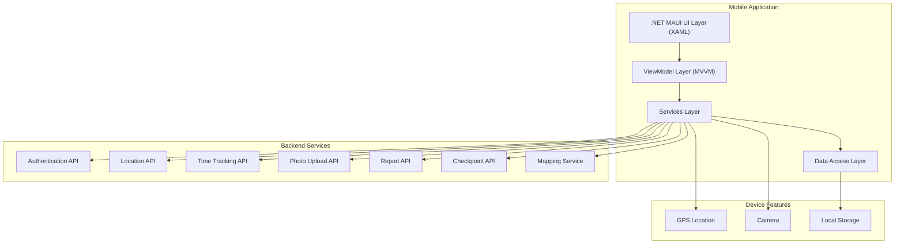
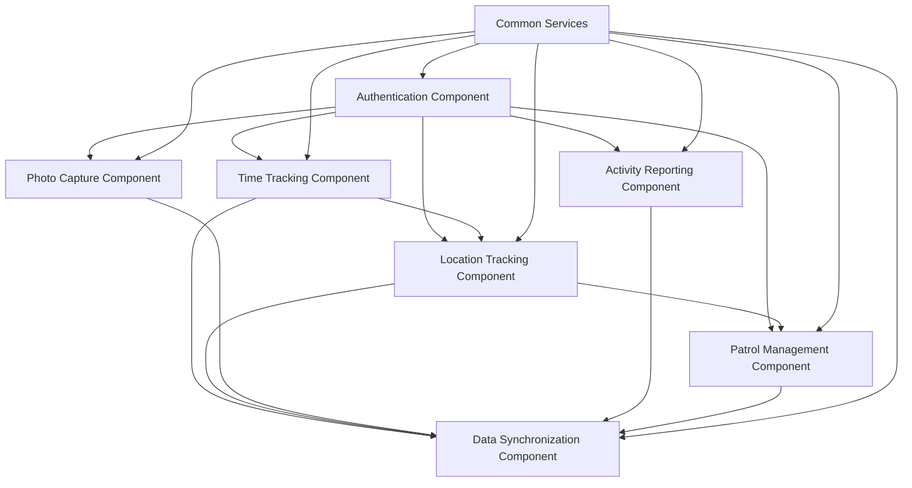
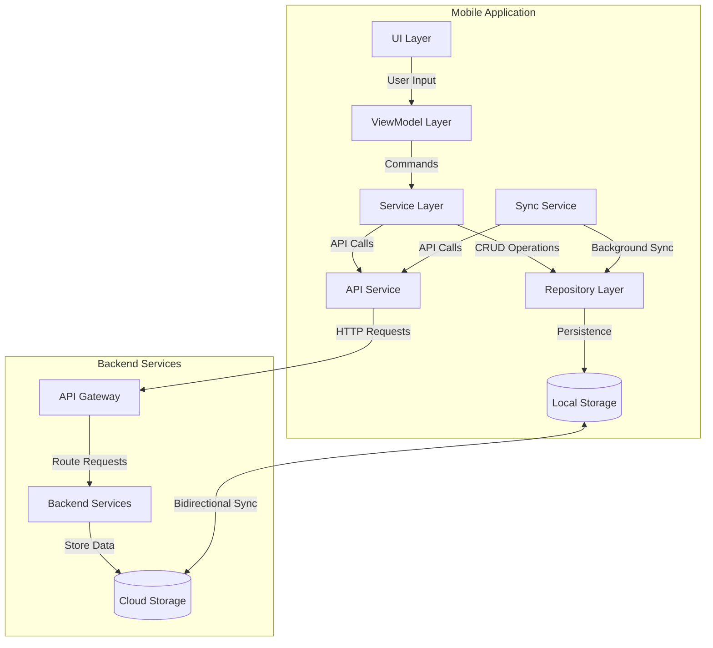
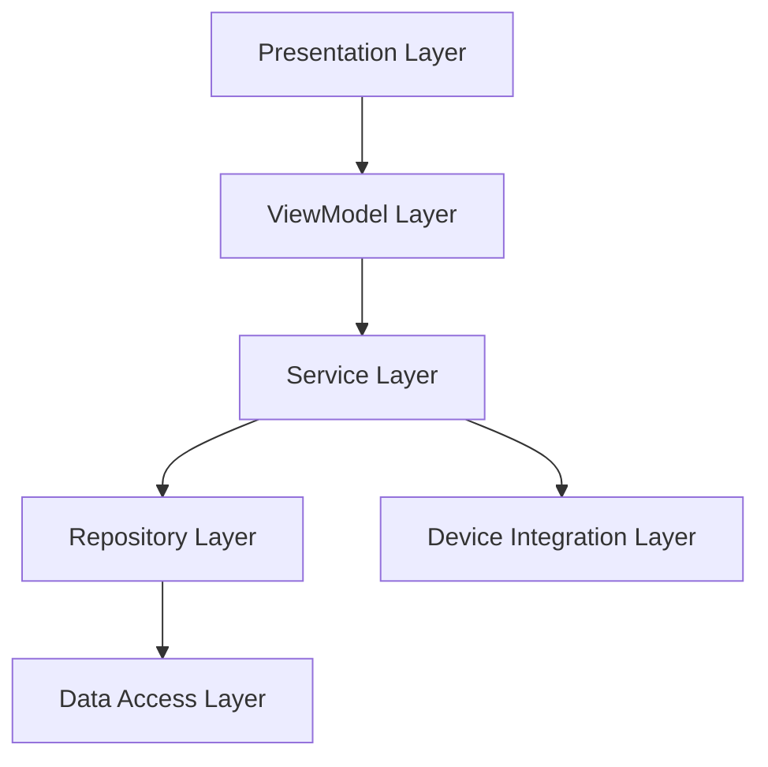
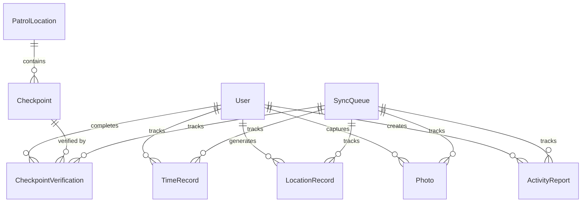
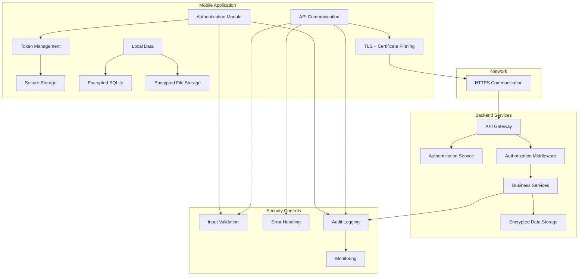
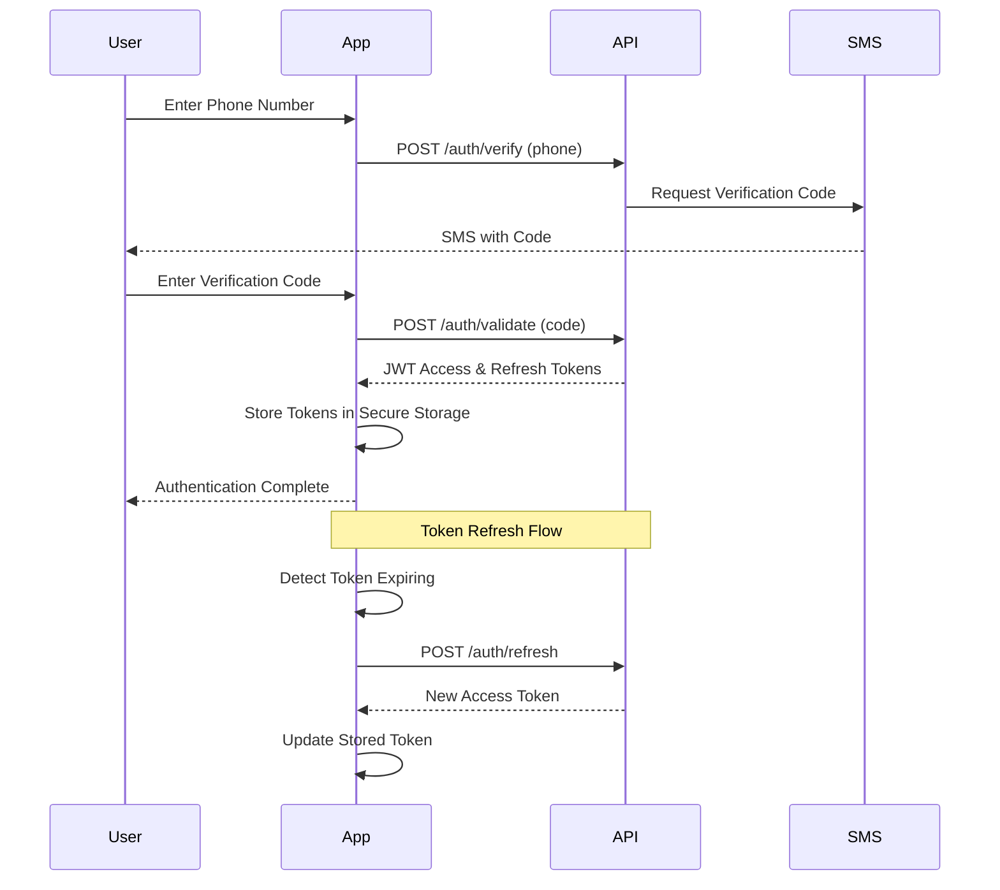
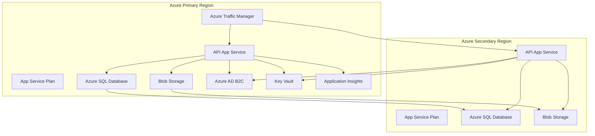
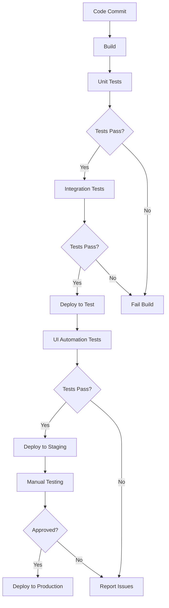

## Introduction

This document provides a comprehensive overview of the Security Patrol Application system architecture. The application is designed for security personnel to track activities, locations, and complete checkpoint-based patrols, primarily targeting Android devices through .NET MAUI. This system overview serves as the entry point to understanding the overall architecture, with links to more detailed documentation on specific aspects of the system.

### Purpose

The purpose of this document is to provide a high-level understanding of the Security Patrol Application architecture, including:

- The overall system structure and key components
- The relationships and interactions between components
- The data flows within the system
- The key architectural decisions and patterns
- The security and integration approaches

This document serves as a roadmap to more detailed documentation on specific aspects of the system architecture.

### System Context

The Security Patrol Application addresses the need for security personnel to efficiently track their activities, locations, and complete checkpoint-based patrols. The application provides:

- Phone number-based authentication with verification code
- Clock-in/out functionality with historical record keeping
- Continuous GPS location tracking during active shifts
- In-app photo capture and storage
- Activity reporting with note-taking capabilities
- Interactive patrol management with map-based checkpoint verification

The system consists of a mobile application built with .NET MAUI (targeting Android) and a set of backend services that provide authentication, data storage, and synchronization capabilities.

### Document Structure

This document is organized as follows:

1. **Introduction**: Overview and context of the system
2. **Architectural Principles**: Key principles guiding the architecture
3. **System Architecture Overview**: High-level view of the system components
4. **Mobile Application Architecture**: Details of the mobile application design
5. **Backend Services Architecture**: Overview of the backend services
6. **Data Architecture**: Data model and persistence approach
7. **Integration Architecture**: How components communicate
8. **Security Architecture**: Security measures and considerations
9. **Deployment Architecture**: How the system is deployed
10. **Cross-Cutting Concerns**: Aspects that affect multiple components

Each section provides an overview with references to more detailed documentation.

## Architectural Principles

The Security Patrol Application architecture is guided by several key principles that inform design decisions throughout the system.

### Mobile-First Design

The application is designed with a mobile-first approach, optimized for Android devices used by security personnel in the field. This principle influences:

- User interface design for touch interaction and mobile screen sizes
- Battery optimization for location tracking and background operations
- Efficient data synchronization to minimize network usage
- Responsive performance even on mid-range devices

While the initial implementation targets Android via .NET MAUI, the architecture allows for potential future expansion to other platforms.

### Layered Architecture

The system implements a layered architecture pattern with clear separation of concerns:

- **Presentation Layer**: User interface components and view models
- **Business Logic Layer**: Services implementing core business functionality
- **Data Access Layer**: Repositories and data access components
- **Integration Layer**: Communication with external systems and services

This separation enhances maintainability, testability, and allows components to evolve independently.

### Offline-First Capability

The application is designed to function fully offline with eventual synchronization when connectivity is available:

- All data operations are performed locally first
- Changes are queued for synchronization with backend services
- Background synchronization occurs when connectivity is available
- Conflict resolution strategies handle synchronization conflicts

This approach ensures that security personnel can continue working even in areas with limited or no connectivity.

### Security by Design

Security is integrated throughout the architecture:

- Strong authentication using phone verification and tokens
- Encryption of sensitive data both at rest and in transit
- Secure communication with backend services
- Permission-based access control
- Audit logging of security-relevant events

Security considerations are addressed at all levels of the architecture, not as an afterthought.

### Maintainability and Testability

The architecture is designed for long-term maintainability and comprehensive testing:

- MVVM pattern for separation of UI and business logic
- Interface-based design for loose coupling
- Dependency injection for component composition
- Clear component boundaries and responsibilities
- Comprehensive logging and diagnostics

These practices facilitate both automated testing and ongoing maintenance of the application.

## System Architecture Overview

The Security Patrol Application follows a client-centric architecture with a mobile-first approach, implementing a layered architecture pattern within the .NET MAUI framework.

### High-Level Architecture

The system consists of three main parts:

1. **Mobile Application**: A .NET MAUI application targeting Android devices, implementing a layered architecture with MVVM pattern
2. **Device Features**: Integration with device hardware capabilities including GPS, camera, and local storage
3. **Backend Services**: RESTful APIs providing authentication, data storage, and business logic

For more detailed component diagrams, see [Component Diagrams](component-diagrams.md).

### Key Components

| Component | Description | Responsibility |
|-----------|-------------|----------------|
| UI Layer | XAML-based user interface | User interaction and display |
| ViewModel Layer | MVVM implementation | UI state management and business logic coordination |
| Services Layer | Business logic components | Core business functionality implementation |
| Data Access Layer | Repositories and storage | Data persistence and retrieval |
| Authentication Service | User verification | Phone number verification and token management |
| Location Service | GPS tracking | Continuous location monitoring and recording |
| Time Tracking Service | Clock in/out management | Work shift tracking and history |
| Patrol Service | Checkpoint management | Patrol routes and checkpoint verification |
| Photo Service | Camera integration | Photo capture, storage, and management |
| Report Service | Activity documentation | Creation and management of activity reports |
| Sync Service | Data synchronization | Background synchronization with backend services |

Each component has a well-defined responsibility and interfaces with other components through clearly defined contracts.

### Component Interactions

Components interact through a combination of direct method calls, events, and asynchronous operations:

- **Direct Method Calls**: Used for synchronous operations within the same layer
- **Events**: Used for notifications and loosely coupled communication
- **Asynchronous Operations**: Used for I/O operations and long-running tasks
- **Dependency Injection**: Used for component composition and testability

For more detailed information on component interactions, see [Component Diagrams](component-diagrams.md).

### Data Flow Overview

The application implements a bidirectional data flow between the mobile client and backend services, with a local-first approach to ensure offline functionality:

Data flows through the system as follows:

1. User interactions in the UI trigger commands in the ViewModel layer
2. ViewModels call appropriate Services to execute business logic
3. Services use Repositories for data access and persistence
4. Data is stored locally in SQLite database or secure file storage
5. The Sync Service manages background synchronization with backend services
6. API Service handles communication with backend APIs
7. Backend services process requests and store data in cloud storage

For more detailed information on data flows, see [Data Flow Documentation](data-flow.md).

## Mobile Application Architecture

The mobile application is built using .NET MAUI, primarily targeting Android devices. It implements a layered architecture with the MVVM pattern for separation of UI and business logic.

### Architectural Layers

The mobile application is structured into the following layers:

1. **Presentation Layer**: XAML-based UI components (Views)
2. **ViewModel Layer**: MVVM implementation using CommunityToolkit.Mvvm
3. **Service Layer**: Business logic and orchestration
4. **Repository Layer**: Data access abstraction
5. **Data Access Layer**: SQLite and secure file storage implementation
6. **Device Integration Layer**: Access to device capabilities (GPS, camera)

This layered approach provides clear separation of concerns and facilitates testing and maintenance.

### MVVM Implementation

The application uses the Model-View-ViewModel (MVVM) pattern to separate UI concerns from business logic, leveraging the CommunityToolkit.Mvvm package for implementation.

Key aspects of the MVVM implementation include:

- **BaseViewModel**: Common base class for all ViewModels providing shared functionality
- **View-ViewModel Binding**: XAML data binding for UI updates
- **Commands**: Encapsulation of user actions as commands
- **Navigation Service**: Abstraction for screen navigation
- **Dependency Injection**: Service location and composition

This approach enhances testability and maintainability by decoupling the UI from business logic.

### Service Layer

The Service Layer contains the core business logic of the application, orchestrating operations between the UI and data layers:

- **Authentication Service**: Manages user authentication and session state
- **Location Service**: Handles GPS tracking and location data management
- **Time Tracking Service**: Manages clock in/out operations and history
- **Patrol Service**: Handles checkpoint data and verification
- **Photo Service**: Manages camera access and photo storage
- **Report Service**: Handles activity report creation and management
- **Sync Service**: Coordinates data synchronization with backend

Services are defined by interfaces to facilitate testing and loose coupling, and are registered in the dependency injection container with appropriate lifetimes.

### Data Persistence

The application uses multiple storage mechanisms to persist different types of data:

| Data Type | Storage Mechanism | Purpose | Encryption |
|-----------|-------------------|---------|------------|
| Structured Data | SQLite Database | Store entities and relationships | Yes |
| Binary Data (Photos) | File System | Store captured images | Yes |
| Authentication Tokens | Secure Storage | Store sensitive authentication data | Platform-specific |
| Application Settings | Preferences | Store user preferences and app settings | No |

The Repository pattern is used to abstract data access operations, providing a clean separation between business logic and data storage details.

### Offline Operation

The application implements an offline-first approach, allowing full functionality without network connectivity:

- All data operations are performed locally first, then synchronized with the backend
- Changes are queued for synchronization when connectivity is available
- The Sync Service manages background synchronization with retry logic
- Conflict resolution strategies handle synchronization conflicts

This approach ensures that security personnel can continue working even in areas with limited or no connectivity.

### Device Integration

The application integrates with device hardware capabilities including:

- **GPS**: For continuous location tracking during shifts
- **Camera**: For photo capture and documentation
- **Storage**: For local data persistence
- **Network**: For connectivity monitoring and adaptation

Device integration is implemented through abstraction layers that provide a consistent interface while handling platform-specific details.

### Performance Optimization

The application implements various performance optimization strategies:

- **Battery Optimization**: Adaptive location tracking based on movement and battery level
- **Memory Management**: Efficient image handling and resource disposal
- **UI Performance**: Virtualization for lists and async image loading
- **Database Optimization**: Indexed queries and batch operations

These optimizations ensure efficient operation on mobile devices with limited resources.

## Backend Services Architecture

The backend services provide authentication, data storage, and business logic for the mobile application. They are implemented as RESTful APIs with a focus on scalability, security, and reliability.

### API Architecture

The backend services follow a RESTful API architecture with the following characteristics:

- **Resource-Oriented**: APIs are organized around resources
- **Standard HTTP Methods**: GET, POST, PUT, DELETE for CRUD operations
- **JSON Data Format**: Consistent data format for all APIs
- **Stateless**: No server-side session state
- **Token-Based Authentication**: JWT tokens for authentication

The API is versioned through URL paths to support backward compatibility while allowing evolution.

### API Components

The backend services consist of several API components:

- **Authentication API**: Phone verification and token management
- **Time Tracking API**: Clock in/out operations and history
- **Location API**: GPS location data storage and retrieval
- **Patrol API**: Checkpoint data and verification
- **Photo API**: Photo storage and retrieval
- **Report API**: Activity report management

Each API component is responsible for a specific domain of functionality and can be deployed and scaled independently.

### Authentication and Authorization

The backend implements a secure authentication and authorization system:

- **Phone Verification**: Two-step verification using SMS codes
- **JWT Tokens**: Secure, signed tokens for API authentication
- **Token Refresh**: Mechanism for extending sessions without re-authentication
- **Role-Based Access**: Authorization based on user roles

This approach provides strong security while maintaining a good user experience.

### Data Storage

The backend services use multiple storage mechanisms:

- **Relational Database**: For structured data and relationships
- **Blob Storage**: For binary data like photos
- **Cache**: For frequently accessed data

Data is stored securely with encryption at rest and appropriate access controls.

### Scalability and Reliability

The backend services are designed for scalability and reliability:

- **Horizontal Scaling**: Ability to add more instances for increased load
- **Load Balancing**: Distribution of requests across instances
- **Fault Tolerance**: Resilience to component failures
- **Monitoring**: Comprehensive monitoring for performance and errors

These characteristics ensure that the backend services can handle growing user bases and maintain high availability.

## Data Architecture

The data architecture of the Security Patrol Application is designed to support offline operation, efficient synchronization, and data integrity.

### Data Model

The core data model includes the following entities:

This model captures the core entities and their relationships, supporting the key functional requirements of the application.

### Data Persistence Strategy

The application implements a local-first data persistence strategy:

1. All data operations are first performed locally
2. Data is stored in SQLite database or secure file storage
3. Changes are queued for synchronization with backend services
4. Synchronization occurs in the background when connectivity is available
5. Conflict resolution strategies handle synchronization conflicts

This approach ensures data availability even without network connectivity.

### Data Synchronization

The synchronization architecture consists of several components working together:

- **Sync Orchestrator**: Coordinates the overall synchronization process
- **Entity Sync Handlers**: Handle type-specific synchronization logic
- **Network Monitor**: Detects connectivity changes and triggers sync
- **Sync Queue**: Tracks items pending synchronization
- **API Service**: Handles communication with backend services

Synchronization follows a prioritized approach, with critical data synchronized first when connectivity is restored.

### Data Migration and Versioning

The application implements a robust data migration and versioning strategy:

1. Database version tracking through a version table
2. Incremental migration scripts for version transitions
3. Safe execution with transactions for atomic migrations
4. Backup and recovery mechanisms for migration failures
5. Validation to ensure data integrity after migration

This approach ensures safe evolution of the data schema as the application evolves.

### Data Security

Data security is implemented at multiple levels:

1. **Encryption at Rest**: Sensitive data is encrypted in local storage
2. **Encryption in Transit**: All API communication uses HTTPS
3. **Access Control**: Data access is restricted based on authentication and authorization
4. **Data Minimization**: Only necessary data is collected and stored
5. **Secure Deletion**: Data is securely deleted when no longer needed

These measures protect sensitive data throughout its lifecycle.

## Integration Architecture

The integration architecture defines how the mobile application communicates with backend services and external systems.

### API Integration

The mobile application communicates with backend services through a unified API service layer:

- **API Service**: Handles all HTTP communication with consistent error handling
- **Authentication**: JWT tokens included in request headers
- **Serialization**: JSON for data exchange
- **Error Handling**: Consistent approach to API errors
- **Retry Logic**: Automatic retry for transient failures

This approach provides a clean separation between business logic and API communication details.

### Device Integration

The application integrates with device features through platform-specific implementations:

- **Location Services**: GPS tracking with battery optimization
- **Camera**: Photo capture and processing
- **Storage**: Secure local storage
- **Network**: Connectivity monitoring

Device integration is implemented through abstraction layers that provide a consistent interface while handling platform-specific details.

### External Services

The application integrates with several external services:

- **SMS Provider**: For phone verification codes
- **Mapping Service**: For map display and geolocation
- **Cloud Storage**: For secure photo storage

Integration with external services is implemented through adapter patterns that isolate the application from external dependencies.

### Integration Patterns

The application implements several integration patterns:

- **Repository Pattern**: Abstracts data access operations
- **Adapter Pattern**: Isolates external dependencies
- **Observer Pattern**: Event-based communication
- **Command Pattern**: Encapsulates operations as objects
- **Retry Pattern**: Handles transient failures

These patterns enhance maintainability and resilience in the integration architecture.

## Security Architecture

The security architecture of the Security Patrol Application is designed to protect data both at rest and in transit, ensure proper authentication and authorization, and maintain the integrity and confidentiality of all system operations.

### Security Overview

The security architecture implements multiple layers of protection:

1. **Authentication Layer**: Verifies user identity through phone number verification
2. **Authorization Layer**: Controls access to resources based on authentication
3. **Communication Layer**: Secures data transmission between components
4. **Storage Layer**: Protects data at rest through encryption
5. **Monitoring Layer**: Detects and responds to security events

### Authentication Framework

The application implements a robust authentication framework centered around phone number verification:

This approach provides two-factor authentication (something the user has - the phone, and something they know - the verification code) while maintaining a good user experience.

### Data Protection

The application implements comprehensive data protection measures:

| Data Category | Encryption Standard | Implementation |
|---------------|---------------------|----------------|
| Authentication Tokens | AES-256 | Platform secure storage |
| Local Database | SQLCipher (AES-256) | Encrypted SQLite database |
| Photos | AES-256 | File-level encryption |
| API Communication | TLS 1.2+ | HTTPS for all API calls |

These measures protect sensitive data both at rest and in transit.

### Secure Coding Practices

The application follows secure coding practices to prevent common vulnerabilities:

- **Input Validation**: All user inputs and API responses are validated
- **Error Handling**: Secure error handling prevents information leakage
- **Dependency Management**: Third-party dependencies are managed securely
- **Secure Configuration**: No hardcoded secrets or sensitive configuration

These practices help prevent common security vulnerabilities.

### Audit and Logging

The application implements comprehensive audit logging:

- **Authentication Events**: Login attempts, logouts, token refreshes
- **Data Modifications**: Create, update, delete operations on critical data
- **Synchronization Events**: Sync attempts, successes, failures
- **Error Events**: Security-related errors and exceptions
- **Access Patterns**: Unusual data access patterns

Audit logs provide accountability and support security incident investigation.

## Deployment Architecture

The deployment architecture defines how the system components are deployed and managed in production environments.

### Mobile Application Deployment

The mobile application is deployed through standard app distribution channels:

- **Google Play Store**: Primary distribution channel for Android
- **App Center**: Distribution for testing and internal users
- **CI/CD Pipeline**: Automated build and deployment process
- **Version Management**: Semantic versioning with update notifications

The application is packaged as an Android APK/AAB file with appropriate signing and optimization.

### Backend Services Deployment

The backend services are deployed in a cloud environment:

The backend deployment includes:

- **Multiple Regions**: For high availability and disaster recovery
- **Traffic Manager**: For load balancing and failover
- **App Services**: For API hosting
- **Managed Databases**: For data storage
- **Blob Storage**: For binary data like photos
- **Monitoring**: For performance and error tracking

### CI/CD Pipeline

The system uses a comprehensive CI/CD pipeline for automated build and deployment:

This pipeline ensures consistent, reliable deployments with appropriate testing at each stage.

### Environment Management

The system uses multiple environments for development and deployment:

| Environment | Purpose | Configuration Approach |
|-------------|---------|------------------------|
| Development | Active development and testing | Developer-specific configurations, mock services |
| Testing | QA and integration testing | Isolated test environment with test data |
| Staging | Pre-production validation | Mirror of production with sanitized data |
| Production | Live application environment | Locked-down configuration, restricted access |

Each environment has appropriate access controls and configuration management.

### Disaster Recovery

The system implements a comprehensive disaster recovery strategy:

- **Recovery Objectives**: RTO of 4 hours, RPO of 1 hour
- **Data Backup**: Regular backups of all critical data
- **Geo-Replication**: Data replicated across regions
- **Failover Procedures**: Automated and manual failover capabilities
- **Recovery Testing**: Regular testing of recovery procedures

These measures ensure that the system can recover from various failure scenarios with minimal data loss and downtime.

## Cross-Cutting Concerns

Cross-cutting concerns are aspects of the system that affect multiple components and layers.

### Logging and Monitoring

The system implements comprehensive logging and monitoring:

- **Application Logging**: Structured logging with contextual information
- **Performance Monitoring**: Tracking of key performance metrics
- **Error Tracking**: Comprehensive error logging and analysis
- **Usage Analytics**: Anonymous usage patterns for optimization
- **Health Checks**: Regular verification of system health

Logging and monitoring provide visibility into system behavior and support troubleshooting and optimization.

### Error Handling

The system implements a consistent error handling approach:

- **Exception Handling**: Structured approach to exception management
- **User Feedback**: Appropriate error messages for users
- **Retry Logic**: Automatic retry for transient failures
- **Fallback Mechanisms**: Graceful degradation when components fail
- **Error Reporting**: Centralized error reporting and analysis

This approach enhances system resilience and user experience during error conditions.

### Performance Optimization

Performance optimization is implemented throughout the system:

- **Caching**: Strategic caching of frequently accessed data
- **Lazy Loading**: On-demand resource initialization
- **Asynchronous Operations**: Non-blocking I/O operations
- **Resource Pooling**: Efficient use of limited resources
- **Query Optimization**: Efficient database queries

These optimizations ensure good performance even on devices with limited resources.

### Accessibility

The system is designed with accessibility in mind:

- **Screen Reader Support**: Compatible with screen readers
- **Color Contrast**: Sufficient contrast for readability
- **Touch Targets**: Adequately sized touch targets
- **Text Scaling**: Support for text size adjustment
- **Keyboard Navigation**: Support for keyboard navigation

These features make the application usable by people with various disabilities.

### Internationalization

The system is designed for potential internationalization:

- **Resource Externalization**: UI strings in resource files
- **Locale Support**: Date, time, and number formatting
- **RTL Support**: Layout support for right-to-left languages
- **Translation Framework**: Infrastructure for multiple languages

While the initial implementation may focus on a single language, the architecture supports future internationalization.

## Conclusion

The Security Patrol Application architecture provides a robust, scalable, and secure foundation for security personnel to track activities, locations, and complete checkpoint-based patrols. The architecture follows industry best practices including layered design, MVVM pattern, offline-first approach, and comprehensive security measures.

### Key Architectural Strengths

1. **Mobile-First Design**: Optimized for Android devices used by security personnel in the field
2. **Offline-First Approach**: Full functionality without network connectivity
3. **Layered Architecture**: Clear separation of concerns for maintainability
4. **Security by Design**: Comprehensive security measures throughout the system
5. **Scalable Backend**: Cloud-based backend services that can scale with demand

### Future Considerations

While the current architecture meets the immediate requirements, several areas could be considered for future enhancement:

1. **Platform Expansion**: Support for iOS or web interfaces
2. **Advanced Analytics**: Enhanced reporting and analytics capabilities
3. **Integration Expansion**: Integration with additional security systems
4. **AI/ML Features**: Intelligent patrol recommendations or anomaly detection
5. **IoT Integration**: Integration with security hardware devices

## References

- [Component Diagrams](component-diagrams.md)
- [Data Flow Documentation](data-flow.md)
- [Security Architecture](security.md)
- [Mobile Architecture](../mobile/architecture.md)
- [API Documentation](../api/api-documentation.md)
- [.NET MAUI Documentation](https://docs.microsoft.com/dotnet/maui/)
- [MVVM Community Toolkit](https://docs.microsoft.com/dotnet/communitytoolkit/mvvm/)
- [SQLite-net Documentation](https://github.com/praeclarum/sqlite-net)