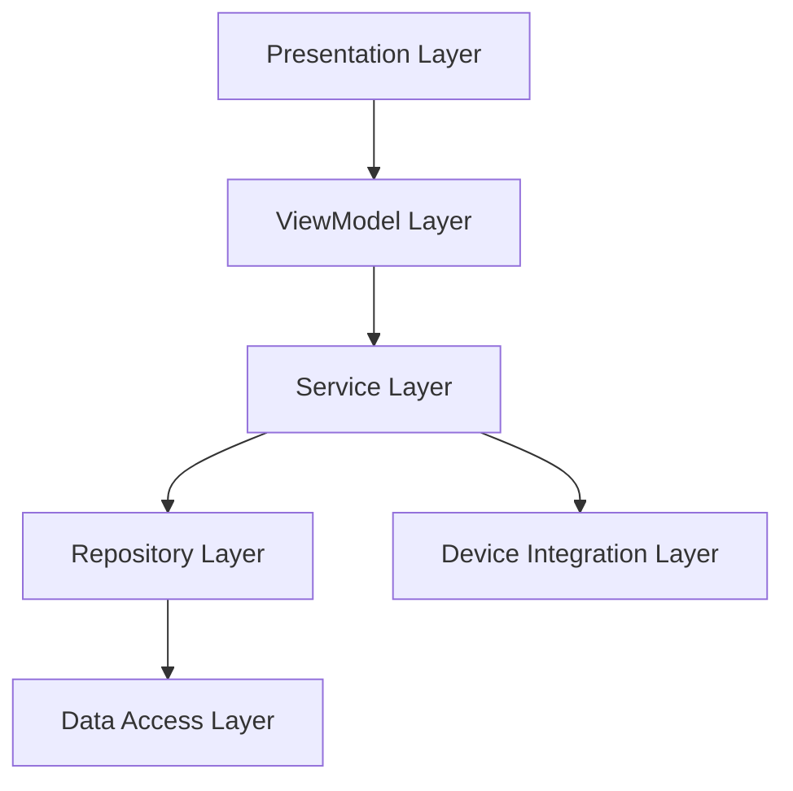
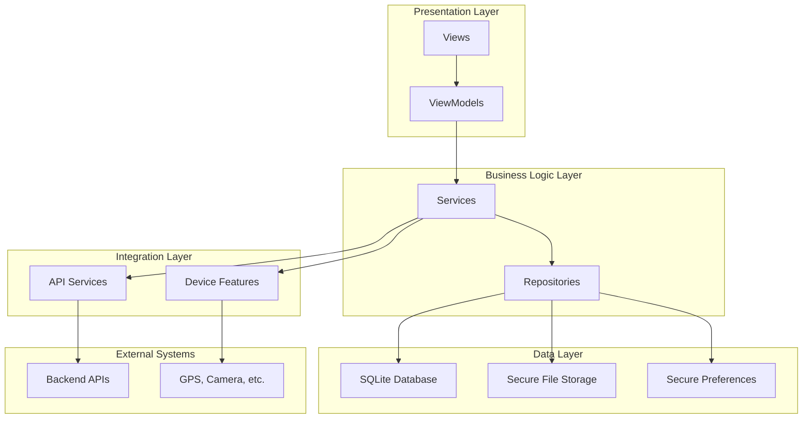
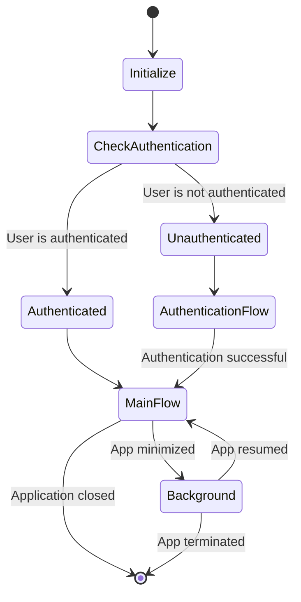
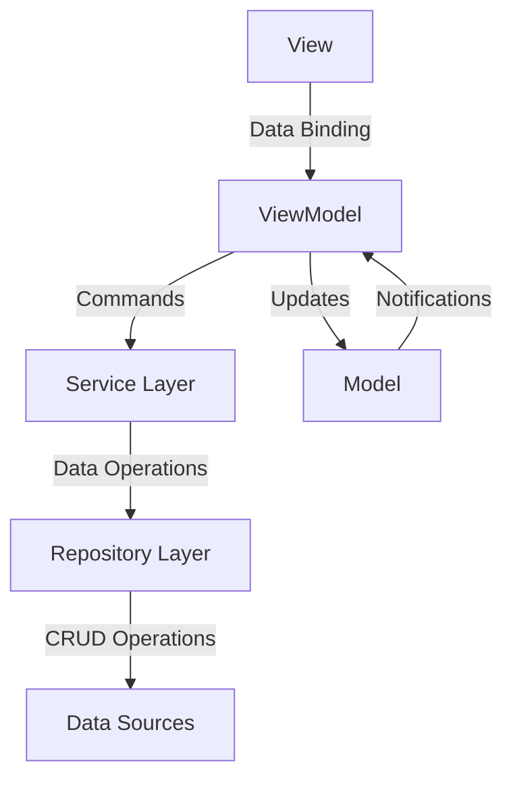
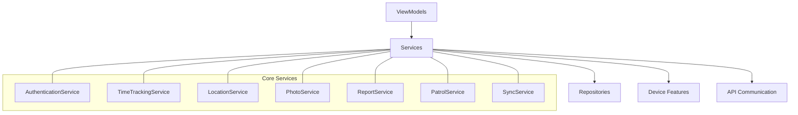
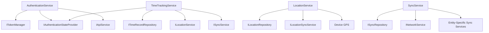
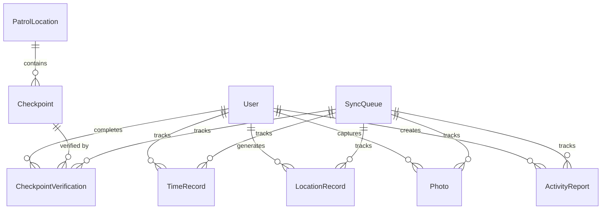
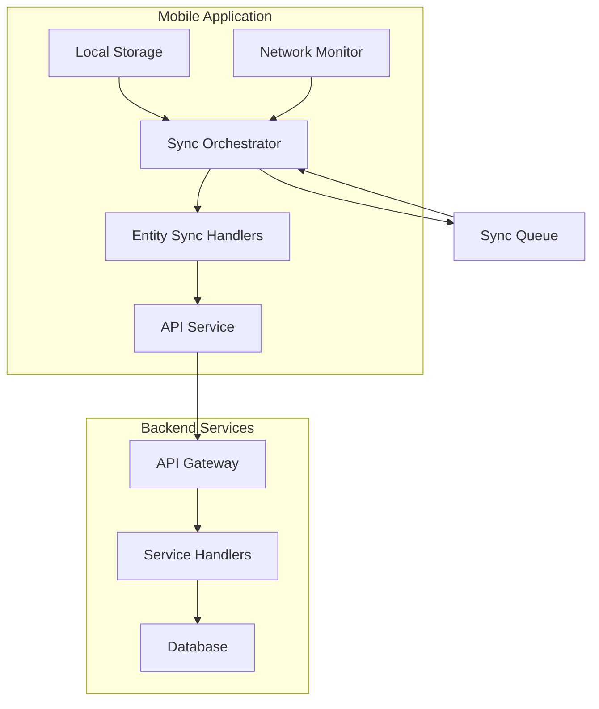

# Mobile Application Architecture

## Introduction

This document provides a comprehensive overview of the Security Patrol mobile application architecture. The application is built using .NET MAUI, primarily targeting Android devices, and implements a layered architecture with the MVVM pattern for separation of UI and business logic.

The architecture is designed to support the core requirements of the Security Patrol application, including:

- Phone number-based authentication with verification code
- Clock-in/out functionality with historical record keeping
- Continuous GPS location tracking during active shifts
- In-app photo capture and storage
- Activity reporting with note-taking capabilities
- Interactive patrol management with map-based checkpoint verification

This document details the architectural patterns, component structure, and design decisions that form the foundation of the mobile application.

### Purpose

The purpose of this document is to provide a detailed understanding of the Security Patrol mobile application architecture, including:

- The overall architectural approach and patterns
- The layered structure and component organization
- The implementation of the MVVM pattern
- The service-oriented design for business logic
- The data persistence and synchronization strategies
- The integration with device features and backend services

This document serves as a reference for developers working on the application and provides context for understanding the codebase structure and organization.

### Architectural Principles

The Security Patrol mobile application architecture is guided by several key principles:

1. **Mobile-First Design**: Optimized for Android devices with focus on battery efficiency, responsive UI, and offline capability
2. **Layered Architecture**: Clear separation between presentation, business logic, and data access layers
3. **MVVM Pattern**: Separation of UI (Views) from business logic (ViewModels) for maintainability and testability
4. **Service-Oriented Design**: Business logic encapsulated in services with clear interfaces
5. **Repository Pattern**: Data access abstracted through repositories for clean separation
6. **Offline-First Capability**: Local-first data operations with background synchronization
7. **Dependency Injection**: Loose coupling through interface-based design and DI container
8. **Security by Design**: Security integrated throughout the architecture

These principles inform the design decisions throughout the application architecture.

### Mobile Application Architecture Overview

The Security Patrol mobile application follows a mobile-first design philosophy, optimized specifically for Android devices with careful consideration of battery usage, responsive UI, and offline capabilities. The architecture enables security personnel to efficiently perform their duties even in areas with limited connectivity.

The application is structured with the following key characteristics:

1. **Android-First Development**: While built with .NET MAUI for potential cross-platform expansion, the current implementation focuses on optimizing the Android experience

2. **Battery-Efficient Design**: Careful implementation of location tracking, background services, and network operations to minimize battery drain during extended patrols

3. **Responsive Interface**: UI designed for quick interactions in the field, with clear visual feedback and intuitive navigation

4. **Offline-Focused**: All critical operations function without network connectivity, with background synchronization when connectivity is restored

5. **Security-Oriented**: Comprehensive security measures protect sensitive patrol data, authentication tokens, and location information

The application interfaces directly with device hardware (GPS, camera) while maintaining a clear separation between device-specific implementations and business logic through abstraction layers.

## Architectural Overview

The Security Patrol mobile application follows a layered architecture with the MVVM pattern, implemented using .NET MAUI for cross-platform compatibility with a focus on Android devices.

### Layered Architecture



The application is structured into the following layers:

1. **Presentation Layer**: XAML-based UI components (Views)
2. **ViewModel Layer**: MVVM implementation using CommunityToolkit.Mvvm
3. **Service Layer**: Business logic and orchestration
4. **Repository Layer**: Data access abstraction
5. **Data Access Layer**: SQLite and secure file storage implementation
6. **Device Integration Layer**: Access to device capabilities (GPS, camera)

This layered approach provides clear separation of concerns, enhancing maintainability and testability.

### Component Organization

The application is organized into the following component categories:

| Component Category | Purpose | Examples |
|-------------------|---------|----------|
| Views | User interface components | PhoneEntryPage, TimeTrackingPage, PatrolPage |
| ViewModels | UI state and behavior | AuthenticationViewModel, TimeTrackingViewModel |
| Services | Business logic | AuthenticationService, LocationService |
| Repositories | Data access | TimeRecordRepository, PhotoRepository |
| Models | Data structures | TimeRecordModel, LocationModel |
| Helpers | Utility functions | ValidationHelper, LocationHelper |
| Constants | Shared constants | ApiEndpoints, NavigationConstants |

Components are organized by type and responsibility, with clear dependencies between layers.

### High-Level Component Diagram



This diagram illustrates the high-level components of the application and their relationships, showing the flow of data and control through the layers.

### Application Lifecycle

The application lifecycle is managed through the App class, which handles initialization, state management, and navigation:



The App class initializes core services, checks authentication state, and directs the user to the appropriate flow based on their authentication status. It also handles transitions between foreground and background states.

## MVVM Implementation

The Security Patrol application implements the Model-View-ViewModel (MVVM) pattern using the CommunityToolkit.Mvvm package, providing a clean separation between UI and business logic.

### MVVM Pattern Overview



The MVVM pattern consists of three main components:

1. **Model**: Represents the data and business logic
2. **View**: Represents the UI elements
3. **ViewModel**: Acts as a mediator between the View and Model

This pattern enhances testability by decoupling the UI from business logic and improves maintainability through clear separation of concerns.

### BaseViewModel

All ViewModels in the application inherit from BaseViewModel, which provides common functionality:

```csharp
public abstract class BaseViewModel : ObservableObject, IDisposable
{
    protected readonly INavigationService NavigationService;
    protected readonly IAuthenticationStateProvider AuthenticationStateProvider;
    
    private string _title;
    public string Title
    {
        get => _title;
        set => SetProperty(ref _title, value);
    }
    
    private bool _isBusy;
    public bool IsBusy
    {
        get => _isBusy;
        set
        {
            SetProperty(ref _isBusy, value);
            IsNotBusy = !value;
        }
    }
    
    private bool _isNotBusy = true;
    public bool IsNotBusy
    {
        get => _isNotBusy;
        set => SetProperty(ref _isNotBusy, value);
    }
    
    private string _errorMessage;
    public string ErrorMessage
    {
        get => _errorMessage;
        set
        {
            SetProperty(ref _errorMessage, value);
            HasError = !string.IsNullOrEmpty(value);
        }
    }
    
    private bool _hasError;
    public bool HasError
    {
        get => _hasError;
        set => SetProperty(ref _hasError, value);
    }
    
    // Constructor, methods, and additional functionality
}
```

BaseViewModel provides:

- Property change notification through ObservableObject
- Navigation service access
- Authentication state access
- Busy indicator management
- Error handling and display
- Common lifecycle methods

### View-ViewModel Binding

Views are bound to ViewModels using XAML data binding:

```xml
<ContentPage xmlns="http://schemas.microsoft.com/dotnet/2021/maui"
             xmlns:x="http://schemas.microsoft.com/winfx/2009/xaml"
             xmlns:viewmodels="clr-namespace:SecurityPatrol.ViewModels"
             x:Class="SecurityPatrol.Views.TimeTrackingPage"
             Title="{Binding Title}">
    
    <ContentPage.BindingContext>
        <viewmodels:TimeTrackingViewModel />
    </ContentPage.BindingContext>
    
    <Grid>
        <ActivityIndicator IsRunning="{Binding IsBusy}" IsVisible="{Binding IsBusy}" />
        
        <StackLayout IsVisible="{Binding IsNotBusy}">
            <Label Text="Current Status" />
            <Label Text="{Binding CurrentStatus}" />
            
            <Button Text="Clock In" Command="{Binding ClockInCommand}" IsVisible="{Binding IsClockInVisible}" />
            <Button Text="Clock Out" Command="{Binding ClockOutCommand}" IsVisible="{Binding IsClockOutVisible}" />
            
            <Label Text="{Binding ErrorMessage}" IsVisible="{Binding HasError}" TextColor="Red" />
        </StackLayout>
    </Grid>
</ContentPage>
```

In practice, ViewModels are injected through dependency injection rather than created directly in XAML.

### Commands

User interactions are encapsulated as commands using the CommunityToolkit.Mvvm RelayCommand:

```csharp
public class TimeTrackingViewModel : BaseViewModel
{
    private readonly ITimeTrackingService _timeTrackingService;
    
    public IRelayCommand ClockInCommand { get; }
    public IRelayCommand ClockOutCommand { get; }
    
    public TimeTrackingViewModel(INavigationService navigationService, 
                               IAuthenticationStateProvider authStateProvider,
                               ITimeTrackingService timeTrackingService)
        : base(navigationService, authStateProvider)
    {
        _timeTrackingService = timeTrackingService;
        
        ClockInCommand = new AsyncRelayCommand(ClockInAsync, CanClockIn);
        ClockOutCommand = new AsyncRelayCommand(ClockOutAsync, CanClockOut);
    }
    
    private async Task ClockInAsync()
    {
        await ExecuteWithBusyIndicator(async () =>
        {
            var result = await _timeTrackingService.ClockIn();
            // Handle result
        });
    }
    
    private bool CanClockIn() => !IsClocked;
    
    // Additional methods and properties
}
```

Commands provide a clean way to handle user interactions while maintaining separation between UI and business logic.

### Navigation Service

Navigation between pages is handled through the INavigationService interface:

```csharp
public interface INavigationService
{
    Task NavigateToAsync(string route, Dictionary<string, object> parameters = null);
    Task NavigateBackAsync();
    Task NavigateToRootAsync();
    Task NavigateToModalAsync(string route, Dictionary<string, object> parameters = null);
    Task CloseModalAsync();
}
```

This abstraction allows ViewModels to trigger navigation without direct coupling to the UI framework, enhancing testability and maintainability.

### Dependency Injection

The application uses dependency injection to compose components and manage their lifecycle:

```csharp
public static class MauiProgram
{
    public static MauiApp CreateMauiApp()
    {
        var builder = MauiApp.CreateBuilder();
        builder
            .UseMauiApp<App>()
            .ConfigureFonts(fonts =>
            {
                fonts.AddFont("OpenSans-Regular.ttf", "OpenSansRegular");
                fonts.AddFont("OpenSans-Semibold.ttf", "OpenSansSemibold");
            });

        // Register services
        ConfigureServices(builder.Services);
        
        // Register ViewModels
        ConfigureViewModels(builder.Services);
        
        return builder.Build();
    }
    
    private static void ConfigureServices(IServiceCollection services)
    {
        // Register singleton services
        services.AddSingleton<IAuthenticationStateProvider, AuthenticationStateProvider>();
        services.AddSingleton<ISettingsService, SettingsService>();
        services.AddSingleton<IDatabaseService, DatabaseService>();
        services.AddSingleton<INetworkService, NetworkService>();
        
        // Register transient services
        services.AddTransient<INavigationService, NavigationService>();
        services.AddTransient<IApiService, ApiService>();
        
        // Register scoped services
        services.AddScoped<IAuthenticationService, AuthenticationService>();
        services.AddScoped<ITimeTrackingService, TimeTrackingService>();
        services.AddScoped<ILocationService, LocationService>();
        services.AddScoped<IPhotoService, PhotoService>();
        services.AddScoped<IReportService, ReportService>();
        services.AddScoped<IPatrolService, PatrolService>();
        services.AddScoped<ISyncService, SyncService>();
    }
    
    private static void ConfigureViewModels(IServiceCollection services)
    {
        services.AddTransient<AuthenticationViewModel>();
        services.AddTransient<PhoneEntryViewModel>();
        services.AddTransient<TimeTrackingViewModel>();
        services.AddTransient<PatrolViewModel>();
        services.AddTransient<PhotoCaptureViewModel>();
        services.AddTransient<ActivityReportViewModel>();
        services.AddTransient<MainViewModel>();
    }
}
```

Dependency injection enhances testability by allowing components to be replaced with mocks during testing and improves maintainability by centralizing component composition.

## Service Layer

The Service Layer contains the core business logic of the application, orchestrating operations between the UI and data layers.

### Service-Oriented Design

The application follows a service-oriented design where business logic is encapsulated in services with clear interfaces:



Each service is responsible for a specific domain of functionality and exposes a clear interface for consumers.

### Authentication Service

The Authentication Service manages user authentication and session state:

```csharp
public interface IAuthenticationService
{
    Task<bool> RequestVerificationCode(string phoneNumber);
    Task<bool> VerifyCode(string code);
    Task<AuthState> GetAuthenticationState();
    Task Logout();
    Task<bool> RefreshToken();
}
```

This service handles phone number verification, token management, and authentication state tracking.

### Location Service

The Location Service manages GPS tracking and location data:

```csharp
public interface ILocationService
{
    Task StartTracking();
    Task StopTracking();
    Task<LocationModel> GetCurrentLocation();
    bool IsTracking { get; }
    event EventHandler<LocationChangedEventArgs> LocationChanged;
}
```

This service handles continuous location tracking during active shifts, providing real-time location updates and managing the device's GPS capabilities.

### Time Tracking Service

The Time Tracking Service manages clock in/out operations and history:

```csharp
public interface ITimeTrackingService
{
    Task<TimeRecordModel> ClockIn();
    Task<TimeRecordModel> ClockOut();
    Task<ClockStatus> GetCurrentStatus();
    Task<IEnumerable<TimeRecordModel>> GetHistory(int count);
    event EventHandler<ClockStatusChangedEventArgs> StatusChanged;
}
```

This service handles work shift tracking, maintaining a history of clock events and coordinating with the Location Service to start and stop location tracking.

### Patrol Service

The Patrol Service manages checkpoint data and verification:

```csharp
public interface IPatrolService
{
    Task<IEnumerable<LocationModel>> GetLocations();
    Task<IEnumerable<CheckpointModel>> GetCheckpoints(int locationId);
    Task<bool> VerifyCheckpoint(int checkpointId);
    Task<PatrolStatus> GetPatrolStatus(int locationId);
    event EventHandler<CheckpointProximityEventArgs> CheckpointProximityChanged;
}
```

This service handles patrol routes, checkpoint data, proximity detection, and verification of checkpoint completion.

### Photo Service

The Photo Service manages camera access and photo storage:

```csharp
public interface IPhotoService
{
    Task<PhotoModel> CapturePhoto();
    Task<IEnumerable<PhotoModel>> GetStoredPhotos();
    Task<Stream> GetPhotoFile(string id);
    Task<bool> DeletePhoto(string id);
}
```

This service handles camera integration, photo capture, secure storage, and management of captured images.

### Report Service

The Report Service manages activity report creation and management:

```csharp
public interface IReportService
{
    Task<ReportModel> CreateReport(string text);
    Task<IEnumerable<ReportModel>> GetReports();
    Task<bool> DeleteReport(int id);
}
```

This service handles the creation, storage, and management of activity reports created by security personnel.

### Sync Service

The Sync Service manages data synchronization with backend services:

```csharp
public interface ISyncService
{
    Task<SyncResult> SyncAll(CancellationToken cancellationToken = default);
    Task<bool> SyncEntity(string entityType, string entityId, CancellationToken cancellationToken = default);
    void ScheduleSync(TimeSpan interval);
    void CancelScheduledSync();
    bool IsSyncing { get; }
    event EventHandler<SyncStatusChangedEventArgs> SyncStatusChanged;
}
```

This service orchestrates the synchronization of different entity types, implements resilience patterns, and provides status updates to the UI.

### Service Dependencies

Services have dependencies on other services and components:



These dependencies are injected through constructors, enabling loose coupling and testability.

## Data Persistence

The Security Patrol application uses multiple storage mechanisms to persist different types of data, with a focus on offline capability and data security.

### Storage Mechanisms

The application uses multiple storage mechanisms optimized for different data types:

| Data Type | Storage Mechanism | Purpose | Encryption |
|-----------|-------------------|---------|------------|
| Structured Data | SQLite Database | Store entities and relationships | Yes |
| Binary Data (Photos) | File System | Store captured images | Yes |
| Authentication Tokens | Secure Storage | Store sensitive authentication data | Platform-specific |
| Application Settings | Preferences | Store user preferences and app settings | No |

Each storage mechanism is chosen based on the nature of the data and security requirements.

### Repository Pattern

Data access is abstracted through the Repository pattern:

```csharp
public interface ITimeRecordRepository
{
    Task<int> SaveTimeRecord(TimeRecordEntity record);
    Task<IEnumerable<TimeRecordEntity>> GetTimeRecords(int count);
    Task<IEnumerable<TimeRecordEntity>> GetPendingRecords();
    Task UpdateSyncStatus(int id, bool isSynced);
}

public class TimeRecordRepository : ITimeRecordRepository
{
    private readonly IDatabaseService _databaseService;
    private readonly ILogger<TimeRecordRepository> _logger;
    
    public TimeRecordRepository(IDatabaseService databaseService, ILogger<TimeRecordRepository> logger)
    {
        _databaseService = databaseService;
        _logger = logger;
    }
    
    public async Task<int> SaveTimeRecord(TimeRecordEntity record)
    {
        try
        {
            var connection = await _databaseService.GetConnectionAsync();
            if (record.Id == 0)
            {
                return await connection.InsertAsync(record);
            }
            else
            {
                await connection.UpdateAsync(record);
                return record.Id;
            }
        }
        catch (Exception ex)
        {
            _logger.LogError(ex, "Error saving time record");
            throw;
        }
    }
    
    // Additional repository methods
}
```

The Repository pattern provides a clean separation between business logic and data access details, enhancing maintainability and testability.

### Database Schema

The SQLite database schema includes the following tables:



The schema is designed to support the core functionality of the application while enabling offline operation and synchronization.

### Database Initialization

The database is initialized during application startup:

```csharp
public class DatabaseInitializer : IDatabaseInitializer
{
    private readonly ILogger<DatabaseInitializer> _logger;
    private SQLiteAsyncConnection _connection;
    private readonly MigrationManager _migrationManager;
    private string _databasePath;
    private bool _isInitialized;
    private readonly object _initializationLock = new object();
    
    public DatabaseInitializer(ILogger<DatabaseInitializer> logger)
    {
        _logger = logger;
        _migrationManager = new MigrationManager(logger);
        _isInitialized = false;
        _databasePath = Path.Combine(FileSystem.AppDataDirectory, DatabaseConstants.DatabaseName);
    }
    
    public async Task InitializeAsync()
    {
        if (_isInitialized)
            return;
            
        lock (_initializationLock)
        {
            if (_isInitialized)
                return;
                
            _logger.LogInformation("Initializing database");
            
            // Ensure directory exists
            EnsureDatabaseDirectoryExistsAsync().Wait();
            
            // Create connection if not already created
            if (_connection == null)
            {
                CreateDatabaseConnectionAsync().Wait();
            }
            
            // Create tables if they don't exist
            CreateTablesAsync().Wait();
            
            // Apply any pending migrations
            ApplyMigrationsAsync(_connection).Wait();
            
            _isInitialized = true;
            _logger.LogInformation("Database initialization complete");
        }
    }
    
    // Additional initialization methods
}
```

The initialization process creates the database if it doesn't exist, creates tables, and applies any pending migrations to ensure the schema is up-to-date.

### Data Migration

The application implements a version-based migration strategy for schema evolution:

```csharp
public class MigrationManager
{
    private readonly ILogger _logger;
    private readonly List<IMigration> _migrations;
    
    public MigrationManager(ILogger logger)
    {
        _logger = logger;
        _migrations = new List<IMigration>
        {
            new Migration_1_0(),
            new Migration_1_1()
            // Add new migrations here
        };
    }
    
    public async Task ApplyMigrationsAsync(SQLiteAsyncConnection connection, double currentVersion)
    {
        _logger.LogInformation($"Applying migrations from version {currentVersion}");
        
        foreach (var migration in _migrations.OrderBy(m => m.Version))
        {
            if (migration.Version > currentVersion)
            {
                _logger.LogInformation($"Applying migration to version {migration.Version}");
                await migration.UpgradeAsync(connection);
                
                // Update database version
                await UpdateDatabaseVersionAsync(connection, migration.Version);
                
                _logger.LogInformation($"Migration to version {migration.Version} complete");
            }
        }
    }
    
    // Additional migration methods
}
```

This approach allows the database schema to evolve over time while ensuring backward compatibility with existing data.

### Secure Storage

Sensitive data such as authentication tokens are stored using platform-specific secure storage:

```csharp
public class TokenManager : ITokenManager
{
    private const string TokenKey = "auth_token";
    private const string RefreshTokenKey = "refresh_token";
    private const string TokenExpiryKey = "token_expiry";
    
    public async Task StoreToken(string token, string refreshToken, DateTime expiresAt)
    {
        await SecureStorage.SetAsync(TokenKey, token);
        await SecureStorage.SetAsync(RefreshTokenKey, refreshToken);
        await SecureStorage.SetAsync(TokenExpiryKey, expiresAt.ToString("o"));
    }
    
    public async Task<string> RetrieveToken()
    {
        return await SecureStorage.GetAsync(TokenKey);
    }
    
    public async Task<string> RetrieveRefreshToken()
    {
        return await SecureStorage.GetAsync(RefreshTokenKey);
    }
    
    public async Task<DateTime?> RetrieveTokenExpiry()
    {
        var expiryString = await SecureStorage.GetAsync(TokenExpiryKey);
        if (string.IsNullOrEmpty(expiryString))
            return null;
            
        return DateTime.Parse(expiryString);
    }
    
    public async Task ClearToken()
    {
        SecureStorage.Remove(TokenKey);
        SecureStorage.Remove(RefreshTokenKey);
        SecureStorage.Remove(TokenExpiryKey);
        await Task.CompletedTask;
    }
    
    public async Task<bool> IsTokenValid()
    {
        var token = await RetrieveToken();
        var expiry = await RetrieveTokenExpiry();
        
        return !string.IsNullOrEmpty(token) && expiry.HasValue && expiry.Value > DateTime.UtcNow;
    }
}
```

Secure Storage leverages platform-specific security features to protect sensitive data from unauthorized access.

## Offline Operation and Synchronization

The Security Patrol application implements an offline-first approach, allowing full functionality without network connectivity, with eventual synchronization when connectivity is restored.

### Local-First Approach

The application implements a local-first approach where:

1. All user actions are immediately processed locally
2. Data is stored in local SQLite database and secure file storage
3. UI provides immediate feedback based on local data
4. Synchronization occurs in the background when connectivity is available
5. Network status is clearly indicated to users

This approach ensures that security personnel can continue their work without interruption, regardless of network conditions.

### Synchronization Architecture

The synchronization architecture consists of several components working together:



- **SyncService**: Central orchestrator that manages the overall synchronization process
- **Entity-Specific Sync Services**: Handle type-specific synchronization logic
- **NetworkService**: Monitors connectivity changes and triggers sync when available
- **SyncRepository**: Manages the queue of items pending synchronization
- **ApiService**: Handles communication with backend services

This architecture ensures reliable data synchronization even in challenging network environments.

### Network Connectivity Monitoring

The application actively monitors network connectivity to adapt its behavior:

```csharp
public class NetworkService : INetworkService
{
    private readonly ILogger<NetworkService> _logger;
    private bool _isMonitoring;
    
    public bool IsConnected { get; private set; }
    
    public event EventHandler<ConnectivityChangedEventArgs> ConnectivityChanged;
    
    public NetworkService(ILogger<NetworkService> logger)
    {
        _logger = logger;
        _isMonitoring = false;
        IsConnected = ConnectivityHelper.IsConnected();
    }
    
    public void StartMonitoring()
    {
        if (_isMonitoring)
            return;
            
        ConnectivityHelper.RegisterForConnectivityChanges(HandleConnectivityChanged);
        _isMonitoring = true;
        _logger.LogInformation("Network monitoring started");
    }
    
    private void HandleConnectivityChanged(ConnectivityChangedEventArgs args)
    {
        IsConnected = args.IsConnected;
        ConnectivityChanged?.Invoke(this, args);
        _logger.LogInformation($"Connectivity changed: {(IsConnected ? "Connected" : "Disconnected")}");
    }
    
    // Additional network-related methods
}
```

This service provides real-time information about connectivity status and notifies other components when connectivity changes.

### Resilience Patterns

The application implements several resilience patterns:

1. **Retry Policies**: Automatic retry with exponential backoff for transient failures
2. **Circuit Breaker**: Prevents repeated calls to failing services
3. **Fallback Mechanisms**: Graceful degradation when services are unavailable
4. **Conflict Resolution**: Server-wins strategy with merge capabilities
5. **Error Isolation**: Prevents cascading failures across the application

These patterns ensure reliable operation even in challenging network environments.

### Data Validation and Conflict Resolution

The application implements client-side validation and conflict resolution:

1. **Input Validation**: All user inputs are validated locally before storage
2. **Business Rule Enforcement**: Business rules are enforced on the client side
3. **Timestamp-Based Resolution**: Changes include timestamps for conflict detection
4. **Entity Version Tracking**: Version numbers help detect conflicts
5. **Server Authority Strategy**: In conflicts, server data typically takes precedence
6. **Field-Level Merging**: Where possible, non-conflicting fields are merged

These mechanisms ensure data integrity and consistency across devices and the backend.

## Device Integration

The Security Patrol application integrates with various device features to provide core functionality.

### Location Services

The application integrates with device GPS capabilities for location tracking:

```csharp
public class LocationService : ILocationService
{
    private readonly ILocationRepository _locationRepository;
    private readonly ILocationSyncService _locationSyncService;
    private readonly ILogger<LocationService> _logger;
    private bool _isTracking;
    private CancellationTokenSource _trackingCancellation;
    
    public bool IsTracking => _isTracking;
    
    public event EventHandler<LocationChangedEventArgs> LocationChanged;
    
    public LocationService(ILocationRepository locationRepository, 
                          ILocationSyncService locationSyncService,
                          ILogger<LocationService> logger)
    {
        _locationRepository = locationRepository;
        _locationSyncService = locationSyncService;
        _logger = logger;
        _isTracking = false;
    }
    
    public async Task StartTracking()
    {
        if (_isTracking)
            return;
            
        // Request location permissions if not granted
        var status = await PermissionHelper.CheckAndRequestLocationPermission();
        if (status != PermissionStatus.Granted)
        {
            throw new UnauthorizedAccessException("Location permission is required for tracking");
        }
        
        _trackingCancellation = new CancellationTokenSource();
        _isTracking = true;
        
        // Start tracking in background
        _ = Task.Run(() => TrackLocationAsync(_trackingCancellation.Token));
        
        _logger.LogInformation("Location tracking started");
    }
    
    public async Task StopTracking()
    {
        if (!_isTracking)
            return;
            
        _trackingCancellation?.Cancel();
        _isTracking = false;
        
        _logger.LogInformation("Location tracking stopped");
        await Task.CompletedTask;
    }
    
    public async Task<LocationModel> GetCurrentLocation()
    {
        // Request location permissions if not granted
        var status = await PermissionHelper.CheckAndRequestLocationPermission();
        if (status != PermissionStatus.Granted)
        {
            throw new UnauthorizedAccessException("Location permission is required");
        }
        
        try
        {
            var request = new GeolocationRequest(GeolocationAccuracy.Medium, TimeSpan.FromSeconds(10));
            var location = await Geolocation.GetLocationAsync(request);
            
            if (location == null)
                throw new Exception("Unable to get current location");
                
            return new LocationModel
            {
                Latitude = location.Latitude,
                Longitude = location.Longitude,
                Accuracy = location.Accuracy,
                Timestamp = DateTime.UtcNow
            };
        }
        catch (Exception ex)
        {
            _logger.LogError(ex, "Error getting current location");
            throw;
        }
    }
    
    private async Task TrackLocationAsync(CancellationToken cancellationToken)
    {
        try
        {
            // Configure location tracking
            var request = new GeolocationRequest(GeolocationAccuracy.Medium, TimeSpan.FromSeconds(30));
            
            while (!cancellationToken.IsCancellationRequested)
            {
                try
                {
                    var location = await Geolocation.GetLocationAsync(request, cancellationToken);
                    
                    if (location != null)
                    {
                        var locationModel = new LocationModel
                        {
                            Latitude = location.Latitude,
                            Longitude = location.Longitude,
                            Accuracy = location.Accuracy,
                            Timestamp = DateTime.UtcNow,
                            IsSynced = false
                        };
                        
                        // Save location to repository
                        await _locationRepository.SaveLocation(locationModel);
                        
                        // Notify subscribers
                        LocationChanged?.Invoke(this, new LocationChangedEventArgs(locationModel));
                        
                        // Try to sync if appropriate
                        await _locationSyncService.TrySyncLocationsAsync();
                    }
                    
                    // Wait before next location check
                    await Task.Delay(TimeSpan.FromSeconds(30), cancellationToken);
                }
                catch (OperationCanceledException)
                {
                    // Expected when cancellation requested
                    break;
                }
                catch (Exception ex)
                {
                    _logger.LogError(ex, "Error during location tracking");
                    // Wait before retry
                    await Task.Delay(TimeSpan.FromSeconds(60), cancellationToken);
                }
            }
        }
        catch (OperationCanceledException)
        {
            // Expected when cancellation requested
        }
        catch (Exception ex)
        {
            _logger.LogError(ex, "Fatal error in location tracking");
            _isTracking = false;
        }
    }
}
```

The LocationService handles permission requests, continuous tracking, and efficient battery usage while providing location data to other components.

### Camera Integration

The application integrates with the device camera for photo capture:

```csharp
public class PhotoService : IPhotoService
{
    private readonly IPhotoRepository _photoRepository;
    private readonly IPhotoSyncService _photoSyncService;
    private readonly ILogger<PhotoService> _logger;
    
    public PhotoService(IPhotoRepository photoRepository, 
                       IPhotoSyncService photoSyncService,
                       ILogger<PhotoService> logger)
    {
        _photoRepository = photoRepository;
        _photoSyncService = photoSyncService;
        _logger = logger;
    }
    
    public async Task<PhotoModel> CapturePhoto()
    {
        // Request camera permissions if not granted
        var status = await PermissionHelper.CheckAndRequestCameraPermission();
        if (status != PermissionStatus.Granted)
        {
            throw new UnauthorizedAccessException("Camera permission is required");
        }
        
        try
        {
            // Capture photo using MediaPicker
            var photo = await MediaPicker.CapturePhotoAsync();
            if (photo == null)
                return null;
                
            // Get current location if available
            LocationModel location = null;
            try
            {
                var locationService = ServiceHelper.GetService<ILocationService>();
                location = await locationService.GetCurrentLocation();
            }
            catch (Exception ex)
            {
                _logger.LogWarning(ex, "Unable to get location for photo");
            }
            
            // Create photo model
            var photoModel = new PhotoModel
            {
                Id = Guid.NewGuid().ToString(),
                Timestamp = DateTime.UtcNow,
                Latitude = location?.Latitude,
                Longitude = location?.Longitude,
                IsSynced = false
            };
            
            // Process and save the photo
            using (var stream = await photo.OpenReadAsync())
            {
                // Compress image to reduce size
                var compressedStream = await ImageCompressor.CompressImageAsync(stream);
                
                // Save to repository
                await _photoRepository.SavePhoto(photoModel, compressedStream);
            }
            
            // Try to sync if appropriate
            await _photoSyncService.TrySyncPhotoAsync(photoModel.Id);
            
            return photoModel;
        }
        catch (Exception ex)
        {
            _logger.LogError(ex, "Error capturing photo");
            throw;
        }
    }
    
    // Additional photo service methods
}
```

The PhotoService handles permission requests, photo capture, image compression, and storage while integrating with location services for geo-tagging.

### Background Services

The application implements background services for continuous operation:

```csharp
public class BackgroundLocationService : IBackgroundService
{
    private readonly ILocationService _locationService;
    private readonly ILogger<BackgroundLocationService> _logger;
    private bool _isRunning;
    
    public BackgroundLocationService(ILocationService locationService, 
                                   ILogger<BackgroundLocationService> logger)
    {
        _locationService = locationService;
        _logger = logger;
        _isRunning = false;
    }
    
    public async Task Start()
    {
        if (_isRunning)
            return;
            
        try
        {
            await _locationService.StartTracking();
            _isRunning = true;
            _logger.LogInformation("Background location service started");
        }
        catch (Exception ex)
        {
            _logger.LogError(ex, "Error starting background location service");
            throw;
        }
    }
    
    public async Task Stop()
    {
        if (!_isRunning)
            return;
            
        try
        {
            await _locationService.StopTracking();
            _isRunning = false;
            _logger.LogInformation("Background location service stopped");
        }
        catch (Exception ex)
        {
            _logger.LogError(ex, "Error stopping background location service");
            throw;
        }
    }
    
    public bool IsRunning() => _isRunning;
}
```

Background services enable continuous operation even when the application is minimized, ensuring uninterrupted tracking and synchronization.

### Permissions Management

The application implements a centralized approach to permission management:

```csharp
public static class PermissionHelper
{
    public static async Task<PermissionStatus> CheckAndRequestLocationPermission()
    {
        var status = await Permissions.CheckStatusAsync<Permissions.LocationWhenInUse>();
        
        if (status != PermissionStatus.Granted)
        {
            status = await Permissions.RequestAsync<Permissions.LocationWhenInUse>();
        }
        
        return status;
    }
    
    public static async Task<PermissionStatus> CheckAndRequestBackgroundLocationPermission()
    {
        // First ensure foreground permission is granted
        var foregroundStatus = await CheckAndRequestLocationPermission();
        if (foregroundStatus != PermissionStatus.Granted)
            return foregroundStatus;
            
        var status = await Permissions.CheckStatusAsync<Permissions.LocationAlways>();
        
        if (status != PermissionStatus.Granted)
        {
            status = await Permissions.RequestAsync<Permissions.LocationAlways>();
        }
        
        return status;
    }
    
    public static async Task<PermissionStatus> CheckAndRequestCameraPermission()
    {
        var status = await Permissions.CheckStatusAsync<Permissions.Camera>();
        
        if (status != PermissionStatus.Granted)
        {
            status = await Permissions.RequestAsync<Permissions.Camera>();
        }
        
        return status;
    }
    
    public static async Task<PermissionStatus> CheckAndRequestStoragePermission()
    {
        var status = await Permissions.CheckStatusAsync<Permissions.StorageRead>();
        
        if (status != PermissionStatus.Granted)
        {
            status = await Permissions.RequestAsync<Permissions.StorageRead>();
        }
        
        var writeStatus = await Permissions.CheckStatusAsync<Permissions.StorageWrite>();
        
        if (writeStatus != PermissionStatus.Granted)
        {
            writeStatus = await Permissions.RequestAsync<Permissions.StorageWrite>();
        }
        
        // Return the most restrictive status
        return status < writeStatus ? status : writeStatus;
    }
}
```

This centralized approach ensures consistent permission handling throughout the application, with appropriate error handling and user feedback.

## API Integration

The Security Patrol application communicates with backend services through a unified API service layer.

### API Service

The API Service handles all HTTP communication with backend services:

```csharp
public class ApiService : IApiService
{
    private readonly ITokenManager _tokenManager;
    private readonly ILogger<ApiService> _logger;
    private readonly HttpClient _httpClient;
    private readonly JsonSerializerOptions _serializerOptions;
    
    public ApiService(ITokenManager tokenManager, ILogger<ApiService> logger)
    {
        _tokenManager = tokenManager;
        _logger = logger;
        _httpClient = new HttpClient();
        _httpClient.DefaultRequestHeaders.Accept.Add(new MediaTypeWithQualityHeaderValue("application/json"));
        
        _serializerOptions = new JsonSerializerOptions
        {
            PropertyNamingPolicy = JsonNamingPolicy.CamelCase,
            WriteIndented = false
        };
    }
    
    public async Task<T> GetAsync<T>(string endpoint, Dictionary<string, string> queryParams = null, bool requiresAuth = true)
    {
        try
        {
            var url = BuildUrl(endpoint, queryParams);
            
            if (requiresAuth)
            {
                await AddAuthenticationHeader();
            }
            
            var response = await _httpClient.GetAsync(url);
            return await ProcessResponse<T>(response);
        }
        catch (Exception ex)
        {
            _logger.LogError(ex, $"Error in GET request to {endpoint}");
            throw;
        }
    }
    
    public async Task<T> PostAsync<T>(string endpoint, object data, bool requiresAuth = true)
    {
        try
        {
            var url = BuildUrl(endpoint);
            var content = new StringContent(JsonSerializer.Serialize(data, _serializerOptions), Encoding.UTF8, "application/json");
            
            if (requiresAuth)
            {
                await AddAuthenticationHeader();
            }
            
            var response = await _httpClient.PostAsync(url, content);
            return await ProcessResponse<T>(response);
        }
        catch (Exception ex)
        {
            _logger.LogError(ex, $"Error in POST request to {endpoint}");
            throw;
        }
    }
    
    public async Task<T> PostMultipartAsync<T>(string endpoint, MultipartFormDataContent content, bool requiresAuth = true)
    {
        try
        {
            var url = BuildUrl(endpoint);
            
            if (requiresAuth)
            {
                await AddAuthenticationHeader();
            }
            
            var response = await _httpClient.PostAsync(url, content);
            return await ProcessResponse<T>(response);
        }
        catch (Exception ex)
        {
            _logger.LogError(ex, $"Error in multipart POST request to {endpoint}");
            throw;
        }
    }
    
    // Additional API methods and helper functions
    
    private async Task AddAuthenticationHeader()
    {
        var token = await _tokenManager.RetrieveToken();
        if (string.IsNullOrEmpty(token))
        {
            throw new UnauthorizedException("No authentication token available");
        }
        
        _httpClient.DefaultRequestHeaders.Authorization = new AuthenticationHeaderValue("Bearer", token);
    }
    
    private async Task<T> ProcessResponse<T>(HttpResponseMessage response)
    {
        if (response.IsSuccessStatusCode)
        {
            var content = await response.Content.ReadAsStringAsync();
            return JsonSerializer.Deserialize<T>(content, _serializerOptions);
        }
        
        // Handle error responses
        await HandleErrorResponse(response);
        
        // This will never be reached due to exception in HandleErrorResponse
        return default;
    }
    
    private async Task HandleErrorResponse(HttpResponseMessage response)
    {
        var content = await response.Content.ReadAsStringAsync();
        
        switch (response.StatusCode)
        {
            case HttpStatusCode.Unauthorized:
                throw new UnauthorizedException("Authentication failed");
                
            case HttpStatusCode.NotFound:
                throw new NotFoundException("Resource not found");
                
            case HttpStatusCode.BadRequest:
                throw new ValidationException(content);
                
            default:
                throw new ApiException($"API error: {response.StatusCode}", content);
        }
    }
}
```

The ApiService provides a unified interface for all API communication, handling authentication, serialization, error handling, and retry logic.

### API Endpoints

The application communicates with several backend API endpoints:

| Endpoint | Method | Purpose |
|----------|--------|---------|
| `/auth/verify` | POST | Request verification code |
| `/auth/validate` | POST | Validate verification code |
| `/auth/refresh` | POST | Refresh authentication token |
| `/time/clock` | POST | Record clock in/out events |
| `/time/history` | GET | Retrieve clock history |
| `/location/batch` | POST | Upload location data batch |
| `/photos/upload` | POST | Upload captured photos |
| `/reports` | POST | Submit activity reports |
| `/patrol/locations` | GET | Get available patrol locations |
| `/patrol/checkpoints` | GET | Get checkpoints for location |
| `/patrol/verify` | POST | Verify checkpoint completion |

These endpoints are defined as constants in the application:

### Error Handling

The application implements a comprehensive approach to API error handling:

```csharp
public class ApiException : Exception
{
    public string ResponseContent { get; }
    
    public ApiException(string message, string responseContent) : base(message)
    {
        ResponseContent = responseContent;
    }
}

public class UnauthorizedException : Exception
{
    public UnauthorizedException(string message) : base(message)
    {
    }
}

public class NotFoundException : Exception
{
    public NotFoundException(string message) : base(message)
    {
    }
}

public class ValidationException : Exception
{
    public string ValidationErrors { get; }
    
    public ValidationException(string validationErrors) : base("Validation failed")
    {
        ValidationErrors = validationErrors;
    }
}
```

These exception types allow the application to handle different error scenarios appropriately, providing meaningful feedback to users and enabling appropriate recovery actions.

### Retry Policies

The application implements retry policies for API communication using the Polly library:

```csharp
private readonly AsyncRetryPolicy _retryPolicy;

public ApiService(ITokenManager tokenManager, ILogger<ApiService> logger)
{
    // Other initialization
    
    // Define retry policy
    _retryPolicy = Policy
        .Handle<HttpRequestException>()
        .Or<TimeoutException>()
        .Or<TaskCanceledException>()
        .WaitAndRetryAsync(
            3, // Retry count
            retryAttempt => TimeSpan.FromSeconds(Math.Pow(2, retryAttempt)), // Exponential backoff
            (exception, timeSpan, retryCount, context) =>
            {
                _logger.LogWarning(exception, $"Retry {retryCount} after {timeSpan.TotalSeconds}s due to: {exception.Message}");
            });
}

public async Task<T> GetAsync<T>(string endpoint, Dictionary<string, string> queryParams = null, bool requiresAuth = true)
{
    return await _retryPolicy.ExecuteAsync(async () =>
    {
        // Existing implementation
    });
}
```

Retry policies enhance resilience by automatically retrying transient failures with appropriate backoff strategies.

## Security Considerations

The Security Patrol application implements several security measures to protect sensitive data and ensure secure operation.

### Authentication Security

The application implements secure authentication practices:

1. **Phone Verification**: Two-step verification using SMS codes
2. **Token-Based Authentication**: JWT tokens for API authentication
3. **Secure Token Storage**: Tokens stored in platform-specific secure storage
4. **Token Refresh**: Automatic token refresh before expiration
5. **Token Validation**: Validation of token integrity and expiration

These practices ensure that only authorized users can access the application and its features.

### Data Encryption

Sensitive data is encrypted both at rest and in transit:

1. **SQLite Encryption**: Database encrypted using SQLCipher
2. **File Encryption**: Photos and other files stored in encrypted form
3. **HTTPS**: All API communication uses TLS 1.2+
4. **Certificate Pinning**: Prevention of man-in-the-middle attacks

Encryption protects sensitive data from unauthorized access, even if the device is compromised.

### Secure Coding Practices

The application follows secure coding practices:

1. **Input Validation**: All user inputs and API responses are validated
2. **Error Handling**: Secure error handling prevents information leakage
3. **Dependency Management**: Third-party dependencies are managed securely
4. **Secure Configuration**: No hardcoded secrets or sensitive configuration
5. **Code Analysis**: Static analysis to identify security issues

These practices help prevent common security vulnerabilities and ensure the application's integrity.

### Permission Management

The application implements careful permission management:

1. **Minimal Permissions**: Only requesting permissions that are necessary
2. **Runtime Permissions**: Requesting permissions at the point of use
3. **Permission Rationale**: Clear explanation of why permissions are needed
4. **Graceful Degradation**: Handling denied permissions appropriately

This approach respects user privacy while ensuring the application can access necessary device features.

## Performance Considerations

The Security Patrol application implements various performance optimizations to ensure efficient operation on mobile devices.

### Battery Optimization

The application implements several battery optimization strategies:

1. **Adaptive Location Tracking**: Adjusts GPS polling frequency based on movement and battery level
2. **Batch Processing**: Groups operations to reduce wake cycles
3. **Efficient Background Services**: Minimizes background processing
4. **Network Optimization**: Batches network requests and compresses data
5. **Resource Cleanup**: Properly disposes of resources when not needed

These optimizations ensure minimal battery impact during extended use.

### Memory Management

The application implements careful memory management:

1. **Lazy Loading**: Data loaded only when needed
2. **Resource Disposal**: Disposable resources properly released
3. **Image Optimization**: Efficient loading and caching of images
4. **View Recycling**: Reuse of UI elements in lists
5. **Memory Monitoring**: Tracking and addressing memory leaks

These strategies prevent memory leaks and excessive memory usage.

### UI Performance

The application optimizes UI performance:

1. **Asynchronous Operations**: Long-running operations moved off the UI thread
2. **Virtualization**: Efficient rendering of large lists
3. **Image Caching**: Caching of images to prevent reloading
4. **Incremental Loading**: Loading data in chunks as needed
5. **UI Throttling**: Limiting UI updates during rapid data changes

These optimizations ensure a responsive user interface even during intensive operations.

### Database Optimization

The application optimizes database operations:

1. **Indexed Queries**: Strategic indexing for frequent queries
2. **Batch Operations**: Grouping database operations for efficiency
3. **Connection Management**: Proper handling of database connections
4. **Query Optimization**: Efficient query design
5. **Data Pruning**: Regular cleanup of old data

These optimizations ensure efficient data access and storage.

## Testing Approach

The Security Patrol application implements a comprehensive testing strategy to ensure reliability and quality.

### Unit Testing

Unit tests verify the behavior of individual components:

```csharp
[Fact]
public async Task AuthenticationService_VerifyCode_WithValidCode_ReturnsTrue()
{
    // Arrange
    var mockApiService = new Mock<IApiService>();
    var mockTokenManager = new Mock<ITokenManager>();
    var mockAuthStateProvider = new Mock<IAuthenticationStateProvider>();
    var mockLogger = new Mock<ILogger<AuthenticationService>>();
    
    mockApiService
        .Setup(x => x.PostAsync<AuthenticationResponse>(It.IsAny<string>(), It.IsAny<object>(), It.IsAny<bool>()))
        .ReturnsAsync(new AuthenticationResponse { Token = "test-token", ExpiresAt = DateTime.UtcNow.AddHours(1) });
    
    var service = new AuthenticationService(
        mockApiService.Object,
        mockTokenManager.Object,
        mockAuthStateProvider.Object,
        mockLogger.Object);
    
    // Set up state for verification
    service.PhoneNumber = "1234567890";
    
    // Act
    var result = await service.VerifyCode("123456");
    
    // Assert
    Assert.True(result);
    mockTokenManager.Verify(x => x.StoreToken(It.IsAny<string>(), It.IsAny<DateTime>()), Times.Once);
    mockAuthStateProvider.Verify(x => x.UpdateState(It.Is<AuthState>(s => s.IsAuthenticated)), Times.Once);
}
```

Unit tests focus on testing business logic in isolation, using mocks for dependencies.

### Integration Testing

Integration tests verify the interaction between components:

```csharp
[Fact]
public async Task TimeTrackingService_ClockIn_ShouldStartLocationTracking()
{
    // Arrange
    var mockLocationService = new Mock<ILocationService>();
    var repository = new TimeRecordRepository(databaseService, logger);
    var syncService = new Mock<ISyncService>().Object;
    var authStateProvider = new Mock<IAuthenticationStateProvider>().Object;
    
    var service = new TimeTrackingService(
        repository,
        mockLocationService.Object,
        syncService,
        authStateProvider,
        logger);
    
    // Act
    var result = await service.ClockIn();
    
    // Assert
    Assert.NotNull(result);
    Assert.Equal("ClockIn", result.Type);
    mockLocationService.Verify(x => x.StartTracking(), Times.Once);
}
```

Integration tests focus on verifying that components work together correctly.

### UI Testing

UI tests verify the user interface behavior:

```csharp
[Fact]
public async Task TimeTrackingPage_ClockInButton_ShouldCallViewModel()
{
    // Arrange
    var mockViewModel = new Mock<TimeTrackingViewModel>();
    mockViewModel.Setup(x => x.ClockInCommand).Returns(new AsyncRelayCommand(() => Task.CompletedTask));
    mockViewModel.Setup(x => x.IsClockInVisible).Returns(true);
    
    var page = new TimeTrackingPage
    {
        BindingContext = mockViewModel.Object
    };
    
    // Act
    await page.FindByName<Button>("ClockInButton").Command.ExecuteAsync(null);
    
    // Assert
    mockViewModel.Verify(x => x.ClockInCommand.ExecuteAsync(null), Times.Once);
}
```

UI tests focus on verifying that the user interface correctly interacts with ViewModels.

### End-to-End Testing

End-to-end tests verify complete user scenarios:

```csharp
[Fact]
public async Task User_ShouldBeAbleToCompletePatrol()
{
    // Arrange
    await LoginAsync("1234567890", "123456");
    await ClockInAsync();
    
    // Act - Navigate to patrol page
    await App.NavigateToAsync("patrol");
    
    // Select location
    await SelectLocationAsync("Main Building");
    
    // Verify checkpoints
    await VerifyCheckpointsAsync();
    
    // Assert
    var patrolStatus = await GetPatrolStatusAsync();
    Assert.Equal(100, patrolStatus.CompletionPercentage);
}
```

End-to-end tests focus on verifying complete user scenarios from start to finish.

## Conclusion

The Security Patrol mobile application architecture provides a robust foundation for a reliable, maintainable, and secure application. The architecture follows industry best practices including layered design, MVVM pattern, service-oriented business logic, and comprehensive testing.

Key architectural strengths include:

1. **Clear Separation of Concerns**: The layered architecture with MVVM pattern provides clear separation between UI, business logic, and data access
2. **Offline-First Approach**: The local-first data operations with background synchronization ensure reliable operation in various connectivity scenarios
3. **Service-Oriented Design**: Business logic encapsulated in services with clear interfaces enhances maintainability and testability
4. **Security by Design**: Comprehensive security measures protect sensitive data and ensure secure operation
5. **Performance Optimization**: Various optimizations ensure efficient operation on mobile devices

This architecture provides a solid foundation for the Security Patrol application, enabling it to meet the needs of security personnel in the field while maintaining high standards of quality, security, and performance.

## References

- [Data Flow Documentation](../architecture/data-flow.md)
- [.NET MAUI Documentation](https://docs.microsoft.com/dotnet/maui/)
- [MVVM Community Toolkit](https://docs.microsoft.com/dotnet/communitytoolkit/mvvm/)
- [SQLite-net Documentation](https://github.com/praeclarum/sqlite-net)