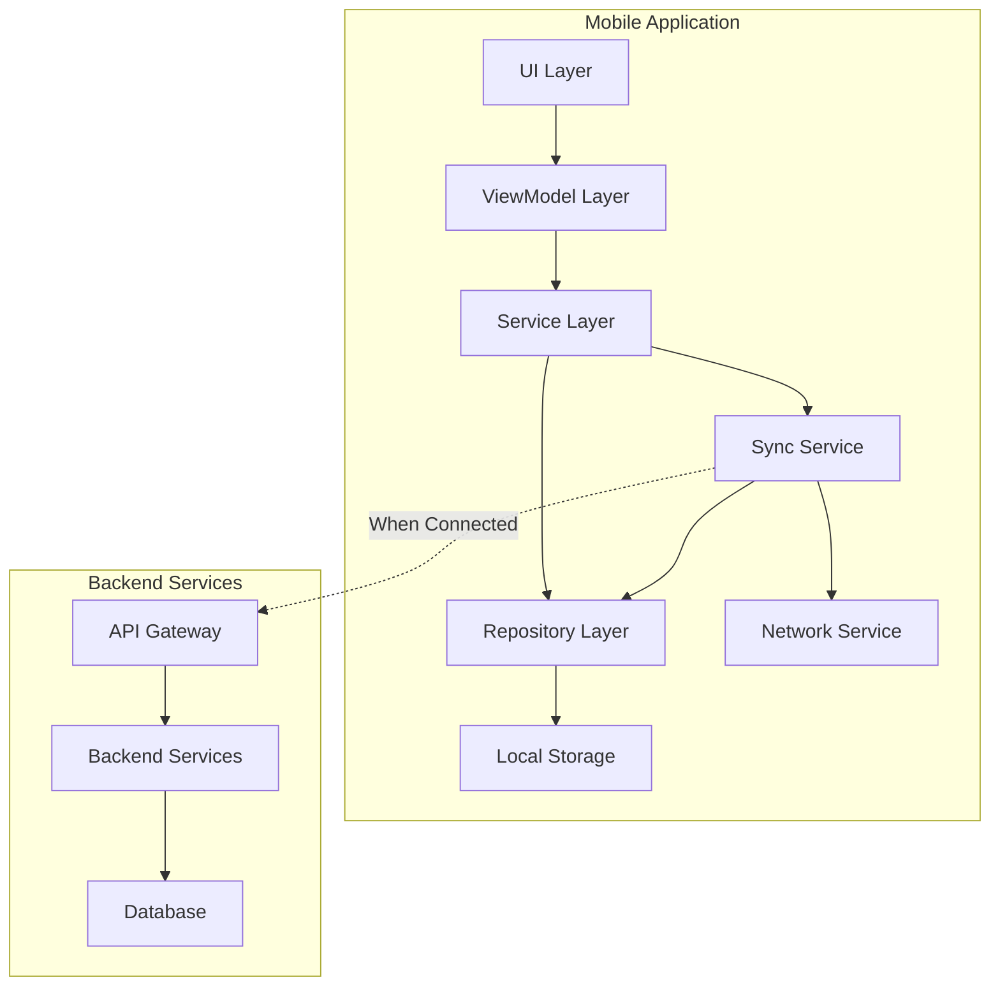
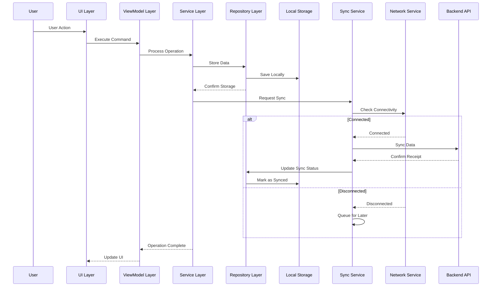
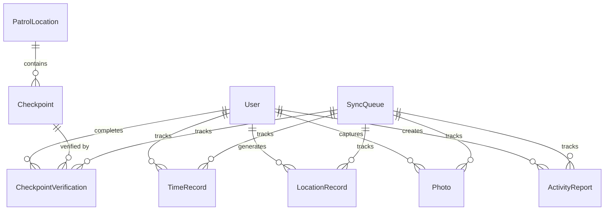
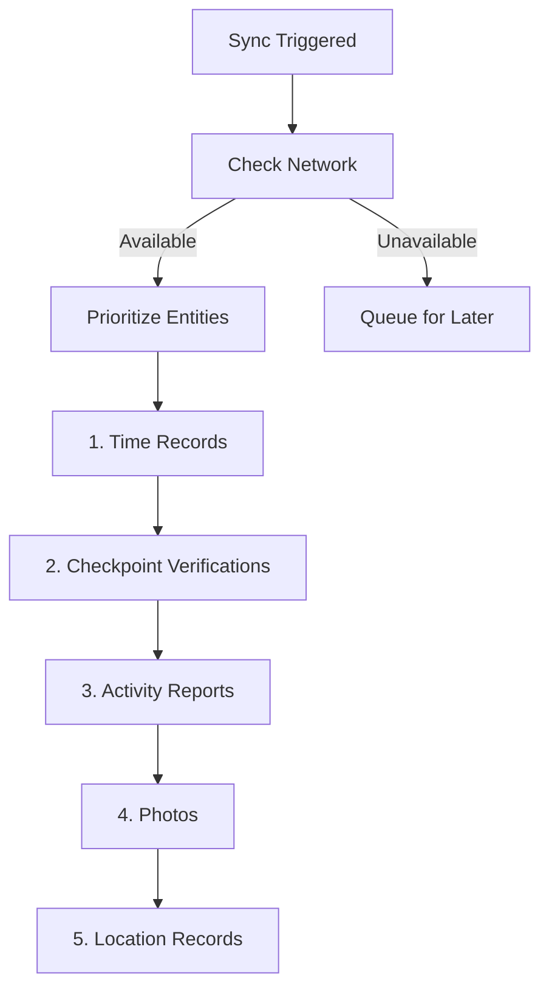
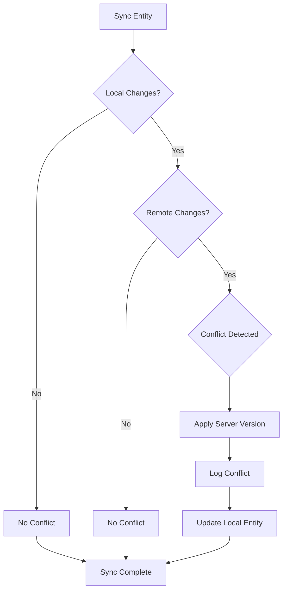
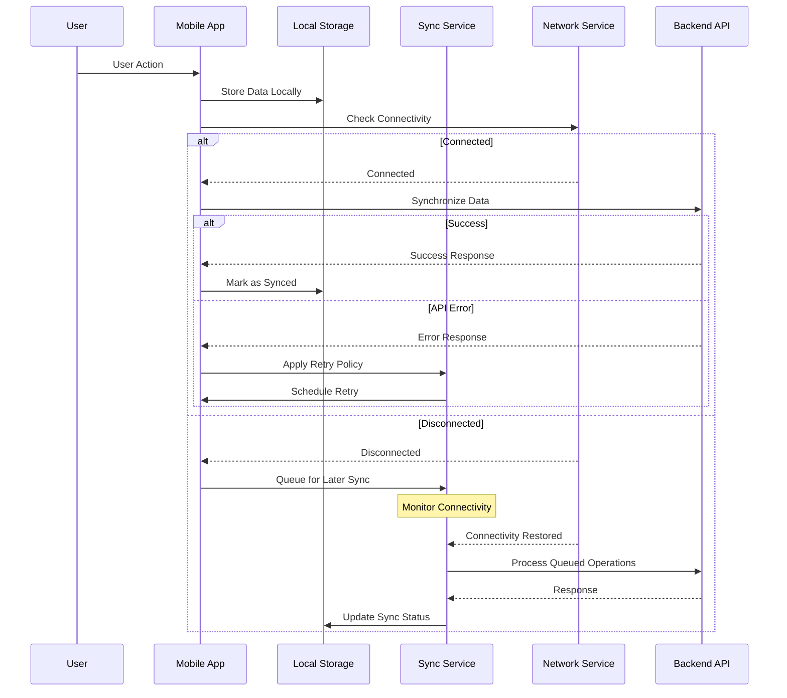
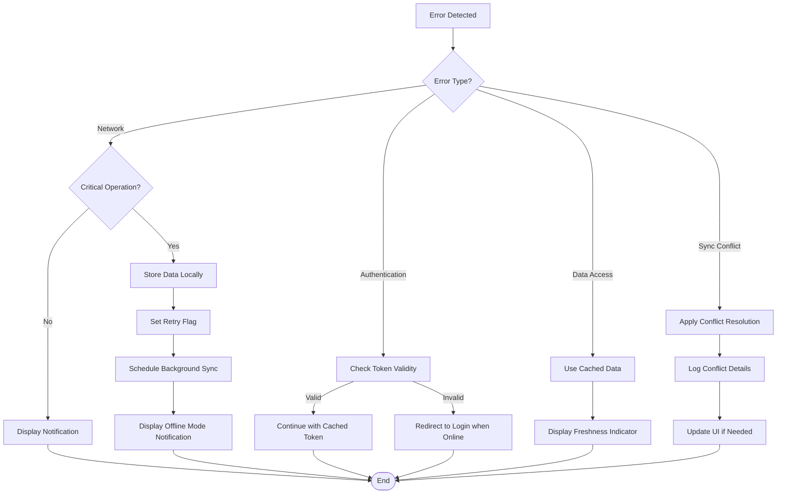

# Offline Operation

## Introduction

This document provides a comprehensive overview of the offline operation capabilities in the Security Patrol Application. It details how the application functions effectively without network connectivity, ensuring that security personnel can continue their work regardless of connectivity challenges.

The Security Patrol Application implements an offline-first approach, where all user actions are processed locally first, with synchronization to backend services occurring when connectivity is available. This approach ensures immediate responsiveness and full functionality even in areas with limited or no connectivity, which is essential for security personnel who may work in remote locations or buildings with poor signal coverage.

### Purpose

The purpose of this document is to provide a detailed understanding of:

- The offline-first architecture that enables operation without connectivity
- The local data storage mechanisms that support offline operation
- The synchronization processes that ensure data consistency when connectivity is restored
- The resilience patterns that handle network interruptions and failures
- The recovery mechanisms that maintain data integrity across connectivity transitions

This document serves as a reference for developers implementing or modifying the system's offline capabilities and provides context for understanding how the application maintains functionality in challenging connectivity environments.

### Offline-First Principles

The Security Patrol Application's offline capabilities are guided by several key principles:

1. **Local-First Operations**: All user actions are processed locally first, then synchronized with the backend when connectivity is available
2. **Complete Offline Functionality**: All critical features function without network connectivity
3. **Transparent Synchronization**: Synchronization occurs automatically in the background without user intervention
4. **Data Integrity**: Strong guarantees for data consistency and conflict resolution
5. **Resilience**: Robust handling of network interruptions and failures
6. **User Awareness**: Clear indication of connectivity status and synchronization progress

These principles ensure that the application provides a consistent, reliable user experience regardless of network conditions, while maintaining data integrity across connectivity transitions.

### Key Offline Capabilities

The Security Patrol Application provides comprehensive offline support for all critical features:

| Feature | Offline Capability | Sync Behavior |
|---------|-------------------|---------------|
| Authentication | Initial auth requires connectivity | Token cached for offline use |
| Clock In/Out | Full offline support | Queued for sync when online |
| Location Tracking | Full offline support | Batched and synced when online |
| Photo Capture | Full offline support | Queued for sync when online |
| Activity Reports | Full offline support | Queued for sync when online |
| Patrol Management | Limited (requires initial checkpoint data) | Verifications queued for sync |

These capabilities ensure that security personnel can perform their duties without interruption, even in areas with limited or no connectivity.

## Offline Architecture Overview

The Security Patrol Application implements a comprehensive architecture to support offline operation, with components designed to work together seamlessly regardless of connectivity status.

### Architectural Approach



The offline architecture follows a layered approach with clear separation of concerns:

1. **UI Layer**: Provides immediate feedback based on local data
2. **ViewModel Layer**: Processes user commands and manages UI state
3. **Service Layer**: Implements business logic with offline awareness
4. **Repository Layer**: Abstracts data access operations for both local and remote data
5. **Local Storage**: Persists data locally using SQLite and secure file storage
6. **Sync Service**: Manages background synchronization when connectivity is available
7. **Network Service**: Monitors connectivity status and notifies other components

This architecture ensures that the application remains responsive and functional even without network connectivity, while maintaining data consistency when connectivity is available.

### Component Responsibilities

Each component in the architecture has specific responsibilities related to offline operation:

| Component | Offline Responsibilities |
|-----------|---------------------------|
| UI Layer | Provide immediate feedback based on local data, indicate sync status |
| ViewModel Layer | Handle offline state in commands, manage error presentation |
| Service Layer | Implement business logic with offline awareness, coordinate with repositories |
| Repository Layer | Abstract data access for both local and remote sources, handle offline storage |
| Local Storage | Persist data securely for offline access, maintain data integrity |
| Sync Service | Queue operations for later sync, manage background synchronization |
| Network Service | Monitor connectivity changes, notify components of status changes |

These responsibilities ensure that each component contributes to the overall offline capability of the application, providing a seamless experience regardless of connectivity status.

### Offline Data Flow



The offline data flow follows these steps:

1. User performs an action in the UI
2. The action is processed through the ViewModel and Service layers
3. Data is stored locally in the Repository layer
4. The UI is updated immediately based on local data
5. The Sync Service attempts to synchronize with the backend if connected
6. If disconnected, the operation is queued for later synchronization
7. When connectivity is restored, queued operations are synchronized automatically

This flow ensures immediate responsiveness while maintaining eventual consistency with backend services.

### Connectivity Monitoring

The application actively monitors network connectivity to adapt its behavior:

```csharp
public class NetworkService : INetworkService
{
    private bool _isConnected;
    private IConnectivity _connectivity;
    
    public bool IsConnected => _isConnected;
    
    public event EventHandler<ConnectivityChangedEventArgs> ConnectivityChanged;
    
    public NetworkService(IConnectivity connectivity)
    {
        _connectivity = connectivity;
        _isConnected = _connectivity.NetworkAccess == NetworkAccess.Internet;
        
        _connectivity.ConnectivityChanged += OnConnectivityChanged;
    }
    
    private void OnConnectivityChanged(object sender, ConnectivityChangedEventArgs e)
    {
        var isConnected = e.NetworkAccess == NetworkAccess.Internet;
        
        if (_isConnected != isConnected)
        {
            _isConnected = isConnected;
            ConnectivityChanged?.Invoke(this, new ConnectivityChangedEventArgs(_isConnected));
        }
    }
    
    public ConnectionType GetConnectionType()
    {
        if (!_isConnected)
            return ConnectionType.None;
            
        if (_connectivity.ConnectionProfiles.Contains(ConnectionProfile.WiFi))
            return ConnectionType.WiFi;
            
        if (_connectivity.ConnectionProfiles.Contains(ConnectionProfile.Cellular))
            return ConnectionType.Cellular;
            
        return ConnectionType.Other;
    }
}
```

The NetworkService provides real-time information about connectivity status and notifies other components when connectivity changes, allowing them to adapt their behavior accordingly.

## Local Data Storage

The Security Patrol Application uses multiple storage mechanisms to persist data locally, enabling offline operation and ensuring data integrity.

### Storage Mechanisms

The application uses multiple storage mechanisms optimized for different data types:

| Data Type | Storage Mechanism | Purpose | Encryption |
|-----------|-------------------|---------|------------|
| Structured Data | SQLite Database | Store entities and relationships | Yes |
| Binary Data (Photos) | File System | Store captured images | Yes |
| Authentication Tokens | Secure Storage | Store sensitive authentication data | Platform-specific |
| Application Settings | Preferences | Store user preferences and app settings | No |

Each storage mechanism is chosen based on the nature of the data and security requirements, providing efficient, secure storage for offline operation.

### Database Schema

The SQLite database schema is designed to support offline operation with synchronization capabilities:



Key aspects of the schema that support offline operation:

1. **Sync Status Tracking**: Each entity includes an `IsSynced` flag to track synchronization status
2. **Remote ID Storage**: Entities store both local and remote IDs for correlation
3. **Timestamp Tracking**: Creation and modification timestamps for conflict resolution
4. **Sync Queue**: Dedicated tables for tracking entities pending synchronization
5. **Version Tracking**: Version numbers for detecting conflicts during synchronization

This schema design ensures that data can be stored locally and synchronized efficiently when connectivity is restored.

### Repository Pattern Implementation

The Repository pattern abstracts data access operations, providing a consistent interface regardless of connectivity status:

```csharp
public class TimeRecordRepository : ITimeRecordRepository
{
    private readonly IDatabaseService _databaseService;
    
    public async Task<int> SaveTimeRecord(TimeRecordModel record)
    {
        var connection = await _databaseService.GetConnectionAsync();
        
        var entity = new TimeRecordEntity
        {
            UserId = record.UserId,
            Type = record.Type,
            Timestamp = record.Timestamp,
            Latitude = record.Latitude,
            Longitude = record.Longitude,
            IsSynced = record.IsSynced,
            RemoteId = record.RemoteId
        };
        
        if (record.Id > 0)
        {
            entity.Id = record.Id;
            await connection.UpdateAsync(entity);
            return entity.Id;
        }
        else
        {
            return await connection.InsertAsync(entity);
        }
    }
    
    public async Task<IEnumerable<TimeRecordModel>> GetTimeRecords(int count)
    {
        var connection = await _databaseService.GetConnectionAsync();
        
        var entities = await connection.Table<TimeRecordEntity>()
            .OrderByDescending(r => r.Timestamp)
            .Take(count)
            .ToListAsync();
            
        return entities.Select(e => new TimeRecordModel
        {
            Id = e.Id,
            UserId = e.UserId,
            Type = e.Type,
            Timestamp = e.Timestamp,
            Latitude = e.Latitude,
            Longitude = e.Longitude,
            IsSynced = e.IsSynced,
            RemoteId = e.RemoteId
        });
    }
    
    public async Task<IEnumerable<TimeRecordModel>> GetPendingRecords()
    {
        var connection = await _databaseService.GetConnectionAsync();
        
        var entities = await connection.Table<TimeRecordEntity>()
            .Where(r => !r.IsSynced)
            .ToListAsync();
            
        return entities.Select(e => new TimeRecordModel
        {
            Id = e.Id,
            UserId = e.UserId,
            Type = e.Type,
            Timestamp = e.Timestamp,
            Latitude = e.Latitude,
            Longitude = e.Longitude,
            IsSynced = e.IsSynced,
            RemoteId = e.RemoteId
        });
    }
    
    public async Task UpdateSyncStatus(int id, bool isSynced, string remoteId = null)
    {
        var connection = await _databaseService.GetConnectionAsync();
        
        var entity = await connection.Table<TimeRecordEntity>()
            .Where(r => r.Id == id)
            .FirstOrDefaultAsync();
            
        if (entity != null)
        {
            entity.IsSynced = isSynced;
            
            if (!string.IsNullOrEmpty(remoteId))
                entity.RemoteId = remoteId;
                
            await connection.UpdateAsync(entity);
        }
    }
}
```

The Repository pattern provides several benefits for offline operation:

1. **Data Access Abstraction**: Consistent interface regardless of data source
2. **Sync Status Management**: Methods for tracking and updating sync status
3. **Pending Data Retrieval**: Ability to retrieve data pending synchronization
4. **Local-Remote ID Mapping**: Correlation between local and remote identifiers

This implementation ensures that data can be stored and retrieved locally during offline operation, then synchronized efficiently when connectivity is restored.

### Data Retention and Management

The application implements data retention policies to manage storage usage while ensuring offline availability:

| Data Type | Retention Period | Cleanup Trigger | Strategy |
|-----------|------------------|-----------------|----------|
| Location Records | 30 days | Age + Sync Status | Delete oldest synced records first |
| Photos | 30 days | Age + Sync Status + Storage Pressure | Delete oldest synced photos when storage is low |
| Time Records | 90 days | Age + Sync Status | Delete records older than 90 days if synced |
| Activity Reports | 90 days | Age + Sync Status | Delete records older than 90 days if synced |
| Patrol Verifications | 90 days | Age + Sync Status | Delete records older than 90 days if synced |

Data management is handled by a background service that periodically checks for data that can be safely removed:

```csharp
public class DataRetentionService : IBackgroundService
{
    private readonly ITimeRecordRepository _timeRecordRepository;
    private readonly ILocationRepository _locationRepository;
    private readonly IPhotoRepository _photoRepository;
    private readonly IReportRepository _reportRepository;
    private readonly ICheckpointRepository _checkpointRepository;
    
    public async Task RunRetentionPolicies()
    {
        // Apply retention policies for each data type
        await CleanupLocationRecords();
        await CleanupTimeRecords();
        await CleanupPhotos();
        await CleanupReports();
        await CleanupVerifications();
    }
    
    private async Task CleanupLocationRecords()
    {
        var cutoffDate = DateTime.UtcNow.AddDays(-30);
        await _locationRepository.DeleteSyncedRecordsOlderThan(cutoffDate);
    }
    
    // Additional cleanup methods for other data types
}
```

These retention policies ensure efficient use of device storage while maintaining access to recent data for offline operation.

## Synchronization Mechanisms

The Security Patrol Application implements robust synchronization mechanisms to ensure data consistency between the mobile client and backend services when connectivity is available.

### Sync Service Architecture

The SyncService is the central component of the synchronization architecture:

```csharp
public class SyncService : ISyncService
{
    private readonly ISyncRepository _syncRepository;
    private readonly INetworkService _networkService;
    private readonly ITimeTrackingSyncService _timeTrackingSyncService;
    private readonly ILocationSyncService _locationSyncService;
    private readonly IPhotoSyncService _photoSyncService;
    private readonly IReportSyncService _reportSyncService;
    private readonly IPatrolSyncService _patrolSyncService;
    private readonly ILogger<SyncService> _logger;
    
    private Timer _syncTimer;
    private CancellationTokenSource _cancellationTokenSource;
    private SemaphoreSlim _syncLock = new SemaphoreSlim(1, 1);
    private bool _isSyncing;
    
    public event EventHandler<SyncStatusChangedEventArgs> SyncStatusChanged;
    
    public bool IsSyncing => _isSyncing;
    
    public SyncService(
        ISyncRepository syncRepository,
        INetworkService networkService,
        ITimeTrackingSyncService timeTrackingSyncService,
        ILocationSyncService locationSyncService,
        IPhotoSyncService photoSyncService,
        IReportSyncService reportSyncService,
        IPatrolSyncService patrolSyncService,
        ILogger<SyncService> logger)
    {
        _syncRepository = syncRepository;
        _networkService = networkService;
        _timeTrackingSyncService = timeTrackingSyncService;
        _locationSyncService = locationSyncService;
        _photoSyncService = photoSyncService;
        _reportSyncService = reportSyncService;
        _patrolSyncService = patrolSyncService;
        _logger = logger;
        
        _networkService.ConnectivityChanged += OnConnectivityChanged;
    }
    
    public async Task<SyncResult> SyncAll(CancellationToken cancellationToken = default)
    {
        if (_isSyncing)
            return new SyncResult { SuccessCount = 0, FailureCount = 0, PendingCount = 0 };
            
        if (!_networkService.IsConnected)
            return new SyncResult { SuccessCount = 0, FailureCount = 0, PendingCount = await GetPendingCount() };
            
        await _syncLock.WaitAsync(cancellationToken);
        
        try
        {
            _isSyncing = true;
            _cancellationTokenSource = CancellationTokenSource.CreateLinkedTokenSource(cancellationToken);
            
            RaiseSyncStatusChanged("All", "Started", 0, 0);
            
            // Sync in priority order
            var timeResult = await SyncEntityType("TimeRecord", _cancellationTokenSource.Token);
            var patrolResult = await SyncEntityType("CheckpointVerification", _cancellationTokenSource.Token);
            var reportResult = await SyncEntityType("Report", _cancellationTokenSource.Token);
            var photoResult = await SyncEntityType("Photo", _cancellationTokenSource.Token);
            var locationResult = await SyncEntityType("LocationRecord", _cancellationTokenSource.Token);
            
            var result = new SyncResult
            {
                SuccessCount = timeResult.SuccessCount + patrolResult.SuccessCount + 
                               reportResult.SuccessCount + photoResult.SuccessCount + 
                               locationResult.SuccessCount,
                               
                FailureCount = timeResult.FailureCount + patrolResult.FailureCount + 
                              reportResult.FailureCount + photoResult.FailureCount + 
                              locationResult.FailureCount,
                              
                PendingCount = await GetPendingCount()
            };
            
            RaiseSyncStatusChanged("All", "Completed", result.SuccessCount, 
                                  result.SuccessCount + result.FailureCount);
            
            return result;
        }
        catch (Exception ex)
        {
            _logger.LogError(ex, "Error during synchronization");
            RaiseSyncStatusChanged("All", "Failed", 0, 0);
            return new SyncResult { SuccessCount = 0, FailureCount = 1, PendingCount = await GetPendingCount() };
        }
        finally
        {
            _isSyncing = false;
            _cancellationTokenSource?.Dispose();
            _cancellationTokenSource = null;
            _syncLock.Release();
        }
    }
    
    private async void OnConnectivityChanged(object sender, ConnectivityChangedEventArgs e)
    {
        if (e.IsConnected)
        {
            // Wait a short delay to ensure stable connection
            await Task.Delay(TimeSpan.FromSeconds(5));
            
            // Check if still connected after delay
            if (_networkService.IsConnected)
            {
                // Start sync
                await SyncAll();
            }
        }
    }
    
    // Additional synchronization methods
}
```

The SyncService orchestrates the synchronization of different entity types, implementing resilience patterns and providing status updates to the UI. It works with entity-specific sync services to handle the details of synchronizing each data type.

### Sync Queue Management

The application uses a sync queue to track entities pending synchronization:

```csharp
public class SyncRepository : ISyncRepository
{
    private readonly IDatabaseService _databaseService;
    
    public async Task<IEnumerable<SyncItem>> GetPendingSync(string entityType)
    {
        var connection = await _databaseService.GetConnectionAsync();
        
        return await connection.Table<SyncQueueEntity>()
            .Where(s => s.EntityType == entityType && s.Status == SyncStatus.Pending)
            .OrderBy(s => s.Priority)
            .ThenBy(s => s.LastAttempt)
            .Take(50) // Batch size
            .Select(e => new SyncItem
            {
                EntityType = e.EntityType,
                EntityId = e.EntityId,
                Priority = e.Priority,
                RetryCount = e.RetryCount,
                LastAttempt = e.LastAttempt
            })
            .ToListAsync();
    }
    
    public async Task AddToSyncQueue(string entityType, string entityId, int priority = 5)
    {
        var connection = await _databaseService.GetConnectionAsync();
        
        // Check if already in queue
        var existing = await connection.Table<SyncQueueEntity>()
            .Where(s => s.EntityType == entityType && s.EntityId == entityId)
            .FirstOrDefaultAsync();
            
        if (existing != null)
        {
            // Update priority if higher
            if (priority < existing.Priority)
            {
                existing.Priority = priority;
                await connection.UpdateAsync(existing);
            }
        }
        else
        {
            // Add new item
            var entity = new SyncQueueEntity
            {
                EntityType = entityType,
                EntityId = entityId,
                Priority = priority,
                RetryCount = 0,
                Status = SyncStatus.Pending,
                LastAttempt = DateTime.MinValue
            };
            
            await connection.InsertAsync(entity);
        }
    }
    
    public async Task UpdateSyncStatus(string entityType, string entityId, SyncStatus status)
    {
        var connection = await _databaseService.GetConnectionAsync();
        
        var entity = await connection.Table<SyncQueueEntity>()
            .Where(s => s.EntityType == entityType && s.EntityId == entityId)
            .FirstOrDefaultAsync();
            
        if (entity != null)
        {
            entity.Status = status;
            entity.LastAttempt = DateTime.UtcNow;
            
            if (status == SyncStatus.Failed)
                entity.RetryCount++;
                
            await connection.UpdateAsync(entity);
        }
    }
    
    // Additional sync queue methods
}
```

The sync queue provides several benefits:

1. **Prioritization**: Entities can be prioritized for synchronization
2. **Retry Tracking**: Failed synchronization attempts are tracked for retry
3. **Batch Processing**: Entities can be processed in batches for efficiency
4. **Status Tracking**: Synchronization status is tracked for each entity

This approach ensures efficient, reliable synchronization when connectivity is restored after an offline period.

### Prioritization Strategy

The application implements a prioritization strategy for synchronization:



Prioritization rationale:

| Entity Type | Priority | Rationale |
|------------|----------|-----------|
| TimeRecord | Highest (1) | Critical for time tracking accuracy and payroll |
| CheckpointVerification | High (2) | Important for patrol verification and security compliance |
| ActivityReport | Medium (3) | User-generated content with operational value |
| Photo | Low (4) | Large size, bandwidth-intensive, less time-sensitive |
| LocationRecord | Lowest (5) | High volume, primarily for historical tracking |

This prioritization ensures that the most critical data is synchronized first when connectivity is restored after an offline period, optimizing the use of potentially limited or unstable network connections.

### Conflict Resolution

The application implements a server-wins conflict resolution strategy:



Conflict resolution approach:

1. **Timestamp-Based Detection**: Each entity includes a `LastModified` timestamp
2. **Version Tracking**: Version numbers track changes to detect conflicts
3. **Server Authority**: In case of conflict, server data takes precedence
4. **Field-Level Merging**: Where possible, non-conflicting fields are merged
5. **Conflict Logging**: Conflicts are logged for analysis

This approach ensures data consistency while minimizing data loss during synchronization. The server-wins strategy is appropriate for this application because:

- Backend systems may have additional validation rules
- Multiple devices may update the same data
- Backend may have access to more complete information
- Simplifies conflict resolution logic in the mobile application

### Offline Sync Flow

The complete offline synchronization flow is illustrated in the following diagram:



The offline sync flow follows these steps:

1. User performs an action in the application
2. Action is processed locally and stored in SQLite/file system
3. System checks network availability
4. If connected, data is synchronized with backend
5. If disconnected, operation is queued for later synchronization
6. Background sync service monitors connectivity
7. When connectivity is restored, queued operations are processed
8. Retry policies handle transient failures
9. Circuit breaker prevents repeated calls to failing services
10. Successfully synchronized data is marked as synced

This comprehensive flow ensures reliable data synchronization even in challenging network environments.

## Resilience Patterns

The Security Patrol Application implements several resilience patterns to ensure reliable operation in challenging connectivity environments.

### Retry Policies

The application implements retry policies for API communication using the Polly library:

```csharp
public class ApiService : IApiService
{
    private readonly ITokenManager _tokenManager;
    private readonly ILogger<ApiService> _logger;
    private readonly HttpClient _httpClient;
    private readonly JsonSerializerOptions _serializerOptions;
    private readonly IAsyncPolicy<HttpResponseMessage> _retryPolicy;
    
    public ApiService(ITokenManager tokenManager, ILogger<ApiService> logger)
    {
        _tokenManager = tokenManager;
        _logger = logger;
        _httpClient = new HttpClient();
        _httpClient.DefaultRequestHeaders.Accept.Add(new MediaTypeWithQualityHeaderValue("application/json"));
        
        _serializerOptions = new JsonSerializerOptions
        {
            PropertyNamingPolicy = JsonNamingPolicy.CamelCase,
            WriteIndented = false
        };
        
        // Define retry policy
        _retryPolicy = Policy
            .Handle<HttpRequestException>()
            .Or<TimeoutException>()
            .Or<TaskCanceledException>()
            .WaitAndRetryAsync(
                3, // Retry count
                retryAttempt => TimeSpan.FromSeconds(Math.Pow(2, retryAttempt)), // Exponential backoff
                (exception, timeSpan, retryCount, context) =>
                {
                    _logger.LogWarning(exception, $"Retry {retryCount} after {timeSpan.TotalSeconds}s due to: {exception.Message}");
                });
    }
    
    public async Task<T> GetAsync<T>(string endpoint, Dictionary<string, string> queryParams = null, bool requiresAuth = true)
    {
        return await _retryPolicy.ExecuteAsync(async () =>
        {
            // Existing implementation
            // ...
        });
    }
    
    // Additional API methods
}
```

Retry policies enhance resilience by automatically retrying transient failures with appropriate backoff strategies. Key aspects of the retry policy implementation:

1. **Selective Exception Handling**: Only retry for specific exceptions that are likely to be transient
2. **Exponential Backoff**: Increasing delay between retries to avoid overwhelming services
3. **Retry Limit**: Maximum number of retry attempts to prevent infinite loops
4. **Logging**: Comprehensive logging of retry attempts for troubleshooting

These policies ensure that transient failures don't disrupt the user experience, while preventing excessive retries that could drain battery or bandwidth.

### Circuit Breaker Pattern

The application implements the circuit breaker pattern to prevent repeated calls to failing services:

```csharp
public class CircuitBreaker
{
    private readonly string _name;
    private readonly int _failureThreshold;
    private readonly TimeSpan _resetTimeout;
    private readonly ILogger _logger;
    
    private int _failureCount;
    private DateTime _lastFailure;
    private CircuitState _state;
    
    public enum CircuitState
    {
        Closed,
        Open,
        HalfOpen
    }
    
    public CircuitBreaker(string name, int failureThreshold, TimeSpan resetTimeout, ILogger logger)
    {
        _name = name;
        _failureThreshold = failureThreshold;
        _resetTimeout = resetTimeout;
        _logger = logger;
        _state = CircuitState.Closed;
        _failureCount = 0;
    }
    
    public bool CanExecute()
    {
        switch (_state)
        {
            case CircuitState.Closed:
                return true;
                
            case CircuitState.Open:
                // Check if reset timeout has elapsed
                if (DateTime.UtcNow - _lastFailure > _resetTimeout)
                {
                    _logger.LogInformation($"Circuit {_name} transitioning from Open to Half-Open");
                    _state = CircuitState.HalfOpen;
                    return true;
                }
                return false;
                
            case CircuitState.HalfOpen:
                return true;
                
            default:
                return false;
        }
    }
    
    public void RecordSuccess()
    {
        if (_state == CircuitState.HalfOpen)
        {
            _logger.LogInformation($"Circuit {_name} transitioning from Half-Open to Closed");
            _state = CircuitState.Closed;
            _failureCount = 0;
        }
    }
    
    public void RecordFailure()
    {
        _lastFailure = DateTime.UtcNow;
        
        switch (_state)
        {
            case CircuitState.Closed:
                _failureCount++;
                
                if (_failureCount >= _failureThreshold)
                {
                    _logger.LogWarning($"Circuit {_name} transitioning from Closed to Open after {_failureCount} failures");
                    _state = CircuitState.Open;
                }
                break;
                
            case CircuitState.HalfOpen:
                _logger.LogWarning($"Circuit {_name} transitioning from Half-Open to Open after test failure");
                _state = CircuitState.Open;
                break;
        }
    }
}
```

The circuit breaker pattern provides several benefits:

1. **Failure Isolation**: Prevents cascading failures by stopping calls to failing services
2. **Self-Healing**: Automatically attempts recovery after a timeout period
3. **Resource Conservation**: Conserves battery and bandwidth by avoiding futile API calls
4. **User Experience**: Allows the application to degrade gracefully when services are unavailable

This pattern is particularly valuable in mobile applications, where network conditions can be unpredictable and battery conservation is important.

### Fallback Mechanisms

The application implements fallback mechanisms to maintain functionality when services are unavailable:

```csharp
public class PatrolService : IPatrolService
{
    private readonly ICheckpointRepository _checkpointRepository;
    private readonly IApiService _apiService;
    private readonly ILogger<PatrolService> _logger;
    
    public async Task<IEnumerable<LocationModel>> GetLocations()
    {
        try
        {
            // Try to get fresh data from API
            if (_networkService.IsConnected)
            {
                try
                {
                    var locations = await _apiService.GetAsync<List<LocationModel>>(ApiEndpoints.PatrolLocations);
                    
                    // Store in repository for offline use
                    await _checkpointRepository.SaveLocations(locations);
                    
                    return locations;
                }
                catch (Exception ex)
                {
                    _logger.LogWarning(ex, "Failed to get locations from API, falling back to local data");
                    // Fall through to local data
                }
            }
            
            // Fallback to local data
            return await _checkpointRepository.GetLocations();
        }
        catch (Exception ex)
        {
            _logger.LogError(ex, "Error getting patrol locations");
            throw;
        }
    }
    
    // Additional methods
}
```

Fallback mechanisms include:

1. **Local Data Fallback**: Using locally cached data when API calls fail
2. **Graceful Degradation**: Disabling features that require unavailable services
3. **Default Values**: Providing sensible defaults when data is unavailable
4. **User Notification**: Informing users when operating in fallback mode
5. **Retry with Backoff**: Attempting to recover service access with exponential backoff

These mechanisms ensure that the application remains functional even when backend services are unavailable, providing a consistent user experience regardless of connectivity status.

### Error Handling Strategy

The application implements a comprehensive error handling strategy for offline scenarios:



The error handling strategy is implemented at multiple levels:

1. **UI Layer**: User-friendly error messages with offline context
2. **ViewModel Layer**: Error transformation for appropriate offline presentation
3. **Service Layer**: Offline-aware business logic with fallbacks
4. **Repository Layer**: Data access error handling with local data fallbacks
5. **API Layer**: Network error handling with retry and circuit breaker patterns

This layered approach ensures that errors are handled appropriately at each level, providing a consistent user experience even during connectivity issues.

## Feature-Specific Offline Capabilities

The Security Patrol Application provides comprehensive offline support for all critical features, with specific implementations tailored to each feature's requirements.

### Authentication

Authentication has limited offline capability, as initial authentication requires connectivity for phone verification:

```csharp
public class AuthenticationService : IAuthenticationService
{
    private readonly IApiService _apiService;
    private readonly ITokenManager _tokenManager;
    private readonly IAuthenticationStateProvider _authStateProvider;
    
    public async Task<AuthState> GetAuthenticationState()
    {
        // Check for cached authentication state
        var state = await _authStateProvider.GetCurrentState();
        
        if (state.IsAuthenticated)
        {
            // Check token validity
            var isValid = await _tokenManager.IsTokenValid();
            
            if (!isValid && _networkService.IsConnected)
            {
                // Try to refresh token if connected
                var refreshed = await RefreshToken();
                
                if (!refreshed)
                {
                    // Clear invalid state
                    await Logout();
                    return new AuthState { IsAuthenticated = false };
                }
            }
            
            // Return cached state for offline use
            return state;
        }
        
        return new AuthState { IsAuthenticated = false };
    }
    
    // Additional methods
}
```

Authentication offline capabilities:

1. **Token Caching**: Authentication tokens are cached for offline use
2. **Session Persistence**: Authentication state persists across application restarts
3. **Token Validation**: Local validation of token expiration
4. **Graceful Expiration**: Clear indication when offline authentication expires

While initial authentication requires connectivity, the application maintains the authenticated state during offline periods, allowing users to continue working without interruption.

### Clock In/Out

Clock In/Out functionality has full offline support:

```csharp
public class TimeTrackingService : ITimeTrackingService
{
    private readonly ITimeRecordRepository _timeRecordRepository;
    private readonly ILocationService _locationService;
    private readonly ISyncService _syncService;
    private readonly IAuthenticationStateProvider _authStateProvider;
    
    public async Task<TimeRecordModel> ClockIn()
    {
        // Check if already clocked in
        var status = await GetCurrentStatus();
        if (status.IsClocked)
            throw new InvalidOperationException("Already clocked in");
            
        // Get current location
        LocationModel location = null;
        try
        {
            location = await _locationService.GetCurrentLocation();
        }
        catch (Exception ex)
        {
            _logger.LogWarning(ex, "Unable to get location for clock in");
        }
        
        // Create time record
        var authState = await _authStateProvider.GetCurrentState();
        var record = new TimeRecordModel
        {
            UserId = authState.UserId,
            Type = "ClockIn",
            Timestamp = DateTime.UtcNow,
            Latitude = location?.Latitude,
            Longitude = location?.Longitude,
            IsSynced = false
        };
        
        // Save locally
        record.Id = await _timeRecordRepository.SaveTimeRecord(record);
        
        // Start location tracking
        await _locationService.StartTracking();
        
        // Queue for sync
        await _syncService.SyncEntity("TimeRecord", record.Id.ToString());
        
        return record;
    }
    
    // Additional methods
}
```

Clock In/Out offline capabilities:

1. **Local Operation**: Clock events are recorded locally first
2. **Offline Timestamps**: Accurate timestamps even when offline
3. **Location Capture**: Location recorded if available, optional if not
4. **Background Sync**: Clock events synchronized when connectivity is restored
5. **History Access**: Complete clock history available offline

This implementation ensures that security personnel can clock in and out regardless of connectivity status, with accurate time tracking and eventual synchronization.

### Location Tracking

Location tracking has full offline support:

```csharp
public class LocationService : ILocationService
{
    private readonly ILocationRepository _locationRepository;
    private readonly ILogger<LocationService> _logger;
    private bool _isTracking;
    private CancellationTokenSource _trackingCancellation;
    
    public async Task StartTracking()
    {
        if (_isTracking)
            return;
            
        // Request location permissions if not granted
        var status = await PermissionHelper.CheckAndRequestLocationPermission();
        if (status != PermissionStatus.Granted)
        {
            throw new UnauthorizedAccessException("Location permission is required for tracking");
        }
        
        _trackingCancellation = new CancellationTokenSource();
        _isTracking = true;
        
        // Start tracking in background
        _ = Task.Run(() => TrackLocationAsync(_trackingCancellation.Token));
        
        _logger.LogInformation("Location tracking started");
    }
    
    private async Task TrackLocationAsync(CancellationToken cancellationToken)
    {
        try
        {
            // Configure location tracking
            var request = new GeolocationRequest(GeolocationAccuracy.Medium, TimeSpan.FromSeconds(30));
            
            while (!cancellationToken.IsCancellationRequested)
            {
                try
                {
                    var location = await Geolocation.GetLocationAsync(request, cancellationToken);
                    
                    if (location != null)
                    {
                        var locationModel = new LocationModel
                        {
                            Latitude = location.Latitude,
                            Longitude = location.Longitude,
                            Accuracy = location.Accuracy,
                            Timestamp = DateTime.UtcNow,
                            IsSynced = false
                        };
                        
                        // Save location to repository
                        await _locationRepository.SaveLocation(locationModel);
                        
                        // Notify subscribers
                        LocationChanged?.Invoke(this, new LocationChangedEventArgs(locationModel));
                        
                        // Try to sync if appropriate
                        if (_batchCount >= BatchThreshold && _networkService.IsConnected)
                        {
                            await _syncService.SyncEntity("LocationBatch");
                            _batchCount = 0;
                        }
                        else
                        {
                            _batchCount++;
                        }
                    }
                    
                    // Wait before next location check
                    await Task.Delay(GetOptimalTrackingInterval(), cancellationToken);
                }
                catch (OperationCanceledException)
                {
                    // Expected when cancellation requested
                    break;
                }
                catch (Exception ex)
                {
                    _logger.LogError(ex, "Error during location tracking");
                    // Wait before retry
                    await Task.Delay(TimeSpan.FromSeconds(60), cancellationToken);
                }
            }
        }
        catch (Exception ex)
        {
            _logger.LogError(ex, "Fatal error in location tracking");
            _isTracking = false;
        }
    }
    
    // Additional methods
}
```

Location tracking offline capabilities:

1. **Continuous Tracking**: Location tracking continues during offline periods
2. **Local Storage**: Location data stored locally in SQLite database
3. **Batch Processing**: Location data collected for efficient synchronization
4. **Adaptive Polling**: Polling frequency adjusted based on movement and battery
5. **Background Operation**: Tracking continues when app is in background

This implementation ensures continuous location tracking regardless of connectivity status, with efficient storage and eventual synchronization of location data.

### Photo Capture

Photo capture has full offline support:

```csharp
public class PhotoService : IPhotoService
{
    private readonly IPhotoRepository _photoRepository;
    private readonly ILocationService _locationService;
    private readonly ISyncService _syncService;
    
    public async Task<PhotoModel> CapturePhoto()
    {
        // Request camera permissions if not granted
        var status = await PermissionHelper.CheckAndRequestCameraPermission();
        if (status != PermissionStatus.Granted)
        {
            throw new UnauthorizedAccessException("Camera permission is required");
        }
        
        try
        {
            // Capture photo using MediaPicker
            var photo = await MediaPicker.CapturePhotoAsync();
            if (photo == null)
                return null;
                
            // Get current location if available
            LocationModel location = null;
            try
            {
                location = await _locationService.GetCurrentLocation();
            }
            catch (Exception ex)
            {
                _logger.LogWarning(ex, "Unable to get location for photo");
            }
            
            // Create photo model
            var authState = await _authStateProvider.GetCurrentState();
            var photoModel = new PhotoModel
            {
                UserId = authState.UserId,
                Timestamp = DateTime.UtcNow,
                Latitude = location?.Latitude,
                Longitude = location?.Longitude,
                IsSynced = false
            };
            
            // Process and save the photo
            using (var stream = await photo.OpenReadAsync())
            {
                // Compress image to reduce size
                var compressedStream = await ImageCompressor.CompressImageAsync(stream);
                
                // Save to repository
                photoModel.Id = await _photoRepository.SavePhoto(photoModel, compressedStream);
            }
            
            // Queue for sync
            await _syncService.SyncEntity("Photo", photoModel.Id);
            
            return photoModel;
        }
        catch (Exception ex)
        {
            _logger.LogError(ex, "Error capturing photo");
            throw;
        }
    }
    
    // Additional methods
}
```

Photo capture offline capabilities:

1. **Local Capture**: Photos captured and stored locally
2. **Metadata Storage**: Photo metadata (timestamp, location) stored with images
3. **Image Compression**: Photos compressed for efficient storage
4. **Background Sync**: Photos synchronized when connectivity is restored
5. **Gallery Access**: Captured photos accessible offline

This implementation ensures that security personnel can capture and access photos regardless of connectivity status, with eventual synchronization when connectivity is restored.

### Activity Reporting

Activity reporting has full offline support:

```csharp
public class ReportService : IReportService
{
    private readonly IReportRepository _reportRepository;
    private readonly ILocationService _locationService;
    private readonly ISyncService _syncService;
    private readonly IAuthenticationStateProvider _authStateProvider;
    
    public async Task<ReportModel> CreateReport(string text)
    {
        if (string.IsNullOrWhiteSpace(text))
            throw new ArgumentException("Report text cannot be empty", nameof(text));
            
        // Get current location if available
        LocationModel location = null;
        try
        {
            location = await _locationService.GetCurrentLocation();
        }
        catch (Exception ex)
        {
            _logger.LogWarning(ex, "Unable to get location for report");
        }
        
        // Create report model
        var authState = await _authStateProvider.GetCurrentState();
        var report = new ReportModel
        {
            UserId = authState.UserId,
            Text = text,
            Timestamp = DateTime.UtcNow,
            Latitude = location?.Latitude,
            Longitude = location?.Longitude,
            IsSynced = false
        };
        
        // Save locally
        report.Id = await _reportRepository.SaveReport(report);
        
        // Queue for sync
        await _syncService.SyncEntity("Report", report.Id.ToString());
        
        return report;
    }
    
    // Additional methods
}
```

Activity reporting offline capabilities:

1. **Local Creation**: Reports created and stored locally
2. **Metadata Storage**: Report metadata (timestamp, location) stored with text
3. **Text Validation**: Input validation performed locally
4. **Background Sync**: Reports synchronized when connectivity is restored
5. **History Access**: Report history accessible offline

This implementation ensures that security personnel can create and access activity reports regardless of connectivity status, with eventual synchronization when connectivity is restored.

### Patrol Management

Patrol management has limited offline support, requiring initial checkpoint data:

```csharp
public class PatrolService : IPatrolService
{
    private readonly ICheckpointRepository _checkpointRepository;
    private readonly ILocationService _locationService;
    private readonly ISyncService _syncService;
    
    public async Task<IEnumerable<LocationModel>> GetLocations()
    {
        // Try to get fresh data from API if connected
        if (_networkService.IsConnected)
        {
            try
            {
                var locations = await _apiService.GetAsync<List<LocationModel>>(ApiEndpoints.PatrolLocations);
                
                // Store in repository for offline use
                await _checkpointRepository.SaveLocations(locations);
                
                return locations;
            }
            catch (Exception ex)
            {
                _logger.LogWarning(ex, "Failed to get locations from API, falling back to local data");
            }
        }
        
        // Fallback to local data
        return await _checkpointRepository.GetLocations();
    }
    
    public async Task<bool> VerifyCheckpoint(int checkpointId)
    {
        // Get current location
        var location = await _locationService.GetCurrentLocation();
        
        // Get checkpoint
        var checkpoint = await _checkpointRepository.GetCheckpoint(checkpointId);
        if (checkpoint == null)
            throw new NotFoundException($"Checkpoint {checkpointId} not found");
            
        // Check proximity
        var distance = LocationHelper.CalculateDistance(
            location.Latitude, location.Longitude,
            checkpoint.Latitude, checkpoint.Longitude);
            
        if (distance > MaxVerificationDistance)
            throw new InvalidOperationException($"Too far from checkpoint ({distance:F1} meters)");
            
        // Create verification record
        var authState = await _authStateProvider.GetCurrentState();
        var verification = new CheckpointVerificationModel
        {
            UserId = authState.UserId,
            CheckpointId = checkpointId,
            Timestamp = DateTime.UtcNow,
            Latitude = location.Latitude,
            Longitude = location.Longitude,
            IsSynced = false
        };
        
        // Save locally
        verification.Id = await _checkpointRepository.SaveVerification(verification);
        
        // Update checkpoint status
        await _checkpointRepository.UpdateCheckpointStatus(checkpointId, true);
        
        // Queue for sync
        await _syncService.SyncEntity("CheckpointVerification", verification.Id.ToString());
        
        return true;
    }
    
    // Additional methods
}
```

Patrol management offline capabilities:

1. **Cached Locations**: Patrol locations cached for offline use
2. **Cached Checkpoints**: Checkpoint data cached for offline use
3. **Local Verification**: Checkpoint verification stored locally
4. **Proximity Detection**: Local calculation of distance to checkpoints
5. **Background Sync**: Verifications synchronized when connectivity is restored

While patrol management requires initial connectivity to download checkpoint data, once downloaded, security personnel can verify checkpoints and complete patrols offline, with eventual synchronization when connectivity is restored.

## User Experience Considerations

The Security Patrol Application implements several user experience enhancements to provide a seamless offline experience.

### Connectivity Indicators

The application provides clear indicators of connectivity status:

```xml
<ContentPage xmlns="http://schemas.microsoft.com/dotnet/2021/maui"
             xmlns:x="http://schemas.microsoft.com/winfx/2009/xaml"
             xmlns:controls="clr-namespace:SecurityPatrol.Views.Controls"
             x:Class="SecurityPatrol.Views.MainPage">
    
    <Grid>
        <!-- Header with connectivity status -->
        <Grid Grid.Row="0" BackgroundColor="{StaticResource PrimaryColor}" Padding="10">
            <Grid.ColumnDefinitions>
                <ColumnDefinition Width="*" />
                <ColumnDefinition Width="Auto" />
            </Grid.ColumnDefinitions>
            
            <Label Text="Security Patrol" TextColor="White" FontSize="18" VerticalOptions="Center" />
            
            <controls:StatusIndicator Grid.Column="1" 
                                     IsConnected="{Binding IsConnected}" 
                                     IsSyncing="{Binding IsSyncing}" />
        </Grid>
        
        <!-- Main content -->
        <Grid Grid.Row="1">
            <!-- Page content -->
        </Grid>
        
        <!-- Offline notification -->
        <Grid Grid.Row="2" BackgroundColor="#FFA500" IsVisible="{Binding IsOffline}" Padding="10,5">
            <Label Text="Offline Mode - Changes will sync when connection is restored" 
                   TextColor="White" 
                   HorizontalOptions="Center" />
        </Grid>
    </Grid>
</ContentPage>
```

Connectivity indicators include:

1. **Status Icon**: Icon indicating connected/disconnected status
2. **Offline Banner**: Banner indicating offline mode when disconnected
3. **Sync Indicator**: Indicator showing active synchronization
4. **Sync Status**: Status of pending synchronizations

These indicators ensure that users are always aware of the current connectivity status and synchronization progress, providing confidence that their data will be synchronized when connectivity is restored.

### Offline Mode Transitions

The application handles transitions between online and offline modes seamlessly:

```csharp
public class MainViewModel : BaseViewModel
{
    private readonly INetworkService _networkService;
    private readonly ISyncService _syncService;
    
    private bool _isConnected;
    public bool IsConnected
    {
        get => _isConnected;
        private set
        {
            if (SetProperty(ref _isConnected, value))
            {
                IsOffline = !value;
                OnPropertyChanged(nameof(ConnectionStatusText));
            }
        }
    }
    
    private bool _isOffline;
    public bool IsOffline
    {
        get => _isOffline;
        private set => SetProperty(ref _isOffline, value);
    }
    
    private bool _isSyncing;
    public bool IsSyncing
    {
        get => _isSyncing;
        private set => SetProperty(ref _isSyncing, value);
    }
    
    public string ConnectionStatusText => IsConnected ? "Connected" : "Offline";
    
    public MainViewModel(INetworkService networkService, ISyncService syncService)
    {
        _networkService = networkService;
        _syncService = syncService;
        
        // Initialize connectivity state
        IsConnected = _networkService.IsConnected;
        IsSyncing = _syncService.IsSyncing;
        
        // Subscribe to connectivity changes
        _networkService.ConnectivityChanged += OnConnectivityChanged;
        _syncService.SyncStatusChanged += OnSyncStatusChanged;
    }
    
    private void OnConnectivityChanged(object sender, ConnectivityChangedEventArgs e)
    {
        // Update UI on main thread
        MainThread.BeginInvokeOnMainThread(() =>
        {
            IsConnected = e.IsConnected;
            
            if (e.IsConnected)
            {
                // Show toast notification
                _dialogService.ShowToast("Connection restored");
            }
            else
            {
                // Show toast notification
                _dialogService.ShowToast("Connection lost - working offline");
            }
        });
    }
    
    private void OnSyncStatusChanged(object sender, SyncStatusChangedEventArgs e)
    {
        // Update UI on main thread
        MainThread.BeginInvokeOnMainThread(() =>
        {
            IsSyncing = e.Status == "Started";
            
            if (e.Status == "Completed" && e.CompletedCount > 0)
            {
                // Show toast notification
                _dialogService.ShowToast($"Synchronized {e.CompletedCount} items");
            }
        });
    }
    
    // Additional methods
}
```

Offline mode transitions include:

1. **Visual Indicators**: UI updates to reflect connectivity status
2. **Toast Notifications**: Notifications when connectivity is lost or restored
3. **Sync Notifications**: Notifications when synchronization completes
4. **Graceful Degradation**: Features that require connectivity are disabled or modified
5. **Automatic Recovery**: Automatic synchronization when connectivity is restored

These transitions ensure that users are aware of connectivity changes while minimizing disruption to their workflow.

### Data Freshness Indicators

The application provides indicators of data freshness:

```xml
<StackLayout>
    <Label Text="Patrol Locations" FontSize="18" Margin="0,10,0,5" />
    
    <Grid>
        <Grid.ColumnDefinitions>
            <ColumnDefinition Width="*" />
            <ColumnDefinition Width="Auto" />
        </Grid.ColumnDefinitions>
        
        <ListView ItemsSource="{Binding Locations}">
            <ListView.ItemTemplate>
                <DataTemplate>
                    <ViewCell>
                        <Grid Padding="10">
                            <Label Text="{Binding Name}" />
                        </Grid>
                    </ViewCell>
                </DataTemplate>
            </ListView.ItemTemplate>
        </ListView>
        
        <StackLayout Grid.Column="1" VerticalOptions="Start" Padding="5" IsVisible="{Binding IsOffline}">
            <Label Text="Cached data" FontSize="12" TextColor="#FFA500" />
            <Label Text="{Binding LastSyncTime, StringFormat='Last updated: {0:g}'}"
                   FontSize="10" TextColor="#FFA500" />
        </StackLayout>
    </Grid>
    
    <Button Text="Refresh" Command="{Binding RefreshCommand}"
            IsEnabled="{Binding IsConnected}" Margin="0,10,0,0" />
</StackLayout>
```

Data freshness indicators include:

1. **Cached Data Indicator**: Indicator showing when data is from local cache
2. **Last Updated Timestamp**: Timestamp showing when data was last synchronized
3. **Sync Status**: Status of pending synchronizations for specific data types
4. **Manual Refresh**: Option to manually refresh data when connected

These indicators ensure that users are aware of the freshness of the data they are viewing, providing confidence in the accuracy of the information.

### Error Handling and User Feedback

The application provides clear error messages and feedback for offline scenarios:

```csharp
public class PatrolViewModel : BaseViewModel
{
    private readonly IPatrolService _patrolService;
    private readonly INetworkService _networkService;
    
    public async Task LoadLocations()
    {
        await ExecuteWithBusyIndicator(async () =>
        {
            try
            {
                var locations = await _patrolService.GetLocations();
                Locations = new ObservableCollection<LocationModel>(locations);
                
                // Update last sync time if offline
                if (!_networkService.IsConnected)
                {
                    var lastSync = await _settingsService.GetValue<DateTime>("LastLocationSync", DateTime.MinValue);
                    LastSyncTime = lastSync;
                    IsUsingCachedData = true;
                }
                else
                {
                    await _settingsService.SetValue("LastLocationSync", DateTime.UtcNow);
                    IsUsingCachedData = false;
                }
            }
            catch (Exception ex)
            {
                if (!_networkService.IsConnected)
                {
                    // Offline-specific error handling
                    if (Locations == null || !Locations.Any())
                    {
                        // No cached data available
                        ErrorMessage = "No patrol locations available offline. Please connect to download locations.";
                        NoDataAvailable = true;
                    }
                    else
                    {
                        // Using existing cached data
                        IsUsingCachedData = true;
                    }
                }
                else
                {
                    // Online error handling
                    ErrorMessage = $"Error loading locations: {ex.Message}";
                }
                
                _logger.LogError(ex, "Error loading patrol locations");
            }
        });
    }
    
    // Additional methods
}
```

Error handling and user feedback include:

1. **Contextual Error Messages**: Different messages for online vs. offline errors
2. **No Data Indicators**: Clear indication when no cached data is available
3. **Recovery Options**: Suggestions for resolving offline-related issues
4. **Sync Status Updates**: Updates on synchronization progress and failures
5. **Retry Options**: Options to retry operations when appropriate

These feedback mechanisms ensure that users understand the current state of the application and have clear guidance on how to proceed in offline scenarios.

## Testing Offline Capabilities

Testing the offline capabilities of the Security Patrol Application requires a comprehensive approach to ensure reliability in various connectivity scenarios.

### Testing Strategy

The testing strategy for offline capabilities includes:

1. **Unit Testing**: Testing individual components with simulated offline conditions
2. **Integration Testing**: Testing interactions between components during connectivity transitions
3. **End-to-End Testing**: Testing complete user scenarios in various connectivity states
4. **Network Condition Simulation**: Testing with simulated network conditions (slow, intermittent, offline)
5. **Device Testing**: Testing on physical devices with actual network transitions

This comprehensive approach ensures that the application's offline capabilities are thoroughly validated across different scenarios and conditions.

### Unit Test Examples

```csharp
[Fact]
public async Task TimeTrackingService_ClockIn_ShouldWorkOffline()
{
    // Arrange
    var mockLocationService = new Mock<ILocationService>();
    var mockSyncService = new Mock<ISyncService>();
    var mockNetworkService = new Mock<INetworkService>();
    var mockAuthStateProvider = new Mock<IAuthenticationStateProvider>();
    var mockRepository = new Mock<ITimeRecordRepository>();
    
    mockNetworkService.Setup(x => x.IsConnected).Returns(false);
    mockAuthStateProvider.Setup(x => x.GetCurrentState()).ReturnsAsync(new AuthState { UserId = "test-user", IsAuthenticated = true });
    mockRepository.Setup(x => x.SaveTimeRecord(It.IsAny<TimeRecordModel>())).ReturnsAsync(1);
    
    var service = new TimeTrackingService(
        mockRepository.Object,
        mockLocationService.Object,
        mockSyncService.Object,
        mockNetworkService.Object,
        mockAuthStateProvider.Object,
        _logger);
    
    // Act
    var result = await service.ClockIn();
    
    // Assert
    Assert.NotNull(result);
    Assert.Equal("ClockIn", result.Type);
    Assert.False(result.IsSynced);
    mockRepository.Verify(x => x.SaveTimeRecord(It.IsAny<TimeRecordModel>()), Times.Once);
    mockSyncService.Verify(x => x.SyncEntity("TimeRecord", "1"), Times.Once);
}
```

Unit tests for offline capabilities focus on verifying that components behave correctly when offline, including:

1. **Local Storage**: Verifying that data is stored locally
2. **Sync Queueing**: Verifying that operations are queued for later synchronization
3. **Error Handling**: Verifying appropriate error handling for offline scenarios
4. **State Management**: Verifying correct state management during offline operation

### Integration Test Examples

```csharp
[Fact]
public async Task SyncService_ShouldSyncQueuedItemsWhenConnectivityRestored()
{
    // Arrange
    var mockNetworkService = new Mock<INetworkService>();
    var mockSyncRepository = new Mock<ISyncRepository>();
    var mockTimeTrackingSyncService = new Mock<ITimeTrackingSyncService>();
    
    // Setup network service to simulate connectivity changes
    var isConnected = false;
    mockNetworkService.Setup(x => x.IsConnected).Returns(() => isConnected);
    
    // Setup sync repository to return queued items
    mockSyncRepository.Setup(x => x.GetPendingSync("TimeRecord"))
        .ReturnsAsync(new List<SyncItem>
        {
            new SyncItem { EntityType = "TimeRecord", EntityId = "1", Priority = 1 }
        });
    
    // Setup successful sync
    mockTimeTrackingSyncService.Setup(x => x.SyncRecord("1"))
        .ReturnsAsync(true);
    
    var service = new SyncService(
        mockSyncRepository.Object,
        mockNetworkService.Object,
        mockTimeTrackingSyncService.Object,
        Mock.Of<ILocationSyncService>(),
        Mock.Of<IPhotoSyncService>(),
        Mock.Of<IReportSyncService>(),
        Mock.Of<IPatrolSyncService>(),
        _logger);
    
    // Act - First try to sync while offline
    var offlineResult = await service.SyncAll();
    
    // Assert offline result
    Assert.Equal(0, offlineResult.SuccessCount);
    Assert.Equal(0, offlineResult.FailureCount);
    Assert.Equal(1, offlineResult.PendingCount);
    
    // Simulate connectivity restored
    isConnected = true;
    
    // Manually trigger connectivity changed event
    var eventArgs = new ConnectivityChangedEventArgs(true);
    typeof(NetworkService).GetField("ConnectivityChanged", BindingFlags.NonPublic | BindingFlags.Instance)?
        .GetValue(mockNetworkService.Object)?
        .GetType()
        .GetMethod("Invoke")?
        .Invoke(mockNetworkService.Object, new object[] { mockNetworkService.Object, eventArgs });
    
    // Allow time for async event handler
    await Task.Delay(100);
    
    // Verify sync was attempted
    mockTimeTrackingSyncService.Verify(x => x.SyncRecord("1"), Times.Once);
    mockSyncRepository.Verify(x => x.UpdateSyncStatus("TimeRecord", "1", SyncStatus.Synced), Times.Once);
}
```

Integration tests for offline capabilities focus on verifying interactions between components during connectivity transitions, including:

1. **Connectivity Change Handling**: Verifying that the system responds correctly to connectivity changes
2. **Sync Triggering**: Verifying that synchronization is triggered when connectivity is restored
3. **Component Interaction**: Verifying that components interact correctly during offline operation
4. **State Propagation**: Verifying that state changes are properly propagated between components

### End-to-End Test Examples

```csharp
[Fact]
public async Task User_ShouldBeAbleToCompletePatrolOffline()
{
    // Arrange - Set up test environment
    await SetupTestEnvironment();
    
    // Log in and download initial data while online
    await LoginAsync("1234567890", "123456");
    await NavigateToAsync("patrol");
    await LoadLocationsAsync();
    await SelectLocationAsync("Main Building");
    
    // Simulate going offline
    NetworkConditionSimulator.SetOffline();
    
    // Act - Perform patrol verification while offline
    await ClockInAsync();
    await VerifyCheckpointsAsync();
    await ClockOutAsync();
    
    // Assert - Verify local state
    var patrolStatus = await GetPatrolStatusAsync();
    Assert.Equal(100, patrolStatus.CompletionPercentage);
    
    // Check sync status
    var syncItems = await GetSyncQueueItemsAsync();
    Assert.Contains(syncItems, i => i.EntityType == "TimeRecord"); // Clock in/out
    Assert.Contains(syncItems, i => i.EntityType == "CheckpointVerification"); // Verifications
    
    // Simulate coming back online
    NetworkConditionSimulator.SetOnline();
    
    // Wait for sync to complete
    await WaitForSyncCompletionAsync();
    
    // Verify sync status
    syncItems = await GetSyncQueueItemsAsync();
    Assert.Empty(syncItems); // All items should be synced
}
```

End-to-end tests for offline capabilities focus on verifying complete user scenarios across different connectivity states, including:

1. **Offline Operation**: Verifying that users can perform tasks while offline
2. **Data Persistence**: Verifying that data is properly stored and accessible offline
3. **Synchronization**: Verifying that data is properly synchronized when connectivity is restored
4. **User Experience**: Verifying that the user experience remains consistent across connectivity transitions

### Network Condition Simulation

```csharp
public class NetworkConditionSimulator
{
    private static readonly INetworkService _networkService;
    private static bool _originalState;
    
    static NetworkConditionSimulator()
    {
        // Get the actual network service from the service provider
        _networkService = ServiceHelper.GetService<INetworkService>();
        
        // Store original state
        _originalState = _networkService.IsConnected;
    }
    
    public static void SetOffline()
    {
        // Use reflection to access the private field
        var field = typeof(NetworkService).GetField("_isConnected", BindingFlags.NonPublic | BindingFlags.Instance);
        if (field != null)
        {
            field.SetValue(_networkService, false);
        }
        
        // Trigger the connectivity changed event
        var eventField = typeof(NetworkService).GetField("ConnectivityChanged", BindingFlags.NonPublic | BindingFlags.Instance);
        var eventDelegate = eventField?.GetValue(_networkService) as EventHandler<ConnectivityChangedEventArgs>;
        eventDelegate?.Invoke(_networkService, new ConnectivityChangedEventArgs(false));
    }
    
    public static void SetOnline()
    {
        // Use reflection to access the private field
        var field = typeof(NetworkService).GetField("_isConnected", BindingFlags.NonPublic | BindingFlags.Instance);
        if (field != null)
        {
            field.SetValue(_networkService, true);
        }
        
        // Trigger the connectivity changed event
        var eventField = typeof(NetworkService).GetField("ConnectivityChanged", BindingFlags.NonPublic | BindingFlags.Instance);
        var eventDelegate = eventField?.GetValue(_networkService) as EventHandler<ConnectivityChangedEventArgs>;
        eventDelegate?.Invoke(_networkService, new ConnectivityChangedEventArgs(true));
    }
    
    public static void SetSlowConnection()
    {
        // Implement network throttling
        // This would typically be done at the device or emulator level
    }
    
    public static void SetIntermittentConnection(int failurePercentage = 50)
    {
        // Implement intermittent connection simulation
        // This would typically involve intercepting API calls and randomly failing them
    }
    
    public static void Reset()
    {
        // Restore original state
        var field = typeof(NetworkService).GetField("_isConnected", BindingFlags.NonPublic | BindingFlags.Instance);
        if (field != null)
        {
            field.SetValue(_networkService, _originalState);
        }
        
        // Trigger the connectivity changed event
        var eventField = typeof(NetworkService).GetField("ConnectivityChanged", BindingFlags.NonPublic | BindingFlags.Instance);
        var eventDelegate = eventField?.GetValue(_networkService) as EventHandler<ConnectivityChangedEventArgs>;
        eventDelegate?.Invoke(_networkService, new ConnectivityChangedEventArgs(_originalState));
    }
}
```

Network condition simulation allows testing under various connectivity scenarios, including:

1. **Complete Offline**: No connectivity at all
2. **Intermittent Connectivity**: Connection that comes and goes
3. **Slow Connectivity**: Connection with high latency or low bandwidth
4. **Connectivity Transitions**: Changes between online and offline states

This approach ensures that the application's offline capabilities are tested under realistic network conditions.

## Best Practices and Recommendations

Based on the implementation of offline capabilities in the Security Patrol Application, the following best practices and recommendations are provided for maintaining and enhancing these capabilities.

### Architecture Recommendations

1. **Maintain Clear Separation of Concerns**: Keep the separation between UI, business logic, and data access to facilitate offline operation

2. **Use Repository Pattern Consistently**: Ensure all data access goes through repositories that abstract the source (local or remote)

3. **Implement Service Interfaces**: Define clear interfaces for services to enable mocking and testing of offline scenarios

4. **Centralize Sync Logic**: Keep synchronization logic centralized in the SyncService to maintain consistency

5. **Design for Offline-First**: Always design features with offline operation in mind from the beginning

6. **Consider Data Volume**: Be mindful of data volume and storage requirements for offline operation

7. **Plan for Conflict Resolution**: Design clear conflict resolution strategies for each data type

8. **Document Offline Capabilities**: Clearly document the offline capabilities and limitations of each feature

### Implementation Guidelines

1. **Local-First Operations**: Always process operations locally first, then synchronize with the backend

2. **Batch Processing**: Use batch processing for efficient synchronization of high-volume data

3. **Adaptive Synchronization**: Adjust synchronization frequency based on network quality and battery level

4. **Prioritize Critical Data**: Implement prioritization for synchronizing the most important data first

5. **Implement Retry with Backoff**: Use exponential backoff for retrying failed operations

6. **Handle Partial Failures**: Design for scenarios where only some items in a batch succeed

7. **Provide Clear Feedback**: Always provide clear feedback about offline status and synchronization progress

8. **Optimize Storage Usage**: Implement data retention policies to manage storage usage

9. **Secure Offline Data**: Ensure that offline data is properly secured and encrypted

10. **Test Thoroughly**: Comprehensively test offline capabilities under various connectivity scenarios

### Performance Optimization

1. **Minimize Battery Impact**: Optimize location tracking and background synchronization for battery efficiency

2. **Optimize Storage Operations**: Use efficient database operations and transactions

3. **Compress Large Data**: Compress photos and other large data before storage

4. **Implement Lazy Loading**: Load data only when needed to minimize memory usage

5. **Use Incremental Synchronization**: Sync only changed data when possible

6. **Optimize Background Processing**: Schedule background tasks efficiently

7. **Monitor Performance Metrics**: Track and optimize key performance metrics for offline operation

8. **Implement Data Pruning**: Regularly clean up old data to maintain performance

9. **Use Efficient Data Structures**: Choose appropriate data structures for offline data management

10. **Profile and Optimize**: Regularly profile the application to identify and address performance bottlenecks

### Future Enhancements

1. **Enhanced Conflict Resolution**: Implement more sophisticated conflict resolution strategies

2. **Differential Synchronization**: Implement efficient synchronization of only changed fields

3. **Improved Offline Analytics**: Collect and analyze usage patterns during offline periods

4. **Predictive Caching**: Preemptively cache data that may be needed offline based on user patterns

5. **Cross-Device Synchronization**: Support synchronization between multiple devices for the same user

6. **Offline Map Support**: Implement offline maps for patrol management

7. **Enhanced Compression**: Implement more efficient compression algorithms for photos and other large data

8. **Background Fetch**: Implement background fetch to update data when the app is not active

9. **Sync Notifications**: Provide system notifications for important synchronization events

10. **User-Controlled Sync**: Allow users to control synchronization timing and priorities

## Conclusion

The offline capabilities of the Security Patrol Application are a critical component of its design, enabling security personnel to perform their duties effectively regardless of connectivity status. By implementing a local-first approach with background synchronization, the application ensures immediate responsiveness and full functionality even in areas with limited or no connectivity.

Key aspects of the offline implementation include:

1. **Comprehensive Local Storage**: All critical data is stored locally in SQLite and secure file storage
2. **Robust Synchronization**: Background synchronization ensures data consistency when connectivity is restored
3. **Resilience Patterns**: Retry policies, circuit breakers, and fallback mechanisms ensure reliable operation
4. **User Experience Enhancements**: Clear indicators and feedback provide a seamless offline experience
5. **Feature-Specific Implementations**: Each feature has tailored offline capabilities to meet its specific requirements

These capabilities ensure that the Security Patrol Application meets the needs of security personnel working in environments with limited connectivity, providing a reliable, efficient tool for security operations regardless of network conditions.

## References

- [Mobile Architecture](architecture.md)
- [Data Flow Documentation](../architecture/data-flow.md)
- [SQLite-net Documentation](https://github.com/praeclarum/sqlite-net)
- [Polly Documentation](https://github.com/App-vNext/Polly)
- [.NET MAUI Connectivity](https://docs.microsoft.com/dotnet/maui/platform-integration/communication/networking)