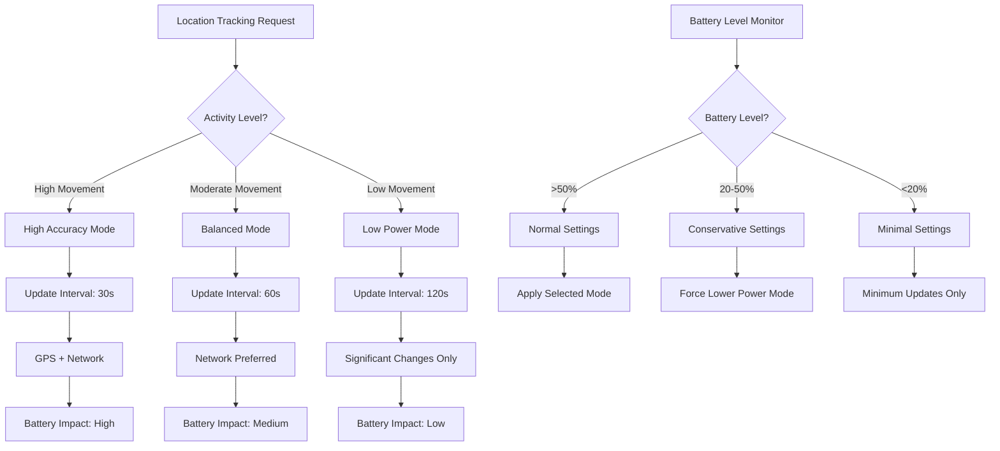

This document provides a comprehensive overview of the performance optimization strategies implemented in the Security Patrol mobile application. Performance optimization is critical for ensuring that the application runs efficiently on mobile devices, conserves battery power, minimizes memory usage, and provides a responsive user experience even in challenging environments.

The Security Patrol application is designed for security personnel who may work extended shifts in various environments, making performance optimization particularly important for battery life, responsiveness, and reliability. This document details the specific strategies and techniques implemented to optimize performance across various aspects of the application.

## Introduction

### Purpose

The purpose of this document is to provide a detailed understanding of:

- The battery optimization strategies that ensure extended operation during security shifts
- The memory management techniques that prevent excessive resource consumption
- The UI performance optimizations that ensure a responsive user experience
- The network efficiency approaches that minimize data usage and improve reliability
- The storage optimization techniques that manage local data efficiently

This document serves as a reference for developers maintaining or extending the application, providing context for the performance-related design decisions and implementation details.

### Performance Optimization Principles

The Security Patrol application's performance optimization strategy is guided by several key principles:

1. **Battery Efficiency**: Minimize battery consumption to support extended security shifts
2. **Resource Conservation**: Use device resources (memory, CPU, storage) efficiently
3. **Responsive UI**: Ensure the user interface remains responsive even during intensive operations
4. **Network Efficiency**: Minimize data transfer and handle network operations efficiently
5. **Adaptive Behavior**: Adjust performance characteristics based on device capabilities and conditions
6. **Background Efficiency**: Optimize background operations to minimize impact when the app is not in focus

These principles inform the specific optimization strategies implemented throughout the application.

### Performance Requirements

The Security Patrol application must meet the following performance requirements:

| Operation | Performance Target | Measurement Method | Mitigation Strategy |
|-----------|-------------------|-------------------|---------------------|
| Application Startup | < 3 seconds | Cold start timing | Optimized initialization, progressive loading |
| Authentication | < 5 seconds | End-to-end timing | Streamlined verification process |
| Map Rendering | < 2 seconds | Screen load timing | Tile caching, progressive loading |
| Photo Capture | < 1 second | Camera to preview timing | Optimized camera initialization |
| Location Updates | < 15% battery impact per 8-hour shift | Battery usage monitoring | Adaptive polling frequency |
| API Operations | < 2 seconds | Network request timing | Caching, background processing |
| Memory Usage | < 150MB | Memory profiling | Efficient resource management |

These requirements ensure that the application provides a responsive, efficient experience for security personnel while conserving device resources.

## Battery Optimization

Battery optimization is critical for the Security Patrol application, as security personnel may need to use the application throughout extended shifts without access to charging facilities. The application implements several strategies to minimize battery consumption while maintaining full functionality.

### Location Tracking Optimization

Location tracking is one of the most battery-intensive operations in the application. Several optimization strategies are implemented to minimize battery impact:



**Adaptive Location Tracking:**

```csharp
private TimeSpan GetOptimalTrackingInterval(LocationModel lastLocation)
{
    // Check battery level first
    var batteryLevel = Battery.ChargeLevel;
    
    // Determine movement level based on historical data
    var movementLevel = _locationAnalyzer.DetermineMovementLevel(lastLocation);
    
    // Adjust interval based on battery level and movement
    if (batteryLevel < 0.2) // Below 20%
    {
        // Battery conservation mode
        return TimeSpan.FromMinutes(3); // Minimum updates
    }
    else if (batteryLevel < 0.5) // Below 50%
    {
        // Conservative mode
        switch (movementLevel)
        {
            case MovementLevel.High:
                return TimeSpan.FromSeconds(60);
            case MovementLevel.Moderate:
                return TimeSpan.FromSeconds(120);
            default:
                return TimeSpan.FromMinutes(3);
        }
    }
    else
    {
        // Normal mode
        switch (movementLevel)
        {
            case MovementLevel.High:
                return TimeSpan.FromSeconds(30);
            case MovementLevel.Moderate:
                return TimeSpan.FromSeconds(60);
            default:
                return TimeSpan.FromSeconds(120);
        }
    }
}
```

This adaptive approach ensures that location tracking frequency is adjusted based on both user movement patterns and battery level, significantly reducing battery consumption during periods of low movement or low battery.

### Background Processing Optimization

Background processing is optimized to minimize battery impact when the application is not in focus:

1. **Batch Processing**: Background operations are batched to minimize wake cycles
2. **Deferred Processing**: Non-critical operations are deferred until the application returns to the foreground
3. **Connectivity-Aware Sync**: Synchronization operations adapt to network conditions
4. **Battery-Aware Scheduling**: Background tasks are scheduled based on battery level

```csharp
public class BackgroundSyncService : IBackgroundService
{
    private readonly ISyncService _syncService;
    private readonly INetworkService _networkService;
    private readonly ILogger<BackgroundSyncService> _logger;
    
    private Timer _syncTimer;
    private bool _isRunning;
    
    public Task Start()
    {
        if (_isRunning)
            return Task.CompletedTask;
            
        // Determine sync interval based on battery level and network type
        var interval = GetSyncInterval();
        
        // Start timer
        _syncTimer = new Timer(SyncCallback, null, TimeSpan.Zero, interval);
        _isRunning = true;
        
        return Task.CompletedTask;
    }
    
    private TimeSpan GetSyncInterval()
    {
        // Adapt sync interval based on battery level
        var batteryLevel = Battery.ChargeLevel;
        var networkType = _networkService.GetConnectionType();
        
        // Base interval on network type
        var baseInterval = networkType switch
        {
            ConnectionType.WiFi => TimeSpan.FromMinutes(5),
            ConnectionType.Cellular => TimeSpan.FromMinutes(15),
            _ => TimeSpan.FromMinutes(30)
        };
        
        // Adjust for battery level
        if (batteryLevel < 0.15) // Below 15%
            return TimeSpan.FromTicks(baseInterval.Ticks * 3); // 3x longer interval
        else if (batteryLevel < 0.3) // Below 30%
            return TimeSpan.FromTicks(baseInterval.Ticks * 2); // 2x longer interval
        else
            return baseInterval;
    }
    
    private async void SyncCallback(object state)
    {
        try
        {
            // Check if conditions are suitable for sync
            if (!_networkService.IsConnected || Battery.ChargeLevel < 0.1)
                return; // Skip sync if disconnected or battery critically low
                
            // Check if device is charging
            bool isCharging = Battery.State == BatteryState.Charging || 
                             Battery.State == BatteryState.Full;
                             
            // If battery is low and not charging, only sync critical data
            bool criticalOnly = Battery.ChargeLevel < 0.2 && !isCharging;
            
            // Perform sync
            await _syncService.SyncAll(criticalOnly: criticalOnly);
            
            // Update sync interval based on current conditions
            if (_isRunning && _syncTimer != null)
            {
                var interval = GetSyncInterval();
                _syncTimer.Change(interval, interval);
            }
        }
        catch (Exception ex)
        {
            _logger.LogError(ex, "Error in background sync");
        }
    }
}
```

This implementation ensures that background operations adapt to device conditions, minimizing battery impact while maintaining essential functionality.

### Network Operation Optimization

Network operations are optimized to minimize battery consumption:

1. **Batch Requests**: Multiple API requests are batched when possible
2. **Compression**: Data is compressed before transmission
3. **Caching**: Responses are cached to avoid redundant requests
4. **Connectivity-Aware Operations**: Network operations adapt to connection quality
5. **Efficient Polling**: Polling intervals are adjusted based on application state

```csharp
public class ApiService : IApiService
{
    private readonly HttpClient _httpClient;
    private readonly INetworkService _networkService;
    private readonly ITokenManager _tokenManager;
    private readonly ILogger<ApiService> _logger;
    
    // Cache for GET requests
    private readonly MemoryCache _responseCache = new MemoryCache(
        new MemoryCacheOptions { SizeLimit = 1024 * 1024 * 5 }); // 5MB cache limit
    
    public async Task<T> GetAsync<T>(string endpoint, Dictionary<string, string> queryParams = null, bool requiresAuth = true, bool useCache = true)
    {
        var url = BuildUrl(endpoint, queryParams);
        var cacheKey = $"GET:{url}";
        
        // Check cache if enabled
        if (useCache && _responseCache.TryGetValue(cacheKey, out T cachedResponse))
        {
            return cachedResponse;
        }
        
        // Determine timeout based on network quality
        var timeout = _networkService.GetConnectionQuality() switch
        {
            ConnectionQuality.High => TimeSpan.FromSeconds(10),
            ConnectionQuality.Medium => TimeSpan.FromSeconds(20),
            _ => TimeSpan.FromSeconds(30)
        };
        
        using var request = new HttpRequestMessage(HttpMethod.Get, url);
        
        // Add compression header to reduce data transfer
        request.Headers.AcceptEncoding.Add(new StringWithQualityHeaderValue("gzip"));
        request.Headers.AcceptEncoding.Add(new StringWithQualityHeaderValue("deflate"));
        
        if (requiresAuth)
        {
            await AddAuthenticationHeader(request);
        }
        
        // Create cancellation token with timeout
        using var cts = new CancellationTokenSource(timeout);
        
        var response = await _httpClient.SendAsync(request, cts.Token);
        response.EnsureSuccessStatusCode();
        
        var content = await response.Content.ReadAsStringAsync();
        var result = JsonSerializer.Deserialize<T>(content, _serializerOptions);
        
        // Cache the response if caching is enabled
        if (useCache)
        {
            // Determine cache duration based on endpoint type
            var cacheDuration = GetCacheDuration(endpoint);
            
            var cacheEntryOptions = new MemoryCacheEntryOptions()
                .SetSize(content.Length) // Set size for memory limit
                .SetAbsoluteExpiration(cacheDuration);
                
            _responseCache.Set(cacheKey, result, cacheEntryOptions);
        }
        
        return result;
    }
    
    private TimeSpan GetCacheDuration(string endpoint)
    {
        // Different cache durations for different types of data
        if (endpoint.Contains("/patrol/locations") || endpoint.Contains("/patrol/checkpoints"))
            return TimeSpan.FromHours(24); // Static data cached longer
        else if (endpoint.Contains("/time/history"))
            return TimeSpan.FromMinutes(30); // Semi-static data
        else
            return TimeSpan.FromMinutes(5); // Dynamic data
    }
}
```

These optimizations ensure efficient network usage, reducing both battery consumption and data usage.

### UI and Rendering Optimization

UI and rendering operations are optimized to reduce battery consumption:

1. **Efficient Layouts**: Layouts are optimized to minimize rendering passes
2. **Reduced Animations**: Animations are minimized or disabled when battery is low
3. **Adaptive Refresh Rates**: UI refresh rates are adjusted based on content changes
4. **Lazy Loading**: UI elements are loaded only when needed
5. **Efficient Drawing**: Custom rendering is optimized for performance

```csharp
public class BatteryAwareAnimationBehavior : Behavior<VisualElement>
{
    public static readonly BindableProperty IsEnabledProperty =
        BindableProperty.Create(nameof(IsEnabled), typeof(bool), typeof(BatteryAwareAnimationBehavior), true);
        
    public static readonly BindableProperty LowBatteryThresholdProperty =
        BindableProperty.Create(nameof(LowBatteryThreshold), typeof(double), typeof(BatteryAwareAnimationBehavior), 0.2);
        
    public bool IsEnabled
    {
        get => (bool)GetValue(IsEnabledProperty);\n        set => SetValue(IsEnabledProperty, value);
    }
    
    public double LowBatteryThreshold
    {
        get => (double)GetValue(LowBatteryThresholdProperty);
        set => SetValue(LowBatteryThresholdProperty, value);
    }
    
    protected override void OnAttachedTo(VisualElement bindable)
    {
        base.OnAttachedTo(bindable);
        
        // Check battery level and adjust animations
        UpdateAnimationState(bindable);
        
        // Subscribe to battery changes
        Battery.BatteryInfoChanged += OnBatteryInfoChanged;
    }
    
    protected override void OnDetachingFrom(VisualElement bindable)
    {
        Battery.BatteryInfoChanged -= OnBatteryInfoChanged;
        base.OnDetachingFrom(bindable);
    }
    
    private void OnBatteryInfoChanged(object sender, BatteryInfoChangedEventArgs e)
    {
        UpdateAnimationState(AssociatedObject);
    }
    
    private void UpdateAnimationState(VisualElement element)
    {
        if (!IsEnabled)
            return;
            
        bool enableAnimations = Battery.ChargeLevel > LowBatteryThreshold || 
                               Battery.State == BatteryState.Charging || 
                               Battery.State == BatteryState.Full;
                               
        // Apply animation settings based on battery state
        if (element is IAnimatable animatable)
        {
            if (!enableAnimations)
            {
                // Store current animation properties if needed
                element.Properties["AnimationEnabled"] = false;
                
                // Disable animations
                Microsoft.Maui.Controls.Animation.EnableAnimations = false;
            }
            else
            {
                // Re-enable animations if they were disabled
                if (element.Properties.ContainsKey("AnimationEnabled") && 
                    !(bool)element.Properties["AnimationEnabled"])
                {
                    Microsoft.Maui.Controls.Animation.EnableAnimations = true;
                    element.Properties["AnimationEnabled"] = true;
                }
            }
        }
    }
}
```

This behavior automatically adjusts animation usage based on battery level, reducing power consumption when battery is low while maintaining a rich user experience when power is available.

### Sensor Usage Optimization

Sensor usage (GPS, accelerometer, etc.) is optimized to minimize battery impact:

1. **Contextual Activation**: Sensors are activated only when needed
2. **Sampling Rate Adjustment**: Sensor sampling rates are adjusted based on requirements
3. **Sensor Fusion**: Multiple sensors are used together for efficient operation
4. **Power-Aware Sensors**: Sensor usage adapts to battery level

```csharp
public class MovementDetectionService : IMovementDetectionService
{
    private readonly IAccelerometer _accelerometer;
    private readonly ILocationService _locationService;
    private readonly ILogger<MovementDetectionService> _logger;
    
    private bool _isMonitoring;\n    private MovementState _currentState = MovementState.Unknown;
    
    public event EventHandler<MovementStateChangedEventArgs> MovementStateChanged;
    
    public MovementDetectionService(
        IAccelerometer accelerometer,
        ILocationService locationService,
        ILogger<MovementDetectionService> logger)
    {
        _accelerometer = accelerometer;
        _locationService = locationService;
        _logger = logger;
    }
    
    public void StartMonitoring()
    {
        if (_isMonitoring)
            return;
            
        // Set accelerometer sampling rate based on battery level
        var batteryLevel = Battery.ChargeLevel;
        var samplingRate = batteryLevel < 0.3 ? SensorSpeed.Game : SensorSpeed.UI;
        
        try
        {
            // Start accelerometer with appropriate sampling rate
            _accelerometer.Start(samplingRate);
            _accelerometer.ReadingChanged += OnAccelerometerReadingChanged;
            
            _isMonitoring = true;
            _logger.LogInformation($"Movement monitoring started with sampling rate: {samplingRate}");
        }
        catch (Exception ex)
        {
            _logger.LogError(ex, "Error starting accelerometer");
            
            // Fallback to location-based movement detection if accelerometer fails
            _locationService.LocationChanged += OnLocationChanged;
        }
    }
    
    public void StopMonitoring()
    {
        if (!_isMonitoring)
            return;
            
        try
        {
            _accelerometer.ReadingChanged -= OnAccelerometerReadingChanged;
            _accelerometer.Stop();
            
            _locationService.LocationChanged -= OnLocationChanged;
            
            _isMonitoring = false;
            _logger.LogInformation("Movement monitoring stopped");
        }
        catch (Exception ex)
        {
            _logger.LogError(ex, "Error stopping movement monitoring");
        }
    }
    
    private void OnAccelerometerReadingChanged(object sender, AccelerometerChangedEventArgs e)
    {
        // Process accelerometer data to detect movement
        var reading = e.Reading;
        var acceleration = Math.Sqrt(
            reading.Acceleration.X * reading.Acceleration.X +
            reading.Acceleration.Y * reading.Acceleration.Y +
            reading.Acceleration.Z * reading.Acceleration.Z);
            
        // Determine movement state based on acceleration
        var newState = DetermineMovementState(acceleration);
        
        // Notify if state changed
        if (newState != _currentState)
        {
            _currentState = newState;
            MovementStateChanged?.Invoke(this, new MovementStateChangedEventArgs(_currentState));
        }
    }
    
    private void OnLocationChanged(object sender, LocationChangedEventArgs e)
    {
        // Fallback movement detection using location changes
        // Only used if accelerometer is unavailable
        
        // Implementation details...
    }
    
    private MovementState DetermineMovementState(double acceleration)
    {
        // Thresholds determined through testing
        if (acceleration > 1.2) // High movement
            return MovementState.Active;
        else if (acceleration > 0.8) // Moderate movement
            return MovementState.Moving;
        else // Low movement
            return MovementState.Stationary;
    }
}

public enum MovementState
{
    Unknown,
    Stationary,
    Moving,
    Active
}

public class MovementStateChangedEventArgs : EventArgs
{
    public MovementState NewState { get; }
    
    public MovementStateChangedEventArgs(MovementState newState)
    {
        NewState = newState;
    }
}
```

This service efficiently detects user movement using the accelerometer with battery-aware sampling rates, falling back to location-based detection if necessary. The movement state is then used to optimize location tracking frequency.

### Battery Impact Measurement

The application includes mechanisms to measure and monitor battery impact:

1. **Battery Usage Tracking**: The application tracks battery consumption during different operations
2. **Power Profiling**: Critical paths are profiled for power consumption
3. **Battery Analytics**: Battery usage patterns are analyzed to identify optimization opportunities
4. **Adaptive Behavior**: The application adapts its behavior based on observed battery impact

```csharp
public class BatteryMonitorService : IBatteryMonitorService
{
    private readonly ILogger<BatteryMonitorService> _logger;
    private readonly ITelemetryService _telemetryService;
    
    private double _lastBatteryLevel;
    private DateTime _lastMeasurement;
    private Dictionary<string, BatteryUsageData> _usageByFeature;
    
    public BatteryMonitorService(
        ILogger<BatteryMonitorService> logger,
        ITelemetryService telemetryService)
    {
        _logger = logger;
        _telemetryService = telemetryService;
        _usageByFeature = new Dictionary<string, BatteryUsageData>();
        
        // Initialize with current battery level
        _lastBatteryLevel = Battery.ChargeLevel;
        _lastMeasurement = DateTime.UtcNow;
        
        // Subscribe to battery changes
        Battery.BatteryInfoChanged += OnBatteryInfoChanged;
    }
    
    public void StartFeatureMonitoring(string featureName)
    {
        if (!_usageByFeature.ContainsKey(featureName))
        {
            _usageByFeature[featureName] = new BatteryUsageData
            {
                StartLevel = Battery.ChargeLevel,
                StartTime = DateTime.UtcNow,
                IsActive = true
            };
        }
        else
        {
            var data = _usageByFeature[featureName];
            data.StartLevel = Battery.ChargeLevel;
            data.StartTime = DateTime.UtcNow;
            data.IsActive = true;
        }
    }
    
    public void StopFeatureMonitoring(string featureName)
    {
        if (_usageByFeature.TryGetValue(featureName, out var data) && data.IsActive)
        {
            // Calculate usage for this session
            var duration = DateTime.UtcNow - data.StartTime;
            var batteryDrain = data.StartLevel - Battery.ChargeLevel;
            
            // Only record if meaningful drain occurred and not charging
            if (batteryDrain > 0.001 && Battery.State != BatteryState.Charging)
            {
                // Calculate drain per hour
                var drainPerHour = batteryDrain / duration.TotalHours;
                
                // Update cumulative data
                data.TotalDuration += duration;
                data.TotalDrain += batteryDrain;
                data.SessionCount++;
                
                // Calculate average drain per hour
                data.AverageDrainPerHour = data.TotalDrain / data.TotalDuration.TotalHours;
                
                // Log for analysis
                _logger.LogInformation(
                    $"Battery usage for {featureName}: {batteryDrain:P2} over {duration.TotalMinutes:F1} minutes. " +
                    $"Rate: {drainPerHour:P2}/hour, Average: {data.AverageDrainPerHour:P2}/hour");
                    
                // Send telemetry
                _telemetryService.TrackMetric($"BatteryUsage_{featureName}", drainPerHour);
            }
            
            data.IsActive = false;
        }
    }
    
    private void OnBatteryInfoChanged(object sender, BatteryInfoChangedEventArgs e)
    {
        // Skip if charging started or stopped
        if (e.State == BatteryState.Charging || e.State == BatteryState.Full ||
            Battery.State == BatteryState.Charging || Battery.State == BatteryState.Full)
        {
            _lastBatteryLevel = e.ChargeLevel;
            _lastMeasurement = DateTime.UtcNow;
            return;
        }
        
        // Calculate overall drain
        var timeDiff = DateTime.UtcNow - _lastMeasurement;
        var levelDiff = _lastBatteryLevel - e.ChargeLevel;
        
        // Only process if meaningful change occurred
        if (timeDiff.TotalMinutes >= 5 && levelDiff > 0.001)
        {
            var drainPerHour = levelDiff / timeDiff.TotalHours;
            
            _logger.LogInformation(
                $"Overall battery drain: {levelDiff:P2} over {timeDiff.TotalMinutes:F1} minutes. " +
                $"Rate: {drainPerHour:P2}/hour");
                
            // Send telemetry
            _telemetryService.TrackMetric("BatteryUsage_Overall", drainPerHour);
            
            // Check if drain is excessive
            if (drainPerHour > 0.15) // More than 15% per hour
            {
                _logger.LogWarning($"Excessive battery drain detected: {drainPerHour:P2}/hour");
                
                // Trigger battery saving mode
                MessagingCenter.Send(this, "EnableBatterySavingMode");
            }
        }
        
        // Update for next measurement
        _lastBatteryLevel = e.ChargeLevel;
        _lastMeasurement = DateTime.UtcNow;
    }
    
    private class BatteryUsageData
    {
        public double StartLevel { get; set; }
        public DateTime StartTime { get; set; }
        public bool IsActive { get; set; }
        public TimeSpan TotalDuration { get; set; } = TimeSpan.Zero;
        public double TotalDrain { get; set; } = 0;
        public int SessionCount { get; set; } = 0;
        public double AverageDrainPerHour { get; set; } = 0;
    }
}
```

This service monitors battery usage across different features, providing insights into which components consume the most power and enabling adaptive behavior based on observed battery impact.

## Memory Management

Efficient memory management is essential for maintaining application performance and preventing crashes due to memory-related issues. The Security Patrol application implements several strategies to optimize memory usage while ensuring smooth operation.

### Image Memory Optimization

Images are one of the most memory-intensive resources in the application. Several strategies are implemented to optimize image memory usage:

1. **Image Resizing**: Images are resized to appropriate dimensions before loading into memory
2. **Progressive Loading**: Large images are loaded progressively at increasing resolutions
3. **Memory Caching**: An efficient caching system prevents redundant loading of images
4. **Image Compression**: Images are compressed to reduce memory footprint
5. **Bitmap Recycling**: Bitmap objects are recycled when possible to reduce garbage collection

```csharp
public class ImageOptimizationService : IImageOptimizationService
{
    private readonly ILogger<ImageOptimizationService> _logger;
    private readonly LruCache<string, SKBitmap> _bitmapCache;
    
    public ImageOptimizationService(ILogger<ImageOptimizationService> logger)
    {
        _logger = logger;
        
        // Create LRU cache with size limit based on device memory
        var memorySizeInMB = DeviceInfo.MemoryInfo.AvailablePhysicalMemory / (1024 * 1024);
        var cacheSize = (int)Math.Min(memorySizeInMB / 4, 50); // 25% of available memory up to 50MB
        
        _bitmapCache = new LruCache<string, SKBitmap>(cacheSize * 1024 * 1024, GetBitmapSize);
    }
    
    public async Task<SKBitmap> LoadImageAsync(string filePath, int maxWidth, int maxHeight)
    {
        var cacheKey = $"{filePath}_{maxWidth}_{maxHeight}";
        
        // Check cache first
        if (_bitmapCache.TryGetValue(cacheKey, out var cachedBitmap))
        {
            return cachedBitmap;
        }
        
        try
        {
            // Load image info first to determine dimensions
            using var stream = File.OpenRead(filePath);
            var imageInfo = SKBitmap.DecodeBounds(stream);
            
            // Calculate sample size to load image at appropriate resolution
            int sampleSize = CalculateSampleSize(imageInfo.Width, imageInfo.Height, maxWidth, maxHeight);
            
            // Reset stream position
            stream.Position = 0;
            
            // Create decode options with sample size
            var options = new SKImageInfo
            {
                ColorType = SKColorType.Rgba8888,
                AlphaType = SKAlphaType.Premul,
                ColorSpace = SKColorSpace.CreateSrgb()
            };
            
            // Decode bitmap with sampling
            var bitmap = SKBitmap.Decode(stream, options);
            
            // Resize if necessary
            if (bitmap.Width > maxWidth || bitmap.Height > maxHeight)
            {
                var scaledBitmap = ResizeBitmap(bitmap, maxWidth, maxHeight);
                bitmap.Dispose(); // Dispose original
                bitmap = scaledBitmap;
            }
            
            // Add to cache
            _bitmapCache.Add(cacheKey, bitmap);
            
            return bitmap;
        }
        catch (Exception ex)
        {
            _logger.LogError(ex, $"Error loading image from {filePath}");
            return null;
        }
    }
    
    private int CalculateSampleSize(int width, int height, int maxWidth, int maxHeight)
    {
        int sampleSize = 1;
        
        while (width / sampleSize > maxWidth || height / sampleSize > maxHeight)
        {
            sampleSize *= 2;
        }
        
        return sampleSize;
    }
    
    private SKBitmap ResizeBitmap(SKBitmap original, int maxWidth, int maxHeight)
    {
        // Calculate new dimensions maintaining aspect ratio
        float ratio = (float)original.Width / original.Height;
        int newWidth, newHeight;
        
        if (ratio > 1) // Landscape
        {
            newWidth = Math.Min(original.Width, maxWidth);
            newHeight = (int)(newWidth / ratio);
            
            if (newHeight > maxHeight)
            {
                newHeight = maxHeight;
                newWidth = (int)(newHeight * ratio);
            }
        }
        else // Portrait
        {
            newHeight = Math.Min(original.Height, maxHeight);
            newWidth = (int)(newHeight * ratio);
            
            if (newWidth > maxWidth)
            {
                newWidth = maxWidth;
                newHeight = (int)(newWidth / ratio);
            }
        }
        
        // Create resized bitmap
        return original.Resize(new SKImageInfo(newWidth, newHeight), SKFilterQuality.Medium);
    }
    
    private int GetBitmapSize(SKBitmap bitmap)
    {
        // Calculate memory size of bitmap
        return bitmap.Width * bitmap.Height * 4; // 4 bytes per pixel for RGBA8888
    }
    
    public void ClearCache()
    {
        _bitmapCache.Clear();
    }
}
```

This service efficiently manages image loading and caching, significantly reducing memory usage for photo-heavy operations in the application.

### Collection Virtualization

Lists and collections are optimized to minimize memory usage:

1. **UI Virtualization**: Only visible items are rendered in lists and collections
2. **Data Virtualization**: Data is loaded incrementally as needed
3. **Recycling**: UI elements are recycled when scrolling through large lists
4. **Pagination**: Large datasets are paginated to limit memory usage