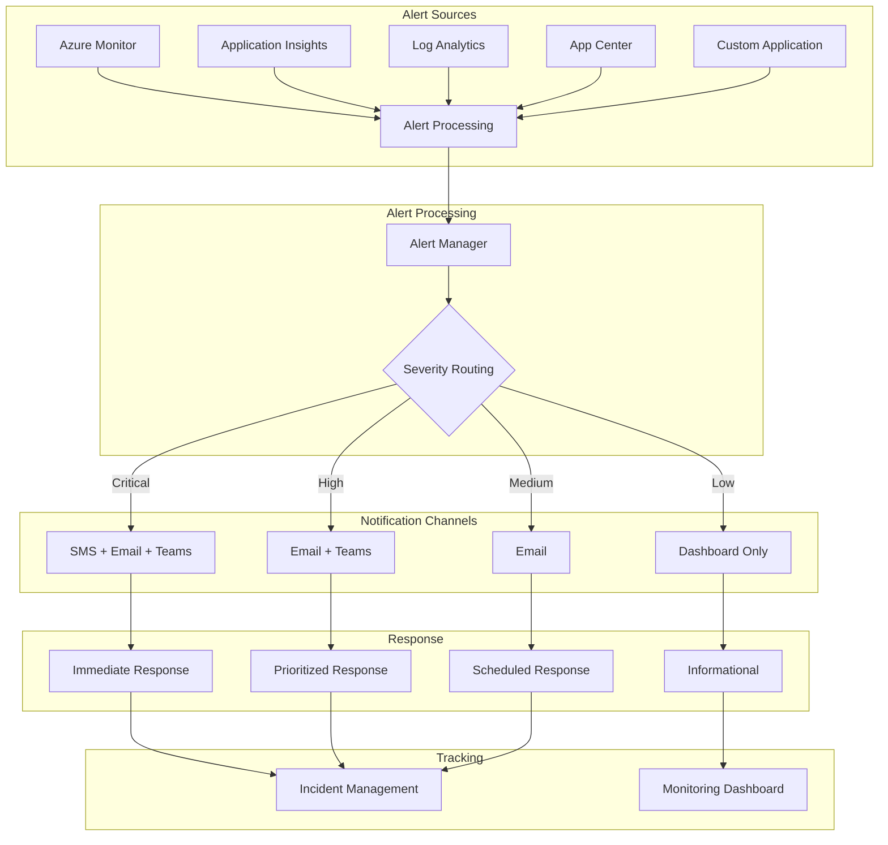
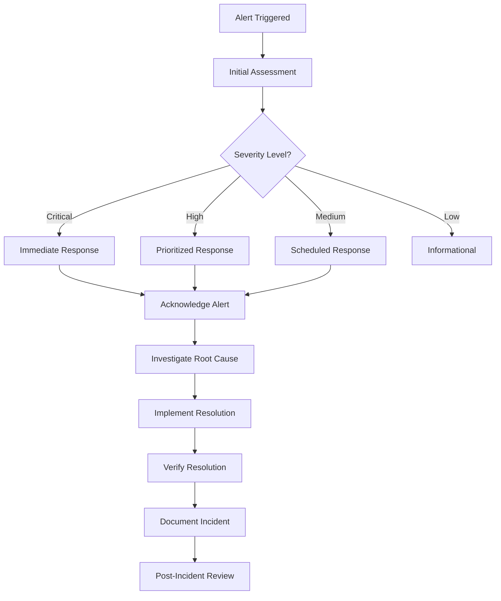

## Introduction

This document provides comprehensive guidance on the alert system for the Security Patrol application. It covers alert configuration, notification channels, response procedures, and best practices to ensure timely detection and resolution of issues.

Effective alerting is essential for maintaining the reliability, performance, and security of the Security Patrol application. This document serves as a reference for operations teams, developers, and stakeholders responsible for monitoring and responding to alerts.

## Alert Architecture

The Security Patrol application implements a comprehensive alert architecture that spans all components of the system, from backend infrastructure to the mobile application.

### Alert Sources

Alerts are generated from multiple sources throughout the application ecosystem:

1. **Azure Monitor Alerts**:
   - Resource health and availability
   - Performance metrics (CPU, memory, etc.)
   - Capacity thresholds
   - Service health notifications

2. **Application Insights Alerts**:
   - API response time
   - Request failure rate
   - Exception volume
   - Availability test failures
   - Custom metric thresholds

3. **Log Analytics Alerts**:
   - Complex query-based alerts
   - Pattern detection
   - Correlation rules
   - Security and compliance alerts

4. **App Center Alerts**:
   - Mobile app crash rate
   - Critical error events
   - Performance degradation
   - Usage anomalies

5. **Custom Application Alerts**:
   - Business process failures
   - Data integrity issues
   - Security events
   - Integration failures

### Alert Flow

The flow of alerts through the system follows this pattern:



This architecture ensures that alerts are properly routed based on severity and impact, with appropriate notification channels and response procedures.

### Alert Severity Levels

Alerts are categorized into severity levels to ensure appropriate response:

| Severity | Level | Description | Response Time | Notification Channels |
|----------|-------|-------------|--------------|------------------------|
| Critical | 1 | Service outage or severe degradation affecting all users | Immediate (< 15 min) | SMS, Email, Teams, Phone Call |
| High | 2 | Partial service degradation or affecting a subset of users | < 1 hour | Email, Teams |
| Medium | 3 | Non-critical issues with limited user impact | < 4 hours | Email |
| Low | 4 | Informational alerts with no immediate impact | Next business day | Dashboard only |

Severity levels are assigned based on the potential impact to users and business operations. The severity level determines the notification channels, response time expectations, and escalation procedures.

### Alert Grouping

To prevent alert fatigue, related alerts are grouped using these strategies:

1. **Smart Groups**:
   - Azure Monitor Smart Groups automatically correlate related alerts
   - Groups are formed based on occurrence pattern, resource type, and proximity
   - Single notification for multiple related alerts
   - Consolidated view in the Azure portal

2. **Alert Suppression**:
   - Duplicate alerts suppressed during maintenance windows
   - Flapping detection to prevent repeated alerts for unstable conditions
   - Cooldown periods between similar alerts
   - Correlation rules to prevent cascade alerts

3. **Alert Aggregation**:
   - Threshold for number of occurrences before notification
   - Time window for aggregating similar alerts
   - Summary notifications for grouped alerts
   - Digest format for low-priority alerts

Alert grouping is configured in Azure Monitor and through custom Logic Apps workflows to ensure efficient notification without overwhelming responders.

## Alert Configuration

This section details the configuration of alerts for different components of the Security Patrol application.

### Backend API Alerts

Alerts configured for the backend API services:

| Alert | Description | Threshold | Severity | Notification |
|-------|-------------|-----------|----------|-------------|
| API Response Time | Average response time exceeds threshold | > 1000ms for 5 min | 2 (High) | Email + Teams |
| API Failure Rate | Percentage of failed requests exceeds threshold | > 5% for 5 min | 1 (Critical) | SMS + Email + Teams |
| API Availability | API endpoint availability test fails | 2 consecutive failures | 1 (Critical) | SMS + Email + Teams |
| Exception Rate | Number of exceptions exceeds threshold | > 10 per minute | 2 (High) | Email + Teams |
| Authentication Failures | Multiple authentication failures detected | > 10 in 5 minutes | 1 (Critical) | SMS + Email + Teams |

These alerts are configured in Application Insights and Azure Monitor using the following methods:

**Azure Portal Configuration:**
1. Navigate to Application Insights resource
2. Select "Alerts" from the menu
3. Create new alert rule with appropriate condition and action group

**PowerShell Configuration:**
```powershell
# Example: Create API Response Time Alert
New-MetricAlert -ResourceGroupName "securitypatrol-prod-rg" `
  -Name "High API Response Time" `
  -Description "Alert when API response time exceeds threshold" `
  -Severity 2 `
  -ResourceId "/subscriptions/{subscription-id}/resourceGroups/securitypatrol-prod-rg/providers/Microsoft.Insights/components/securitypatrol-ai" `
  -MetricName "requests/duration" `
  -Operator "GreaterThan" `
  -Threshold 1000 `
  -Aggregation "Average" `
  -ActionGroupId "/subscriptions/{subscription-id}/resourceGroups/securitypatrol-prod-rg/providers/Microsoft.Insights/actionGroups/SecurityPatrolAlerts"
```

**ARM Template Configuration:**
```json
{
  "type": "Microsoft.Insights/metricAlerts",
  "apiVersion": "2018-03-01",
  "name": "High API Response Time",
  "location": "global",
  "properties": {
    "description": "Alert when API response time exceeds threshold",
    "severity": 2,
    "enabled": true,
    "scopes": [
      "/subscriptions/{subscription-id}/resourceGroups/securitypatrol-prod-rg/providers/Microsoft.Insights/components/securitypatrol-ai"
    ],
    "evaluationFrequency": "PT1M",
    "windowSize": "PT5M",
    "criteria": {
      "odata.type": "Microsoft.Azure.Monitor.SingleResourceMultipleMetricCriteria",
      "allOf": [
        {
          "name": "Metric1",
          "metricName": "requests/duration",
          "dimensions": [],
          "operator": "GreaterThan",
          "threshold": 1000,
          "timeAggregation": "Average"
        }
      ]
    },
    "actions": [
      {
        "actionGroupId": "/subscriptions/{subscription-id}/resourceGroups/securitypatrol-prod-rg/providers/Microsoft.Insights/actionGroups/SecurityPatrolAlerts"
      }
    ]
  }
}
```

### Database Alerts

Alerts configured for the database services:

| Alert | Description | Threshold | Severity | Notification |
|-------|-------------|-----------|----------|-------------|
| Database DTU | DTU consumption exceeds threshold | > 80% for 15 min | 2 (High) | Email + Teams |
| Database Storage | Storage usage exceeds threshold | > 80% | 2 (High) | Email + Teams |
| Long-Running Queries | Queries exceeding execution time threshold | > 30 seconds | 3 (Medium) | Email |
| Database Connectivity | Connection failures exceed threshold | > 5 in 5 minutes | 1 (Critical) | SMS + Email + Teams |
| Database Errors | Critical database errors detected | Any occurrence | 1 (Critical) | SMS + Email + Teams |

These alerts are configured in Azure Monitor and SQL Database Insights using the following methods:

**Azure Portal Configuration:**
1. Navigate to SQL Database resource
2. Select "Alerts" from the menu
3. Create new alert rule with appropriate condition and action group

**PowerShell Configuration:**
```powershell
# Example: Create Database DTU Alert
New-MetricAlert -ResourceGroupName "securitypatrol-prod-rg" `
  -Name "High Database DTU Usage" `
  -Description "Alert when database DTU consumption exceeds threshold" `
  -Severity 2 `
  -ResourceId "/subscriptions/{subscription-id}/resourceGroups/securitypatrol-prod-rg/providers/Microsoft.Sql/servers/securitypatrol-sql/databases/securitypatrol-db" `
  -MetricName "dtu_consumption_percent" `
  -Operator "GreaterThan" `
  -Threshold 80 `
  -Aggregation "Average" `
  -ActionGroupId "/subscriptions/{subscription-id}/resourceGroups/securitypatrol-prod-rg/providers/Microsoft.Insights/actionGroups/SecurityPatrolAlerts"
```

**Log Query Alert:**
```kusto
AzureDiagnostics
| where Category == "QueryStoreRuntimeStatistics"
| where DatabaseName_s == "securitypatrol-db"
| where Duration > 30000 // 30 seconds in milliseconds
| summarize count() by bin(TimeGenerated, 5m)
| where count_ > 5
```

### Storage Alerts

Alerts configured for blob storage services:

| Alert | Description | Threshold | Severity | Notification |
|-------|-------------|-----------|----------|-------------|
| Storage Capacity | Storage usage exceeds threshold | > 80% | 2 (High) | Email + Teams |
| Storage Availability | Storage service availability issues | Any occurrence | 1 (Critical) | SMS + Email + Teams |
| Storage Latency | Transaction latency exceeds threshold | > 1000ms for 5 min | 2 (High) | Email + Teams |
| Storage Throttling | Storage requests being throttled | > 10 throttled requests | 2 (High) | Email + Teams |
| Unauthorized Access | Unauthorized access attempts detected | Any occurrence | 1 (Critical) | SMS + Email + Teams |

These alerts are configured in Azure Monitor and Storage Analytics using the following methods:

**Azure Portal Configuration:**
1. Navigate to Storage Account resource
2. Select "Alerts" from the menu
3. Create new alert rule with appropriate condition and action group

**PowerShell Configuration:**
```powershell
# Example: Create Storage Capacity Alert
New-MetricAlert -ResourceGroupName "securitypatrol-prod-rg" `
  -Name "High Storage Usage" `
  -Description "Alert when storage capacity exceeds threshold" `
  -Severity 2 `
  -ResourceId "/subscriptions/{subscription-id}/resourceGroups/securitypatrol-prod-rg/providers/Microsoft.Storage/storageAccounts/securitypatrolstorage" `
  -MetricName "UsedCapacity" `
  -Operator "GreaterThan" `
  -Threshold 85899345920 `
  -Aggregation "Average" `
  -ActionGroupId "/subscriptions/{subscription-id}/resourceGroups/securitypatrol-prod-rg/providers/Microsoft.Insights/actionGroups/SecurityPatrolAlerts"
```

**Log Query Alert for Unauthorized Access:**
```kusto
StorageBlobLogs
| where StatusCode == 403
| summarize count() by AccountName, AuthenticationType, CallerIpAddress, bin(TimeGenerated, 5m)
| where count_ > 5
```

### Mobile App Alerts

Alerts configured for the mobile application:

| Alert | Description | Threshold | Severity | Notification |
|-------|-------------|-----------|----------|-------------|
| Crash Rate | App crash rate exceeds threshold | > 1% of sessions | 1 (Critical) | SMS + Email + Teams |
| API Connection Failures | Mobile app unable to connect to API | > 5% of attempts | 1 (Critical) | SMS + Email + Teams |
| App Start Time | App startup time exceeds threshold | > 5 seconds | 2 (High) | Email + Teams |
| Session Abandonment | Users abandoning sessions abnormally | > 10% increase | 2 (High) | Email + Teams |
| Sync Failures | Data synchronization failures | > 5% of sync attempts | 2 (High) | Email + Teams |

These alerts are configured in App Center and through custom telemetry events:

**App Center Configuration:**
1. Navigate to App Center portal
2. Select the Security Patrol application
3. Configure email notifications for crashes and events

**Custom Telemetry Implementation:**
```csharp
// Example: Track API connection failure
public async Task<bool> ConnectToApi()
{
    try
    {
        var result = await _apiService.ConnectAsync();
        if (!result)
        {
            // Track connection failure event
            _telemetryService.TrackEvent("ApiConnectionFailure", new Dictionary<string, string>
            {
                { "Endpoint", _apiService.BaseUrl },
                { "NetworkStatus", Connectivity.NetworkAccess.ToString() }
            });
        }
        return result;
    }
    catch (Exception ex)
    {
        // Track exception
        _telemetryService.TrackException(ex, new Dictionary<string, string>
        {
            { "Operation", "ApiConnection" },
            { "Endpoint", _apiService.BaseUrl },
            { "NetworkStatus", Connectivity.NetworkAccess.ToString() }
        });
        return false;
    }
}
```

**App Center Export to Application Insights:**
App Center events can be exported to Application Insights for centralized alerting:

1. Configure App Center to export to Application Insights
2. Create alerts in Application Insights based on custom events
3. Use the same action groups for consistent notification

### Business Process Alerts

Alerts configured for business processes and operations:

| Alert | Description | Threshold | Severity | Notification |
|-------|-------------|-----------|----------|-------------|
| Patrol Completion Rate | Patrol completion rate falls below threshold | < 90% | 2 (High) | Email + Teams |
| Clock Compliance | Clock in/out compliance falls below threshold | < 95% | 2 (High) | Email + Teams |
| Authentication Failures | Multiple failed authentication attempts | > 10 in 5 minutes | 1 (Critical) | SMS + Email + Teams |
| Data Synchronization | Data sync completion rate falls below threshold | < 95% | 2 (High) | Email + Teams |
| Checkpoint Verification | Checkpoint verification failures | > 5% failure rate | 2 (High) | Email + Teams |

These alerts are configured using custom metrics and log queries:

**Custom Metric Alert:**
```kusto
customMetrics
| where name == "PatrolCompletionRate"
| where timestamp > ago(24h)
| summarize avg(value) by bin(timestamp, 1h)
| where avg_value < 90
```

**Log Query Alert:**
```kusto
traces
| where message contains "authentication failed"
| summarize count() by bin(timestamp, 5m), operation_Name
| where count_ > 10
```

**Implementation in Backend API:**
```csharp
// Example: Track patrol completion rate
public async Task<PatrolStatistics> GetPatrolStatisticsAsync(DateTime date)
{
    var statistics = await _patrolRepository.GetStatisticsAsync(date);
    
    // Track completion rate as a custom metric
    _telemetry.TrackMetric("PatrolCompletionRate", statistics.CompletionRate);
    
    // If below threshold, log a warning
    if (statistics.CompletionRate < 90)
    {
        _logger.LogWarning("Patrol completion rate below threshold: {Rate}%", statistics.CompletionRate);
    }
    
    return statistics;
}
```

### Action Groups

Action groups define the notification channels and recipients for alerts:

| Action Group | Description | Notification Methods | Recipients |
|--------------|-------------|----------------------|------------|
| Critical-Alerts | For critical (Sev 1) alerts | SMS, Email, Teams, Voice Call | On-call team, Operations Manager |
| High-Priority | For high (Sev 2) alerts | Email, Teams | Operations Team |
| Medium-Priority | For medium (Sev 3) alerts | Email | Operations Team, Development Team |
| Low-Priority | For low (Sev 4) alerts | None (dashboard only) | N/A |

Action groups are configured in Azure Monitor using the following methods:

**Azure Portal Configuration:**
1. Navigate to Azure Monitor
2. Select "Action Groups" from the menu
3. Create new action group with appropriate notification methods and recipients

**PowerShell Configuration:**
```powershell
# Example: Create Critical Alerts Action Group
New-ActionGroup -ResourceGroupName "securitypatrol-prod-rg" `
  -Name "SecurityPatrol-Critical" `
  -ShortName "Critical" `
  -Enabled $true `
  -EmailReceiver @(
    @{
      Name = "OpsTeam"
      EmailAddress = "ops@example.com"
      UseCommonAlertSchema = $true
    },
    @{
      Name = "Manager"
      EmailAddress = "manager@example.com"
      UseCommonAlertSchema = $true
    }
  ) `
  -SmsReceiver @(
    @{
      Name = "OncallPhone"
      CountryCode = "1"
      PhoneNumber = "5551234567"
    }
  ) `
  -WebhookReceiver @(
    @{
      Name = "TeamsChannel"
      ServiceUri = "https://outlook.office.com/webhook/..."
    }
  )
```

**ARM Template Configuration:**
```json
{
  "type": "Microsoft.Insights/actionGroups",
  "apiVersion": "2019-06-01",
  "name": "SecurityPatrol-Critical",
  "location": "Global",
  "properties": {
    "groupShortName": "Critical",
    "enabled": true,
    "emailReceivers": [
      {
        "name": "OpsTeam",
        "emailAddress": "ops@example.com",
        "useCommonAlertSchema": true
      },
      {
        "name": "Manager",
        "emailAddress": "manager@example.com",
        "useCommonAlertSchema": true
      }
    ],
    "smsReceivers": [
      {
        "name": "OncallPhone",
        "countryCode": "1",
        "phoneNumber": "5551234567"
      }
    ],
    "webhookReceivers": [
      {
        "name": "TeamsChannel",
        "serviceUri": "https://outlook.office.com/webhook/...",
        "useCommonAlertSchema": true
      }
    ]
  }
}
```

## Alert Response Procedures

This section details the procedures for responding to alerts of different types and severity levels.

### Alert Response Workflow

The general workflow for responding to alerts follows these steps:



**Initial Assessment:**
- Verify alert is valid (not a false positive)
- Confirm severity and impact
- Determine if related to known issues or maintenance
- Assign to appropriate responder

**Response Based on Severity:**
- **Critical (Sev 1)**: Immediate response required, all other work paused
- **High (Sev 2)**: Response within 1 hour, prioritized over routine work
- **Medium (Sev 3)**: Response within 4 hours, scheduled appropriately
- **Low (Sev 4)**: Informational, addressed during normal operations

**Resolution Process:**
- Acknowledge alert in monitoring system
- Investigate root cause using monitoring tools and logs
- Implement appropriate resolution steps
- Verify issue is resolved and services are functioning normally
- Document the incident, cause, and resolution
- Schedule post-incident review for critical and high severity alerts

### Alert Response Roles

Clear roles and responsibilities ensure effective alert response:

| Role | Responsibilities | Escalation Path |
|------|-----------------|----------------|
| First Responder | Initial assessment, triage, basic troubleshooting | Team Lead |
| Operations Engineer | Detailed investigation, standard resolution procedures | Operations Manager |
| Subject Matter Expert | Complex issue resolution, specialized knowledge | Technical Director |
| Incident Manager | Coordination, communication, escalation management | CTO |
| On-Call Manager | Decision authority for critical incidents | CTO |

**On-Call Schedule:**
- Primary and secondary on-call responders scheduled weekly
- 24/7 coverage with rotation among team members
- Escalation contacts clearly defined for each shift
- Contact information maintained in on-call management system

**Handoff Procedures:**
- Detailed documentation of ongoing incidents
- Live handoff for critical incidents
- Clear communication of pending actions
- Verification of contact information and availability

### Escalation Procedures

Clear escalation procedures ensure timely resolution of alerts:

**Time-Based Escalation:**
- Critical alerts unacknowledged for 15 minutes → escalate to Team Lead
- Critical alerts unresolved for 30 minutes → escalate to Operations Manager
- Critical alerts unresolved for 1 hour → escalate to Technical Director
- Critical alerts unresolved for 2 hours → escalate to CTO

**Functional Escalation:**
- First responder unable to resolve → escalate to Subject Matter Expert
- Issue affecting multiple components → escalate to Incident Manager
- Issue requiring business decisions → escalate to Product Owner
- Issue requiring external vendor support → escalate to Vendor Manager

**Escalation Channels:**
- Primary: On-call management system
- Secondary: Direct phone call
- Tertiary: SMS message

**Escalation Information:**
- Alert details and current status
- Actions already taken
- Impact assessment
- Resources needed
- Recommended next steps

### Backend API Alert Response

Specific response procedures for backend API alerts:

**API Response Time Alert:**
1. Check Application Insights for performance metrics
2. Identify slow endpoints and operations
3. Check database query performance
4. Check external dependencies
5. Review recent deployments or changes
6. Consider scaling up or out if resource-constrained
7. Implement resolution based on root cause

**API Failure Rate Alert:**
1. Check Application Insights for exception details
2. Identify failing endpoints and error patterns
3. Check logs for specific error messages
4. Verify database connectivity
5. Check external service dependencies
6. Review recent deployments or changes
7. Implement resolution based on root cause

**API Availability Alert:**
1. Verify if service is actually down (false positive check)
2. Check App Service status in Azure Portal
3. Check application logs for startup errors
4. Verify network connectivity and DNS resolution
5. Check for recent deployments or changes
6. Consider app service restart if unresponsive
7. Consider deployment rollback if recently deployed

**Example Diagnostic Queries:**
```kusto
// Identify slow endpoints
requests
| where timestamp > ago(1h)
| summarize avg(duration), count() by name
| order by avg_duration desc
| take 10

// Identify failing endpoints
requests
| where timestamp > ago(1h)
| where success == false
| summarize count() by name, resultCode
| order by count_ desc
| take 10

// Check dependency performance
dependencies
| where timestamp > ago(1h)
| summarize avg(duration), count() by type, name
| order by avg_duration desc
| take 10
```

### Database Alert Response

Specific response procedures for database alerts:

**Database DTU Alert:**
1. Check Azure Portal for DTU usage patterns
2. Identify resource-intensive queries using Query Performance Insight
3. Check for unusual activity or query patterns
4. Consider query optimization for high-impact queries
5. Consider scaling up database if consistently at capacity
6. Implement query caching if appropriate
7. Consider read/write splitting for read-heavy workloads

**Database Storage Alert:**
1. Check database size growth trend
2. Identify largest tables and indexes
3. Check for temporary objects or log growth
4. Consider data archiving for historical data
5. Implement data purging based on retention policies
6. Consider scaling up storage if approaching limits
7. Verify backup storage requirements

**Long-Running Queries Alert:**
1. Identify specific long-running queries
2. Analyze query execution plans
3. Check for missing indexes or statistics
4. Consider query optimization or rewriting
5. Implement query timeouts if appropriate
6. Consider breaking complex queries into smaller operations
7. Evaluate asynchronous processing for long operations

**Example Diagnostic Queries:**
```kusto
// Check DTU consumption
AzureMetrics
| where ResourceProvider == "MICROSOFT.SQL"
| where MetricName == "dtu_consumption_percent"
| where TimeGenerated > ago(24h)
| summarize avg(Average), max(Average) by bin(TimeGenerated, 15m)
| render timechart

// Identify long-running queries
AzureDiagnostics
| where Category == "QueryStoreRuntimeStatistics"
| where DatabaseName_s == "securitypatrol-db"
| project TimeGenerated, query_hash_s, query_id_s, execution_type_s, duration_ms = duration_s
| order by duration_ms desc
| take 10
```

### Storage Alert Response

Specific response procedures for storage alerts:

**Storage Capacity Alert:**
1. Check Azure Portal for storage usage trends
2. Identify largest containers and blobs
3. Verify retention policies are being applied
4. Consider data archiving to cool or archive tier
5. Implement cleanup of temporary or unnecessary data
6. Consider increasing capacity if approaching limits
7. Verify backup storage requirements

**Storage Availability Alert:**
1. Check Azure Service Health for storage service issues
2. Verify network connectivity to storage account
3. Check access policies and authentication
4. Verify application connection strings
5. Test basic storage operations from multiple locations
6. Consider failover to secondary region if persistent
7. Open support ticket if service issue confirmed

**Storage Latency Alert:**
1. Check Azure Portal for storage performance metrics
2. Identify specific operations with high latency
3. Check for throttling or rate limiting
4. Verify network performance between app and storage
5. Consider optimizing storage access patterns
6. Implement caching for frequently accessed data
7. Consider premium storage for performance-sensitive data

**Example Diagnostic Queries:**
```kusto
// Check storage transactions
AzureMetrics
| where ResourceProvider == "MICROSOFT.STORAGE"
| where MetricName == "Transactions"
| where TimeGenerated > ago(24h)
| summarize count() by bin(TimeGenerated, 1h)
| render timechart

// Check storage latency
AzureMetrics
| where ResourceProvider == "MICROSOFT.STORAGE"
| where MetricName == "SuccessE2ELatency"
| where TimeGenerated > ago(24h)
| summarize avg(Average) by bin(TimeGenerated, 1h)
| render timechart
```

### Mobile App Alert Response

Specific response procedures for mobile app alerts:

**Crash Rate Alert:**
1. Check App Center for crash details and stack traces
2. Identify affected devices, OS versions, and app versions
3. Analyze crash patterns and frequency
4. Reproduce crash in development environment if possible
5. Implement fix in development
6. Consider emergency app update for critical crashes
7. Monitor crash rate after fix deployment

**API Connection Failures Alert:**
1. Verify backend API availability and performance
2. Check for network connectivity issues
3. Verify authentication and authorization
4. Check for certificate or TLS issues
5. Verify API endpoint configuration in app
6. Consider app update if client-side issue
7. Implement server-side fix if API issue

**App Start Time Alert:**
1. Analyze app startup sequence using App Center analytics
2. Identify slow initialization components
3. Check for excessive resource loading during startup
4. Consider lazy loading for non-critical components
5. Optimize database operations during startup
6. Implement performance improvements in development
7. Deploy app update with optimizations

**Example App Center Analysis:**
1. Navigate to App Center portal
2. Select the Security Patrol application
3. Review Crashes section for details on crash instances
4. Analyze Events section for custom telemetry data
5. Use Analytics to run custom queries:

```kusto
// Analyze crash distribution by device
Crashes
| where timestamp > ago(7d)
| summarize count() by device_model
| order by count_ desc

// Analyze API call performance
CustomEvents
| where timestamp > ago(24h)
| where name == "ApiCall"
| extend endpoint = tostring(custom_dimensions.endpoint)
| extend duration = todouble(custom_dimensions.duration)
| extend success = tobool(custom_dimensions.isSuccess)
| summarize avg(duration), count(), failureCount=countif(success == false) by endpoint
| extend failureRate = failureCount * 100.0 / count_
| order by failureRate desc
```

### Communication During Alerts

Effective communication is essential during alert response:

**Internal Communication:**
- Primary channel: Microsoft Teams dedicated alert channel
- Secondary channel: Email distribution list
- Critical incidents: Conference bridge for real-time coordination
- Regular status updates (every 30 minutes for critical incidents)

**Stakeholder Communication:**
- Initial notification for critical and high severity incidents
- Regular status updates for extended incidents
- Resolution notification with impact summary
- Follow-up with root cause and preventive measures

**Communication Templates:**

**Initial Alert Notification:**
```
Subject: [ALERT] [Severity] [System] - [Brief Description]

Alert Details:
- Time Detected: [Timestamp]
- Severity: [Critical/High/Medium/Low]
- System Affected: [System Name]
- Component: [Component Name]
- Description: [Detailed Description]

Impact:
- [Description of user/business impact]
- [Affected functionality]

Current Status:
- [Current state of investigation]
- [Actions being taken]

Next Update:
- [Expected time of next update]

Responder: [Name]
Contact: [Contact Information]
```

**Status Update:**
```
Subject: [UPDATE] [ALERT] [Severity] [System] - [Brief Description]

Update as of [Timestamp]:
- [Progress since last update]
- [Current status of investigation/resolution]
- [New findings or information]

Current Impact:
- [Updated impact assessment]
- [Workarounds if available]

Next Steps:
- [Planned actions]
- [Expected resolution time if known]

Next Update:
- [Expected time of next update]

Responder: [Name]
Contact: [Contact Information]
```

**Resolution Notification:**
```
Subject: [RESOLVED] [ALERT] [Severity] [System] - [Brief Description]

Resolution Details:
- Time Detected: [Original Detection Timestamp]
- Time Resolved: [Resolution Timestamp]
- Duration: [Total incident duration]

Root Cause:
- [Brief description of root cause]

Resolution:
- [Actions taken to resolve the issue]

Impact Summary:
- [Final assessment of user/business impact]
- [Any ongoing effects or limitations]

Follow-up:
- [Planned post-incident review]
- [Preventive measures being implemented]

Responder: [Name]
Contact: [Contact Information]
```

### Alert Response Documentation

Comprehensive documentation of alert responses is essential for continuous improvement:

**Alert Response Record:**
- Alert details (ID, type, severity, timestamp)
- Response timeline (acknowledgment, investigation, resolution)
- Actions taken and their results
- Root cause identification
- Resolution steps
- Impact assessment
- Follow-up actions

**Documentation Location:**
- Primary: Incident management system
- Secondary: Wiki or knowledge base
- Tertiary: Team documentation repository

**Documentation Template:**
```
# Alert Response Record

## Alert Information
- **Alert ID:** [Alert ID]
- **Alert Type:** [Alert Type]
- **Severity:** [Severity Level]
- **Time Detected:** [Timestamp]
- **Time Acknowledged:** [Timestamp]
- **Time Resolved:** [Timestamp]
- **Total Duration:** [Duration]

## Response Team
- **Primary Responder:** [Name]
- **Additional Responders:** [Names]
- **Escalations:** [Escalation details if any]

## Timeline
| Time | Action | Outcome |
|------|--------|--------|
| [Timestamp] | [Action taken] | [Result] |
| [Timestamp] | [Action taken] | [Result] |
| [Timestamp] | [Action taken] | [Result] |

## Root Cause Analysis
[Detailed description of the root cause]

## Resolution
[Detailed description of the resolution steps]

## Impact Assessment
- **Users Affected:** [Number or percentage]
- **Duration of Impact:** [Duration]
- **Functionality Affected:** [Description]
- **Business Impact:** [Description]

## Follow-up Actions
- [ ] [Action item]
- [ ] [Action item]
- [ ] [Action item]

## Lessons Learned
- [Lesson]
- [Lesson]
- [Lesson]

## Related Alerts
- [Related alert ID]
- [Related alert ID]