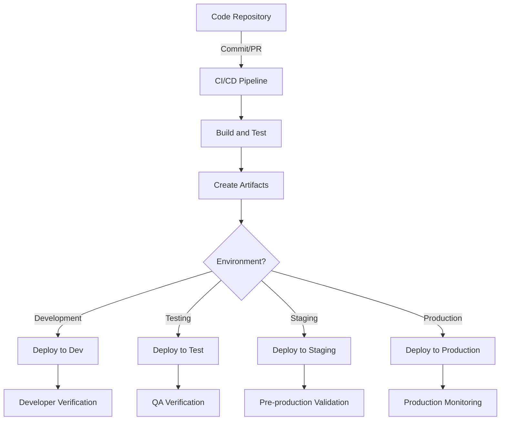
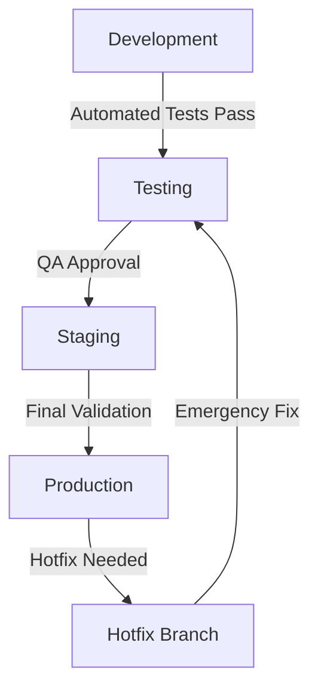

## Introduction

This document provides comprehensive guidance for deploying the Security Patrol application, including infrastructure provisioning, backend service deployment, mobile app distribution, and environment management. It covers both automated deployment through CI/CD pipelines and manual deployment procedures for all components of the system.

## Deployment Architecture

The Security Patrol application uses a multi-tier deployment architecture with separate components for the mobile application and backend services.

### Deployment Components

The deployment architecture consists of the following components:

1. **Infrastructure**: Azure cloud resources provisioned using Terraform
2. **Backend Services**: .NET-based API services deployed as Docker containers to Azure App Service
3. **Mobile Application**: .NET MAUI Android application distributed through Google Play Store
4. **Monitoring**: Azure Monitor, Application Insights, and App Center for monitoring and observability

These components are deployed and managed through a combination of automated CI/CD pipelines and manual procedures as documented in this guide.

### Deployment Environments

The Security Patrol application supports the following deployment environments:

| Environment | Purpose | Access | Update Frequency |
|------------|---------|--------|------------------|
| Development | Active development and testing | Development team | Continuous |
| Testing | QA and integration testing | Development and QA teams | On demand |
| Staging | Pre-production validation | Development, QA, and Operations teams | Before production releases |
| Production | Live application environment | End users | Scheduled releases only |

Each environment has its own isolated infrastructure and configuration to prevent cross-environment impacts.

### Deployment Flow

The deployment flow follows this general pattern:



This flow ensures that code changes are properly built, tested, and verified before reaching production.

## Prerequisites

Before beginning the deployment process, ensure that the following prerequisites are met.

### Required Tools

The following tools are required for deployment:

| Tool | Version | Purpose | Installation |
|------|---------|---------|-------------|
| Azure CLI | 2.40.0+ | Managing Azure resources | [Install Azure CLI](https://docs.microsoft.com/en-us/cli/azure/install-azure-cli) |
| Terraform | 1.3.0+ | Infrastructure provisioning | [Install Terraform](https://www.terraform.io/downloads.html) |
| Docker | 20.10.0+ | Container management | [Install Docker](https://docs.docker.com/get-docker/) |
| .NET SDK | 8.0.0+ | Building .NET applications | [Install .NET SDK](https://dotnet.microsoft.com/download) |
| Git | 2.30.0+ | Source code management | [Install Git](https://git-scm.com/downloads) |

These tools should be installed on the deployment machine or CI/CD runner.

### Required Permissions

The following permissions are required for deployment:

| Resource | Permission | Purpose |
|----------|------------|--------|
| Azure Subscription | Contributor | Resource provisioning and management |
| Azure AD | Application Administrator | Service principal creation |
| GitHub Repository | Write access | CI/CD workflow configuration |
| Google Play Console | Release Manager | Android app publishing |

For production deployments, it's recommended to use a service principal with the minimum required permissions rather than a user account.

### Required Secrets

The following secrets are required for deployment:

| Secret | Purpose | Storage Location |
|--------|---------|------------------|
| Azure Credentials | Authentication with Azure | GitHub Secrets / Azure Key Vault |
| Database Credentials | Database access | Azure Key Vault |
| Storage Account Keys | Blob storage access | Azure Key Vault |
| Android Signing Key | APK signing | GitHub Secrets / Secure Storage |
| Google Play API Key | Play Store publishing | GitHub Secrets |

All secrets should be stored securely and never committed to the repository.

## Infrastructure Deployment

The infrastructure for the Security Patrol application is provisioned using Terraform, which ensures consistent and repeatable deployments across all environments.

### Infrastructure Components

The infrastructure includes the following Azure resources:

| Resource | Purpose | Configuration |
|----------|---------|---------------|
| Resource Group | Logical container for resources | Per environment |
| App Service Plan | Hosting plan for API services | Standard S1 (2 instances) |
| App Service | Hosting for backend API | Linux with container support |
| SQL Database | Relational data storage | Standard S1 |
| Blob Storage | Photo and file storage | Hot tier with LRS |
| Key Vault | Secrets management | Standard tier |
| Application Insights | Application monitoring | Basic tier |
| Traffic Manager | Global routing and failover | Performance routing method |

These resources are defined in the Terraform configuration files in the `infrastructure/terraform` directory.

### Infrastructure Provisioning

To provision the infrastructure, use the `provision-infrastructure.sh` script:

```bash
# Navigate to the scripts directory
cd infrastructure/scripts

# Provision infrastructure for the specified environment
./provision-infrastructure.sh -e <environment> -a <apply_changes>
```

Where:
- `<environment>` is one of: dev, test, staging, prod
- `<apply_changes>` is true to apply changes, false to only plan changes

The script performs the following steps:

1. Initialize Terraform with the appropriate backend configuration
2. Select the appropriate Terraform workspace for the environment
3. Generate a Terraform plan for the changes
4. Apply the changes if approved
5. Output the resource information for use in subsequent deployment steps

For manual provisioning, you can use the following Terraform commands:

```bash
# Navigate to the Terraform directory
cd infrastructure/terraform

# Initialize Terraform
terraform init

# Select the appropriate workspace
terraform workspace select <environment>

# Create a plan
terraform plan -out=tfplan -var-file=environments/<environment>/terraform.tfvars

# Apply the plan
terraform apply tfplan
```

### Infrastructure Updates

To update existing infrastructure, follow the same process as provisioning. Terraform will detect the changes and create a plan that shows what will be added, changed, or removed.

For sensitive updates that require careful coordination (such as database changes), use the `-target` option to limit the scope of changes:

```bash
# Update only the App Service configuration
terraform plan -out=tfplan -var-file=environments/<environment>/terraform.tfvars -target=module.api

# Apply the targeted changes
terraform apply tfplan
```

Always review the plan carefully before applying changes to production infrastructure.

### Infrastructure Validation

After provisioning or updating infrastructure, validate that the resources are correctly configured:

1. Verify that all resources are created in the Azure Portal
2. Check resource connectivity and dependencies
3. Verify that resource tags are correctly applied
4. Ensure that monitoring is properly configured
5. Validate that security controls are in place

For automated validation, use the validation scripts in the `infrastructure/scripts` directory:

```bash
# Validate infrastructure for the specified environment
./validate-infrastructure.sh -e <environment>
```

The validation script checks resource existence, configuration, and connectivity to ensure that the infrastructure is ready for application deployment.

## Backend Deployment

The backend services for the Security Patrol application are deployed as Docker containers to Azure App Service.

### Backend Components

The backend consists of the following components:

| Component | Description | Deployment Artifact |
|-----------|-------------|---------------------|
| API Service | RESTful API for mobile app | Docker container |
| Database | Azure SQL Database | Migrations in API container |
| Storage | Azure Blob Storage | Configured through API |

These components are deployed together to ensure consistency and compatibility.

### Automated Deployment

The backend is automatically deployed through the GitHub Actions workflow defined in `.github/workflows/release.yml`. This workflow is triggered by the creation of a version tag or can be manually triggered.

The workflow performs the following steps for backend deployment:

1. Build the backend API project
2. Run tests to ensure quality
3. Build a Docker container image
4. Push the container image to Azure Container Registry
5. Deploy the container to Azure App Service
6. Run post-deployment validation tests

For details on the release workflow, see the [Release Process](../development/release-process.md) documentation.

### Manual Deployment

For manual deployment of the backend services, use the `deploy-backend.sh` script:

```bash
# Navigate to the scripts directory
cd infrastructure/scripts

# Deploy backend for the specified environment
./deploy-backend.sh -e <environment> -t <image_tag>
```

Where:
- `<environment>` is one of: dev, test, staging, prod
- `<image_tag>` is the tag for the Docker image (e.g., v1.0.0)

The script performs the following steps:

1. Build the Docker image for the backend API
2. Push the image to Azure Container Registry
3. Update App Service configuration with environment variables and connection strings
4. Deploy the container image to App Service
5. Test the deployment to verify functionality

For more control over the deployment process, the script supports additional options:

```bash
# Deploy to staging slot and swap after validation
./deploy-backend.sh -e prod -t v1.0.0 -s true -w true

# Skip building the Docker image and use existing image
./deploy-backend.sh -e prod -t v1.0.0 -b false

# Only build the Docker image without deploying
./deploy-backend.sh -e prod -t v1.0.0 -o true
```

See the script help for a complete list of options:

```bash
./deploy-backend.sh -h
```

### Database Migrations

Database migrations are automatically applied during application startup. The API service checks for pending migrations and applies them before accepting requests.

For manual control over migrations, use the following commands:

```bash
# Navigate to the API project directory
cd src/backend/SecurityPatrol.API

# Apply migrations
dotnet ef database update --connection "<connection_string>"

# Generate a SQL script for manual application
dotnet ef migrations script --output migration.sql --idempotent
```

For production deployments, it's recommended to generate and review the migration script before applying changes to ensure data integrity.

### Backend Configuration

The backend services are configured through environment variables and connection strings in Azure App Service. These settings are managed through the deployment process and stored in Azure Key Vault for security.

The following configuration categories are available:

1. **Application Settings**: General application configuration
2. **Connection Strings**: Database and storage connections
3. **Authentication Settings**: Identity and authentication configuration
4. **Feature Flags**: Toggles for enabling/disabling features

To update configuration manually:

```bash
# Update application settings
az webapp config appsettings set --resource-group <resource_group> --name <app_service_name> --settings "Setting1=Value1" "Setting2=Value2"

# Update connection strings
az webapp config connection-string set --resource-group <resource_group> --name <app_service_name> --connection-string-type SQLAzure --settings "Database=<connection_string>"
```

For sensitive settings, use Key Vault references:

```bash
az webapp config appsettings set --resource-group <resource_group> --name <app_service_name> --settings "SecretSetting=@Microsoft.KeyVault(SecretUri=https://myvault.vault.azure.net/secrets/mysecret/)"
```

### Backend Validation

After deployment, validate that the backend services are functioning correctly:

1. Check the health endpoint: `https://<app_service_name>.azurewebsites.net/health`
2. Verify API functionality with sample requests
3. Check logs in Application Insights for errors
4. Verify database connectivity and migrations
5. Test authentication and authorization

For automated validation, the deployment script includes basic health checks. For more comprehensive validation, use the API test suite:

```bash
# Run API tests against the deployed environment
cd src/test/API/SecurityPatrol.API.IntegrationTests
dotnet test --filter Category=EndToEnd -- TestRunParameters.Parameter(name="ApiUrl", value="https://<app_service_name>.azurewebsites.net")
```

## Mobile App Deployment

The Security Patrol mobile application is built using .NET MAUI and deployed to Android devices through the Google Play Store.

### Mobile App Components

The mobile app consists of the following components:

| Component | Description | Deployment Artifact |
|-----------|-------------|---------------------|
| MAUI Application | Cross-platform mobile app | APK/AAB file |
| App Resources | Images, fonts, and other assets | Included in APK/AAB |
| Configuration | Environment-specific settings | Included in APK/AAB |

These components are packaged together into a single deployment artifact.

### Automated Deployment

The mobile app is automatically built and published through the GitHub Actions workflow defined in `.github/workflows/release.yml`. This workflow is triggered by the creation of a version tag or can be manually triggered.

The workflow performs the following steps for mobile app deployment:

1. Build the MAUI Android project
2. Run tests to ensure quality
3. Sign the APK with the release key
4. Generate an Android App Bundle (AAB)
5. Upload the AAB to Google Play Store
6. Publish to the appropriate track (internal, alpha, beta, or production)

For details on the release workflow, see the [Release Process](../development/release-process.md) documentation.

### Manual Deployment

For manual building and deployment of the mobile app:

1. **Build the APK**:

```bash
# Navigate to the mobile app project directory
cd src/android/SecurityPatrol

# Build the release APK
dotnet build -c Release -f net8.0-android
```

2. **Sign the APK**:

```bash
# Sign the APK with the release key
dotnet build -c Release -f net8.0-android \
  -p:AndroidKeyStore=true \
  -p:AndroidSigningKeyStore=securitypatrol.keystore \
  -p:AndroidSigningKeyAlias=securitypatrol \
  -p:AndroidSigningKeyPass=<key_password> \
  -p:AndroidSigningStorePass=<store_password>
```

3. **Generate AAB** (for Google Play):

```bash
# Generate Android App Bundle
dotnet publish -c Release -f net8.0-android \
  -p:AndroidKeyStore=true \
  -p:AndroidSigningKeyStore=securitypatrol.keystore \
  -p:AndroidSigningKeyAlias=securitypatrol \
  -p:AndroidSigningKeyPass=<key_password> \
  -p:AndroidSigningStorePass=<store_password>
```

4. **Upload to Google Play**:
   - Log in to the [Google Play Console](https://play.google.com/console)
   - Navigate to the Security Patrol app
   - Select "Production" or another track
   - Upload the AAB file
   - Update release notes and metadata
   - Submit for review and release

### Mobile App Configuration

The mobile app is configured through the following mechanisms:

1. **Build-time Configuration**:
   - Environment-specific constants in `src/android/SecurityPatrol/Constants/AppConstants.cs`
   - API endpoints in `src/android/SecurityPatrol/Constants/ApiEndpoints.cs`
   - Feature flags in build properties

2. **Runtime Configuration**:
   - Settings retrieved from backend API
   - User preferences stored locally
   - Dynamic configuration for feature toggles

To update build-time configuration for different environments:

```bash
# Build with specific environment configuration
dotnet build -c Release -f net8.0-android -p:Environment=Production
```

The `Environment` property determines which configuration values are used during the build process.

### App Store Deployment

The Security Patrol app is distributed through the Google Play Store using the following tracks:

| Track | Purpose | Audience | Update Frequency |
|-------|---------|----------|------------------|
| Internal Testing | Early testing | Development team | As needed |
| Closed Testing | Beta testing | Selected testers | Before production |
| Production | Live app | All users | Scheduled releases |

For staged rollouts to production:

1. Release to internal testing track first
2. Promote to closed testing with selected testers
3. Gradually roll out to production users (10%, 25%, 50%, 100%)
4. Monitor crash reports and user feedback at each stage

This approach minimizes risk by catching issues before they affect all users.

### Mobile App Validation

After deployment, validate that the mobile app is functioning correctly:

1. Install the app on test devices from the appropriate track
2. Verify authentication with the backend
3. Test core functionality (clock in/out, patrol management)
4. Check offline operation and synchronization
5. Verify proper handling of device permissions

For automated validation, use the UI test suite:

```bash
# Run UI tests against the deployed app
cd src/test/MAUI/SecurityPatrol.MAUI.UITests
dotnet test --filter Category=Smoke
```

Additionally, monitor App Center for crash reports and analytics to identify any issues affecting users.

## Environment Management

Proper environment management ensures consistent and reliable deployments across all stages of the application lifecycle.

### Environment Configuration

Each environment has its own configuration to support different requirements:

| Environment | Infrastructure | Backend | Mobile App |
|------------|---------------|---------|------------|
| Development | Minimal resources | Debug mode | Debug build |
| Testing | Standard resources | Test mode | Test build |
| Staging | Production-like | Production mode | Release build |
| Production | Full resources | Production mode | Release build |

Environment-specific configuration is managed through:

1. **Terraform Variables**: `infrastructure/terraform/environments/<env>/terraform.tfvars`
2. **App Settings**: Environment-specific settings in Azure App Service
3. **Build Properties**: Environment-specific build configurations

This separation ensures that each environment is properly isolated while maintaining consistency in the deployment process.

### Environment Promotion

Changes are promoted through environments in a controlled manner:



The promotion process includes:

1. **Development to Testing**:
   - Automated tests must pass
   - Code review must be completed
   - Build artifacts are promoted to testing environment

2. **Testing to Staging**:
   - QA testing must be completed
   - All critical and high-priority bugs must be fixed
   - Release candidate is created

3. **Staging to Production**:
   - Final validation must be successful
   - Stakeholder approval must be obtained
   - Release is scheduled and communicated

This process ensures that only thoroughly tested and validated changes reach production.

### Configuration Management

Configuration is managed differently for each component:

1. **Infrastructure Configuration**:
   - Stored in Terraform files in version control
   - Environment-specific variables in separate files
   - Sensitive values in Azure Key Vault

2. **Backend Configuration**:
   - Environment variables in Azure App Service
   - Connection strings securely stored
   - Feature flags for runtime configuration

3. **Mobile App Configuration**:
   - Build-time constants for environment-specific values
   - Runtime configuration from backend API
   - User preferences stored securely on device

All configuration changes should follow the change management process and be properly documented.

### Secrets Management

Secrets are managed securely using the following approaches:

1. **Infrastructure Secrets**:
   - Stored in Azure Key Vault
   - Referenced in Terraform using Key Vault data sources
   - Access controlled through Azure RBAC

2. **Backend Secrets**:
   - Stored in Azure Key Vault
   - Referenced in App Service using Key Vault references
   - Rotated according to security policy

3. **CI/CD Secrets**:
   - Stored in GitHub Secrets
   - Used only during build and deployment
   - Access restricted to authorized workflows

4. **Mobile App Secrets**:
   - No secrets stored in mobile app code
   - Authentication handled through secure tokens
   - Sensitive data stored in secure storage

Never store secrets in code, configuration files, or logs. Always use the appropriate secrets management solution.

## Monitoring Setup

Monitoring is an essential part of the deployment process, ensuring that the application is functioning correctly and providing visibility into its performance and usage.

### Monitoring Components

The monitoring infrastructure includes the following components:

| Component | Purpose | Configuration |
|-----------|---------|---------------|
| Application Insights | Application performance monitoring | Connected to backend API |
| Azure Monitor | Resource monitoring and alerting | Configured for all Azure resources |
| Log Analytics | Centralized logging and analysis | Collects logs from all components |
| App Center Analytics | Mobile app usage and crash reporting | Integrated with MAUI app |

These components work together to provide a comprehensive view of the application's health and performance.

### Monitoring Deployment

Monitoring is deployed as part of the infrastructure provisioning process using Terraform. The monitoring module in the Terraform configuration creates and configures the necessary resources.

For manual setup or updates to monitoring configuration, use the `setup-monitoring.ps1` script:

```powershell
# Navigate to the scripts directory
cd infrastructure/scripts

# Set up monitoring for the specified environment
./setup-monitoring.ps1 -Environment <environment> -ResourceGroupName <resource_group> -AppServiceName <app_service_name>
```

The script performs the following steps:

1. Create or update Application Insights resources
2. Configure diagnostic settings for all resources
3. Set up metric alerts for critical components
4. Create availability tests for API health checks
5. Configure action groups for alert notifications
6. Create monitoring dashboards for different stakeholders

### Alert Configuration

Alerts are configured to notify the appropriate teams when issues occur:

| Alert | Threshold | Severity | Notification |
|-------|-----------|----------|-------------|
| API Response Time | > 1000ms | 2 (Warning) | Email + Slack |
| API Failure Rate | > 5% | 1 (Critical) | Email + SMS + Slack |
| Database DTU | > 80% | 2 (Warning) | Email + Slack |
| Storage Capacity | > 80% | 3 (Informational) | Email |
| Authentication Failures | > 10 in 5 minutes | 1 (Critical) | Email + SMS + Slack |
| Mobile App Crash Rate | > 1% | 2 (Warning) | Email + Slack |

Alerts are configured using Azure Monitor Alert Rules and App Center Alerts, with appropriate thresholds and notification channels based on severity and impact.

To update alert configuration:

```bash
# Create or update an alert rule
az monitor metrics alert create --name "High API Response Time" \
  --resource-group <resource_group> \
  --scopes <app_insights_id> \
  --condition "avg request/duration > 1000" \
  --window-size 5m \
  --evaluation-frequency 1m \
  --action-group <action_group_id> \
  --severity 2
```

### Dashboard Setup

Monitoring dashboards are created for different stakeholders to provide visibility into the application's health and performance:

1. **Executive Dashboard**: High-level metrics for business stakeholders
2. **Technical Dashboard**: Detailed performance metrics for the development team
3. **Operations Dashboard**: Real-time status and alerts for the operations team
4. **User Experience Dashboard**: Usage patterns and user experience metrics

Dashboards are created as part of the monitoring setup process and can be accessed through the Azure Portal.

To create or update dashboards manually:

```bash
# Create a dashboard from a template
az portal dashboard create --resource-group <resource_group> \
  --name "SecurityPatrol-TechnicalDashboard" \
  --location <location> \
  --input-path dashboards/technical-dashboard.json
```

Dashboard templates are stored in the `infrastructure/dashboards` directory.

### Logging Configuration

Logging is configured to capture relevant information for troubleshooting and analysis:

| Component | Log Level | Storage | Retention |
|-----------|-----------|---------|----------|
| Backend API | Information (Production) | App Insights + Log Analytics | 30 days |
| Backend API | Debug (Non-Production) | App Insights + Log Analytics | 14 days |
| Infrastructure | All activity | Activity Log + Log Analytics | 90 days |
| Mobile App | Warning and above | App Center | 90 days |

Logging configuration is managed through:

1. **Backend API**: `appsettings.json` and environment-specific settings
2. **Infrastructure**: Diagnostic settings in Azure resources
3. **Mobile App**: TelemetryService configuration

To update logging configuration for the backend API:

```bash
# Update logging settings
az webapp config appsettings set --resource-group <resource_group> --name <app_service_name> --settings "Logging:LogLevel:Default=Information" "Logging:LogLevel:Microsoft=Warning"
```

### Monitoring Best Practices

Follow these best practices when configuring and using monitoring:

1. **Establish Baselines**: Determine normal performance patterns before setting alert thresholds
2. **Focused Alerting**: Configure alerts only for actionable issues to avoid alert fatigue
3. **Correlation**: Set up correlation between related metrics for better root cause analysis
4. **Aggregation**: Use log aggregation to centralize monitoring data
5. **Trend Analysis**: Review performance trends regularly to identify degradation
6. **Automated Remediation**: Where possible, implement automated responses to common issues
7. **Documentation**: Keep monitoring configuration documented and up-to-date

These practices help ensure effective monitoring that provides value without overwhelming operators with unnecessary alerts.

## Deployment Verification

After deployment, verification steps ensure that the application is functioning correctly in all environments.

### Smoke Testing

Immediately after deployment, smoke tests verify that the application is functioning correctly:

1. **Backend API Verification**:
   - Verify health check endpoint returns 200 OK
   - Test authentication endpoints
   - Verify key API functionality with sample requests

2. **Mobile App Verification**:
   - Verify app installation on test devices
   - Test login functionality
   - Verify core features (clock in/out, patrol management)

Smoke tests are automated where possible and included in the deployment process. For manual smoke testing, follow the checklist in the [Release Verification](../development/release-process.md#release-verification) documentation.

### Integration Testing

After smoke testing, integration tests verify that all components work together correctly:

1. **End-to-End Flows**:
   - Complete authentication flow
   - Clock in/out process
   - Patrol management and checkpoint verification
   - Photo capture and synchronization
   - Activity reporting

2. **Cross-Component Integration**:
   - Mobile app to backend API communication
   - Backend API to database operations
   - Backend API to blob storage operations

Integration tests are automated using the end-to-end test suite:

```bash
# Run end-to-end tests against the deployed environment
cd src/test/EndToEnd/SecurityPatrol.E2ETests
dotnet test --filter Category=E2E -- TestRunParameters.Parameter(name="ApiUrl", value="https://<app_service_name>.azurewebsites.net")
```

### Performance Validation

Performance validation ensures that the application meets its performance targets:

| Metric | Target | Measurement Method |
|--------|--------|-------------------|
| API Response Time | < 500ms | Application Insights |
| Mobile App Startup | < 2s | App Center Analytics |
| Database Performance | < 60% DTU | Azure Monitor |
| Map Rendering | < 1s | Custom timing events |

Performance validation is performed using a combination of automated tests and monitoring tools. For detailed performance testing, use the performance test suite:

```bash
# Run performance tests against the deployed environment
cd src/test/API/SecurityPatrol.API.PerformanceTests
dotnet test --filter Category=Performance -- TestRunParameters.Parameter(name="ApiUrl", value="https://<app_service_name>.azurewebsites.net")
```

### Security Validation

Security validation ensures that the application meets its security requirements:

1. **Authentication and Authorization**:
   - Verify that authentication is required for protected endpoints
   - Test authorization rules for different operations
   - Verify token validation and expiration handling

2. **Data Protection**:
   - Verify that sensitive data is encrypted in transit and at rest
   - Test secure storage of authentication tokens
   - Verify proper handling of user data

3. **Vulnerability Scanning**:
   - Run automated security scans against the deployed application
   - Verify that no critical vulnerabilities are present
   - Check for secure configuration of all components

Security validation is performed using a combination of automated tools and manual testing. For automated security testing, use the security test suite:

```bash
# Run security tests against the deployed environment
cd src/test/SecurityScanning/SecurityPatrol.SecurityTests
dotnet test --filter Category=Security -- TestRunParameters.Parameter(name="ApiUrl", value="https://<app_service_name>.azurewebsites.net")
```

### Monitoring Verification

Verify that monitoring is properly configured and functioning:

1. **Telemetry Collection**:
   - Verify that Application Insights is receiving telemetry
   - Check that App Center is collecting analytics and crash reports
   - Verify that logs are flowing to Log Analytics

2. **Alert Configuration**:
   - Test alert rules by triggering test conditions
   - Verify that notifications are sent to the correct recipients
   - Check that alert suppression and grouping work as expected

3. **Dashboard Functionality**:
   - Verify that all dashboards are accessible
   - Check that metrics are being displayed correctly
   - Verify that dashboard refresh is working

Monitoring verification is performed manually by accessing the monitoring tools and checking their configuration and data collection.

## Rollback Procedures

Despite thorough testing, issues may still occur in production. This section details the procedures for rolling back a deployment if necessary.

### Backend Rollback

To roll back the backend services:

1. **Using Deployment Slots**:
   ```bash
   # Swap back to the previous version
   az webapp deployment slot swap -g <resource_group> -n <app_service_name> --slot staging --target-slot production
   ```

2. **Using Container Rollback**:
   ```bash
   # Revert to the previous container image
   az webapp config container set -g <resource_group> -n <app_service_name> --docker-custom-image-name <previous_image_tag>
   ```

3. **Database Rollback** (if necessary):
   ```bash
   # Restore database from point-in-time backup
   az sql db restore -g <resource_group> -s <server_name> -n <database_name> --dest-name <database_name>-restored --time "<backup_time>"
   ```

4. **Verification After Rollback**:
   - Verify API health check endpoint
   - Test key functionality
   - Verify database connectivity
   - Check logs for errors

### Mobile App Rollback

Rolling back a mobile app is more challenging since users have already installed the new version. The following approaches can be used:

1. **Google Play Staged Rollout**:
   - If using staged rollout, halt the rollout immediately
   - Revert to the previous version in Google Play Console
   - Users who haven't updated will receive the previous version

2. **Server-Side Feature Flags**:
   - Disable problematic features via server-side configuration
   - This allows quick mitigation without requiring app updates

3. **Emergency Patch Release**:
   - If rollback is not possible, prepare an emergency patch
   - Expedite the release process for critical fixes
   - Communicate with users about the issue and upcoming fix

### Infrastructure Rollback

For infrastructure changes that need to be rolled back:

1. **Using Terraform**:
   ```bash
   # Roll back to previous infrastructure state
   cd infrastructure/terraform
   terraform workspace select <environment>
   terraform plan -out=rollback.tfplan -var-file=environments/<environment>/terraform.tfvars -target=module.specific_resource
   terraform apply rollback.tfplan