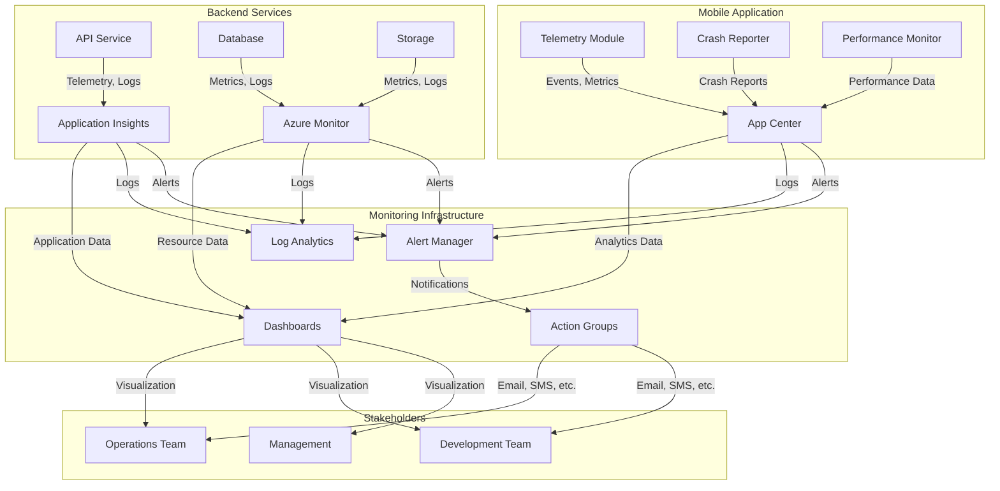

## Introduction

This document provides comprehensive guidance on monitoring the Security Patrol application, including infrastructure monitoring, application performance monitoring, alerting, and observability. It covers the monitoring architecture, configuration, and best practices to ensure reliable operation and provide insights into application performance and usage patterns.

Effective monitoring is essential for maintaining the reliability, performance, and security of the Security Patrol application. This document serves as a reference for operations teams, developers, and stakeholders responsible for monitoring and maintaining the application.

## Monitoring Architecture

The Security Patrol application implements a comprehensive monitoring architecture that spans all components of the system, from backend infrastructure to the mobile application.

### Monitoring Components

The monitoring infrastructure includes the following components:

| Component | Purpose | Configuration |
|-----------|---------|---------------|
| Azure Monitor | Resource monitoring and alerting | Configured for all Azure resources |
| Application Insights | Application performance monitoring | Connected to backend API |
| Log Analytics | Centralized logging and analysis | Collects logs from all components |
| App Center Analytics | Mobile app usage and crash reporting | Integrated with MAUI app |

These components work together to provide a comprehensive view of the application's health and performance across all layers of the stack.

### Monitoring Flow

The monitoring data flows through the system as follows:



This architecture ensures that monitoring data is collected from all components, aggregated for analysis, and presented to stakeholders in a meaningful way.

### Monitoring Scope

The monitoring system covers the following areas:

1. **Infrastructure Monitoring**:
   - Azure resource health and availability
   - Resource utilization and performance
   - Capacity and scaling metrics
   - Network connectivity and latency

2. **Application Performance Monitoring**:
   - API response times and throughput
   - Database query performance
   - Exception rates and error patterns
   - Dependency performance and availability

3. **Mobile App Monitoring**:
   - Crash rates and stability
   - Performance metrics (startup time, screen load times)
   - Feature usage and user engagement
   - Network request performance

4. **Business Metrics**:
   - User activity and adoption
   - Patrol completion rates
   - Clock in/out compliance
   - Feature utilization

This comprehensive scope ensures visibility into all aspects of the application's operation.

### Data Collection

Data is collected from various sources using different mechanisms:

| Data Source | Collection Method | Data Types | Storage |
|------------|-------------------|-----------|--------|
| Backend API | Application Insights SDK | Requests, dependencies, exceptions, custom events | Application Insights |
| Azure Resources | Azure Monitor | Metrics, activity logs, diagnostic logs | Azure Monitor Metrics, Log Analytics |
| Database | Azure Monitor | Query performance, DTU usage, storage | Azure Monitor Metrics, Log Analytics |
| Storage | Azure Monitor | Transactions, capacity, availability | Azure Monitor Metrics, Log Analytics |
| Mobile App | App Center SDK | Events, crashes, analytics, custom metrics | App Center |

Collection frequency varies by data type:
- High-frequency metrics: Collected every minute (e.g., API response time)
- Standard metrics: Collected every 5 minutes (e.g., resource utilization)
- Logs: Collected in real-time or near-real-time
- Custom events: Collected as they occur

### Data Retention

Monitoring data is retained according to the following policies:

| Data Type | Retention Period | Storage Location | Archival Strategy |
|-----------|------------------|------------------|-------------------|
| Metrics | 93 days | Azure Monitor | Export to storage for long-term retention |
| Application Insights | 90 days | Application Insights | Continuous export to storage for long-term retention |
| Logs | 30 days | Log Analytics | Export to storage for long-term retention |
| App Center Analytics | 90 days | App Center | Export via API for long-term retention |
| Alerts History | 90 days | Azure Monitor | Export to storage for audit purposes |

Longer retention periods can be configured for compliance or analysis purposes, but may incur additional storage costs.

## Monitoring Configuration

This section details the configuration of monitoring components for the Security Patrol application.

### Azure Monitor Configuration

Azure Monitor is configured to collect metrics and logs from all Azure resources used by the application:

1. **Diagnostic Settings**:
   - All resources have diagnostic settings enabled
   - Logs are sent to Log Analytics workspace
   - Metrics are collected at 1-minute intervals
   - Resource-specific logs are enabled as appropriate

2. **Metric Alerts**:
   - Configured for critical resource metrics
   - Thresholds set based on performance requirements
   - Action groups configured for notifications
   - Severity levels assigned based on business impact

3. **Activity Log Alerts**:
   - Service health alerts enabled
   - Administrative operation alerts enabled
   - Security alerts enabled
   - Resource health alerts enabled

Azure Monitor configuration is managed through the `setup-monitoring.ps1` script, which can be run with the following parameters:

```powershell
./setup-monitoring.ps1 -Environment production -ResourceGroupName "securitypatrol-prod-rg" -AppServiceName "securitypatrol-api" -AlertEmailAddress "alerts@example.com"
```

### Application Insights Configuration

Application Insights is configured to monitor the backend API services:

1. **SDK Integration**:
   - Application Insights SDK integrated into API project
   - Configured for automatic collection of:
     - Requests and dependencies
     - Exceptions and traces
     - Performance counters
     - Custom events and metrics

2. **Sampling Configuration**:
   - Adaptive sampling enabled to manage telemetry volume
   - Critical events excluded from sampling
   - Sampling percentage adjusted based on traffic volume

3. **Custom Telemetry**:
   - Custom events for business processes
   - Custom metrics for performance monitoring
   - Custom dependencies for external service calls
   - Custom availability tests for critical endpoints

4. **Availability Tests**:
   - URL ping tests for key API endpoints
   - Multi-step web tests for critical workflows
   - Tests run from multiple geographic locations
   - Alerts configured for availability failures

Application Insights is configured in the API project's `Program.cs` file:

```csharp
builder.Services.AddApplicationInsightsTelemetry(options =>
{
    options.ConnectionString = builder.Configuration["ApplicationInsights:ConnectionString"];
    options.EnableAdaptiveSampling = true;
    options.EnableQuickPulseMetricStream = true;
});
```

### Log Analytics Configuration

Log Analytics is configured as the central repository for logs from all components:

1. **Workspace Configuration**:
   - Separate workspaces for each environment
   - Retention period set to 30 days
   - Daily cap configured to manage costs
   - Query timeout set to 10 minutes

2. **Data Collection**:
   - Azure Monitor diagnostic logs
   - Application Insights logs
   - Activity logs
   - Custom logs as needed

3. **Log Queries**:
   - Saved queries for common analysis scenarios
   - Custom query alerts for complex conditions
   - Workbooks for interactive analysis
   - Dashboards for visualization

4. **Access Control**:
   - Role-based access control implemented
   - Read-only access for most users
   - Query permissions for analysts
   - Administrative access restricted

Log Analytics workspace is created and configured through the `setup-monitoring.ps1` script:

```powershell
$workspace = New-LogAnalyticsWorkspace -ResourceGroupName $ResourceGroupName -Name "$AppServiceName-logs" -Location $Location -RetentionDays 30
```

### App Center Configuration

App Center is configured to monitor the mobile application:

1. **SDK Integration**:
   - App Center SDK integrated into MAUI project
   - Analytics module enabled for usage tracking
   - Crashes module enabled for crash reporting
   - Diagnostics module enabled for device information

2. **Event Tracking**:
   - Custom events for feature usage
   - Page view tracking for navigation analysis
   - User property tracking for segmentation
   - Custom properties for contextual information

3. **Crash Reporting**:
   - Automatic crash reporting enabled
   - Crash groups for categorization
   - Symbolication for readable stack traces
   - Attachments for additional context

4. **Distribution Groups**:
   - Test group for internal testing
   - Beta group for pre-release testing
   - Production group for released versions

App Center is initialized in the mobile app's `TelemetryService.cs` file:

```csharp
private void InitializeAppCenter()
{
    if (_isInitialized)
        return;

    var services = new List<Type>();
    
    if (AppConstants.EnableTelemetry)
        services.Add(typeof(Analytics));
        
    if (AppConstants.EnableCrashReporting)
        services.Add(typeof(Crashes));
    
    AppCenter.Start("your-app-center-secret-here", services.ToArray());
    _isInitialized = true;
    
    _logger.LogInformation("App Center initialized with {ServiceCount} services", services.Count);
}
```

### Dashboard Configuration

Monitoring dashboards are configured for different stakeholders:

1. **Executive Dashboard**:
   - High-level metrics for business stakeholders
   - User adoption and engagement
   - System health status
   - Critical incidents overview

2. **Technical Dashboard**:
   - Detailed performance metrics for the development team
   - API performance and errors
   - Database performance
   - Exception trends and details
   - Dependency performance

3. **Operations Dashboard**:
   - Real-time status and alerts for the operations team
   - Resource utilization and capacity
   - Active sessions and traffic
   - Current incidents and status
   - SLA compliance metrics

4. **User Experience Dashboard**:
   - Mobile app performance and stability
   - Feature usage patterns
   - User flows and conversion rates
   - Error rates and impact

Dashboards are created using the `New-Dashboard` function in the `setup-monitoring.ps1` script:

```powershell
New-Dashboard -ResourceGroupName $ResourceGroupName -Name "SecurityPatrol-TechnicalDashboard" -Location $Location -AppInsightsId $appInsights.Id -DashboardType "Technical"
```

### Alert Configuration

Alerts are configured to notify the appropriate teams when issues occur:

| Alert | Threshold | Severity | Notification |
|-------|-----------|----------|-------------|
| API Response Time | > 1000ms | 2 (Warning) | Email + Slack |
| API Failure Rate | > 5% | 1 (Critical) | SMS + Email + Slack |
| Database DTU | > 80% | 2 (Warning) | Email + Slack |
| Storage Capacity | > 80% | 3 (Informational) | Email |
| Authentication Failures | > 10 in 5 minutes | 1 (Critical) | SMS + Email + Slack |
| Mobile App Crash Rate | > 1% | 2 (Warning) | Email + Slack |

Alerts are configured using the `New-MetricAlert` function in the `setup-monitoring.ps1` script:

```powershell
New-MetricAlert -ResourceGroupName $ResourceGroupName -Name "High API Response Time" -Description "Alert when API response time exceeds threshold" -Severity 2 -ResourceId $appService.Id -MetricName "HttpResponseTime" -Operator "GreaterThan" -Threshold 1000 -Aggregation "Average" -ActionGroupId $actionGroup.Id
```

For detailed alert configuration and response procedures, see the [Alerts](./alerts.md) documentation.

## Monitoring Implementation

This section details how monitoring is implemented in different components of the Security Patrol application.

### Backend API Monitoring

The backend API is monitored using Application Insights and custom telemetry:

1. **Request Monitoring**:
   - Automatic tracking of HTTP requests
   - Response time and status code tracking
   - Dependency tracking for database and external services
   - Custom operation tracking for complex workflows

2. **Performance Monitoring**:
   - Server response time metrics
   - CPU and memory usage
   - Request rate and throughput
   - Dependency performance

3. **Exception Monitoring**:
   - Automatic tracking of unhandled exceptions
   - Custom exception tracking with context
   - Exception trends and patterns
   - Stack trace analysis

4. **Custom Telemetry**:
   - Business process tracking
   - Authentication and authorization events
   - Data synchronization events
   - Feature usage tracking

Example of custom telemetry in the backend API:

```csharp
// Track a business process event
_telemetry.TrackEvent("PatrolCheckpointVerified", new Dictionary<string, string>
{
    { "UserId", userId },
    { "CheckpointId", checkpointId.ToString() },
    { "PatrolId", patrolId.ToString() },
    { "Latitude", latitude.ToString() },
    { "Longitude", longitude.ToString() }
});

// Track a performance metric
_telemetry.TrackMetric("DatabaseQueryDuration", duration.TotalMilliseconds);

// Track an exception with context
try
{
    // Operation that might fail
}
catch (Exception ex)
{
    _telemetry.TrackException(ex, new Dictionary<string, string>
    {
        { "Operation", "SyncData" },
        { "UserId", userId },
        { "DataType", dataType }
    });
    throw;
}
```

### Mobile App Monitoring

The mobile application is monitored using App Center and the TelemetryService:

1. **Usage Analytics**:
   - Screen views and navigation flows
   - Feature usage and engagement
   - Session duration and frequency
   - User properties and segments

2. **Performance Monitoring**:
   - App startup time
   - Screen load times
   - API request performance
   - Battery and memory usage

3. **Crash Reporting**:
   - Automatic crash detection and reporting
   - Crash analysis and grouping
   - Affected devices and OS versions
   - Stack traces and context information

4. **Custom Events**:
   - User actions and workflows
   - Business process completion
   - Error conditions and handling
   - Sync operations and status

Example of using the TelemetryService in the mobile app:

```csharp
// Track page view
_telemetryService.TrackPageView("PatrolMapPage");

// Track feature usage
_telemetryService.TrackEvent("VerifyCheckpoint", new Dictionary<string, string>
{
    { "CheckpointId", checkpoint.Id.ToString() },
    { "PatrolId", patrol.Id.ToString() },
    { "IsWithinRange", isWithinRange.ToString() }
});

// Track API call performance
var stopwatch = Stopwatch.StartNew();
try
{
    var result = await _apiService.GetAsync<PatrolData>("patrol/checkpoints");
    stopwatch.Stop();
    _telemetryService.TrackApiCall("patrol/checkpoints", stopwatch.Elapsed, true, "200");
    return result;
}
catch (Exception ex)
{
    stopwatch.Stop();
    _telemetryService.TrackApiCall("patrol/checkpoints", stopwatch.Elapsed, false, ex.Message);
    _telemetryService.TrackException(ex);
    throw;
}
```

### Database Monitoring

The database is monitored using Azure Monitor and custom metrics:

1. **Performance Monitoring**:
   - DTU/CPU utilization
   - Query performance and duration
   - Wait statistics and blocking
   - Storage usage and growth

2. **Query Monitoring**:
   - Slow query detection
   - Query plan analysis
   - Index usage and missing indexes
   - Parameter sniffing issues

3. **Availability Monitoring**:
   - Database connectivity
   - Failover events
   - Backup success and restore tests
   - Replication health

4. **Security Monitoring**:
   - Login failures
   - Permission changes
   - Data access patterns
   - Vulnerability assessments

Example Kusto query for database performance analysis:

```kusto
AzureMetrics
| where ResourceProvider == "MICROSOFT.SQL"
| where MetricName == "dtu_consumption_percent"
| where TimeGenerated > ago(24h)
| summarize avg(Average), max(Average) by bin(TimeGenerated, 15m)
| render timechart
```

### Storage Monitoring

Blob storage is monitored using Azure Monitor and custom metrics:

1. **Capacity Monitoring**:
   - Storage usage and growth
   - Container size trends
   - Blob count and size distribution
   - Quota usage and limits

2. **Performance Monitoring**:
   - Transaction rates and latency
   - Throttling events
   - Bandwidth usage
   - Cache hit ratio

3. **Availability Monitoring**:
   - Service availability
   - Authentication failures
   - Error rates by error type
   - Replication health

4. **Security Monitoring**:
   - Anonymous access attempts
   - Shared access signature usage
   - Network access patterns
   - Data access auditing

Example Kusto query for storage capacity analysis:

```kusto
AzureMetrics
| where ResourceProvider == "MICROSOFT.STORAGE"
| where MetricName == "UsedCapacity"
| where TimeGenerated > ago(30d)
| summarize avg(Average) by bin(TimeGenerated, 1d)
| render timechart
```

### Infrastructure Monitoring

The underlying infrastructure is monitored using Azure Monitor:

1. **Resource Health**:
   - Service health and availability
   - Resource provisioning state
   - Planned maintenance events
   - Service issues and outages

2. **Network Monitoring**:
   - Connectivity between components
   - Latency and throughput
   - DNS resolution
   - Network security group flow logs

3. **Capacity Monitoring**:
   - Resource utilization trends
   - Scaling events and triggers
   - Resource limits and quotas
   - Cost analysis and optimization

4. **Security Monitoring**:
   - Security Center recommendations
   - Vulnerability assessments
   - Compliance status
   - Threat detection alerts

Example Azure CLI command for checking resource health:

```bash
az resource show --ids /subscriptions/{subscription-id}/resourceGroups/{resource-group}/providers/Microsoft.Web/sites/{app-service-name} --include-resource-health
```

## Observability Patterns

This section describes the observability patterns implemented in the Security Patrol application to ensure comprehensive visibility into its behavior and performance.

### Health Checks

Health checks provide real-time status information about application components:

1. **API Health Endpoints**:
   - `/health` endpoint for overall health
   - `/health/ready` for readiness checks
   - `/health/live` for liveness checks
   - Component-specific health checks

2. **Database Health Checks**:
   - Connection availability
   - Query execution capability
   - Replication status
   - Backup status

3. **Storage Health Checks**:
   - Blob storage accessibility
   - Container existence
   - Read/write capability
   - Permissions verification

4. **Mobile App Health Checks**:
   - API connectivity
   - Local storage access
   - Device permission status
   - Background service status

Health checks are implemented in the backend API using the ASP.NET Core health checks middleware:

```csharp
public void ConfigureServices(IServiceCollection services)
{
    services.AddHealthChecks()
        .AddSqlServer(Configuration.GetConnectionString("DefaultConnection"), name: "database")
        .AddAzureBlobStorage(Configuration["Storage:ConnectionString"], name: "blobstorage")
        .AddCheck<ApiDependencyHealthCheck>("api-dependencies")
        .AddCheck<BackgroundServiceHealthCheck>("background-services");
}

public void Configure(IApplicationBuilder app)
{
    app.UseHealthChecks("/health", new HealthCheckOptions
    {
        ResponseWriter = UIResponseWriter.WriteHealthCheckUIResponse
    });
    
    app.UseHealthChecks("/health/ready", new HealthCheckOptions
    {
        Predicate = check => check.Tags.Contains("ready"),
        ResponseWriter = UIResponseWriter.WriteHealthCheckUIResponse
    });
    
    app.UseHealthChecks("/health/live", new HealthCheckOptions
    {
        Predicate = _ => true,
        ResponseWriter = UIResponseWriter.WriteHealthCheckUIResponse
    });
}
```

### Performance Metrics

Key performance metrics are collected and monitored to ensure the application meets its performance targets:

| Metric | Target | Warning Threshold | Critical Threshold |
|--------|--------|-------------------|-------------------|
| API Response Time | < 500ms | > 1000ms | > 3000ms |
| Database DTU | < 60% | > 80% | > 90% |
| Memory Usage | < 70% | > 85% | > 95% |
| Mobile App Crash Rate | < 0.5% | > 1% | > 3% |
| App Startup Time | < 2 seconds | > 4 seconds | > 6 seconds |
| Map Rendering Time | < 1 second | > 2 seconds | > 4 seconds |
| Photo Upload Time | < 3 seconds | > 5 seconds | > 10 seconds |
| Sync Completion Rate | > 99% | < 95% | < 90% |

Performance metrics are collected through a combination of:
- Application Insights performance counters
- Custom application metrics
- Azure Monitor resource metrics
- App Center analytics

Example of tracking a custom performance metric in the backend API:

```csharp
public async Task<IActionResult> UploadPhoto(PhotoUploadRequest request)
{
    var stopwatch = Stopwatch.StartNew();
    var result = await _photoService.ProcessAndStorePhotoAsync(request);
    stopwatch.Stop();
    
    _telemetry.TrackMetric("PhotoProcessingTime", stopwatch.ElapsedMilliseconds);
    
    return Ok(result);
}
```

### Business Metrics

Business metrics provide insights into how effectively the application is supporting security operations:

| Metric | Purpose | Target | Data Source |
|--------|---------|--------|------------|
| Active Users | Usage tracking | > 90% of security staff | Session starts |
| Patrol Completion Rate | Operational efficiency | > 95% completion | Checkpoint verifications |
| Clock Compliance | Time tracking accuracy | < 5% missed clocks | Clock events |
| Report Submission | Documentation compliance | > 1 report per shift | Report submissions |
| Photo Documentation | Visual evidence collection | As needed basis | Photo captures |
| Offline Usage | Resilience measurement | < 10% of operations | Sync events |
| Feature Adoption | Feature value assessment | Varies by feature | Feature usage events |

Business metrics are collected through custom events in both the backend API and mobile application, and are visualized in custom dashboards.

Example of tracking a business metric in the mobile app:

```csharp
public async Task<bool> CompletePatrol(int patrolId)
{
    var result = await _patrolService.CompletePatrolAsync(patrolId);
    
    if (result)
    {
        var checkpoints = await _patrolService.GetCheckpointsAsync(patrolId);
        var verifiedCount = checkpoints.Count(c => c.IsVerified);
        var totalCount = checkpoints.Count;
        var completionRate = totalCount > 0 ? (double)verifiedCount / totalCount * 100 : 0;
        
        _telemetryService.TrackEvent("PatrolCompleted", new Dictionary<string, string>
        {
            { "PatrolId", patrolId.ToString() },
            { "VerifiedCheckpoints", verifiedCount.ToString() },
            { "TotalCheckpoints", totalCount.ToString() },
            { "CompletionRate", completionRate.ToString("F2") }
        });
    }
    
    return result;
}
```

### SLA Monitoring

SLA monitoring ensures that the application meets its performance and reliability commitments:

| Service | SLA Target | Measurement Method | Reporting Frequency |
|---------|------------|-------------------|--------------------|
| Authentication | 99.9% success rate | Success/failure ratio | Daily |
| Location Tracking | 99% accuracy | GPS accuracy readings | Weekly |
| API Availability | 99.5% uptime | Successful API calls | Daily |
| Offline Operation | 100% functionality | Feature availability | Weekly |
| Data Synchronization | 99% completion | Sync success rate | Daily |
| Mobile App Stability | < 1% crash rate | Crashes per session | Daily |

SLA monitoring is implemented through a combination of:
- Availability tests in Application Insights
- Custom metrics and events
- Log Analytics queries
- Custom SLA dashboards

Example Kusto query for API availability SLA calculation:

```kusto
requests
| where timestamp > ago(24h)
| summarize total=count(), failed=countif(success == false) by bin(timestamp, 1h)
| extend availability = 100.0 - (100.0 * failed / total)
| project timestamp, availability
| render timechart
```

### Logging and Tracing

Comprehensive logging and tracing provide detailed information for troubleshooting and analysis:

1. **Log Levels**:
   - **Error**: Exceptions, critical failures
   - **Warning**: Potential issues, degraded functionality
   - **Information**: Key user actions, state transitions
   - **Debug**: Detailed operation information (development only)

2. **Structured Logging**:
   - Consistent log format with contextual metadata
   - Correlation IDs for request tracing
   - User and session context
   - Environment and version information

3. **Distributed Tracing**:
   - End-to-end request tracking
   - Component interaction visualization
   - Performance bottleneck identification
   - Dependency mapping

4. **Log Storage and Analysis**:
   - Centralized storage in Log Analytics
   - Retention policies based on log importance
   - Query capabilities for analysis
   - Visualization through dashboards

Example of structured logging in the backend API:

```csharp
_logger.LogInformation(
    "User {UserId} verified checkpoint {CheckpointId} for patrol {PatrolId} at location {Latitude}, {Longitude}",
    userId,
    checkpointId,
    patrolId,
    location.Latitude,
    location.Longitude);
```

Example of distributed tracing in the backend API:

```csharp
[HttpGet("checkpoints/{locationId}")]
public async Task<IActionResult> GetCheckpoints(int locationId)
{
    var activity = Activity.Current;
    activity?.AddTag("locationId", locationId);
    
    using (_logger.BeginScope(new Dictionary<string, object>
    {
        ["OperationId"] = activity?.Id ?? Guid.NewGuid().ToString(),
        ["LocationId"] = locationId
    }))
    {
        _logger.LogInformation("Retrieving checkpoints for location {LocationId}", locationId);
        
        var checkpoints = await _checkpointService.GetCheckpointsAsync(locationId);
        
        activity?.AddTag("checkpointCount", checkpoints.Count);
        _logger.LogInformation("Retrieved {Count} checkpoints for location {LocationId}", checkpoints.Count, locationId);
        
        return Ok(checkpoints);
    }
}
```

### Capacity Monitoring

Capacity monitoring tracks resource usage and growth to ensure adequate capacity and optimize costs:

1. **Resource Utilization Tracking**:
   - CPU, memory, and storage usage
   - Request and transaction rates
   - Concurrent user sessions
   - Queue depths and processing rates

2. **Growth Trending**:
   - User growth projections
   - Data storage growth rates
   - Transaction volume increases
   - Feature usage expansion

3. **Scaling Triggers**:
   - Automatic scaling rule monitoring
   - Scale-out and scale-in events
   - Resource saturation detection
   - Performance degradation indicators

4. **Cost Optimization**:
   - Resource right-sizing opportunities
   - Idle resource identification
   - Reserved instance coverage
   - Storage tier optimization

Example Kusto query for database growth trending:

```kusto
AzureMetrics
| where ResourceProvider == "MICROSOFT.SQL"
| where MetricName == "storage_percent"
| where TimeGenerated > ago(90d)
| summarize avg(Average) by bin(TimeGenerated, 1d)
| render timechart